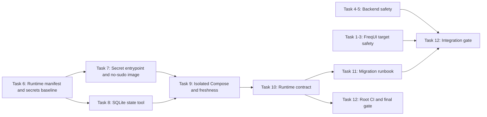

# P0 Current-System Safety Gate Implementation Plan

> **For agentic workers:** REQUIRED SUB-SKILL: Use superpowers:subagent-driven-development (recommended) or superpowers:executing-plans to implement this plan task-by-task. Steps use checkbox (`- [ ]`) syntax for tracking.

**Goal:** 在不引入多市场研究内核的前提下，为当前 Freqtrade 执行系统建立可验证、默认模拟运行、不会错 Bot、不会因陈旧数据误开仓、不会共享可写状态、能够一致性备份恢复且由根 CI 强制执行的 P0 安全基线。

**Architecture:** P0 不重构 Freqtrade 为多市场平台；它把 Freqtrade 保留为交易执行端，并在三个边界加闸：后端启动对账与目录权限、FreqUI 高风险动作目标路由、顶层 Docker/配置/密钥/状态/备份运行契约。顶层运行契约只覆盖当前 Git HEAD 已正式跟踪的 `freqtrade`、`freqtrade-futures`、`freqtrade-research`；任何新增服务必须先进入 manifest、模板、测试和 CI，不能只改 Compose。

**Tech Stack:** Python 3.13/3.14、Freqtrade、pytest、Vue 3、TypeScript 6、Pinia、Vitest、Docker Compose、SQLite Online Backup API、GitHub Actions、PowerShell。

## Global Constraints

- P0 与 `research-platform`、MarketBundle、统一回测内核、AI 分析、AI Bot、ExecutionIntent、中央风险引擎完全分开提交。
- P0 的所有正式交易服务强制 `dry_run=true`；任何 live 交易入口必须等待 P11 的 Risk/Intent/Reconciliation Gate。
- 自动策略只允许使用主 analyzed timeframe 收盘后不超过 `60` 秒的 entry signal；超过即拒绝新初始仓位。
- `ignore_buying_expired_candle_after` 只保护自动初始开仓，不宣称覆盖人工 `force_entry`、DCA、informative timeframe 完整依赖健康或跨 Bot 中央风控。
- API password、JWT secret 和 WebSocket token 每个服务独立，使用 Compose file secret 注入；Git 中只允许 sentinel，不允许静态值。
- 每个服务只有自己的可写 state root；配置、策略和 Research 源数据必须只读；禁止共享完整可写 `/freqtrade/user_data`。
- 镜像内不安装 `sudo`，`ftuser` 不加入 sudo 组，运行时不执行 `chown`；宿主目录权限错误必须 fail closed。
- SQLite 备份必须使用 `sqlite3.Connection.backup()`，包含已提交 WAL 状态，发布前校验 hash、`integrity_check`、`foreign_key_check` 和核心表计数。
- SQLite 恢复默认拒绝覆盖已存在目标；替换活动数据库必须先停服务，并保留旧 DB/WAL/SHM 直到验收期结束。
- 当前只能宣称 dry-run SQLite 状态可恢复；live 账户恢复还需要交易所 orders/fills/positions 对账，不属于 P0。
- 根工具仅使用 Python 标准库；不为 manifest、bootstrap、contract 或 SQLite 工具增加运行时第三方依赖。
- 根 CI 必须从 recursive fresh checkout 运行，不依赖当前机器未跟踪的配置、策略、数据库或日志。
- 当前未提交的 QQE、Supertrend、图表和本地 Compose 改动属于用户资产。执行本计划前必须使用 `superpowers:using-git-worktrees` 创建隔离 worktree，禁止 stash、reset、清理或代提交这些改动。
- P0 的正式拓扑以当前已跟踪 HEAD 为准：Spot、Volatility Futures、Research。QQE 正式化必须作为独立变更；其中 full-stake 服务只能进入 `unsafe-experiments` profile 并继续强制 dry-run。
- 每个提交只 stage 任务列出的路径；禁止 `git add -A`、`git add .` 和将子模块无关脏文件夹带进提交。
- 后端和前端先在各自子模块提交；顶层最后只记录审核过的 submodule pointer 与根文件。
- 所有测试先 RED、再做最小 GREEN 修改；不顺手修复 timeframe 漂移、图表格式、账户模型或其他邻近缺陷。

---

### Task 1: Add explicit, fail-closed multi-Bot force-action routing

**Files:**

- Modify: `frequi/src/types/types.ts:8-38`
- Modify: `frequi/src/stores/ftbotwrapper.ts:1-90,470-540`
- Create: `frequi/tests/unit/ftbotwrapperTradeRouting.spec.ts`

**Interfaces:**

- Produces: `MultiForceEnterPayload`, `getBotOrThrow(botId: string): BotSubStore`, `forceEntryMulti(payload): Promise<unknown>`。
- Changes: `forceSellMulti()` 剥离 UI-only `botId` 后才调用 Freqtrade API。
- Failure policy: 目标 Bot 不存在时抛出明确错误，不 fallback 到 active Bot，不静默成功。

- [ ] **Step 1: Write Store routing RED tests**

按现有 Pinia unit-test setup 创建两个最小子 Store，并覆盖以下测试：

```ts
it('routes force exit to the payload bot and strips botId', async () => {
  await botStore.forceSellMulti({
    botId: 'bot-b',
    tradeid: '7',
    ordertype: 'market',
  });

  expect(forceExitA).not.toHaveBeenCalled();
  expect(forceExitB).toHaveBeenCalledWith({
    tradeid: '7',
    ordertype: 'market',
  });
});

it('routes force entry to the payload bot and strips botId', async () => {
  await botStore.forceEntryMulti({
    botId: 'bot-b',
    pair: 'ETH/USDT',
    stakeamount: 20,
  });

  expect(forceEntryA).not.toHaveBeenCalled();
  expect(forceEntryB).toHaveBeenCalledWith({
    pair: 'ETH/USDT',
    stakeamount: 20,
  });
});

it('fails closed when the target bot no longer exists', async () => {
  await expect(
    botStore.forceEntryMulti({ botId: 'missing-bot', pair: 'ETH/USDT' }),
  ).rejects.toThrow('Unknown bot target: missing-bot');

  expect(forceEntryA).not.toHaveBeenCalled();
  expect(forceEntryB).not.toHaveBeenCalled();
});
```

测试 fixture 中 A/B 的 `forceentry`、`forceexit` 必须是不同 `vi.fn()`，active Bot 固定为 A。

- [ ] **Step 2: Run the RED Store test**

Run from `G:\AI_Trading\freqtrade-cn\frequi`:

```powershell
pnpm exec vitest run tests/unit/ftbotwrapperTradeRouting.spec.ts
```

Expected: FAIL because `forceEntryMulti` and `getBotOrThrow` are absent, and current exit payload still includes `botId`.

- [ ] **Step 3: Add the payload type and explicit target resolver**

在 `types.ts` 增加：

```ts
export interface MultiForceEnterPayload extends ForceEnterPayload {
  botId: string;
}
```

在 `BotStoreSetup` 增加签名并导入类型：

```ts
getBotOrThrow: (botId: string) => BotSubStore;
forceEntryMulti: (payload: MultiForceEnterPayload) => Promise<unknown>;
```

在 Store 中实现：

```ts
function getBotOrThrow(botId: string): BotSubStore {
  const bot = botStores.value[botId];
  if (!bot) {
    throw new Error(`Unknown bot target: ${botId}`);
  }
  return bot;
}

async function forceSellMulti({ botId, ...payload }: MultiForceExitPayload) {
  return getBotOrThrow(botId).forceexit(payload);
}

async function forceEntryMulti({ botId, ...payload }: MultiForceEnterPayload) {
  return getBotOrThrow(botId).forceentry(payload);
}
```

将 `getBotOrThrow` 和 `forceEntryMulti` 加入返回对象。不要重命名 `forceSellMulti`，避免扩大调用面。

- [ ] **Step 4: Run GREEN Store test and typecheck**

```powershell
pnpm exec vitest run tests/unit/ftbotwrapperTradeRouting.spec.ts
pnpm typecheck
```

Expected: test PASS; typecheck exits `0`.

- [ ] **Step 5: Commit only explicit routing**

```powershell
git add `
  src/types/types.ts `
  src/stores/ftbotwrapper.ts `
  tests/unit/ftbotwrapperTradeRouting.spec.ts
git diff --cached --check
git diff --cached --stat
git commit -m "fix(ui): route force actions by bot id"
```

---

### Task 2: Pin force-entry and partial-exit dialogs to the row Bot

**Files:**

- Modify: `frequi/src/components/ftbot/ForceEntryForm.vue`
- Modify: `frequi/src/components/ftbot/ForceExitForm.vue`
- Modify: `frequi/src/components/ftbot/TradeList.vue:140-260`
- Modify: `frequi/src/components/ftbot/BotControls.vue:55-70`
- Create: `frequi/tests/component/ForceTradeForms.spec.ts`
- Create: `frequi/tests/component/TradeListTradeActions.spec.ts`

**Interfaces:**

- Consumes: Task 1 的 `getBotOrThrow`, `forceEntryMulti`, `forceSellMulti`。
- Produces: `ForceEntryFormProps.botId: string`, `ForceExitFormProps.botId: string`。
- Invariant: modal 打开后 active Bot 可以变化，但能力、默认值、显示和最终 API 目标都不能变化。

- [ ] **Step 1: Write form RED tests with deliberately different Bot capabilities**

Fixture 必须设置：

```ts
// active A
forceExitWithPrice: false;
forceEnterShort: false;
stakeCurrency: 'USDC';
forceEntryOrderType: 'market';

// target B
forceExitWithPrice: true;
forceEnterShort: true;
stakeCurrency: 'USDT';
forceEntryOrderType: 'limit';
```

测试提交目标与 active Bot 切换：

```ts
it('submits a partial exit to the prop bot after activeBot changes', async () => {
  vi.spyOn(HTMLFormElement.prototype, 'checkValidity').mockReturnValue(true);
  const wrapper = mountForceExitForm({
    botId: 'bot-b',
    trade,
    stakeCurrencyDecimals: 6,
  });

  botStore.selectedBot = 'bot-a';
  await wrapper.find('form').trigger('submit');
  await flushPromises();

  expect(forceExitA).not.toHaveBeenCalled();
  expect(forceExitB).toHaveBeenCalledWith(
    expect.objectContaining({ tradeid: String(trade.trade_id) }),
  );
});

it('submits a position increase to the prop bot after activeBot changes', async () => {
  vi.spyOn(HTMLFormElement.prototype, 'checkValidity').mockReturnValue(true);
  const wrapper = mountForceEntryForm({
    botId: 'bot-b',
    pair: 'ETH/USDT',
    positionIncrease: true,
  });

  botStore.selectedBot = 'bot-a';
  await wrapper.find('form').trigger('submit');
  await flushPromises();

  expect(forceEntryA).not.toHaveBeenCalled();
  expect(forceEntryB).toHaveBeenCalledWith(
    expect.objectContaining({ pair: 'ETH/USDT' }),
  );
});

it('disables submission when the pinned target disappears', async () => {
  const wrapper = mountForceEntryForm({ botId: 'bot-b', pair: 'ETH/USDT' });
  delete botStore.botStores['bot-b'];
  await nextTick();

  expect(wrapper.get('[data-test="target-unavailable"]').isVisible()).toBe(true);
  expect(wrapper.get('[data-test="submit-force-entry"]').attributes('disabled')).toBeDefined();
});
```

另断言 Force Entry 方向、标签、stake currency 和默认 order type 来自 B；Force Exit 价格能力和默认 order type 来自 B。

- [ ] **Step 2: Write TradeList row-routing RED tests**

用 `UTable` stub 渲染第一行 action cell，row 属于 B、active 为 A：

```ts
it('passes the row bot to partial exit and position increase dialogs', async () => {
  await wrapper.get('[data-test="partial-exit"]').trigger('click');
  expect(forceExitDialog).toHaveBeenCalledWith({
    botId: 'bot-b',
    trade,
    stakeCurrencyDecimals: 6,
  });

  await wrapper.get('[data-test="increase-position"]').trigger('click');
  expect(forceEntryDialog).toHaveBeenCalledWith({
    botId: 'bot-b',
    pair: trade.pair,
    positionIncrease: true,
  });
});

it('uses row-bot capabilities for the row action menu', () => {
  const actions = wrapper.getComponent(TradeActionsPopoverStub);
  expect(actions.props('enableForceEntry')).toBe(true);
  expect(actions.props('botFeatures')).toBe(botBFeatures);
});
```

- [ ] **Step 3: Run RED component tests**

```powershell
pnpm exec vitest run `
  tests/component/ForceTradeForms.spec.ts `
  tests/component/TradeListTradeActions.spec.ts
```

Expected: FAIL because dialog props lack `botId`, forms use `activeBot`, and row capabilities come from A.

- [ ] **Step 4: Require a stable Bot ID in both modal props**

```ts
export interface ForceEntryFormProps {
  botId: string;
  pair?: string;
  positionIncrease?: boolean;
}

export interface ForceExitFormProps {
  botId: string;
  trade: Trade;
  stakeCurrencyDecimals: number;
}
```

两个 Form 使用可空 computed，目标消失时显示错误并禁用提交：

```ts
const targetBot = computed(() => botStore.botStores[props.botId]);
const targetUnavailable = computed(() => !targetBot.value);

async function handleEntry() {
  if (!checkFormValidity() || !targetBot.value) {
    return;
  }

  const payload: MultiForceEnterPayload = {
    botId: props.botId,
    pair: selectedPair.value,
  };
  if (price.value) {
    payload.price = Number(price.value);
  }
  if (ordertype.value) {
    payload.ordertype = ordertype.value;
  }
  if (stakeAmount.value) {
    payload.stakeamount = stakeAmount.value;
  }
  if (targetBot.value.botFeatures.forceEnterShort && targetBot.value.shortAllowed) {
    payload.side = orderSide.value;
  }
  if (targetBot.value.botFeatures.forceEntryTag && enterTag.value) {
    payload.entry_tag = enterTag.value;
  }
  if (leverage.value) {
    payload.leverage = leverage.value;
  }
  await botStore.forceEntryMulti(payload);
  emit('close', true);
}
```

Exit 同样构造：

```ts
const payload: MultiForceExitPayload = {
  botId: props.botId,
  tradeid: String(props.trade.trade_id),
};
if (ordertype.value) payload.ordertype = ordertype.value;
if (amount.value) payload.amount = amount.value;
if (price.value && targetBot.value.botFeatures.forceExitWithPrice) {
  payload.price = price.value;
}
await botStore.forceSellMulti(payload);
emit('close', true);
```

模板增加：

```vue
<UAlert
  v-if="targetUnavailable"
  data-test="target-unavailable"
  color="error"
  :title="t('trade.targetBotUnavailable')"
/>

<UButton
  data-test="submit-force-entry"
  :disabled="targetUnavailable"
  @click="handleEntry"
>
  {{ t('trade.forceEnter') }}
</UButton>
```

Exit submit button使用 `data-test="submit-force-exit"` 和相同 disabled policy。不要在 Form 中 fallback 到 `activeBot`。

- [ ] **Step 5: Route TradeList row actions by row Bot**

```ts
function botForTrade(item: Trade): BotSubStore {
  return botStore.getBotOrThrow(item.botId);
}

function forceExitPartialHandler(item: Trade) {
  const targetBot = botForTrade(item);
  forceExitDialog({
    botId: item.botId,
    trade: item,
    stakeCurrencyDecimals: targetBot.stakeCurrencyDecimals,
  });
}

function handleForceEntry(item: Trade) {
  forceEntryDialog({
    botId: item.botId,
    pair: item.pair,
    positionIncrease: true,
  });
}
```

Action props 改为：

```vue
<TradeActionsPopover
  :id="row.original.trade_id ?? row.index"
  :enable-force-entry="botForTrade(row.original).botState.force_entry_enable"
  :trade="row.original"
  :bot-features="botForTrade(row.original).botFeatures"
  @force-exit-partial="forceExitPartialHandler"
  @force-entry="handleForceEntry"
/>
```

`BotControls.handleForceEntry()` 在调用 modal 前冻结：

```ts
async function handleForceEntry() {
  const targetBot = botStore.activeBot;
  await forceEntryDialog({
    botId: targetBot.botId,
    pair: targetBot.selectedPair,
  });
}
```

- [ ] **Step 6: Add exact unavailable locale keys**

在 `trade` locale namespace 增加：

```ts
// en.ts
targetBotUnavailable: 'The selected target bot is no longer available. The action was blocked.',

// zh-CN.ts
targetBotUnavailable: '目标机器人已不可用，本次操作已被阻止。',
```

当前 locale 文件已有用户未提交图例文案；在隔离 worktree 中只增加本任务键，合并时不得格式化或覆盖其他区域。

- [ ] **Step 7: Run GREEN tests and prove Forms no longer read activeBot**

```powershell
pnpm exec vitest run `
  tests/unit/ftbotwrapperTradeRouting.spec.ts `
  tests/component/ForceTradeForms.spec.ts `
  tests/component/TradeListTradeActions.spec.ts

pnpm typecheck

rg -n "botStore\.activeBot" `
  src/components/ftbot/ForceEntryForm.vue `
  src/components/ftbot/ForceExitForm.vue
```

Expected: tests PASS; typecheck exits `0`; final `rg` has no output.

- [ ] **Step 8: Commit pinned force dialogs**

```powershell
git add `
  src/components/ftbot/ForceEntryForm.vue `
  src/components/ftbot/ForceExitForm.vue `
  src/components/ftbot/TradeList.vue `
  src/components/ftbot/BotControls.vue `
  src/locales/en.ts `
  src/locales/zh-CN.ts `
  tests/component/ForceTradeForms.spec.ts `
  tests/component/TradeListTradeActions.spec.ts
git diff --cached --check
git diff --cached --stat
git commit -m "fix(ui): pin force dialogs to the target bot"
```

---

### Task 3: Freeze and display the execution target in high-risk confirmations

**Files:**

- Create: `frequi/src/utils/tradeActionTarget.ts`
- Modify: `frequi/src/components/general/ConfirmDialogBox.vue`
- Modify: `frequi/src/components/ftbot/TradeList.vue`
- Modify: `frequi/src/components/ftbot/BotControls.vue`
- Modify: `frequi/src/components/ftbot/ForceEntryForm.vue`
- Modify: `frequi/src/components/ftbot/ForceExitForm.vue`
- Modify: `frequi/src/locales/en.ts`
- Modify: `frequi/src/locales/zh-CN.ts`
- Create: `frequi/tests/unit/tradeActionTarget.spec.ts`
- Create: `frequi/tests/component/ConfirmDialogBox.spec.ts`
- Create: `frequi/tests/component/BotControls.spec.ts`
- Extend: `frequi/tests/component/TradeListTradeActions.spec.ts`
- Extend: `frequi/tests/unit/appI18n.spec.ts`

**Interfaces:**

- Produces: `formatTradeActionTarget(bot, t): string`, `ConfirmDialogBoxProps.targetContext?: string`。
- Invariant: 确认文字描述的目标与确认后调用的对象必须是同一冻结引用/ID。
- Limitation: 当前模型无 account/subaccount，显示 Bot endpoint identity，不伪装账户身份。

- [ ] **Step 1: Write target-format and dialog RED tests**

```ts
it.each([
  [true, 'DRY-RUN'],
  [false, 'LIVE'],
  [undefined, 'UNKNOWN ENVIRONMENT'],
])('formats target identity for dry_run=%s', (dryRun, marker) => {
  const text = formatTradeActionTarget(
    {
      botId: 'bot-b',
      uiBotName: 'Beta',
      botState: { dry_run: dryRun, exchange: 'okx', trading_mode: 'futures' },
    },
    t,
  );

  expect(text).toContain('Beta');
  expect(text).toContain('bot-b');
  expect(text).toContain('okx');
  expect(text).toContain('futures');
  expect(text).toContain(marker);
});

it('renders target context separately from the action message', () => {
  const wrapper = mountDialog({
    title: 'Force exit',
    targetContext: 'Target bot: Beta (bot-b) · okx · futures · LIVE',
    message: 'Really exit trade 7?',
  });

  expect(wrapper.get('[data-test="trade-action-target"]').text()).toContain(
    'Beta (bot-b)',
  );
});
```

- [ ] **Step 2: Write deferred-confirm RED tests for BotControls**

对 stop、stop entering、reload、force exit all 做表驱动测试。核心 deferred pattern：

```ts
let resolveConfirm!: (value: boolean) => void;
confirm.mockImplementation(
  () =>
    new Promise<boolean>((resolve) => {
      resolveConfirm = resolve;
    }),
);

await wrapper.get('[data-test="stop-bot"]').trigger('click');
expect(confirm).toHaveBeenCalledWith(
  expect.objectContaining({
    targetContext: expect.stringContaining('Alpha (bot-a)'),
  }),
);

botStore.selectedBot = 'bot-b';
resolveConfirm(true);
await flushPromises();

expect(stopBotA).toHaveBeenCalledOnce();
expect(stopBotB).not.toHaveBeenCalled();
```

表格必须覆盖：

| Test hook | Frozen call |
|---|---|
| `stop-bot` | `targetBot.stopBot()` |
| `stop-entering` | `targetBot.stopBuy()` |
| `reload-config` | `targetBot.reloadConfig()` |
| `force-exit-all` | `forceSellMulti({ botId: targetBot.botId, tradeid: 'all' })` |

另测 `force-entry` dialog options 始终含最初 `botId`。

- [ ] **Step 3: Extend TradeList confirmation RED tests**

分别触发 full exit、delete trade、cancel open order，断言每次 confirm：

```ts
expect(confirm).toHaveBeenCalledWith(
  expect.objectContaining({
    targetContext: expect.stringContaining('Beta (bot-b)'),
  }),
);
expect(confirm.mock.calls.at(-1)?.[0].targetContext).toContain('okx');
expect(confirm.mock.calls.at(-1)?.[0].targetContext).toContain('futures');
expect(confirm.mock.calls.at(-1)?.[0].targetContext).toContain('LIVE');
expect(confirm.mock.calls.at(-1)?.[0].targetContext).not.toContain('Alpha');
```

- [ ] **Step 4: Run all RED confirmation tests**

```powershell
pnpm exec vitest run `
  tests/unit/tradeActionTarget.spec.ts `
  tests/component/ConfirmDialogBox.spec.ts `
  tests/component/TradeListTradeActions.spec.ts `
  tests/component/BotControls.spec.ts
```

Expected: FAIL because target formatter/prop are absent and BotControls re-reads active Bot after `await`.

- [ ] **Step 5: Implement target identity formatting**

Create `src/utils/tradeActionTarget.ts`:

```ts
import { formatLocaleText } from '@/composables/useAppI18n';
import type { LocaleKey } from '@/locales/keys';
import type { BotState } from '@/types';

interface TradeActionTargetSource {
  botId: string;
  uiBotName: string;
  botState: Partial<Pick<BotState, 'dry_run' | 'exchange' | 'trading_mode'>>;
}

type Translate = (key: LocaleKey) => string;

export function formatTradeActionTarget(
  bot: TradeActionTargetSource,
  t: Translate,
): string {
  const key =
    bot.botState.dry_run === true
      ? 'trade.actionTargetDryRun'
      : bot.botState.dry_run === false
        ? 'trade.actionTargetLive'
        : 'trade.actionTargetUnknown';

  return formatLocaleText(t(key), {
    botName: bot.uiBotName,
    botId: bot.botId,
    exchange: bot.botState.exchange || t('common.unknown'),
    tradingMode: bot.botState.trading_mode || t('common.unknown'),
  });
}
```

- [ ] **Step 6: Add exact bilingual target strings and ConfirmDialog prop**

```ts
// en.ts, trade namespace
actionTargetDryRun:
  'Target bot: {botName} ({botId}) · {exchange} · {tradingMode} · DRY-RUN',
actionTargetLive:
  'Target bot: {botName} ({botId}) · {exchange} · {tradingMode} · LIVE',
actionTargetUnknown:
  'Target bot: {botName} ({botId}) · {exchange} · {tradingMode} · UNKNOWN ENVIRONMENT',

// zh-CN.ts, trade namespace
actionTargetDryRun:
  '目标机器人：{botName}（{botId}）· {exchange} · {tradingMode} · 模拟运行',
actionTargetLive:
  '目标机器人：{botName}（{botId}）· {exchange} · {tradingMode} · 实盘',
actionTargetUnknown:
  '目标机器人：{botName}（{botId}）· {exchange} · {tradingMode} · 运行环境未知',
```

`ConfirmDialogBoxProps` 增加：

```ts
targetContext?: string;
```

在 body 最前独立渲染：

```vue
<div
  v-if="props.targetContext"
  data-test="trade-action-target"
  class="mb-3 font-medium"
>
  {{ props.targetContext }}
</div>
```

- [ ] **Step 7: Freeze targets at all confirmation entry points**

每个 `TradeList` handler 先执行：

```ts
const targetBot = botForTrade(item);
```

然后把以下字段加入 full exit、delete、cancel 的 confirm options：

```ts
targetContext: formatTradeActionTarget(targetBot, t),
```

Force Entry/Exit Form body 顶部显示同一个 computed target context。

`BotControls` 所有 handler 必须在 `await confirm()` 前冻结：

```ts
async function handleStopBot() {
  const targetBot = botStore.activeBot;
  const result = await confirm({
    title: t('trade.stopBot'),
    message: t('trade.stopBotMessage'),
    targetContext: formatTradeActionTarget(targetBot, t),
  });
  if (result) {
    targetBot.stopBot();
  }
}
```

StopBuy 必须显式冻结并调用同一对象：

```ts
async function handleStopBuy() {
  const targetBot = botStore.activeBot;
  const result = await confirm({
    title: t('trade.pauseStopEntering'),
    message: t('trade.pauseStopEnteringMessage'),
    targetContext: formatTradeActionTarget(targetBot, t),
  });
  if (result) {
    targetBot.stopBuy();
  }
}
```

Reload 必须显式冻结并调用同一对象：

```ts
async function handleReloadConfig() {
  const targetBot = botStore.activeBot;
  const result = await confirm({
    title: t('trade.reloadConfig'),
    message: t('trade.reloadConfigMessage'),
    targetContext: formatTradeActionTarget(targetBot, t),
  });
  if (result) {
    targetBot.reloadConfig();
  }
}
```

ForceExitAll 使用：

```ts
await botStore.forceSellMulti({ botId: targetBot.botId, tradeid: 'all' });
```

给现有按钮增加：

```text
data-test="stop-bot"
data-test="stop-entering"
data-test="reload-config"
data-test="force-exit-all"
data-test="force-entry"
```

- [ ] **Step 8: Run complete frontend P0 verification**

```powershell
pnpm exec vitest run `
  tests/unit/ftbotwrapperTradeRouting.spec.ts `
  tests/unit/tradeActionTarget.spec.ts `
  tests/unit/appI18n.spec.ts `
  tests/component/ConfirmDialogBox.spec.ts `
  tests/component/ForceTradeForms.spec.ts `
  tests/component/TradeListTradeActions.spec.ts `
  tests/component/BotControls.spec.ts

pnpm exec vitest run tests/unit tests/component
pnpm typecheck
git diff --check
```

Expected: all focused and full unit/component tests PASS; typecheck and diff check exit `0`.

`pnpm lint-ci` 当前基线存在与 P0 无关的 CRLF/noise；本任务只能要求 P0 修改文件无新增 lint error。运行：

```powershell
pnpm exec eslint `
  src/types/types.ts `
  src/stores/ftbotwrapper.ts `
  src/components/ftbot/ForceEntryForm.vue `
  src/components/ftbot/ForceExitForm.vue `
  src/components/ftbot/TradeList.vue `
  src/components/ftbot/BotControls.vue `
  src/components/general/ConfirmDialogBox.vue `
  src/utils/tradeActionTarget.ts `
  tests/unit/ftbotwrapperTradeRouting.spec.ts `
  tests/unit/tradeActionTarget.spec.ts `
  tests/component/ForceTradeForms.spec.ts `
  tests/component/TradeListTradeActions.spec.ts `
  tests/component/ConfirmDialogBox.spec.ts `
  tests/component/BotControls.spec.ts
```

Expected: exit `0`.

- [ ] **Step 9: Commit confirmation target safety**

```powershell
git add `
  src/utils/tradeActionTarget.ts `
  src/components/general/ConfirmDialogBox.vue `
  src/components/ftbot/TradeList.vue `
  src/components/ftbot/BotControls.vue `
  src/components/ftbot/ForceEntryForm.vue `
  src/components/ftbot/ForceExitForm.vue `
  src/locales/en.ts `
  src/locales/zh-CN.ts `
  tests/unit/tradeActionTarget.spec.ts `
  tests/unit/appI18n.spec.ts `
  tests/component/ConfirmDialogBox.spec.ts `
  tests/component/TradeListTradeActions.spec.ts `
  tests/component/BotControls.spec.ts
git diff --cached --check
git diff --cached --stat
git commit -m "fix(ui): show and freeze trade action targets"
```

---

## Scope and Acceptance Boundary

P0 完成时必须同时证明：

1. 交易所暂时查不到一天内的新订单时，启动对账不会本地取消；超过五天的缺失订单仍按现有语义取消。
2. FreqUI 聚合 Dashboard 中属于 Bot B 的部分退出、加仓、全退、删除、撤单和 Bot 控制命令永远不会因为 active Bot 变为 A 而发给 A。
3. 高风险 UI 明确显示 UI Bot 名称、Bot ID、exchange、trading mode 与 `DRY-RUN`/`LIVE`/未知环境；P0 不伪造不存在的 account/subaccount ID。
4. Git 不再跟踪 operational `config*.json`；所有被跟踪模板只含 sentinel，exchange key/secret 为空且 trading template 为 dry-run。
5. 三个正式服务各自使用不同 API password、JWT、WS token；缺失、过短、占位或重复时容器以配置错误退出且日志不泄露值。
6. 不存在共享可写完整 `user_data`；每个服务 state source 唯一，配置和策略只读，Research 源数据只读。
7. 后端源码和两个 Dockerfile 都不再提供 `sudo chown` 路径。
8. 每个正式交易服务最后加载同一个无密钥 safety overlay，强制 `dry_run=true` 和 entry freshness `60` 秒。
9. dry-run SQLite 可以在 WAL 写入存在时一致性备份、校验、恢复到新路径并由 Freqtrade `show-trades` 读取。
10. 根 CI 能验证子模块指针、后端定向测试、前端定向测试、配置密钥策略、Compose 契约、Docker build/no-sudo、SQLite 工具和只读挂载 smoke。

以下明确不在 P0：

- 多市场研究内核、A/H/US MarketBundle 和 v2 API。
- AI 新闻分析、贪恐指数、Agent 策略优化和 AI 自动交易。
- 新账户领域模型、RBAC、中央组合风控、ExecutionIntent 和交易所级 reconciliation。
- Git 历史重写。旧静态凭据必须立即轮换；历史清理需单独协调所有 clone、branch 和远端保护规则。
- QQE 策略/指标/图表功能的正式化。P0 contract 会阻止未正式化服务进入受支持拓扑。

---

## File Responsibility Map

### Backend submodule: `freqtrade/`

- `freqtrade/freqtrade/freqtradebot.py`：启动时缺失订单的五天年龄判断。
- `freqtrade/tests/freqtradebot/test_freqtradebot.py`：近期与历史缺失订单回归测试。
- `freqtrade/freqtrade/configuration/directory_operations.py`：Docker 用户目录可访问性校验，不再提权修复。
- `freqtrade/freqtrade/commands/build_config_commands.py`：配置生成命令调用新的权限校验函数。
- `freqtrade/tests/test_directory_operations.py`：可写、不可写和非 Docker 目录行为。
- `freqtrade/Dockerfile`：独立构建路径移除 sudo。

### Frontend submodule: `frequi/`

- `frequi/src/types/types.ts`：增加带 `botId` 的 multi-force-entry payload。
- `frequi/src/stores/ftbotwrapper.ts`：按稳定 Bot ID fail-closed 路由并剥离 UI-only 字段。
- `frequi/src/components/ftbot/ForceEntryForm.vue`、`ForceExitForm.vue`：modal 固定目标 Bot，不再提交时读取 active Bot。
- `frequi/src/components/ftbot/TradeList.vue`：行操作使用 row Bot 的能力、精度、确认上下文和路由。
- `frequi/src/components/ftbot/BotControls.vue`：确认前冻结目标引用。
- `frequi/src/components/general/ConfirmDialogBox.vue`：独立显示目标上下文。
- `frequi/src/utils/tradeActionTarget.ts`：统一格式化执行端点身份。
- `frequi/src/locales/en.ts`、`zh-CN.ts`：目标环境和 unavailable 文案。
- `frequi/tests/unit/*TradeRouting*.spec.ts`、`tradeActionTarget.spec.ts` 与 `frequi/tests/component/*`：双 Bot 错目标回归。

### Superproject root

- `ops/runtime-services.json`：正式运行服务唯一清单。
- `ops/config/trading-safety.json`：最后加载、无 secret 的 dry-run/freshness policy。
- `tools/runtime_manifest.py`：读取和验证 manifest schema。
- `tools/bootstrap_runtime.py`：从模板创建本地配置、独立 secrets 和 state 目录；不覆盖、不输出 secret。
- `docker/freqtrade_entrypoint.py`：从 `/run/secrets` 读取并注入 Freqtrade 环境变量，然后 `exec`。
- `tools/runtime_contract.py`：验证 Git 配置策略、Compose 拓扑、挂载、secret、端口和命令顺序。
- `tools/sqlite_state.py`：SQLite backup/verify/restore/compare。
- `tests/test_*.py`：根工具和运行契约的标准库 `unittest` 测试。
- `Dockerfile`：集成 FreqUI/Freqtrade 镜像，安装安全 entrypoint，不含 sudo。
- `docker-compose.yml`：三服务隔离、file secrets、只读输入、独立 state 和 safety overlay。
- `.gitignore`、`.env.example`：忽略 operational config/secrets/state/backups，只保留端口示例。
- `README.docker.md`、`docs/operations/*.md`：初始化、轮换、迁移、回滚和恢复演练。
- `.github/workflows/root-safety.yml`：根级安全 CI。



---

### Task 4: Correct the five-day missing-order predicate

**Files:**

- Modify: `freqtrade/freqtrade/freqtradebot.py:434-444`
- Modify: `freqtrade/tests/freqtradebot/test_freqtradebot.py:4525-4563`

**Interfaces:**

- Consumes: `Order.order_date_utc: datetime`, `dt_now()`, `FreqtradeBot.startup_update_open_orders()`。
- Produces: 只有 `order_date_utc < now - 5 days` 才调用现有 `handle_cancel_order()`；不新增生产接口。

- [ ] **Step 1: Make the old-order test independent of historical fixtures**

在现有 `test_startup_update_open_orders` 的 `InvalidOrderException` 分支前显式设置旧订单：

```python
for order in Order.get_open_orders():
    order.order_date = (dt_now() - timedelta(days=6)).replace(tzinfo=None)
Trade.commit()

mocker.patch(f"{EXMS}.fetch_order", side_effect=InvalidOrderException)
hto_mock = mocker.patch("freqtrade.freqtradebot.FreqtradeBot.handle_cancel_order")
freqtrade.startup_update_open_orders()

assert log_has_re(r"Order is older than \d days.*", caplog)
assert hto_mock.call_count == 3
```

- [ ] **Step 2: Write the recent-order RED regression**

在同一测试文件新增：

```python
@pytest.mark.usefixtures("init_persistence")
def test_startup_update_open_orders_keeps_recent_missing_orders(
    mocker,
    default_conf_usdt,
    fee,
    caplog,
    time_machine,
):
    time_machine.move_to("2026-07-11 00:00:00 +00:00", tick=False)

    freqtrade = get_patched_freqtradebot(mocker, default_conf_usdt)
    create_mock_trades(fee)
    freqtrade.config["dry_run"] = False

    open_orders = Order.get_open_orders()
    open_order_ids = {order.order_id for order in open_orders}
    recent_order_date = (dt_now() - timedelta(days=1)).replace(tzinfo=None)
    for order in open_orders:
        order.order_date = recent_order_date
    Trade.commit()

    mocker.patch(f"{EXMS}.fetch_order", side_effect=InvalidOrderException("not found"))
    cancel_mock = mocker.patch("freqtrade.freqtradebot.FreqtradeBot.handle_cancel_order")

    freqtrade.startup_update_open_orders()

    assert cancel_mock.call_count == 0
    assert {order.order_id for order in Order.get_open_orders()} == open_order_ids
    assert not log_has_re(r"Order is older than 5 days.*", caplog)
```

- [ ] **Step 3: Run the RED test**

Run from `G:\AI_Trading\freqtrade-cn\freqtrade`:

```powershell
.\.venv\Scripts\python.exe -m pytest `
  tests\freqtradebot\test_freqtradebot.py::test_startup_update_open_orders_keeps_recent_missing_orders `
  -q -p no:cacheprovider
```

Expected: FAIL because `handle_cancel_order` is called for recent orders.

- [ ] **Step 4: Apply the one-line strict age fix**

Replace the predicate with:

```python
except InvalidOrderException as e:
    logger.warning(f"Error updating Order {order.order_id} due to {e}.")
    if order.order_date_utc < datetime.now(UTC) - timedelta(days=5):
        logger.warning("Order is older than 5 days. Assuming order was fully cancelled.")
        fo = order.to_ccxt_object()
        fo["status"] = "canceled"
        self.handle_cancel_order(fo, order, order.trade, constants.CANCEL_REASON["TIMEOUT"])
```

严格使用 `<`；恰好五天不属于“older than 5 days”。不要抽取时间策略类，不改变异常层次、取消原因或启动对账流程。

- [ ] **Step 5: Run targeted and file-level GREEN tests**

```powershell
.\.venv\Scripts\python.exe -m pytest `
  tests\freqtradebot\test_freqtradebot.py::test_startup_update_open_orders_keeps_recent_missing_orders `
  tests\freqtradebot\test_freqtradebot.py::test_startup_update_open_orders `
  -q -p no:cacheprovider

.\.venv\Scripts\python.exe -m pytest `
  tests\freqtradebot\test_freqtradebot.py `
  -q -p no:cacheprovider

.\.venv\Scripts\ruff.exe check `
  freqtrade\freqtradebot.py `
  tests\freqtradebot\test_freqtradebot.py

git diff --check -- `
  freqtrade/freqtradebot.py `
  tests/freqtradebot/test_freqtradebot.py
```

Expected: targeted tests PASS; file-level tests PASS; Ruff and diff check exit `0`.

- [ ] **Step 6: Commit only the backend order fix**

```powershell
git add freqtrade/freqtradebot.py tests/freqtradebot/test_freqtradebot.py
git diff --cached --check
git diff --cached --stat
git commit -m "fix: preserve recent orders during startup reconciliation"
```

Expected staged paths: exactly the two files above.

---

### Task 5: Remove runtime sudo/chown and fail closed on inaccessible user directories

**Files:**

- Modify: `freqtrade/freqtrade/configuration/directory_operations.py:1-75`
- Modify: `freqtrade/freqtrade/commands/build_config_commands.py:20-28`
- Modify: `freqtrade/tests/test_directory_operations.py:1-70`
- Modify: `freqtrade/Dockerfile:12-28`

**Interfaces:**

- Produces: `ensure_user_directory_access(directory: Path) -> None`。
- Consumes: `running_in_docker()`, `os.access()`, `OperationalException`。
- Invariant: 不存在目录时由现有 create flow 创建；已存在但在 Docker 内不可读写执行时立即抛出配置错误。

- [ ] **Step 1: Replace the sudo-oriented tests with access-policy RED tests**

把测试 import 改为 `ensure_user_directory_access`，删除设置 `FT_APP_ENV` 后断言 `subprocess.check_output` 的测试，新增：

```python
def test_ensure_user_directory_access_ignores_non_docker(mocker, tmp_path) -> None:
    access_mock = mocker.patch("os.access", return_value=False)
    mocker.patch(
        "freqtrade.configuration.directory_operations.running_in_docker",
        return_value=False,
    )

    ensure_user_directory_access(tmp_path)

    access_mock.assert_not_called()


def test_ensure_user_directory_access_accepts_writable_docker_path(mocker, tmp_path) -> None:
    mocker.patch(
        "freqtrade.configuration.directory_operations.running_in_docker",
        return_value=True,
    )
    access_mock = mocker.patch("os.access", return_value=True)

    ensure_user_directory_access(tmp_path)

    access_mock.assert_called_once_with(tmp_path, os.R_OK | os.W_OK | os.X_OK)


def test_ensure_user_directory_access_rejects_inaccessible_docker_path(
    mocker, tmp_path
) -> None:
    mocker.patch(
        "freqtrade.configuration.directory_operations.running_in_docker",
        return_value=True,
    )
    mocker.patch("os.access", return_value=False)

    with pytest.raises(
        OperationalException,
        match="not readable, writable, and searchable by the container user",
    ):
        ensure_user_directory_access(tmp_path)


def test_ensure_user_directory_access_allows_missing_path(mocker, tmp_path) -> None:
    missing = tmp_path / "will-be-created"
    mocker.patch(
        "freqtrade.configuration.directory_operations.running_in_docker",
        return_value=True,
    )
    access_mock = mocker.patch("os.access")

    ensure_user_directory_access(missing)

    access_mock.assert_not_called()
```

- [ ] **Step 2: Run the RED permission tests**

```powershell
.\.venv\Scripts\python.exe -m pytest `
  tests\test_directory_operations.py `
  -q -p no:cacheprovider
```

Expected: collection fails because `ensure_user_directory_access` does not exist.

- [ ] **Step 3: Implement the minimal fail-closed policy**

在 `directory_operations.py` 导入 `os`，删除 `subprocess` 路径并实现：

```python
import os


def ensure_user_directory_access(directory: Path) -> None:
    """Fail closed when an existing Docker bind mount is inaccessible to ftuser."""
    if not running_in_docker() or not directory.exists():
        return

    required = os.R_OK | os.W_OK | os.X_OK
    if not os.access(directory, required):
        raise OperationalException(
            f"Directory `{directory}` is not readable, writable, and searchable by the "
            "container user. Fix the host directory ownership or permissions before startup."
        )
```

把两个调用点改为新名称：

```python
# directory_operations.py
folder = Path(directory)
ensure_user_directory_access(folder)

# build_config_commands.py
from freqtrade.configuration.directory_operations import ensure_user_directory_access

ensure_user_directory_access(config_path.parent)
```

不要在容器内增加替代 chown、setuid helper 或 chmod recovery。

- [ ] **Step 4: Remove sudo from the standalone backend image**

把 `freqtrade/Dockerfile` base 安装段改为：

```dockerfile
RUN mkdir /freqtrade \
  && apt-get update \
  && apt-get -y install --no-install-recommends libatlas3-base curl sqlite3 libgomp1 \
  && apt-get clean \
  && rm -rf /var/lib/apt/lists/* \
  && useradd -u 1000 -U -m -s /bin/bash ftuser \
  && chown ftuser:ftuser /freqtrade
```

删除 `sudo` package、`-G sudo` 和 `/etc/sudoers` 写入。

- [ ] **Step 5: Run backend permission and command regressions**

```powershell
.\.venv\Scripts\python.exe -m pytest `
  tests\test_directory_operations.py `
  tests\commands\test_build_config.py `
  -q -p no:cacheprovider

.\.venv\Scripts\ruff.exe check `
  freqtrade\configuration\directory_operations.py `
  freqtrade\commands\build_config_commands.py `
  tests\test_directory_operations.py

rg -n "sudo|chown_user_directory" `
  freqtrade\configuration\directory_operations.py `
  freqtrade\commands\build_config_commands.py `
  tests\test_directory_operations.py `
  Dockerfile
```

Expected: tests PASS; Ruff exits `0`; final `rg` has no output.

- [ ] **Step 6: Commit the backend privilege removal**

```powershell
git add `
  freqtrade/configuration/directory_operations.py `
  freqtrade/commands/build_config_commands.py `
  tests/test_directory_operations.py `
  Dockerfile
git diff --cached --check
git diff --cached --stat
git commit -m "security: remove runtime directory privilege escalation"
```

Expected staged paths: exactly the four files above.

---

### Task 6: Establish the tracked runtime manifest and local secret/state bootstrap

**Files:**

- Create: `ops/runtime-services.json`
- Create: `tools/__init__.py`
- Create: `tools/runtime_manifest.py`
- Create: `tools/bootstrap_runtime.py`
- Create: `tests/__init__.py`
- Create: `tests/test_bootstrap_runtime.py`
- Modify: `.gitignore`
- Modify: `.env.example`
- Modify: `ft_userdata/user_data/config.example.json`
- Modify: `ft_userdata/user_data/config.research.example.json`
- Rename: `ft_userdata/user_data/config.volatility.futures.json` to `ft_userdata/user_data/config.volatility.futures.example.json`
- Rename: `ft_userdata/user_data/config.lsri.futures.20u.json` to `ft_userdata/user_data/config.lsri.futures.20u.example.json`
- Rename: `ft_userdata/user_data/config.lsri.futures.100u.json` to `ft_userdata/user_data/config.lsri.futures.100u.example.json`

**Interfaces:**

- Produces: `load_runtime_manifest(path: Path | None = None) -> dict[str, object]`。
- Produces CLI: `python tools/bootstrap_runtime.py init|verify|sanitize-api-configs|rotate-secrets [--service NAME] [--root PATH]`。
- Manifest schema version: exactly `1`。
- Active supported services: exactly `freqtrade`, `freqtrade-futures`, `freqtrade-research`。

- [ ] **Step 1: Write manifest/bootstrap RED tests**

使用标准库 `unittest` 和临时目录，至少覆盖：

```python
class BootstrapRuntimeTests(unittest.TestCase):
    def test_load_manifest_rejects_duplicate_service_names(self):
        manifest = self.write_manifest(
            services=[self.service("freqtrade"), self.service("freqtrade")]
        )
        with self.assertRaisesRegex(ValueError, "duplicate runtime service"):
            load_runtime_manifest(manifest)

    def test_init_creates_config_state_and_three_unique_secrets(self):
        bootstrap_runtime.init_runtime(self.root, self.manifest)

        self.assertTrue((self.root / "ft_userdata/user_data/config.json").is_file())
        self.assertTrue((self.root / "ft_userdata/runtime/freqtrade/logs").is_dir())
        values = [
            (self.root / f"ft_userdata/secrets/freqtrade/{name}")
            .read_text(encoding="utf-8")
            .strip()
            for name in ("api_password", "jwt_secret_key", "ws_token")
        ]
        self.assertEqual(len(values), len(set(values)))
        self.assertTrue(all(len(value) >= 32 for value in values))

    def test_init_never_overwrites_existing_config_or_secret(self):
        config = self.root / "ft_userdata/user_data/config.json"
        config.parent.mkdir(parents=True)
        config.write_text('{"marker": "keep"}\n', encoding="utf-8")
        secret = self.root / "ft_userdata/secrets/freqtrade/api_password"
        secret.parent.mkdir(parents=True)
        secret.write_text("existing-secret-value-that-is-long-enough\n", encoding="utf-8")

        bootstrap_runtime.init_runtime(self.root, self.manifest)

        self.assertEqual(config.read_text(encoding="utf-8"), '{"marker": "keep"}\n')
        self.assertEqual(
            secret.read_text(encoding="utf-8"),
            "existing-secret-value-that-is-long-enough\n",
        )

    def test_verify_rejects_duplicate_secret_values_without_printing_them(self):
        bootstrap_runtime.init_runtime(self.root, self.manifest)
        repeated = "repeated-secret-value-that-must-not-be-logged"
        for name in ("api_password", "jwt_secret_key"):
            (self.root / f"ft_userdata/secrets/freqtrade/{name}").write_text(
                repeated + "\n", encoding="utf-8"
            )

        with self.assertRaisesRegex(ValueError, "runtime secrets must be unique") as raised:
            bootstrap_runtime.verify_runtime(self.root, self.manifest)
        self.assertNotIn(repeated, str(raised.exception))

    def test_sanitize_changes_only_api_server_secret_fields(self):
        bootstrap_runtime.init_runtime(self.root, self.manifest)
        config_path = self.root / "ft_userdata/user_data/config.json"
        config = json.loads(config_path.read_text(encoding="utf-8"))
        config["api_server"]["password"] = "old-password"
        config["api_server"]["jwt_secret_key"] = "old-jwt"
        config["api_server"]["ws_token"] = "old-ws"
        config["exchange"]["name"] = "okx"
        config_path.write_text(json.dumps(config), encoding="utf-8")

        bootstrap_runtime.sanitize_api_configs(self.root, self.manifest)

        sanitized = json.loads(config_path.read_text(encoding="utf-8"))
        self.assertEqual(sanitized["exchange"]["name"], "okx")
        for key in ("password", "jwt_secret_key", "ws_token"):
            self.assertEqual(sanitized["api_server"][key], SENTINEL)

    def test_rotate_secrets_changes_only_the_requested_service(self):
        bootstrap_runtime.init_runtime(self.root, self.manifest)
        before = self.read_all_secret_values()

        bootstrap_runtime.rotate_secrets(
            self.root,
            self.manifest,
            service_names={"freqtrade"},
        )

        after = self.read_all_secret_values()
        self.assertNotEqual(before["freqtrade"], after["freqtrade"])
        self.assertEqual(before["freqtrade-futures"], after["freqtrade-futures"])
        self.assertEqual(before["freqtrade-research"], after["freqtrade-research"])
        self.assertEqual(
            len(after["freqtrade"]),
            len(set(after["freqtrade"])),
        )

    def test_rotate_rejects_unknown_service_without_changing_files(self):
        bootstrap_runtime.init_runtime(self.root, self.manifest)
        before = self.read_all_secret_values()

        with self.assertRaisesRegex(ValueError, "unknown runtime service"):
            bootstrap_runtime.rotate_secrets(
                self.root,
                self.manifest,
                service_names={"missing-bot"},
            )

        self.assertEqual(before, self.read_all_secret_values())
```

- [ ] **Step 2: Run bootstrap RED tests**

Run from superproject root:

```powershell
python -m unittest tests.test_bootstrap_runtime -v
```

Expected: import failure because `tools.runtime_manifest` and `tools.bootstrap_runtime` do not exist.

- [ ] **Step 3: Add the exact supported-runtime manifest**

Create `ops/runtime-services.json`:

```json
{
  "schema_version": 1,
  "services": [
    {
      "name": "freqtrade",
      "role": "trading",
      "profile": "trading",
      "config_template": "ft_userdata/user_data/config.example.json",
      "config_path": "ft_userdata/user_data/config.json",
      "strategy": "SampleStrategy",
      "state_root": "ft_userdata/runtime/freqtrade",
      "legacy_database": "ft_userdata/user_data/tradesv3.sqlite",
      "database_filename": "trades.sqlite"
    },
    {
      "name": "freqtrade-futures",
      "role": "trading",
      "profile": "trading",
      "config_template": "ft_userdata/user_data/config.volatility.futures.example.json",
      "config_path": "ft_userdata/user_data/config.volatility.futures.json",
      "strategy": "VolatilitySystem",
      "state_root": "ft_userdata/runtime/freqtrade-futures",
      "legacy_database": "ft_userdata/user_data/tradesv3-futures.sqlite",
      "database_filename": "trades.sqlite"
    },
    {
      "name": "freqtrade-research",
      "role": "research",
      "profile": "research",
      "config_template": "ft_userdata/user_data/config.research.example.json",
      "config_path": "ft_userdata/user_data/config.research.json",
      "strategy": null,
      "state_root": "ft_userdata/runtime/freqtrade-research",
      "legacy_database": null,
      "database_filename": null
    }
  ]
}
```

这份 manifest 不收录当前未提交 QQE 服务。以后增加任何 Compose service 时，contract 必须先要求同一提交更新 manifest、sanitized template、策略可用性和测试。

- [ ] **Step 4: Implement strict manifest loading**

Create `tools/runtime_manifest.py`:

```python
from __future__ import annotations

import json
from pathlib import Path
from typing import Any


REPO_ROOT = Path(__file__).resolve().parents[1]
DEFAULT_MANIFEST = REPO_ROOT / "ops" / "runtime-services.json"
REQUIRED_SERVICE_KEYS = {
    "name",
    "role",
    "profile",
    "config_template",
    "config_path",
    "strategy",
    "state_root",
    "legacy_database",
    "database_filename",
}


def load_runtime_manifest(path: Path | None = None) -> dict[str, Any]:
    manifest_path = path or DEFAULT_MANIFEST
    data = json.loads(manifest_path.read_text(encoding="utf-8"))
    if data.get("schema_version") != 1:
        raise ValueError("runtime manifest schema_version must be 1")
    services = data.get("services")
    if not isinstance(services, list) or not services:
        raise ValueError("runtime manifest services must be a non-empty list")

    names: set[str] = set()
    for service in services:
        if not isinstance(service, dict):
            raise ValueError("runtime service entries must be objects")
        missing = REQUIRED_SERVICE_KEYS - service.keys()
        if missing:
            raise ValueError(
                f"runtime service is missing keys: {', '.join(sorted(missing))}"
            )
        name = service["name"]
        if not isinstance(name, str) or not name:
            raise ValueError("runtime service name must be a non-empty string")
        if name in names:
            raise ValueError(f"duplicate runtime service: {name}")
        names.add(name)
        if service["role"] not in {"trading", "research"}:
            raise ValueError(f"unsupported runtime role for {name}")
    return data
```

- [ ] **Step 5: Implement non-overwriting bootstrap and sanitization**

Create `tools/bootstrap_runtime.py` with these exact public functions and policies:

```python
from __future__ import annotations

import argparse
import json
import os
import secrets
import shutil
from pathlib import Path
from typing import Any

from tools.runtime_manifest import DEFAULT_MANIFEST, load_runtime_manifest


SENTINEL = "__SET_VIA_SECRET_FILE__"
SECRET_SPECS = {
    "api_password": 32,
    "jwt_secret_key": 48,
    "ws_token": 32,
}


def write_new_secret(path: Path, entropy_bytes: int) -> None:
    path.parent.mkdir(parents=True, exist_ok=True)
    descriptor = os.open(path, os.O_WRONLY | os.O_CREAT | os.O_EXCL, 0o600)
    try:
        with os.fdopen(descriptor, "w", encoding="utf-8", newline="\n") as handle:
            handle.write(secrets.token_urlsafe(entropy_bytes))
            handle.write("\n")
    except BaseException:
        path.unlink(missing_ok=True)
        raise


def init_runtime(root: Path, manifest: dict[str, Any]) -> None:
    for service in manifest["services"]:
        template = root / service["config_template"]
        config = root / service["config_path"]
        if not template.is_file():
            raise ValueError(f"missing config template for {service['name']}")
        if not config.exists():
            config.parent.mkdir(parents=True, exist_ok=True)
            shutil.copyfile(template, config)

        state_root = root / service["state_root"]
        (state_root / "logs").mkdir(parents=True, exist_ok=True)
        if service["role"] == "research":
            (state_root / "data").mkdir(parents=True, exist_ok=True)
            (state_root / "backtest_results").mkdir(parents=True, exist_ok=True)

        secret_root = root / "ft_userdata" / "secrets" / service["name"]
        for filename, entropy_bytes in SECRET_SPECS.items():
            path = secret_root / filename
            if not path.exists():
                write_new_secret(path, entropy_bytes)


def sanitize_api_configs(root: Path, manifest: dict[str, Any]) -> None:
    for service in manifest["services"]:
        config_path = root / service["config_path"]
        config = json.loads(config_path.read_text(encoding="utf-8"))
        api_server = config.setdefault("api_server", {})
        for key in ("password", "jwt_secret_key", "ws_token"):
            api_server[key] = SENTINEL
        temporary = config_path.with_suffix(config_path.suffix + ".tmp")
        temporary.write_text(
            json.dumps(config, indent=2, ensure_ascii=False) + "\n",
            encoding="utf-8",
            newline="\n",
        )
        os.replace(temporary, config_path)


def rotate_secrets(
    root: Path,
    manifest: dict[str, Any],
    service_names: set[str],
) -> None:
    known = {service["name"] for service in manifest["services"]}
    unknown = service_names - known
    if unknown:
        raise ValueError(f"unknown runtime service: {', '.join(sorted(unknown))}")
    for service_name in sorted(service_names):
        secret_root = root / "ft_userdata" / "secrets" / service_name
        for filename, entropy_bytes in SECRET_SPECS.items():
            destination = secret_root / filename
            temporary = secret_root / f".{filename}.{secrets.token_hex(8)}.tmp"
            write_new_secret(temporary, entropy_bytes)
            os.replace(temporary, destination)


def verify_runtime(root: Path, manifest: dict[str, Any]) -> None:
    all_values: list[str] = []
    state_roots: set[Path] = set()
    for service in manifest["services"]:
        config = root / service["config_path"]
        state_root = (root / service["state_root"]).resolve()
        if not config.is_file():
            raise ValueError(f"missing operational config for {service['name']}")
        if not state_root.is_dir() or state_root in state_roots:
            raise ValueError(f"invalid or duplicate state root for {service['name']}")
        state_roots.add(state_root)

        config_data = json.loads(config.read_text(encoding="utf-8"))
        api_server = config_data.get("api_server", {})
        for key in ("password", "jwt_secret_key", "ws_token"):
            if api_server.get(key) != SENTINEL:
                raise ValueError(
                    f"operational API field must use sentinel: {service['name']}:{key}"
                )

        for filename in SECRET_SPECS:
            path = root / "ft_userdata" / "secrets" / service["name"] / filename
            if not path.is_file():
                raise ValueError(f"missing runtime secret file for {service['name']}")
            value = path.read_text(encoding="utf-8").rstrip("\r\n")
            if "\n" in value or "\r" in value or len(value) < 32 or value == SENTINEL:
                raise ValueError(f"runtime secret policy failed for {service['name']}")
            all_values.append(value)
    if len(all_values) != len(set(all_values)):
        raise ValueError("runtime secrets must be unique")
```

CLI 使用以下 parser；输出只允许 command/status，禁止输出 secret value：

```python
def build_parser() -> argparse.ArgumentParser:
    parser = argparse.ArgumentParser(description="Bootstrap isolated Freqtrade runtime state")
    parser.add_argument(
        "--root",
        type=Path,
        default=Path(__file__).resolve().parents[1],
    )
    parser.add_argument(
        "--manifest",
        type=Path,
        default=DEFAULT_MANIFEST,
    )
    subparsers = parser.add_subparsers(dest="command", required=True)
    subparsers.add_parser("init")
    subparsers.add_parser("verify")
    subparsers.add_parser("sanitize-api-configs")
    rotate = subparsers.add_parser("rotate-secrets")
    rotate.add_argument("--service", action="append", required=True)
    return parser


def main() -> int:
    args = build_parser().parse_args()
    manifest = load_runtime_manifest(args.manifest)
    root = args.root.resolve()
    if args.command == "init":
        init_runtime(root, manifest)
    elif args.command == "verify":
        verify_runtime(root, manifest)
    elif args.command == "sanitize-api-configs":
        sanitize_api_configs(root, manifest)
    elif args.command == "rotate-secrets":
        rotate_secrets(root, manifest, set(args.service))
    print(f"runtime bootstrap: {args.command}: OK")
    return 0


if __name__ == "__main__":
    raise SystemExit(main())
```

`rotate-secrets` 要求至少一个可重复的 `--service`。轮换过程中断时，新旧文件都仍满足长度和唯一性策略；服务重启前容器继续使用启动时已加载的旧环境，重启后只接受新值。

- [ ] **Step 6: Convert tracked configs into sanitized templates**

执行精确 rename：

```powershell
git mv `
  ft_userdata/user_data/config.volatility.futures.json `
  ft_userdata/user_data/config.volatility.futures.example.json
git mv `
  ft_userdata/user_data/config.lsri.futures.20u.json `
  ft_userdata/user_data/config.lsri.futures.20u.example.json
git mv `
  ft_userdata/user_data/config.lsri.futures.100u.json `
  ft_userdata/user_data/config.lsri.futures.100u.example.json
```

在五个 tracked template 中只做以下安全改动：

```json
{
  "dry_run": true,
  "exchange": {
    "key": "",
    "secret": ""
  },
  "api_server": {
    "password": "__SET_VIA_SECRET_FILE__",
    "jwt_secret_key": "__SET_VIA_SECRET_FILE__",
    "ws_token": "__SET_VIA_SECRET_FILE__"
  }
}
```

保留每份模板现有 strategy、pair whitelist、wallet、proxy 和 trading-mode 参数；不在 P0 中修正 timeframe 漂移。

- [ ] **Step 7: Expand ignore rules and port-only env example**

`.gitignore` 的配置/运行段改为：

```gitignore
.env

# Operational configuration is local-only.
ft_userdata/user_data/config*.json
!ft_userdata/user_data/config*.example.json

# Runtime credentials and mutable state.
ft_userdata/secrets/
ft_userdata/runtime/
ft_userdata/backups/

# Generated data.
ft_userdata/user_data/logs/
ft_userdata/user_data/data/
ft_userdata/user_data/backtest_results/
ft_userdata/user_data/lsri_validation_runs/
ft_userdata/user_data/*.sqlite
ft_userdata/user_data/*.sqlite-shm
ft_userdata/user_data/*.sqlite-wal
```

保留现有 Python、screenshot 和 `.superpowers` 规则。`.env.example` 只含非敏感端口：

```dotenv
FT_UI_PORT=8081
FT_FUTURES_UI_PORT=8082
FT_RESEARCH_UI_PORT=8083
```

- [ ] **Step 8: Run bootstrap GREEN tests in a temporary root**

```powershell
python -m unittest tests.test_bootstrap_runtime -v
python -m compileall -q tools/runtime_manifest.py tools/bootstrap_runtime.py
git check-ignore -q ft_userdata/user_data/config.volatility.futures.json
git check-ignore -q ft_userdata/secrets/freqtrade/api_password
git diff --check
```

Expected: tests PASS; compile/check-ignore/diff checks exit `0`.

Do not run `sanitize-api-configs` against the user's active original workspace in this task. Actual credential rotation occurs in the controlled migration drill after the entrypoint and Compose are ready.

- [ ] **Step 9: Commit the runtime baseline**

```powershell
git add `
  ops/runtime-services.json `
  tools/__init__.py `
  tools/runtime_manifest.py `
  tools/bootstrap_runtime.py `
  tests/__init__.py `
  tests/test_bootstrap_runtime.py `
  .gitignore `
  .env.example `
  ft_userdata/user_data/config.example.json `
  ft_userdata/user_data/config.research.example.json `
  ft_userdata/user_data/config.volatility.futures.example.json `
  ft_userdata/user_data/config.lsri.futures.20u.example.json `
  ft_userdata/user_data/config.lsri.futures.100u.example.json
git diff --cached --check
git diff --cached --stat
git commit -m "security: establish a sanitized runtime configuration baseline"
```

Expected: no operational `config*.json`, secret file, runtime directory or database is staged.

---

### Task 7: Load per-service file secrets and remove sudo from the integrated image

**Files:**

- Create: `docker/__init__.py`
- Create: `docker/freqtrade_entrypoint.py`
- Create: `tests/test_freqtrade_entrypoint.py`
- Modify: `Dockerfile`

**Interfaces:**

- Consumes env: `FT_API_PASSWORD_FILE`, `FT_JWT_SECRET_FILE`, `FT_WS_TOKEN_FILE`。
- Produces env: `FREQTRADE__API_SERVER__PASSWORD`, `FREQTRADE__API_SERVER__JWT_SECRET_KEY`, `FREQTRADE__API_SERVER__WS_TOKEN`。
- Exit policy: secret config error exits `78`; signal behavior preserved through `os.execvpe()`。

- [ ] **Step 1: Write entrypoint RED tests**

测试 import 固定为：

```python
from docker import freqtrade_entrypoint as entrypoint
```

```python
class EntrypointTests(unittest.TestCase):
    def test_load_api_secrets_reads_three_distinct_values(self):
        environ = self.secret_environment()
        loaded = entrypoint.load_api_secrets(environ)
        self.assertEqual(
            set(loaded),
            {
                "FREQTRADE__API_SERVER__PASSWORD",
                "FREQTRADE__API_SERVER__JWT_SECRET_KEY",
                "FREQTRADE__API_SERVER__WS_TOKEN",
            },
        )

    def test_missing_secret_file_fails_without_value_leak(self):
        environ = self.secret_environment()
        Path(environ["FT_API_PASSWORD_FILE"]).unlink()
        with self.assertRaisesRegex(
            entrypoint.SecretConfigurationError, "secret file is unavailable"
        ):
            entrypoint.load_api_secrets(environ)

    def test_short_placeholder_and_duplicate_values_fail_closed(self):
        for invalid in ("short", entrypoint.SENTINEL):
            with self.subTest(invalid=invalid):
                environ = self.secret_environment(api_password=invalid)
                with self.assertRaises(entrypoint.SecretConfigurationError):
                    entrypoint.load_api_secrets(environ)

        environ = self.secret_environment(
            api_password="same-value-that-is-at-least-thirty-two-characters",
            ws_token="same-value-that-is-at-least-thirty-two-characters",
        )
        with self.assertRaisesRegex(
            entrypoint.SecretConfigurationError, "must be distinct"
        ):
            entrypoint.load_api_secrets(environ)

    @mock.patch("docker.freqtrade_entrypoint.os.execvpe")
    def test_main_execs_freqtrade_with_loaded_environment(self, execvpe):
        environ = self.secret_environment()
        entrypoint.main(["--version"], environ)
        args = execvpe.call_args.args
        self.assertEqual(args[0], "freqtrade")
        self.assertEqual(args[1], ["freqtrade", "--version"])
        self.assertIn("FREQTRADE__API_SERVER__PASSWORD", args[2])
```

- [ ] **Step 2: Run the RED entrypoint tests**

```powershell
python -m unittest tests.test_freqtrade_entrypoint -v
```

Expected: import failure because `docker/freqtrade_entrypoint.py` is absent.

- [ ] **Step 3: Implement the secret-file entrypoint**

```python
from __future__ import annotations

import os
import sys
from pathlib import Path
from typing import Mapping, MutableMapping, NoReturn, Sequence


SENTINEL = "__SET_VIA_SECRET_FILE__"
SECRET_SPECS = (
    ("FT_API_PASSWORD_FILE", "FREQTRADE__API_SERVER__PASSWORD", 24),
    ("FT_JWT_SECRET_FILE", "FREQTRADE__API_SERVER__JWT_SECRET_KEY", 32),
    ("FT_WS_TOKEN_FILE", "FREQTRADE__API_SERVER__WS_TOKEN", 32),
)


class SecretConfigurationError(RuntimeError):
    pass


def _read_secret(path_text: str, label: str, minimum_length: int) -> str:
    path = Path(path_text)
    if not path.is_file():
        raise SecretConfigurationError(f"{label} secret file is unavailable")
    try:
        value = path.read_text(encoding="utf-8").rstrip("\r\n")
    except (OSError, UnicodeError) as exc:
        raise SecretConfigurationError(f"{label} secret file cannot be read") from exc
    if "\r" in value or "\n" in value:
        raise SecretConfigurationError(f"{label} secret must be one line")
    if len(value) < minimum_length or value == SENTINEL:
        raise SecretConfigurationError(f"{label} secret does not meet runtime policy")
    return value


def load_api_secrets(environ: Mapping[str, str]) -> dict[str, str]:
    loaded: dict[str, str] = {}
    for file_variable, target_variable, minimum_length in SECRET_SPECS:
        path_text = environ.get(file_variable)
        if not path_text:
            raise SecretConfigurationError(f"{file_variable} is required")
        loaded[target_variable] = _read_secret(
            path_text, target_variable, minimum_length
        )
    if len(set(loaded.values())) != len(loaded):
        raise SecretConfigurationError(
            "API password, JWT secret and WS token must be distinct"
        )
    return loaded


def main(
    argv: Sequence[str],
    environ: MutableMapping[str, str] = os.environ,
) -> NoReturn:
    try:
        environ.update(load_api_secrets(environ))
    except SecretConfigurationError as exc:
        print(f"fatal: {exc}", file=sys.stderr)
        raise SystemExit(78) from exc
    os.execvpe("freqtrade", ["freqtrade", *argv], dict(environ))


if __name__ == "__main__":
    main(sys.argv[1:])
```

- [ ] **Step 4: Harden the integrated Dockerfile**

Base stage must become：

```dockerfile
RUN mkdir /freqtrade \
  && apt-get update \
  && apt-get -y install --no-install-recommends libatlas3-base curl sqlite3 libgomp1 \
  && apt-get clean \
  && rm -rf /var/lib/apt/lists/* \
  && useradd -u 1000 -U -m -s /bin/bash ftuser \
  && chown ftuser:ftuser /freqtrade
```

Runtime stage 在 `USER ftuser` 前增加：

```dockerfile
COPY --chown=root:root --chmod=0555 \
  docker/freqtrade_entrypoint.py \
  /usr/local/bin/freqtrade-entrypoint
```

最终入口改为：

```dockerfile
ENTRYPOINT ["python", "/usr/local/bin/freqtrade-entrypoint"]
CMD ["trade"]
```

删除 root Dockerfile 的 `sudo` package、sudo group 和 sudoers 写入。

- [ ] **Step 5: Run unit and image verification**

```powershell
python -m unittest tests.test_freqtrade_entrypoint -v
python -m compileall -q docker/freqtrade_entrypoint.py
docker build -t freqtrade-cn:p0 .
docker run --rm --entrypoint python freqtrade-cn:p0 -c `
  "import os, shutil; assert os.geteuid() == 1000; assert shutil.which('sudo') is None"
```

Expected: tests PASS; image build succeeds; runtime UID is `1000`; `sudo` is absent.

在 Linux CI 还要执行：

```bash
docker run --rm --entrypoint sh freqtrade-cn:p0 -c '
  set -eu
  touch /tmp/chown-probe
  if chown 0:0 /tmp/chown-probe 2>/dev/null; then
    echo "unexpected root chown capability" >&2
    exit 1
  fi
'
```

Expected: container command exits `0` because privileged chown fails.

- [ ] **Step 6: Commit the entrypoint/image hardening**

```powershell
git add docker/__init__.py docker/freqtrade_entrypoint.py tests/test_freqtrade_entrypoint.py Dockerfile
git diff --cached --check
git diff --cached --stat
git commit -m "security: load per-service secrets without runtime sudo"
```

---

### Task 8: Add WAL-consistent SQLite backup, verification, restore and comparison

**Files:**

- Create: `tools/sqlite_state.py`
- Create: `tests/test_sqlite_state.py`

**Interfaces:**

- CLI: `backup --service --source --output-root [--print-path]`。
- CLI: `verify --bundle`。
- CLI: `restore --bundle --destination`。
- CLI: `compare --source --candidate`。
- Bundle: `<UTC timestamp>-<service>/database.sqlite` + `manifest.json`。

- [ ] **Step 1: Write SQLite state RED tests**

至少实现以下测试，数据库 fixture 使用 WAL mode 和 `trades`、`orders`、`pairlocks`、`KeyValueStore` 四张最小表：

```python
def test_backup_contains_committed_wal_rows_while_writer_stays_open(self):
    writer = sqlite3.connect(self.source)
    writer.execute("PRAGMA journal_mode=WAL")
    writer.execute("CREATE TABLE trades (id INTEGER PRIMARY KEY, pair TEXT)")
    writer.execute("INSERT INTO trades(pair) VALUES ('BTC/USDT')")
    writer.commit()

    bundle = sqlite_state.create_backup(
        service="freqtrade",
        source=self.source,
        output_root=self.output_root,
        now=self.fixed_now,
    )

    with closing(sqlite3.connect(bundle / "database.sqlite")) as restored:
        self.assertEqual(restored.execute("SELECT COUNT(*) FROM trades").fetchone()[0], 1)
    writer.close()

def test_backup_excludes_uncommitted_rows(self):
    writer = self.open_wal_source()
    writer.execute("INSERT INTO trades(pair) VALUES ('ETH/USDT')")
    bundle = sqlite_state.create_backup(
        service="freqtrade",
        source=self.source,
        output_root=self.output_root,
        now=self.fixed_now,
    )
    with closing(sqlite3.connect(bundle / "database.sqlite")) as backup:
        self.assertEqual(backup.execute("SELECT COUNT(*) FROM trades").fetchone()[0], 0)
    writer.rollback()
    writer.close()

def test_verify_rejects_database_or_manifest_tampering(self):
    bundle = self.create_valid_bundle()
    (bundle / "database.sqlite").write_bytes(b"corrupt")
    with self.assertRaises(sqlite_state.StateBundleError):
        sqlite_state.verify_bundle(bundle)

def test_restore_refuses_existing_destination(self):
    bundle = self.create_valid_bundle()
    self.destination.write_bytes(b"keep")
    with self.assertRaisesRegex(sqlite_state.StateBundleError, "already exists"):
        sqlite_state.restore_bundle(bundle, self.destination)
    self.assertEqual(self.destination.read_bytes(), b"keep")

def test_failed_backup_does_not_publish_bundle(self):
    with mock.patch.object(sqlite_state, "inspect_database", side_effect=ValueError("bad")):
        with self.assertRaises(ValueError):
            sqlite_state.create_backup(
                service="freqtrade",
                source=self.source,
                output_root=self.output_root,
                now=self.fixed_now,
            )
    self.assertEqual(list(self.output_root.glob("*-freqtrade")), [])

def test_compare_detects_core_table_count_mismatch(self):
    candidate = self.copy_source()
    with closing(sqlite3.connect(candidate)) as connection:
        connection.execute("INSERT INTO orders(id) VALUES (99)")
        connection.commit()
    with self.assertRaisesRegex(sqlite_state.StateBundleError, "orders row count"):
        sqlite_state.compare_databases(self.source, candidate)
```

其余边界使用以下具名断言覆盖：

```python
def test_manifest_hash_size_and_integrity_match_database(self):
    bundle = self.create_valid_bundle()
    manifest = json.loads((bundle / "manifest.json").read_text(encoding="utf-8"))
    database = bundle / "database.sqlite"
    self.assertEqual(manifest["database_sha256"], sqlite_state.sha256_file(database))
    self.assertEqual(manifest["database_size"], database.stat().st_size)
    self.assertEqual(manifest["integrity_check"], "ok")
    self.assertEqual(manifest["foreign_key_violations"], 0)

def test_verify_rejects_missing_core_table(self):
    candidate = self.create_database_with_only_orders()
    with self.assertRaisesRegex(sqlite_state.StateBundleError, "core-table policy"):
        sqlite_state.inspect_database(candidate)

def test_backup_does_not_modify_source_hash_or_mtime(self):
    before_hash = sqlite_state.sha256_file(self.source)
    before_mtime = self.source.stat().st_mtime_ns
    sqlite_state.create_backup(
        service="freqtrade",
        source=self.source,
        output_root=self.output_root,
        now=self.fixed_now,
    )
    self.assertEqual(sqlite_state.sha256_file(self.source), before_hash)
    self.assertEqual(self.source.stat().st_mtime_ns, before_mtime)

def test_restore_closes_connections_before_atomic_replace(self):
    bundle = self.create_valid_bundle()
    sqlite_state.restore_bundle(bundle, self.destination)
    renamed = self.destination.with_name("renamed.sqlite")
    os.replace(self.destination, renamed)
    self.assertTrue(renamed.is_file())

def test_cli_output_contains_paths_and_status_but_no_trade_rows(self):
    completed = self.run_cli("verify", "--bundle", str(self.create_valid_bundle()))
    self.assertEqual(completed.returncode, 0)
    self.assertNotIn("BTC/USDT", completed.stdout)
    self.assertNotIn("ETH/USDT", completed.stdout)
```

- [ ] **Step 2: Run SQLite RED tests**

```powershell
python -m unittest tests.test_sqlite_state -v
```

Expected: import failure because `tools/sqlite_state.py` does not exist.

- [ ] **Step 3: Implement read-only open, online backup and verification primitives**

```python
from contextlib import closing
from pathlib import Path
import hashlib
import json
import os
import shutil
import sqlite3
import tempfile


CORE_TABLES = ("trades", "orders")
COUNT_TABLES = ("trades", "orders", "pairlocks", "KeyValueStore")
MANIFEST_SCHEMA_VERSION = 1


class StateBundleError(RuntimeError):
    pass


def open_read_only(path: Path) -> sqlite3.Connection:
    uri = path.resolve().as_uri() + "?mode=ro"
    return sqlite3.connect(uri, uri=True)


def sha256_file(path: Path) -> str:
    digest = hashlib.sha256()
    with path.open("rb") as handle:
        for chunk in iter(lambda: handle.read(1024 * 1024), b""):
            digest.update(chunk)
    return digest.hexdigest()


def online_backup(source_path: Path, target_path: Path) -> None:
    with closing(open_read_only(source_path)) as source:
        with closing(sqlite3.connect(target_path)) as target:
            source.backup(target)
            target.commit()


def inspect_database(path: Path) -> dict[str, object]:
    with closing(open_read_only(path)) as connection:
        integrity = [row[0] for row in connection.execute("PRAGMA integrity_check")]
        foreign_keys = list(connection.execute("PRAGMA foreign_key_check"))
        tables = sorted(
            row[0]
            for row in connection.execute(
                "SELECT name FROM sqlite_master WHERE type='table' AND name NOT LIKE 'sqlite_%'"
            )
        )
        missing = sorted(set(CORE_TABLES) - set(tables))
        if integrity != ["ok"] or foreign_keys or missing:
            raise StateBundleError("SQLite integrity or core-table policy failed")
        counts = {
            table: connection.execute(f'SELECT COUNT(*) FROM "{table}"').fetchone()[0]
            for table in COUNT_TABLES
            if table in tables
        }
        user_version = connection.execute("PRAGMA user_version").fetchone()[0]
    return {
        "user_version": user_version,
        "tables": tables,
        "row_counts": counts,
        "integrity_check": "ok",
        "foreign_key_violations": 0,
    }
```

所有 connection 必须用 `closing()` 或显式 `.close()`；`with sqlite3.connect()` 不会关闭连接，Windows 上会阻止原子 replace/cleanup。

- [ ] **Step 4: Implement atomic bundle publication and strict restore**

`create_backup()` 必须：

1. 检查 source 是文件。
2. 在 output root 创建隐藏 staging directory。
3. Online backup 到 `database.sqlite`。
4. inspect、hash、size 后写 manifest。
5. 再次 `verify_bundle(staging)`。
6. 用 `os.replace(staging, final_bundle)` 发布。
7. 任意失败 `shutil.rmtree(staging, ignore_errors=True)`。

Manifest 精确字段：

```json
{
  "schema_version": 1,
  "service": "freqtrade",
  "created_at_utc": "2026-07-11T00:00:00Z",
  "sqlite_version": "3.x.x",
  "source_filename": "tradesv3.sqlite",
  "database_sha256": "<64 hex>",
  "database_size": 12345,
  "user_version": 0,
  "tables": ["orders", "trades"],
  "row_counts": {"orders": 0, "trades": 0},
  "integrity_check": "ok",
  "foreign_key_violations": 0
}
```

实现发布、校验、恢复和比较函数：

```python
def verify_bundle(bundle: Path) -> dict[str, object]:
    manifest_path = bundle / "manifest.json"
    database_path = bundle / "database.sqlite"
    if not manifest_path.is_file() or not database_path.is_file():
        raise StateBundleError("state bundle is incomplete")
    manifest = json.loads(manifest_path.read_text(encoding="utf-8"))
    if manifest.get("schema_version") != MANIFEST_SCHEMA_VERSION:
        raise StateBundleError("unsupported state bundle schema")
    if sha256_file(database_path) != manifest.get("database_sha256"):
        raise StateBundleError("state bundle database hash mismatch")
    if database_path.stat().st_size != manifest.get("database_size"):
        raise StateBundleError("state bundle database size mismatch")
    inspected = inspect_database(database_path)
    for key in (
        "user_version",
        "tables",
        "row_counts",
        "integrity_check",
        "foreign_key_violations",
    ):
        if inspected[key] != manifest.get(key):
            raise StateBundleError(f"state bundle metadata mismatch: {key}")
    return manifest


def create_backup(
    *,
    service: str,
    source: Path,
    output_root: Path,
    now: datetime,
) -> Path:
    if not re.fullmatch(r"[A-Za-z0-9][A-Za-z0-9._-]*", service):
        raise StateBundleError("invalid service name")
    if not source.is_file():
        raise StateBundleError("backup source is not a file")
    output_root.mkdir(parents=True, exist_ok=True)
    timestamp = now.astimezone(UTC).strftime("%Y%m%dT%H%M%SZ")
    final_bundle = output_root / f"{timestamp}-{service}"
    if final_bundle.exists():
        raise StateBundleError("backup bundle already exists")
    staging = Path(tempfile.mkdtemp(prefix=f".{service}-", dir=output_root))
    database = staging / "database.sqlite"
    try:
        online_backup(source, database)
        inspected = inspect_database(database)
        manifest = {
            "schema_version": MANIFEST_SCHEMA_VERSION,
            "service": service,
            "created_at_utc": now.astimezone(UTC).isoformat().replace("+00:00", "Z"),
            "sqlite_version": sqlite3.sqlite_version,
            "source_filename": source.name,
            "database_sha256": sha256_file(database),
            "database_size": database.stat().st_size,
            **inspected,
        }
        (staging / "manifest.json").write_text(
            json.dumps(manifest, indent=2, sort_keys=True) + "\n",
            encoding="utf-8",
            newline="\n",
        )
        verify_bundle(staging)
        os.replace(staging, final_bundle)
        return final_bundle
    except BaseException:
        shutil.rmtree(staging, ignore_errors=True)
        raise


def restore_bundle(bundle: Path, destination: Path) -> None:
    verify_bundle(bundle)
    if destination.exists():
        raise StateBundleError(f"restore destination already exists: {destination}")
    destination.parent.mkdir(parents=True, exist_ok=True)
    descriptor, temporary_text = tempfile.mkstemp(
        prefix=f".{destination.name}.",
        suffix=".tmp",
        dir=destination.parent,
    )
    os.close(descriptor)
    temporary = Path(temporary_text)
    try:
        shutil.copyfile(bundle / "database.sqlite", temporary)
        inspect_database(temporary)
        if sha256_file(temporary) != sha256_file(bundle / "database.sqlite"):
            raise StateBundleError("restored database hash mismatch")
        os.replace(temporary, destination)
    except BaseException:
        temporary.unlink(missing_ok=True)
        raise


def compare_databases(source: Path, candidate: Path) -> None:
    source_info = inspect_database(source)
    candidate_info = inspect_database(candidate)
    if source_info["user_version"] != candidate_info["user_version"]:
        raise StateBundleError("user_version mismatch")
    if set(source_info["tables"]) != set(candidate_info["tables"]):
        raise StateBundleError("table set mismatch")
    tables = sorted(
        set(source_info["row_counts"]) | set(candidate_info["row_counts"])
    )
    for table in tables:
        source_count = source_info["row_counts"].get(table)
        candidate_count = candidate_info["row_counts"].get(table)
        if source_count != candidate_count:
            raise StateBundleError(
                f"{table} row count mismatch: {source_count} != {candidate_count}"
            )
```

在 import 段加入：

```python
import re
from datetime import UTC, datetime
```

`restore_bundle()` 必须拒绝已存在 destination，在同目录创建临时文件，`shutil.copyfile` 后重新 inspect/hash，最后 `os.replace`；失败删除临时文件，绝不修改 bundle。

`compare_databases()` 比较 `user_version`、core table set 和 `COUNT_TABLES` 中存在表的行数；错误只输出表名/计数，不输出交易行内容。

- [ ] **Step 5: Add argparse commands and run GREEN tests**

CLI parser 和 dispatch：

```python
def build_parser() -> argparse.ArgumentParser:
    parser = argparse.ArgumentParser(description="Manage consistent SQLite state bundles")
    subparsers = parser.add_subparsers(dest="command", required=True)

    backup = subparsers.add_parser("backup")
    backup.add_argument("--service", required=True)
    backup.add_argument("--source", type=Path, required=True)
    backup.add_argument("--output-root", type=Path, required=True)
    backup.add_argument("--print-path", action="store_true")

    verify = subparsers.add_parser("verify")
    verify.add_argument("--bundle", type=Path, required=True)

    restore = subparsers.add_parser("restore")
    restore.add_argument("--bundle", type=Path, required=True)
    restore.add_argument("--destination", type=Path, required=True)

    compare = subparsers.add_parser("compare")
    compare.add_argument("--source", type=Path, required=True)
    compare.add_argument("--candidate", type=Path, required=True)
    return parser


def main() -> int:
    args = build_parser().parse_args()
    if args.command == "backup":
        bundle = create_backup(
            service=args.service,
            source=args.source,
            output_root=args.output_root,
            now=datetime.now(UTC),
        )
        print(bundle if args.print_path else "SQLite backup: OK")
    elif args.command == "verify":
        verify_bundle(args.bundle)
        print("SQLite bundle verification: OK")
    elif args.command == "restore":
        restore_bundle(args.bundle, args.destination)
        print("SQLite restore: OK")
    elif args.command == "compare":
        compare_databases(args.source, args.candidate)
        print("SQLite comparison: OK")
    return 0


if __name__ == "__main__":
    raise SystemExit(main())
```

在 import 段加入 `import argparse`。

```powershell
python -m unittest tests.test_sqlite_state -v
python -m compileall -q tools/sqlite_state.py
python tools/sqlite_state.py --help
git diff --check -- tools/sqlite_state.py tests/test_sqlite_state.py
```

Expected: tests PASS; compile/help/diff checks exit `0`.

- [ ] **Step 6: Commit the SQLite state tool**

```powershell
git add tools/sqlite_state.py tests/test_sqlite_state.py
git diff --cached --check
git diff --cached --stat
git commit -m "ops: add consistent SQLite backup and restore tooling"
```

---

### Task 9: Isolate Compose state and force the dry-run/freshness policy last

**Files:**

- Create: `ops/config/trading-safety.json`
- Create: `tests/test_trading_config_safety.py`
- Modify: `docker-compose.yml`

**Interfaces:**

- Safety overlay container path: `/freqtrade/config/trading-safety.json`。
- Operational config container path: `/freqtrade/config/runtime.json`。
- Mutable state container path: `/freqtrade/state`。
- Strategy path: `/freqtrade/user_data/strategies` read-only。
- Research source: `/freqtrade/user_data/research_data` read-only。

- [ ] **Step 1: Write the Compose safety RED test**

Create `tests/test_trading_config_safety.py`：

```python
from __future__ import annotations

import json
import shlex
import subprocess
import unittest
from pathlib import Path

from tools.runtime_manifest import load_runtime_manifest


REPO_ROOT = Path(__file__).resolve().parents[1]
POLICY_PATH = REPO_ROOT / "ops" / "config" / "trading-safety.json"
POLICY_CONTAINER_PATH = "/freqtrade/config/trading-safety.json"
RUNTIME_CONFIG_PATH = "/freqtrade/config/runtime.json"


def render_compose() -> dict[str, object]:
    result = subprocess.run(
        [
            "docker",
            "compose",
            "--profile",
            "trading",
            "--profile",
            "research",
            "config",
            "--format",
            "json",
        ],
        cwd=REPO_ROOT,
        text=True,
        capture_output=True,
        check=True,
    )
    return json.loads(result.stdout)


class TradingConfigSafetyTests(unittest.TestCase):
    def test_trading_services_load_runtime_then_safety_config_last(self):
        manifest = load_runtime_manifest()
        compose = render_compose()
        for entry in manifest["services"]:
            if entry["role"] != "trading":
                continue
            command = compose["services"][entry["name"]]["command"]
            tokens = shlex.split(command)
            config_paths = [
                tokens[index + 1]
                for index, token in enumerate(tokens[:-1])
                if token == "--config"
            ]
            self.assertEqual(
                config_paths,
                [RUNTIME_CONFIG_PATH, POLICY_CONTAINER_PATH],
                entry["name"],
            )

    def test_policy_forces_dry_run_and_sixty_second_entry_freshness(self):
        policy = json.loads(POLICY_PATH.read_text(encoding="utf-8"))
        self.assertIs(policy["dry_run"], True)
        self.assertEqual(policy["ignore_buying_expired_candle_after"], 60)

    def test_each_service_has_a_unique_writable_state_source(self):
        manifest = load_runtime_manifest()
        compose = render_compose()
        state_sources = []
        for entry in manifest["services"]:
            volumes = compose["services"][entry["name"]].get("volumes", [])
            state = [volume for volume in volumes if volume["target"] == "/freqtrade/state"]
            self.assertEqual(len(state), 1, entry["name"])
            self.assertFalse(state[0].get("read_only", False), entry["name"])
            state_sources.append(state[0]["source"])
            self.assertFalse(
                any(
                    volume["target"] == "/freqtrade/user_data"
                    and not volume.get("read_only", False)
                    for volume in volumes
                ),
                entry["name"],
            )
        self.assertEqual(len(state_sources), len(set(state_sources)))
```

- [ ] **Step 2: Prepare an ephemeral local runtime and run RED**

```powershell
python tools/bootstrap_runtime.py init
python tools/bootstrap_runtime.py sanitize-api-configs
python tools/bootstrap_runtime.py verify
python -m unittest tests.test_trading_config_safety -v
```

Expected: tests FAIL because the safety overlay is absent and current services share writable `user_data`.

- [ ] **Step 3: Create the immutable trading safety policy**

Create `ops/config/trading-safety.json`：

```json
{
  "dry_run": true,
  "ignore_buying_expired_candle_after": 60
}
```

不要在 overlay 中加入交易所、pair、stake、wallet 或 API 字段。P0 所有 trading service 必须最后加载该文件。

- [ ] **Step 4: Replace Compose with three manifest-backed isolated services**

顶层声明九个独立 file secrets：

```yaml
secrets:
  freqtrade_api_password:
    file: ./ft_userdata/secrets/freqtrade/api_password
  freqtrade_jwt_secret:
    file: ./ft_userdata/secrets/freqtrade/jwt_secret_key
  freqtrade_ws_token:
    file: ./ft_userdata/secrets/freqtrade/ws_token
  freqtrade_futures_api_password:
    file: ./ft_userdata/secrets/freqtrade-futures/api_password
  freqtrade_futures_jwt_secret:
    file: ./ft_userdata/secrets/freqtrade-futures/jwt_secret_key
  freqtrade_futures_ws_token:
    file: ./ft_userdata/secrets/freqtrade-futures/ws_token
  freqtrade_research_api_password:
    file: ./ft_userdata/secrets/freqtrade-research/api_password
  freqtrade_research_jwt_secret:
    file: ./ft_userdata/secrets/freqtrade-research/jwt_secret_key
  freqtrade_research_ws_token:
    file: ./ft_userdata/secrets/freqtrade-research/ws_token
```

公共服务 anchor 只包含真正共同的 container security/runtime 设置：

```yaml
x-freqtrade-common: &freqtrade-common
  build:
    context: .
    dockerfile: Dockerfile
  image: freqtrade-cn:local
  restart: unless-stopped
  init: true
  cap_drop:
    - ALL
  security_opt:
    - no-new-privileges:true
  extra_hosts:
    - host.docker.internal:host-gateway
```

Spot service 完整结构：

```yaml
services:
  freqtrade:
    <<: *freqtrade-common
    profiles: ["trading"]
    container_name: freqtrade-cn
    volumes:
      - type: bind
        source: ./ft_userdata/user_data/config.json
        target: /freqtrade/config/runtime.json
        read_only: true
        bind:
          create_host_path: false
      - type: bind
        source: ./ops/config/trading-safety.json
        target: /freqtrade/config/trading-safety.json
        read_only: true
        bind:
          create_host_path: false
      - type: bind
        source: ./ft_userdata/user_data/strategies
        target: /freqtrade/user_data/strategies
        read_only: true
        bind:
          create_host_path: false
      - type: bind
        source: ./ft_userdata/runtime/freqtrade
        target: /freqtrade/state
        bind:
          create_host_path: false
    secrets:
      - source: freqtrade_api_password
        target: api_password
      - source: freqtrade_jwt_secret
        target: jwt_secret_key
      - source: freqtrade_ws_token
        target: ws_token
    environment:
      FT_API_PASSWORD_FILE: /run/secrets/api_password
      FT_JWT_SECRET_FILE: /run/secrets/jwt_secret_key
      FT_WS_TOKEN_FILE: /run/secrets/ws_token
    ports:
      - target: 8080
        published: "${FT_UI_PORT:-8081}"
        host_ip: 127.0.0.1
        protocol: tcp
    healthcheck:
      test: ["CMD-SHELL", "curl -fsS http://127.0.0.1:8080/api/v1/ping || exit 1"]
      interval: 30s
      timeout: 5s
      retries: 3
      start_period: 30s
    command: >
      trade
      --logfile /freqtrade/state/logs/freqtrade.log
      --db-url sqlite:////freqtrade/state/trades.sqlite
      --config /freqtrade/config/runtime.json
      --config /freqtrade/config/trading-safety.json
      --strategy SampleStrategy
```

Futures service 使用自己的 config/state/secrets/port，不能引用 Spot secret：

```yaml
  freqtrade-futures:
    <<: *freqtrade-common
    profiles: ["trading"]
    container_name: freqtrade-cn-futures
    volumes:
      - type: bind
        source: ./ft_userdata/user_data/config.volatility.futures.json
        target: /freqtrade/config/runtime.json
        read_only: true
        bind:
          create_host_path: false
      - type: bind
        source: ./ops/config/trading-safety.json
        target: /freqtrade/config/trading-safety.json
        read_only: true
        bind:
          create_host_path: false
      - type: bind
        source: ./ft_userdata/user_data/strategies
        target: /freqtrade/user_data/strategies
        read_only: true
        bind:
          create_host_path: false
      - type: bind
        source: ./ft_userdata/runtime/freqtrade-futures
        target: /freqtrade/state
        bind:
          create_host_path: false
    secrets:
      - source: freqtrade_futures_api_password
        target: api_password
      - source: freqtrade_futures_jwt_secret
        target: jwt_secret_key
      - source: freqtrade_futures_ws_token
        target: ws_token
    environment:
      FT_API_PASSWORD_FILE: /run/secrets/api_password
      FT_JWT_SECRET_FILE: /run/secrets/jwt_secret_key
      FT_WS_TOKEN_FILE: /run/secrets/ws_token
    ports:
      - target: 8080
        published: "${FT_FUTURES_UI_PORT:-8082}"
        host_ip: 127.0.0.1
        protocol: tcp
    healthcheck:
      test: ["CMD-SHELL", "curl -fsS http://127.0.0.1:8080/api/v1/ping || exit 1"]
      interval: 30s
      timeout: 5s
      retries: 3
      start_period: 30s
    command: >
      trade
      --logfile /freqtrade/state/logs/freqtrade-futures.log
      --db-url sqlite:////freqtrade/state/trades.sqlite
      --config /freqtrade/config/runtime.json
      --config /freqtrade/config/trading-safety.json
      --strategy VolatilitySystem
```

Research service 只能写自己的 state/data/results，不能挂载交易 DB：

```yaml
  freqtrade-research:
    <<: *freqtrade-common
    profiles: ["research"]
    container_name: freqtrade-cn-research
    volumes:
      - type: bind
        source: ./ft_userdata/user_data/config.research.json
        target: /freqtrade/config/runtime.json
        read_only: true
        bind:
          create_host_path: false
      - type: bind
        source: ./ft_userdata/user_data/strategies
        target: /freqtrade/user_data/strategies
        read_only: true
        bind:
          create_host_path: false
      - type: bind
        source: ./ft_userdata/user_data/research_data
        target: /freqtrade/user_data/research_data
        read_only: true
        bind:
          create_host_path: false
      - type: bind
        source: ./ft_userdata/runtime/freqtrade-research
        target: /freqtrade/state
        bind:
          create_host_path: false
      - type: bind
        source: ./ft_userdata/runtime/freqtrade-research/data
        target: /freqtrade/user_data/data
        bind:
          create_host_path: false
      - type: bind
        source: ./ft_userdata/runtime/freqtrade-research/backtest_results
        target: /freqtrade/user_data/backtest_results
        bind:
          create_host_path: false
    secrets:
      - source: freqtrade_research_api_password
        target: api_password
      - source: freqtrade_research_jwt_secret
        target: jwt_secret_key
      - source: freqtrade_research_ws_token
        target: ws_token
    environment:
      FT_API_PASSWORD_FILE: /run/secrets/api_password
      FT_JWT_SECRET_FILE: /run/secrets/jwt_secret_key
      FT_WS_TOKEN_FILE: /run/secrets/ws_token
    ports:
      - target: 8080
        published: "${FT_RESEARCH_UI_PORT:-8083}"
        host_ip: 127.0.0.1
        protocol: tcp
    healthcheck:
      test: ["CMD-SHELL", "curl -fsS http://127.0.0.1:8080/api/v1/ping || exit 1"]
      interval: 30s
      timeout: 5s
      retries: 3
      start_period: 30s
    command: >
      webserver
      --logfile /freqtrade/state/logs/freqtrade-research.log
      --config /freqtrade/config/runtime.json
```

不要把当前未提交 QQE service 复制到正式 Compose。未来 QQE 变更必须与 manifest/template/strategy/tests 一起提交；full-stake 使用 `unsafe-experiments`，不能进入普通 `trading` profile。

- [ ] **Step 5: Run Compose/freshness GREEN tests**

```powershell
python tools/bootstrap_runtime.py verify
docker compose --profile trading --profile research config --quiet
python -m unittest tests.test_trading_config_safety -v

Set-Location freqtrade
.\.venv\Scripts\python.exe -m pytest `
  tests\strategy\test_interface.py::test_get_signal_old_dataframe `
  tests\strategy\test_interface.py::test_ignore_expired_candle `
  -q -p no:cacheprovider
Set-Location ..

git diff --check -- `
  ops/config/trading-safety.json `
  docker-compose.yml `
  tests/test_trading_config_safety.py
```

Expected: Compose renders; root safety tests PASS; existing Freqtrade freshness tests report `3 passed`; diff check exits `0`.

- [ ] **Step 6: Commit isolated Compose and policy**

```powershell
git add `
  ops/config/trading-safety.json `
  docker-compose.yml `
  tests/test_trading_config_safety.py
git diff --cached --check
git diff --cached --stat
git commit -m "security: isolate runtime state and reject stale entries"
```

---

### Task 10: Enforce the runtime contract against Git and rendered Compose

**Files:**

- Create: `tools/runtime_contract.py`
- Create: `tests/test_runtime_contract.py`

**Interfaces:**

- CLI: `python tools/runtime_contract.py [--compose-json PATH] [--check-configs-only]`。
- Produces no secret values; returns exit `1` with service/path/policy errors, exit `0` when clean。
- Consumes: Task 6 manifest, Task 9 rendered Compose and tracked config templates。

- [ ] **Step 1: Write synthetic contract RED tests**

用纯 dict fixture 覆盖每条约束，不依赖 Docker daemon：

```python
class RuntimeContractTests(unittest.TestCase):
    def test_accepts_the_minimal_safe_contract(self):
        self.assertEqual(
            runtime_contract.validate_compose(self.manifest, self.safe_compose),
            [],
        )

    def test_rejects_service_not_in_manifest(self):
        self.safe_compose["services"]["rogue-bot"] = copy.deepcopy(
            self.safe_compose["services"]["freqtrade"]
        )
        errors = runtime_contract.validate_compose(self.manifest, self.safe_compose)
        self.assertIn("Compose services differ from runtime manifest", "\n".join(errors))

    def test_rejects_shared_or_whole_user_data_write_mount(self):
        service = self.safe_compose["services"]["freqtrade"]
        service["volumes"].append(
            {
                "type": "bind",
                "source": "/repo/ft_userdata/user_data",
                "target": "/freqtrade/user_data",
                "read_only": False,
            }
        )
        errors = runtime_contract.validate_compose(self.manifest, self.safe_compose)
        self.assertIn("whole user_data cannot be writable", "\n".join(errors))

    def test_rejects_config_strategy_or_research_source_write_mount(self):
        for target in (
            "/freqtrade/config/runtime.json",
            "/freqtrade/user_data/strategies",
            "/freqtrade/user_data/research_data",
        ):
            with self.subTest(target=target):
                compose = copy.deepcopy(self.safe_compose)
                volume = self.find_volume(compose, target)
                volume["read_only"] = False
                self.assertTrue(runtime_contract.validate_compose(self.manifest, compose))

    def test_rejects_reused_secret_source_or_direct_secret_environment(self):
        compose = copy.deepcopy(self.safe_compose)
        compose["services"]["freqtrade-futures"]["secrets"] = copy.deepcopy(
            compose["services"]["freqtrade"]["secrets"]
        )
        compose["services"]["freqtrade"]["environment"][
            "FREQTRADE__API_SERVER__PASSWORD"
        ] = "forbidden"
        errors = runtime_contract.validate_compose(self.manifest, compose)
        text = "\n".join(errors)
        self.assertIn("secret source must be used by one service", text)
        self.assertIn("direct secret environment is forbidden", text)
        self.assertNotIn("forbidden", text)

    def test_rejects_non_loopback_ports_and_docker_socket(self):
        compose = copy.deepcopy(self.safe_compose)
        service = compose["services"]["freqtrade"]
        service["ports"][0]["host_ip"] = "0.0.0.0"
        service["volumes"].append(
            {"source": "/var/run/docker.sock", "target": "/var/run/docker.sock"}
        )
        errors = runtime_contract.validate_compose(self.manifest, compose)
        text = "\n".join(errors)
        self.assertIn("host port must bind 127.0.0.1", text)
        self.assertIn("Docker socket mount is forbidden", text)

    def test_rejects_safety_config_not_loaded_last(self):
        compose = copy.deepcopy(self.safe_compose)
        compose["services"]["freqtrade"]["command"] = (
            "trade --config /freqtrade/config/trading-safety.json "
            "--config /freqtrade/config/runtime.json"
        )
        errors = runtime_contract.validate_compose(self.manifest, compose)
        self.assertIn("trading safety config must be last", "\n".join(errors))

    def test_rejects_fullstake_in_trading_profile(self):
        manifest = copy.deepcopy(self.manifest)
        manifest["services"].append(self.service_entry("freqtrade-fullstake"))
        compose = copy.deepcopy(self.safe_compose)
        compose["services"]["freqtrade-fullstake"] = copy.deepcopy(
            compose["services"]["freqtrade"]
        )
        compose["services"]["freqtrade-fullstake"]["profiles"] = ["trading"]
        errors = runtime_contract.validate_compose(manifest, compose)
        self.assertIn("fullstake requires unsafe-experiments profile", "\n".join(errors))
```

Config tests必须覆盖：tracked operational config、template static API secret、non-empty exchange secret、`dry_run=false`、sentinel 合法、safety policy 精确值。

- [ ] **Step 2: Run runtime-contract RED tests**

```powershell
python -m unittest tests.test_runtime_contract -v
```

Expected: import failure because `tools/runtime_contract.py` does not exist.

- [ ] **Step 3: Implement config-tree validation without exposing values**

核心策略：

```python
import argparse
import json
import shlex
import subprocess
import sys
from pathlib import Path

from tools.runtime_manifest import load_runtime_manifest


SENTINEL = "__SET_VIA_SECRET_FILE__"
API_SECRET_KEYS = ("password", "jwt_secret_key", "ws_token")
EXCHANGE_SECRET_KEYS = ("key", "secret", "password", "uid")


def validate_tracked_configs(repo_root: Path) -> list[str]:
    errors: list[str] = []
    result = subprocess.run(
        ["git", "ls-files", "-z", "ft_userdata/user_data/config*.json"],
        cwd=repo_root,
        capture_output=True,
        check=True,
    )
    paths = [
        Path(item.decode("utf-8"))
        for item in result.stdout.split(b"\0")
        if item
    ]
    for relative in paths:
        if not relative.name.endswith(".example.json"):
            errors.append(f"tracked operational config is forbidden: {relative}")
            continue
        data = json.loads((repo_root / relative).read_text(encoding="utf-8"))
        if data.get("dry_run") is not True:
            errors.append(f"tracked template must be dry-run: {relative}")
        api = data.get("api_server", {})
        for key in API_SECRET_KEYS:
            if api.get(key) != SENTINEL:
                errors.append(f"tracked API field must use sentinel: {relative}:{key}")
        exchange = data.get("exchange", {})
        for key in EXCHANGE_SECRET_KEYS:
            if exchange.get(key) not in (None, ""):
                errors.append(f"tracked exchange field must be empty: {relative}:{key}")
    policy = json.loads(
        (repo_root / "ops/config/trading-safety.json").read_text(encoding="utf-8")
    )
    if policy != {"dry_run": True, "ignore_buying_expired_candle_after": 60}:
        errors.append("trading safety policy must force dry-run and 60-second freshness")
    return errors
```

错误只报告 path/key，不拼接 value。

- [ ] **Step 4: Implement rendered Compose validation**

```python
EXPECTED_CONFIGS = [
    "/freqtrade/config/runtime.json",
    "/freqtrade/config/trading-safety.json",
]
READ_ONLY_TARGETS = {
    "/freqtrade/config/runtime.json",
    "/freqtrade/config/trading-safety.json",
    "/freqtrade/user_data/strategies",
    "/freqtrade/user_data/research_data",
}
DIRECT_SECRET_ENV = {
    "FREQTRADE__API_SERVER__PASSWORD",
    "FREQTRADE__API_SERVER__JWT_SECRET_KEY",
    "FREQTRADE__API_SERVER__WS_TOKEN",
}


def option_values(tokens: list[str], option: str) -> list[str]:
    return [
        tokens[index + 1]
        for index, token in enumerate(tokens[:-1])
        if token == option
    ]


def validate_compose(manifest: dict[str, object], compose: dict[str, object]) -> list[str]:
    errors: list[str] = []
    manifest_services = {entry["name"]: entry for entry in manifest["services"]}
    compose_services = compose.get("services", {})
    if set(manifest_services) != set(compose_services):
        errors.append("Compose services differ from runtime manifest")

    state_sources: set[str] = set()
    secret_owners: dict[str, str] = {}
    for name in sorted(set(manifest_services) & set(compose_services)):
        expected = manifest_services[name]
        service = compose_services[name]
        volumes = service.get("volumes", [])
        state = [volume for volume in volumes if volume.get("target") == "/freqtrade/state"]
        if len(state) != 1 or state[0].get("read_only", False):
            errors.append(f"{name}: expected one writable state mount")
        elif state[0].get("source") in state_sources:
            errors.append(f"{name}: state source must be unique")
        else:
            state_sources.add(state[0].get("source"))

        for volume in volumes:
            target = volume.get("target")
            if target == "/freqtrade/user_data" and not volume.get("read_only", False):
                errors.append(f"{name}: whole user_data cannot be writable")
            if target in READ_ONLY_TARGETS and not volume.get("read_only", False):
                errors.append(f"{name}: {target} must be read-only")
            if "docker.sock" in str(volume.get("source", "")):
                errors.append(f"{name}: Docker socket mount is forbidden")

        for port in service.get("ports", []):
            if port.get("host_ip") != "127.0.0.1":
                errors.append(f"{name}: host port must bind 127.0.0.1")

        environment = service.get("environment", {})
        if DIRECT_SECRET_ENV & environment.keys():
            errors.append(f"{name}: direct secret environment is forbidden")
        for required in (
            "FT_API_PASSWORD_FILE",
            "FT_JWT_SECRET_FILE",
            "FT_WS_TOKEN_FILE",
        ):
            if required not in environment:
                errors.append(f"{name}: missing secret file environment {required}")

        secrets = service.get("secrets", [])
        if len(secrets) != 3:
            errors.append(f"{name}: expected exactly three API secrets")
        for secret in secrets:
            source = secret.get("source")
            owner = secret_owners.setdefault(source, name)
            if owner != name:
                errors.append(f"{name}: secret source must be used by one service")

        if expected["role"] == "trading":
            tokens = shlex.split(service.get("command", ""))
            paths = option_values(tokens, "--config")
            if paths != EXPECTED_CONFIGS:
                errors.append(f"{name}: trading safety config must be last")
            databases = option_values(tokens, "--db-url")
            if len(databases) != 1 or not databases[0].startswith(
                "sqlite:////freqtrade/state/"
            ):
                errors.append(f"{name}: database must live below /freqtrade/state")
        else:
            tokens = shlex.split(service.get("command", ""))
            if option_values(tokens, "--db-url"):
                errors.append(f"{name}: research service cannot mount a trading database")

        logs = option_values(tokens, "--logfile")
        if len(logs) != 1 or not logs[0].startswith("/freqtrade/state/logs/"):
            errors.append(f"{name}: logfile must live below /freqtrade/state/logs")

        if service.get("profiles", []) != [expected["profile"]]:
            errors.append(f"{name}: Compose profile differs from runtime manifest")

        config_mounts = [
            volume
            for volume in volumes
            if volume.get("target") == "/freqtrade/config/runtime.json"
        ]
        expected_config = str(expected["config_path"]).replace("\\", "/")
        if len(config_mounts) != 1 or not str(config_mounts[0].get("source", "")).replace(
            "\\", "/"
        ).endswith(expected_config):
            errors.append(f"{name}: config source differs from runtime manifest")

        if "fullstake" in name.lower() and "unsafe-experiments" not in service.get(
            "profiles", []
        ):
            errors.append(f"{name}: fullstake requires unsafe-experiments profile")
    return errors
```

上述实现已同时验证 DB、log、Research 无交易 DB、profile 和 config source；为这五个错误分支分别增加 synthetic dict test，并断言错误字符串只含 service/path，不含 config 内容。

- [ ] **Step 5: Implement CLI and run GREEN tests**

CLI 无 `--compose-json` 时执行：

```text
docker compose --profile trading --profile research config --format json
```

有路径时读取该 JSON。收集 config + compose errors，每行以 `error: ` 开头写 stderr，任何 error 返回 `1`；成功输出 `runtime contract: OK`。

```python
def main() -> int:
    parser = argparse.ArgumentParser(description="Validate the root runtime contract")
    parser.add_argument("--compose-json", type=Path)
    parser.add_argument("--check-configs-only", action="store_true")
    args = parser.parse_args()

    repo_root = Path(__file__).resolve().parents[1]
    manifest = load_runtime_manifest()
    errors = validate_tracked_configs(repo_root)
    if not args.check_configs_only:
        if args.compose_json:
            compose = json.loads(args.compose_json.read_text(encoding="utf-8"))
        else:
            result = subprocess.run(
                [
                    "docker",
                    "compose",
                    "--profile",
                    "trading",
                    "--profile",
                    "research",
                    "config",
                    "--format",
                    "json",
                ],
                cwd=repo_root,
                text=True,
                capture_output=True,
                check=True,
            )
            compose = json.loads(result.stdout)
        errors.extend(validate_compose(manifest, compose))

    if errors:
        for error in errors:
            print(f"error: {error}", file=sys.stderr)
        return 1
    print("runtime contract: OK")
    return 0


if __name__ == "__main__":
    raise SystemExit(main())
```

Run:

```powershell
python -m unittest tests.test_runtime_contract -v
python tools/runtime_contract.py
python tools/runtime_contract.py --check-configs-only
git ls-files 'ft_userdata/user_data/config*.json'
git diff --check -- tools/runtime_contract.py tests/test_runtime_contract.py
```

Expected: tests PASS; both CLI calls exit `0`; `git ls-files` only returns `*.example.json`.

- [ ] **Step 6: Commit the root contract**

```powershell
git add tools/runtime_contract.py tests/test_runtime_contract.py
git diff --cached --check
git diff --cached --stat
git commit -m "security: enforce the root runtime contract"
```

---

### Task 11: Document credential rotation, state migration, rollback and restore drill

**Files:**

- Create: `docs/operations/runtime-secrets.md`
- Create: `docs/operations/sqlite-backup-and-restore.md`
- Modify: `README.docker.md`

**Interfaces:**

- Consumes: Task 6 bootstrap CLI、Task 8 SQLite CLI、Task 9 Compose service names。
- Produces: 新机器初始化流程、逐服务轮换流程、停服迁移流程、dry-run 恢复验收和明确回滚路径。
- Operational boundary: 文档提交和工具测试可以自动执行；停止当前用户 Bot、轮换当前凭据、恢复当前数据库必须在执行时获得明确运维授权。

- [ ] **Step 1: Replace default-password setup with bootstrap setup**

`README.docker.md` 的 First setup 必须改为：

```powershell
git clone --recurse-submodules https://github.com/xrunmasterx/freqtrade-cn.git
Set-Location freqtrade-cn

Copy-Item .env.example .env
python tools/bootstrap_runtime.py init
python tools/bootstrap_runtime.py sanitize-api-configs
python tools/bootstrap_runtime.py verify
python tools/runtime_contract.py --check-configs-only
docker compose --profile trading --profile research config --quiet
```

明确说明：

- bootstrap 不覆盖已有 operational config 或 secret。
- config 中 API secret 字段必须保持 sentinel。
- 实际 secret 位于 ignored `ft_userdata/secrets/<service>/`。
- UI username 可以来自 template；password 不再有仓库默认值。
- 登录信息不写日志、不粘贴到 issue、聊天或截图。
- `freqtrade`、`freqtrade-futures`、`freqtrade-research` 是 P0 正式服务。
- QQE 当前不属于正式 root runtime contract；正式加入时必须一次性提交 manifest/template/strategy/tests/Compose。

删除现有 `password: change-me` 文案和手工复制 tracked operational futures config 的说明。

- [ ] **Step 2: Write exact credential rotation runbook**

`docs/operations/runtime-secrets.md` 必须包含逐服务步骤：

```powershell
Set-Location G:\AI_Trading\freqtrade-cn

python tools/bootstrap_runtime.py rotate-secrets --service freqtrade
python tools/bootstrap_runtime.py verify
docker compose up -d --force-recreate freqtrade
docker compose ps freqtrade
```

分别替换 service 为 `freqtrade-futures`、`freqtrade-research`，一次只轮换一个。每次轮换后：

1. 旧 access/refresh token 失效是预期行为。
2. FreqUI 重新登录该 Bot endpoint。
3. 确认 UI 显示正确 Bot 名称/ID/exchange/mode/dry-run。
4. 查看 healthcheck，不打印 secret 文件。
5. 失败时不要恢复旧泄漏值；生成新的三件套并再次重启。

文档必须区分：

- 当前 tree 清理与凭据轮换属于 P0。
- Git 历史仍含旧值；历史重写是独立协调任务。
- 不允许在 secret scanner 中 allowlist 旧值来伪造通过。

- [ ] **Step 3: Write exact backup and verification runbook**

`docs/operations/sqlite-backup-and-restore.md` 必须先演示只读 online backup：

```powershell
$backupRoot = 'G:\AI_Trading\freqtrade-backups'

$spotBundle = python tools/sqlite_state.py backup `
  --service freqtrade `
  --source ft_userdata\user_data\tradesv3.sqlite `
  --output-root $backupRoot `
  --print-path

python tools/sqlite_state.py verify --bundle $spotBundle
```

Futures 使用：

```powershell
$futuresBundle = python tools/sqlite_state.py backup `
  --service freqtrade-futures `
  --source ft_userdata\user_data\tradesv3-futures.sqlite `
  --output-root $backupRoot `
  --print-path

python tools/sqlite_state.py verify --bundle $futuresBundle
```

当前本地 QQE/LSRI DB 若存在，只允许归档备份，不自动加入 P0 runtime：

```powershell
$archiveSources = @(
  @{ Service = 'freqtrade-qqe-base-futures-archive'; Path = 'ft_userdata\user_data\tradesv3-qqe-base-futures.sqlite' },
  @{ Service = 'freqtrade-qqe-daily-regime-futures-archive'; Path = 'ft_userdata\user_data\tradesv3-qqe-daily-regime-futures.sqlite' },
  @{ Service = 'freqtrade-qqe-4h-fullstake-futures-archive'; Path = 'ft_userdata\user_data\tradesv3-qqe-4h-fullstake-futures.sqlite' },
  @{ Service = 'lsri-shadow-archive'; Path = 'ft_userdata\user_data\tradesv3-lsri-shadow.sqlite' }
)

foreach ($item in $archiveSources) {
  if (Test-Path $item.Path) {
    python tools/sqlite_state.py backup `
      --service $item.Service `
      --source $item.Path `
      --output-root $backupRoot
  }
}
```

- [ ] **Step 4: Write controlled stop/restore/compare/start sequence**

文档必须以醒目警告说明：执行以下步骤会停止 Bot；只有用户明确批准维护窗口后才能执行。

```powershell
docker compose --profile trading --profile research stop

$running = docker compose `
  --profile trading `
  --profile research `
  ps --status running --quiet
if ($running) {
  throw 'Freqtrade services are still running'
}
```

停服后重新生成最终一致性 bundle，然后恢复到新 state：

```powershell
python tools/sqlite_state.py restore `
  --bundle $spotBundle `
  --destination ft_userdata\runtime\freqtrade\trades.sqlite

python tools/sqlite_state.py restore `
  --bundle $futuresBundle `
  --destination ft_userdata\runtime\freqtrade-futures\trades.sqlite

python tools/sqlite_state.py compare `
  --source ft_userdata\user_data\tradesv3.sqlite `
  --candidate ft_userdata\runtime\freqtrade\trades.sqlite

python tools/sqlite_state.py compare `
  --source ft_userdata\user_data\tradesv3-futures.sqlite `
  --candidate ft_userdata\runtime\freqtrade-futures\trades.sqlite
```

用 Freqtrade 本身只读验证：

```powershell
docker compose run --rm --no-deps freqtrade `
  show-trades `
  --db-url sqlite:////freqtrade/state/trades.sqlite `
  --print-json | Out-Null

docker compose run --rm --no-deps freqtrade-futures `
  show-trades `
  --db-url sqlite:////freqtrade/state/trades.sqlite `
  --print-json | Out-Null
```

逐服务启动：

```powershell
docker compose up -d freqtrade
docker compose ps freqtrade
docker compose up -d freqtrade-futures
docker compose ps freqtrade-futures
docker compose up -d freqtrade-research
docker compose ps freqtrade-research
```

旧 DB/WAL/SHM 在整个验收期保留。失败回滚：停止新服务、恢复旧 Compose/image、重新指向未改动旧 DB；禁止新旧服务同时写两个数据库版本。

- [ ] **Step 5: Document the recovery claim boundary**

必须原文写明：

```text
This drill proves that the dry-run SQLite state is internally consistent and readable.
It does not prove that a live exchange account is reconciled.
Live recovery requires open-order, fill, position, unknown-order and late-fill reconciliation.
```

中文紧邻说明相同边界。任何 live DB 恢复后都必须人工核对交易所，直到 P11 Reconciliation Gate 完成。

- [ ] **Step 6: Validate commands, forbidden copy and links**

```powershell
rg -n "bootstrap_runtime.py|runtime_contract.py|sqlite_state.py|show-trades" `
  README.docker.md `
  docs/operations/runtime-secrets.md `
  docs/operations/sqlite-backup-and-restore.md

rg -n "change-me|Default example login|password:" `
  README.docker.md `
  docs/operations/runtime-secrets.md

git diff --check -- `
  README.docker.md `
  docs/operations/runtime-secrets.md `
  docs/operations/sqlite-backup-and-restore.md
```

Expected: first `rg` finds all required command families; second `rg` has no output; diff check exits `0`.

- [ ] **Step 7: Commit operations documentation**

```powershell
git add `
  README.docker.md `
  docs/operations/runtime-secrets.md `
  docs/operations/sqlite-backup-and-restore.md
git diff --cached --check
git diff --cached --stat
git commit -m "docs: add P0 runtime migration and recovery runbooks"
```

---

### Task 12: Add the root safety CI and perform the integration gate

**Files:**

- Create: `.github/workflows/root-safety.yml`
- Modify: superproject gitlinks `freqtrade`, `frequi` after their commits are reviewed

**Interfaces:**

- CI validates the current superproject tree and exact submodule SHAs。
- CI does not start a live loop and does not need repository secrets。
- Current-tree secret scan is mandatory; full-history scan waits for the separately coordinated history rewrite。

- [ ] **Step 1: Create a pinned, least-privilege workflow**

Workflow header：

```yaml
name: Root Safety

on:
  pull_request:
  push:
    branches:
      - main
      - "feature/**"

permissions:
  contents: read

concurrency:
  group: root-safety-${{ github.ref }}
  cancel-in-progress: true
```

Use locally established immutable action SHAs：

```yaml
- uses: actions/checkout@9c091bb21b7c1c1d1991bb908d89e4e9dddfe3e0 # v7.0.0
  with:
    submodules: recursive
    fetch-depth: 1
    persist-credentials: false
- uses: astral-sh/setup-uv@fac544c07dec837d0ccb6301d7b5580bf5edae39 # v8.2.0
- uses: pnpm/action-setup@0ebf47130e4866e96fce0953f49152a61190b271 # v6.0.9
- uses: actions/setup-node@48b55a011bda9f5d6aeb4c2d9c7362e8dae4041e # v6.4.0
  with:
    node-version: "24"
    cache: pnpm
    cache-dependency-path: frequi/pnpm-lock.yaml
```

Runner 使用 `ubuntu-24.04`，job timeout `45` 分钟。

- [ ] **Step 2: Add root Python and tracked-config gates**

```yaml
- name: Install backend development dependencies
  run: uv pip install --system -e "./freqtrade[develop]"

- name: Run root unit tests
  run: python -m unittest discover -s tests -p "test_*.py" -v

- name: Bootstrap ephemeral runtime
  run: |
    python tools/bootstrap_runtime.py init
    python tools/bootstrap_runtime.py sanitize-api-configs
    python tools/bootstrap_runtime.py verify

- name: Enforce tracked config policy
  run: python tools/runtime_contract.py --check-configs-only
```

在 bootstrap 前运行 config-only；bootstrap 后运行 full verify。为了保持顺序正确，最终 workflow 实际排列为：root unit tests → config-only → bootstrap/sanitize/verify → Compose contract。

- [ ] **Step 3: Add backend and frontend targeted gates**

```yaml
- name: Run backend P0 regressions
  working-directory: freqtrade
  run: |
    python -m pytest \
      tests/freqtradebot/test_freqtradebot.py::test_startup_update_open_orders_keeps_recent_missing_orders \
      tests/freqtradebot/test_freqtradebot.py::test_startup_update_open_orders \
      tests/test_directory_operations.py \
      tests/strategy/test_interface.py::test_get_signal_old_dataframe \
      tests/strategy/test_interface.py::test_ignore_expired_candle \
      -q -p no:cacheprovider
    ruff check \
      freqtrade/freqtradebot.py \
      freqtrade/configuration/directory_operations.py \
      freqtrade/commands/build_config_commands.py \
      tests/freqtradebot/test_freqtradebot.py \
      tests/test_directory_operations.py

- name: Install FreqUI dependencies
  working-directory: frequi
  run: pnpm install --frozen-lockfile

- name: Run FreqUI P0 regressions
  working-directory: frequi
  run: |
    pnpm exec vitest run \
      tests/unit/ftbotwrapperTradeRouting.spec.ts \
      tests/unit/tradeActionTarget.spec.ts \
      tests/unit/appI18n.spec.ts \
      tests/component/ConfirmDialogBox.spec.ts \
      tests/component/ForceTradeForms.spec.ts \
      tests/component/TradeListTradeActions.spec.ts \
      tests/component/BotControls.spec.ts
    pnpm typecheck
```

不把当前已知有 CRLF/noise 的全量 `pnpm lint-ci` 写成虚假绿门；对 P0 文件执行的定向 ESLint 命令使用 Task 5 的完整路径清单。

- [ ] **Step 4: Add Compose, image and mount isolation gates**

```yaml
- name: Render and enforce Compose
  run: |
    docker compose --profile trading --profile research config --format json > compose.rendered.json
    python tools/runtime_contract.py --compose-json compose.rendered.json
    docker compose --profile trading --profile research config --quiet

- name: Build integrated image
  run: docker build -t freqtrade-cn:ci .

- name: Verify unprivileged runtime image
  run: |
    docker run --rm --entrypoint python freqtrade-cn:ci -c '
    import os, shutil, subprocess
    assert os.geteuid() == 1000
    assert shutil.which("sudo") is None
    assert "sudo" not in subprocess.check_output(["id", "-Gn"], text=True).split()
    '
    docker run --rm --entrypoint sh freqtrade-cn:ci -c '
    set -eu
    touch /tmp/chown-probe
    if chown 0:0 /tmp/chown-probe 2>/dev/null; then exit 1; fi
    '

- name: Smoke secret entrypoint and service configs
  run: |
    docker compose run --rm --no-deps freqtrade --version
    docker compose run --rm --no-deps freqtrade-futures --version
    docker compose run --rm --no-deps freqtrade-research --version

- name: Verify state write and input read-only mounts
  run: |
    docker compose run --rm --no-deps --entrypoint python freqtrade -c \
      "from pathlib import Path; p=Path('/freqtrade/state/.probe'); p.write_text('ok'); p.unlink()"
    if docker compose run --rm --no-deps --entrypoint python freqtrade -c \
      "from pathlib import Path; Path('/freqtrade/user_data/strategies/.probe').write_text('bad')"
    then
      echo "strategy mount unexpectedly writable" >&2
      exit 1
    fi
    if docker compose run --rm --no-deps --entrypoint python freqtrade-research -c \
      "from pathlib import Path; Path('/freqtrade/user_data/research_data/.probe').write_text('bad')"
    then
      echo "research source unexpectedly writable" >&2
      exit 1
    fi
```

- [ ] **Step 5: Add current-tree secret scan**

使用版本固定的 Gitleaks container 扫描 superproject tree archive，不扫历史、不扫描 CI 生成的 ignored secret：

```yaml
- name: Scan current superproject tree for secrets
  shell: bash
  run: |
    set -euo pipefail
    scan_root="${RUNNER_TEMP}/root-tree"
    mkdir -p "${scan_root}"
    git archive HEAD | tar -x -C "${scan_root}"
    docker run --rm \
      -v "${scan_root}:/repo:ro" \
      ghcr.io/gitleaks/gitleaks:v8.27.2 \
      dir /repo --redact --no-banner
```

不得把旧 secret value 加入 allowlist。历史重写完成后另开变更把 scan 升级到 full history。

- [ ] **Step 6: Run the complete local integration gate**

```powershell
python -m unittest discover -s tests -p 'test_*.py' -v
python tools/runtime_contract.py

Set-Location freqtrade
.\.venv\Scripts\python.exe -m pytest `
  tests\freqtradebot\test_freqtradebot.py::test_startup_update_open_orders_keeps_recent_missing_orders `
  tests\freqtradebot\test_freqtradebot.py::test_startup_update_open_orders `
  tests\test_directory_operations.py `
  tests\strategy\test_interface.py::test_get_signal_old_dataframe `
  tests\strategy\test_interface.py::test_ignore_expired_candle `
  -q -p no:cacheprovider
Set-Location ..\frequi
pnpm exec vitest run `
  tests/unit/ftbotwrapperTradeRouting.spec.ts `
  tests/unit/tradeActionTarget.spec.ts `
  tests/unit/appI18n.spec.ts `
  tests/component/ConfirmDialogBox.spec.ts `
  tests/component/ForceTradeForms.spec.ts `
  tests/component/TradeListTradeActions.spec.ts `
  tests/component/BotControls.spec.ts
pnpm typecheck
Set-Location ..

docker compose --profile trading --profile research config --quiet
docker build -t freqtrade-cn:p0 .
git diff --check
```

Expected: every command exits `0`. If Docker Desktop is unavailable locally, do not claim Docker verification; wait for root CI and report the local environmental limitation explicitly.

- [ ] **Step 7: Commit CI separately**

```powershell
git add .github/workflows/root-safety.yml
git diff --cached --check
git diff --cached --stat
git commit -m "ci: enforce the root runtime safety contract"
```

- [ ] **Step 8: Record only reviewed submodule pointers in the superproject**

确认子模块 HEAD 是本计划 Task 1-5 生成的审核过提交，且无其他 commit 被顺带推进：

```powershell
git -C freqtrade log -5 --oneline
git -C frequi log -5 --oneline
git diff --submodule=log -- freqtrade frequi
```

然后：

```powershell
git add freqtrade frequi
git diff --cached --submodule=short
git diff --cached --check
git commit -m "chore: advance execution adapters for P0 safety"
```

Expected cached diff: exactly two gitlink updates; no root file or submodule working-tree file。

- [ ] **Step 9: Final clean-worktree and commit audit in the isolated worktree**

```powershell
git status --short
git log --oneline --decorate -15
git diff HEAD^ --check
git submodule status
```

Expected in the isolated P0 worktree: no uncommitted P0 files; submodule SHAs match the two reviewed commits. The user's original workspace may remain dirty with its pre-existing QQE/chart/indicator work; that is expected and must not be cleaned.

---

## Manual Acceptance Matrix

After code/CI passes, perform only against two dry-run Bot endpoints:

| Scenario | Setup | Expected result |
|---|---|---|
| Recent missing order | Exchange lookup raises missing for a 1-day order | No local cancel; warning contains lookup error only |
| Historical missing order | Exchange lookup raises missing for a 6-day order | Existing timeout cancel path runs |
| Partial exit wrong-target regression | Active A; row belongs to B | Modal shows B; only B receives request |
| Position increase wrong-target regression | Active A; row belongs to B | Capabilities/defaults come from B; only B receives request |
| Modal target disappears | Open B modal, remove/disconnect B | Submit disabled; no fallback to A |
| Confirmation race | Open A stop confirmation, switch to B, confirm | A is stopped; B unchanged |
| Target visibility | B is futures dry-run | Bot name, ID, exchange, futures, DRY-RUN visible as text |
| Stale entry | Entry signal arrives 61 seconds after candle close | Automatic initial entry rejected |
| Fresh entry | Entry signal arrives within 60 seconds | Existing strategy evaluation continues |
| Missing secret | Remove one CI fixture secret | Container exits `78`; no value in stderr |
| Shared secret | Reuse one service secret in another | Bootstrap/contract fails |
| State isolation | Write Spot state probe | Futures/Research state unchanged |
| Strategy write | Try to write mounted strategy from container | Permission denied |
| WAL backup | Keep writer open after committed WAL row | Bundle contains committed row and passes verify |
| Existing restore destination | Destination file already exists | Restore refuses and preserves destination |
| Full-stake topology | Add fullstake under `trading` in fixture | Runtime contract rejects; requires `unsafe-experiments` |

---

## Rollback Rules

- Backend order fix rollback is a single submodule commit revert; do not revert unrelated indicator/chart commits.
- Frontend target safety rollback must revert Tasks 1-3 together only if API compatibility requires it; never retain a Form that accepts `botId` while submitting through active Bot.
- Secret rotation cannot roll back to old leaked values. Generate another fresh set and restart one service at a time.
- Compose state migration rollback stops new containers first, restores previous Compose/image, and points to untouched old DB. Never run old and new writers simultaneously.
- Removing sudo is not rolled back to solve bind permissions. Fix host ownership/ACL and rerun bootstrap verification.
- Safety overlay remains last and dry-run throughout P0. A live override is not a P0 rollback mechanism.
- If root CI detects an extra service, either remove it from official Compose or formalize it with manifest/template/strategy/tests/profile in its own reviewed change; do not weaken equality checks.

---

## Completion Gate

P0 can be marked complete only when all of the following are evidenced in one reviewed branch:

- Backend order and directory tests pass.
- Frontend double-Bot routing, modal, confirmation and locale tests pass.
- Root unit tests pass using only standard library dependencies.
- `runtime_contract.py` passes against rendered Compose.
- Git tracks only `*.example.json` runtime templates; current-tree secret scan passes.
- Integrated image builds, runs as UID 1000, contains no sudo, and cannot chown to root.
- Trading config/safety overlay order is exactly runtime then safety.
- Spot/Futures/Research use distinct file secrets and distinct writable state roots.
- Strategies/configs/Research source data are read-only in container smoke tests.
- SQLite WAL backup/verify/restore/compare tests pass.
- Operations docs contain exact migration/rollback commands and no default password.
- Root CI passes from a recursive fresh checkout.
- Superproject records only the intended backend/frontend submodule commits.
- Original user-owned dirty QQE/chart/indicator work remains untouched.

Only after this gate passes should implementation planning begin for P1 Kernel Foundation.
