# Runtime Registry v2 Master Implementation Plan

> **For agentic workers:** Read the documentation index and the active phase plan before
> coding. Execute one bounded task at a time with RED -> GREEN verification and an
> independent review.

**Current status (2026-07-30):** Phases 2A-2C are merged into local Root `main`. Phase 2D
Tasks 1-4 are complete only on the local, unpublished
`phase2d-runtime-access-rebaseline` branch. Phase 2D Task 5 is next. Phase 2E remains
blocked on the rebaselined Phase 2D Task 8 gate.

**Goal:** Deliver a governed Runtime Registry and Supervisor, Bot-independent market data,
one proven minimal Runtime Access vertical slice, and then a controlled journey-by-journey
migration away from fixed 8081/8082/8083 services.

**Architecture:** PostgreSQL backs one modular control plane. A host-local Supervisor is
the only dynamic Docker actor. Managed runtimes are compiled from committed closed
templates and have private per-instance access networks. `platform-control` is the only
fixed loopback application ingress on 8090. Base market data is platform-owned; runtime
behavior is exposed only by exact semantic operations with real producers and consumers.

## Governing documents

Read in this order:

1. `../README.md` for current status and supersession rules.
2. `../specs/2026-07-12-runtime-registry-v2-design.md` for the governing Phase 2 design.
3. `../specs/2026-07-30-runtime-access-rebaseline-design.md` for the approved Runtime
   Access rollout amendment.
4. The active phase plan below.
5. `../../chart-data-source-rules.md` before any chart, overlay, tooltip, or decision-
   evidence change.

The amendment changes only Runtime Access breadth, ordering, the first operation/audit
contract, and internal authentication. All previously approved lifecycle, state, network,
secret, and safety invariants remain.

## Non-negotiable constraints

- `platform-control` is the only fixed loopback application API and binds through
  `127.0.0.1:8090`.
- PostgreSQL is internal-only and has no host port.
- Runtime lifecycle HTTP remains read-only; the trusted local Operator CLI creates jobs.
- The Runtime Supervisor is the only dynamic Docker actor.
- Runtime Access never accepts caller-selected URL, IP, port, hostname, path, method,
  container, project, network, service, image, command, mount, or Compose input.
- A Runtime Access operation is added only with a real managed producer and its concrete
  consumer. One route ID maps to one method/path/schema; route groups grant no authority.
- `platform-control` has no Registry lifecycle mutation, Docker, secret-root, or Bot-state
  authority.
- Each managed application runtime has a private access network shared only with the
  verified `platform-control` identity.
- Dynamic runtimes use `restart: "no"`, one active attempt maximum, failure latching, and
  explicit operator retry.
- No destructive recovery, overwrite restore, automatic state reuse/deletion, unknown-
  container deletion, or simultaneous writers to one allocation.
- Secret values never enter PostgreSQL, RuntimeSpec, API, audit, log, error, receipt, Git,
  or ordinary environment variables.
- Base candles are independent of Bot health; overlay failure cannot erase them.
- Chart/AI refresh never evaluates a strategy, creates an OrderIntent, invokes risk
  approval, or submits an order.
- Ambiguous lifecycle or application-write outcomes are reconciled and never blindly
  retried. Phase 2D Runtime Access reads are also not retried.
- Backend, frontend, and Root changes are reviewed and committed in their owning
  repositories separately.
- Pushing, PR mutation, online exchange access, listener removal, and any live/order write
  require separate explicit authorization.

## Plan set and dependency order

1. [Phase 2A: Registry and Platform Control](2026-07-12-runtime-registry-v2-phase2a-control-plane.md) — completed and merged.
2. [Phase 2B: Trusted Template and RuntimeSpec Compiler](2026-07-12-runtime-registry-v2-phase2b-compiler.md) — completed and merged.
3. [Phase 2C: Supervisor and Safe Runtime Driver](2026-07-12-runtime-registry-v2-phase2c-supervisor.md) — completed at the accepted offline/fail-closed boundary.
4. [Phase 2D: Market Data and Minimal Runtime Access](2026-07-12-runtime-registry-v2-phase2d-market-data-ui.md) — active; Task 5 next.
5. [Phase 2E: Managed Migration and Controlled Cutover](2026-07-12-runtime-registry-v2-phase2e-cutover.md) — planned; blocked on Phase 2D Task 8.

```mermaid
flowchart LR
    A[2A Registry] --> B[2B Compiler]
    B --> C[2C Safe Supervisor]
    C --> D14[2D Tasks 1-4 canonical market data]
    D14 --> D5[2D Task 5 base-only 8090 chart]
    D5 --> D6[2D Task 6 production readiness and real endpoint]
    D6 --> D7[2D Task 7 one Bot overlay]
    D7 --> D8[2D Task 8 acceptance]
    D8 --> E1[2E stopped import]
    E1 --> E2[closed Research launch path]
    E2 --> E3[Research service cycle and 8083 removal]
    E3 --> E4[Spot service cycle and 8081 removal]
    E4 --> E5[Futures service cycle and 8082 removal]
```



This ordering deliberately avoids three invalid shortcuts:

- Phase 2D does not create Research routes before a managed Workspace Worker exists.
- Phase 2E does not wait for dormant Research routes from Phase 2D before importing that
  worker.
- Phase 2E does not migrate reads globally, leave writes on a diverging old state copy,
  then attempt one late state cutover. Each service uses a disposable read candidate and a
  final authoritative sync before its first migrated write.

## Current working state

| Repository | Branch/state | Current reviewed Phase 2D commit |
|---|---|---|
| Root | `phase2d-runtime-access-rebaseline` | `2128646` |
| Backend `freqtrade/` | `phase2d-runtime-access-rebaseline` | `b9345c4a6` |
| Frontend `frequi/` | detached, unchanged for Phase 2D | `09b235d8` |

Phase 2D local commit chain:

| Task | Root | Backend |
|---|---|---|
| Refresh policy/domain | `164b605` | `c6f774f7a` |
| Cache/coalescing | `f402782` | `6e6f14b1d` |
| Public adapters/catalog | `ec47979` | `f82ad96b8` |
| Query service/API | `2128646` | `b9345c4a6` |

These are local development commits, not merged or published Phase 2D evidence.

## Requirement coverage

| Requirement | Owning phase/task |
|---|---|
| PostgreSQL control plane, closed runtime domain, authenticated 8090 read API | 2A |
| Trusted templates, secret references, allocations, deterministic compiler | 2B |
| Supervisor-only Docker, persisted launch authority, private access network, failure/recovery controls | 2C |
| Canonical refresh policy, candle DTO, public adapters, cache/coalescing | 2D Tasks 1-4 |
| Same-origin base-only chart independent of Bot health | 2D Task 5 |
| Supervisor production blockers 1-6, paper-probe-only assembly, attested endpoint producer/query, separately authorized producer smoke | 2D Task 6 |
| One exact Bot strategy-overlay Runtime Access operation | 2D Task 7 |
| Stopped import and exact Research launch-policy prerequisite | 2E Tasks 1-2 |
| Research candidate/reads/final sync/writes/8083 removal | 2E Task 3 |
| Spot producer/consumer/state cycle and 8081 removal | 2E Task 4 |
| Futures producer/consumer/state cycle and 8082 removal | 2E Task 5 |
| Offline, separately authorized paper-online, and recursive-checkout proof | 2E Task 6 |

The following remain outside Phase 2: production BotRelease/AccountRevision business
models, CompositeBot, central risk gateway, a new live lane, full RBAC lifecycle HTTP, AI
model/agent execution, immutable production decision-snapshot history, broker/options
execution, destructive/automatic recovery, and a generic proxy platform.

## Task execution protocol

For each active task:

1. restate assumptions, exclusions, and observable success criteria;
2. confirm every prerequisite from repository evidence;
3. write focused failing tests;
4. implement the smallest semantic surface;
5. run focused and affected regression gates;
6. inspect the diff for unrelated changes and secret material;
7. run an independent requirement/security review;
8. fix findings and rerun verification;
9. commit in the owning repository;
10. update Root gitlinks/docs only after component review.

If a prerequisite is fake or absent, stop at the prerequisite. Do not hide the gap behind
a mock production target, fixed-port adapter, generic abstraction, or speculative policy.

## Phase gates

A phase is not complete until:

- every task exit condition in its active plan passes;
- focused tests, full affected suites, lint/typecheck/build, and Root Safety pass;
- architecture/security review has no unresolved P0/P1 finding;
- exact component commits and non-secret verification evidence are recorded;
- a clean recursive checkout reproduces the offline gate;
- any required online step has separate explicit paper-only authorization.

Phase 2D completion does **not** mean fixed ports are removed. It proves base market data,
real target lifecycle, and one Bot overlay operation while compatibility services stay
unchanged. Phase 2E owns consumer parity, state cutover, and listener removal.

## Final Phase 2 offline gate

At the exact final Root SHA, run at minimum:

```powershell
git status --short
git submodule status --recursive
python -S -m unittest discover -s tests -p "test_*.py" -v

Push-Location freqtrade
python -m pytest tests/platform tests/platform_control -q -p no:cacheprovider
ruff check freqtrade/platform freqtrade/platform_control tests/platform tests/platform_control
Pop-Location

Push-Location frequi
pnpm vitest run
pnpm typecheck
pnpm lint-ci
pnpm build
Pop-Location
```

Then verify exact-SHA fresh checkout, policy-to-consumer evidence, no secret leakage,
identity-bound backup/restore, emergency stop, accepted typed application journeys, and no
active listeners on 8081/8082/8083.

Separately authorized paper-online acceptance must prove no real order, exchange write,
Live environment, cross-instance credential, fallback target, or automatic ambiguous
retry. Never infer that authorization from approval of this plan.
