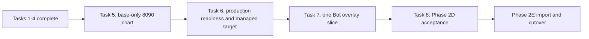

# Phase 2D Market Data and Minimal Runtime Access Implementation Plan

> **For agentic workers:** Execute one task at a time with RED -> GREEN tests, an
> independent requirements/security review, and separate backend/frontend/Root commits.

**Current status (2026-07-30):** Tasks 1-4 are complete on the local, unpublished
`phase2d-runtime-access-rebaseline` branch. Task 5 is the next implementation task.

**Governing amendment:**
`../specs/2026-07-30-runtime-access-rebaseline-design.md`

**Goal:** Finish one Bot-independent base-chart journey on 8090, close the real managed
target lifecycle, and then add exactly one Bot strategy-overlay Runtime Access operation.
Research migration, broad Bot compatibility reads, application writes, and fixed-port
removal belong to Phase 2E.

**Architecture:** `MarketDataQueryService` remains the sole owner of base candles. FreqUI
is served by `platform-control` on the same 8090 origin. A typed live-chart service may
optionally request one Bot-owned overlay through an internal, exact-route gateway. The
gateway can resolve only a healthy Supervisor-produced Registry endpoint and never has a
browser-facing generic proxy API.

## Global constraints

- Follow the master plan, chart data-source rules, and the 2026-07-30 amendment.
- Base candles remain available when every Bot is stopped or Runtime Access is broken.
- Existing 8081/8082/8083 services remain explicit compatibility services in Phase 2D.
- No Research route, Bot status/log route, application write, lifecycle HTTP, or live lane
  is added in this phase.
- No caller-selected upstream URL, host, port, path, method, network, container, or
  service is accepted anywhere.
- Runtime Access has one semantic route ID, one fixed method/path, no route group, no
  redirect, no retry, and no fallback target.
- Runtime internal authentication is separate from user Basic/HS256 authentication.
- A runtime can verify the platform's short-lived grant but cannot mint one.
- Chart refresh reads recorded output only; it never evaluates a strategy or creates an
  order.
- Online exchange access and paper-runtime launch acceptance require separate explicit
  authorization. Documentation approval is not online authorization.

## Verified progress

| Task | Result | Root commit | Backend commit |
|---|---|---|---|
| 1. Versioned refresh policy and canonical candle contracts | Complete locally | `164b605` | `c6f774f7a` |
| 2. Bounded cache and in-flight coalescing | Complete locally | `f402782` | `6e6f14b1d` |
| 3. Closed OKX/Bitget public adapters and catalog correction | Complete locally | `ec47979` | `f82ad96b8` |
| 4. `MarketDataQueryService` and authenticated API v2 | Complete locally | `2128646` | `b9345c4a6` |

The frontend remains at `09b235d8`; no Phase 2D frontend change has been made. The Task 4
implementation session reported 65 focused tests and a 425-test combined backend
regression; no checked-in acceptance receipt independently reproduces those counts. These
commits are not merged or pushed and must not be described as published work.

## Dependency order



Do not start Task 7 token or gateway code while Task 6 still lacks a separately accepted
real endpoint producer and exact target query. An offline assembly test or invented
endpoint does not satisfy this dependency.

---

## Completed Tasks 1-4

Tasks 1-4 delivered:

- immutable `market-data-refresh-v1` cadence with `60m -> 1h` and fail-closed unknown
  timeframes;
- canonical candle/freshness DTOs;
- bounded TTL cache and exact-key in-flight coalescing;
- credential-free, closed OKX/Bitget public candle adapters;
- catalog-backed capability checks and Bitget catalog correction;
- authenticated `GET /api/v2/market-data/candles` on `platform-control`.

Their earlier step-by-step instructions are preserved by Git history, not repeated as an
active backlog in this plan. Any modification to these contracts requires focused
regression tests and a separate justification.

---

## Task 5: One authenticated base-only chart on 8090

### Scope

Prove the user-visible value of Tasks 1-4 before building Runtime Access:

- reuse the existing packaged FreqUI static router from `platform-control`, registered
  after all `/api/v2` routes;
- add one platform session/client using same-origin relative `/api/v2` URLs and a storage
  key distinct from Bot login state;
- add `/platform-login` and one isolated `/platform-chart` route/view that renders
  canonical candles without an active Bot; keep the existing Bot-coupled `ChartsView.vue`
  and TradingView unchanged;
- use the one committed acceptance key
  `digital_asset/spot/bitget/BTC-USDT/1m`; do not add a new instrument-catalog API or
  general selector in this proof slice;
- adapt canonical OHLCV to the existing chart frame without inventing strategy/watch
  layers;
- schedule refresh from the response policy and expose freshness/stale/error state;
- leave TradingView Bot controls and all Research behavior on their current compatibility
  paths.

Do not add CORS, a runtime instance selector, an overlay request, a generic Runtime Access
store, or `/charts/live` in this task.

### Expected files

Backend:

- Modify `freqtrade/freqtrade/platform_control/app.py`.
- Reuse `freqtrade/freqtrade/rpc/api_server/web_ui.py`; do not fork its static-file logic.
- Modify `freqtrade/tests/platform_control/test_app.py`.

Frontend:

- Create `frequi/src/composables/platformLoginInfo.ts`.
- Create `frequi/src/composables/platformApi.ts`.
- Create `frequi/src/types/marketData.ts`.
- Create `frequi/src/stores/marketData.ts`.
- Create a minimal `frequi/src/components/PlatformLogin.vue` with fixed same-origin
  username/password login; do not expose an arbitrary API URL field.
- Create `frequi/src/views/PlatformChartView.vue`, reusing the lowest-level existing
  candle renderer instead of forking ECharts logic.
- Modify `frequi/src/router/index.ts` with an explicit `authDomain: "platform"` route-meta
  branch. `/platform-login` is the only anonymous platform route; `/platform-chart`
  validates or refreshes the platform session and redirects only to `/platform-login`.
  This branch must not initialize or require the Bot store, while the existing guard for
  every Bot-dependent route remains semantically unchanged.
- Add focused unit/component tests next to those modules.

### Test-first acceptance

Write failing tests proving:

1. platform API routes win over the static catch-all and `/api/...` misses do not return
   `index.html`;
2. the platform client uses relative `/api/v2`, never a Bot URL;
3. zero-Bot navigation reaches `/platform-login` and then `/platform-chart`, while an
   existing Bot route still redirects to `/login` when the Bot store is empty;
4. the fixed accepted Bitget Spot BTC-USDT 1m base chart renders from a controlled
   canonical snapshot with all Bot stores offline or absent;
5. `recommended_refresh_ms`, freshness, forming/closed state, and canonical source data
   drive the view;
6. no strategy layer, Research call, order call, or exchange credential appears.

Run at minimum:

```powershell
Push-Location freqtrade
python -m pytest tests/platform_control/test_app.py tests/platform_control/test_api_market_data.py -q -p no:cacheprovider
ruff check freqtrade/platform_control/app.py tests/platform_control/test_app.py
Pop-Location

Push-Location frequi
pnpm vitest run tests/unit/platformApi.spec.ts tests/unit/marketDataStore.spec.ts tests/component/PlatformLogin.spec.ts tests/component/PlatformChartView.spec.ts
pnpm typecheck
pnpm build
Pop-Location
```

### Required offline exit gate

Task 5 is complete when, using a controlled credential-free provider adapter, an
authenticated user can open `http://127.0.0.1:8090/platform-chart` and see canonical
candles while 8081/8082/8083 Bot/Research services are stopped. Static/API precedence,
platform-session refresh, zero-Bot routing, rendering, and cadence must all pass without
public network access. If same-origin asset delivery cannot be achieved by reusing the
existing router, stop and review the packaging boundary; do not solve it with wildcard
CORS or a second web gateway.

### Separately authorized public-market-data smoke

A real Bitget public response is not required to complete Task 5 and is not authorized by
this document. It is required later by the Phase 2D Task 8 paper-online gate. Run it only
after explicit authorization; record the exact key, provider, snapshot identity, and
non-secret result. A fixture-backed pass must never be reported as that online evidence.

Commit backend, frontend, and Root gitlink changes separately after review.

---

## Task 6: Close production readiness and the real managed target lifecycle

### Current authority boundary

The current production entrypoint is intentionally disabled. The internal persisted-
authority assembly seam is test evidence only, and the host mutation bridge is unavailable.
Task 6 must close—not bypass—the production blockers in
`docs/operations/runtime-supervisor.md`. This task adds no token, forwarding, chart overlay,
Research route, or browser route.

### Task 6A: Offline production-readiness closure

Close all of the runbook's blockers 1-6 with reviewed code, tests, and operational
evidence:

1. assemble the exact SQL repository, Reconciler, preparation ports, compiler, access-
   network gate, and Safe Compose Driver in `_assemble_supervisor()`;
2. wire the Supervisor-only PostgreSQL role/secret, exact schema gate, transaction and
   outage behavior without granting the Operator or platform-control that authority;
3. reload and revalidate persisted launch authority; never accept a deserialized or
   caller-built `LaunchSnapshot`;
4. deploy exactly one protected single writer through the reviewed narrow host mutation
   bridge and prove lock loss, guard revocation, restart, and competing replicas fail
   closed;
5. complete production state/secret preparation, ownership, rotation, backup, and
   non-destructive recovery without leaking values;
6. add bounded job/lease/attempt/health/failure-latch telemetry plus database-down
   inspection, log access, and exact-identity emergency stop.

The change that enables production assembly remains closed to the committed
`freqtrade-paper-probe-v1` registration, template, command, health, state, secret, image,
and paper environment. It starts no job by itself and grants no Research, migration Bot,
Live, exchange-write, or listener-removal authority. Root Safety must replace the old
always-disabled assertion with positive paper-probe-only assembly checks plus negative
tests for every other template, owner, environment, and mutation path.

### Task 6B: Attested endpoint producer and query

Backend responsibilities:

- migrate `runtime_endpoints` to add non-null `network_name`, `runtime_alias`, and
  `connection_identity_revision`; these are exact compiled binding facts, not a URL;
- because no trusted producer exists today, the migration must refuse any pre-existing
  endpoint row rather than fabricate/backfill an unattested alias or network; only then
  make the new fields non-null;
- add an immutable endpoint/target DTO containing exact instance, attempt, RuntimeSpec,
  endpoint kind, protocol, internal port, exposure, and those attested connection fields;
- extend the Supervisor repository contract so the verified healthy transition creates
  exactly one `application_http` endpoint for that exact attempt in the same transaction;
- accept connection identity only from the exact compiled access-network binding after
  the two-member private-network gate passes;
- add a consistent-read target query that accepts only the exact healthy, non-latched
  active attempt with one `internal_only` endpoint whose persisted connection identity
  still matches active launch authority;
- keep stopped/failed/old endpoint rows as evidence but make them unselectable;
- fail missing, duplicate, stale, wrong-attempt, wrong-exposure, wrong-spec, wrong-network,
  wrong-alias, wrong-identity-revision, and ambiguous state before network access.

The producer and query consume one shared typed `RuntimeConnectionIdentity`; do not
duplicate Root's current private string formulas in platform-control or let
platform-control inspect Docker.

### Expected files

Backend changes should stay within:

- `freqtrade/freqtrade/platform/runtime_domain.py`;
- `freqtrade/freqtrade/platform/runtime_models.py`;
- `freqtrade/freqtrade/platform/runtime_repository.py`;
- one Alembic migration under `freqtrade/platform_migrations/versions/`;
- focused domain, migration, and repository tests.

Root changes should stay within existing surfaces:

- `tools/runtime_supervisor/__main__.py` and current assembly/dependency adapters;
- the current runtime snapshot, access-network, repository, state, secret, and safe-driver
  modules only where a blocker requires them;
- `tests/test_runtime_supervisor_*.py`, affected component tests, and Root Safety selectors;
- `docs/operations/runtime-supervisor.md` plus any directly affected operations runbook.

Do not add a second repository, direct SQL path, Docker SDK path, new owner kind, generic
endpoint discovery service, fixed-port adapter, general host socket mount, or parallel
Supervisor implementation.

### Required offline gate

Write failing tests for every blocker, endpoint transition/query state, and producer/query
connection-identity equality. Then run focused backend and Root Supervisor suites followed
by all affected Phase 2C and Root Safety regressions. Offline acceptance must instantiate
the real production dependency graph without starting Docker, contacting an exchange, or
creating a lifecycle job. The runbook must describe the new paper-probe-only boundary and
retain an exact fail-closed operator path.

Passing this gate permits the reviewed binary/deployment to exist; it does not authorize
starting it.

### Separately authorized gate 7a: paper-probe producer smoke

Only after explicit authorization for the exact paper-probe instance:

1. start it through the single real Supervisor;
2. prove exact image/spec/state/secret/network/attempt identity and no real order;
3. prove the healthy transaction emits one attested `application_http` endpoint;
4. query that exact target through the production repository path;
5. stop it and prove the old row remains evidence but is immediately unselectable;
6. retain a non-secret receipt and leave 8081/8082/8083 unchanged.

Task 7 begins only after this gate passes. If online authorization is unavailable, pause
after the offline gate; do not substitute a mock producer. Listener retirement is gate 7b
and remains entirely in Phase 2E.

### Stop conditions

Stop and repair the prerequisite if any runbook blocker remains open, endpoint creation
cannot be atomic with the verified healthy transition, connection identity would come from
the caller or a duplicated formula, the host bridge is broad/unreviewed, or enabling
assembly bypasses any Phase 2C safety guard.

---

## Task 7: One Bot strategy-overlay Runtime Access vertical slice

### Scope

Implement only `bot.strategy_overlay.read.v1` end to end:

1. `POST /api/v1/internal/runtime-access/strategy-overlay`, matched as
   `runtime_strategy_overlay_v1`, returns only the exact frozen overlay DTO defined by the
   governing amendment;
2. committed `runtime-access-policy-v1` contains exactly that semantic route ID, method,
   path, schemas, paper-probe capability, byte/time/concurrency bounds, and no second entry;
3. `platform-control` obtains Task 6's exact target, issues one short-lived Ed25519 grant,
   and forwards with no redirect or retry;
4. a typed `POST /api/v2/charts/live` composes canonical base candles with the optional
   overlay and turns overlay failure into a warning;
5. the platform chart may select the known authorized paper-probe Registry instance as a
   product identity, but receives and supplies no attempt, host, network, path, port, or
   token detail.

There is no public generic Runtime Access router. The typed chart service calls the
internal gateway service directly.

### Expected backend work

- Add the exact runtime route, exact request/response union, and a route-local internal-
  auth dependency. Keep it out of ordinary Basic/Bearer auth and public OpenAPI.
- Add minimal Runtime Access domain, the one-entry canonical policy, Ed25519 issue/verify,
  exact target forwarding, and chart composition modules. Issuer and verifier must load
  the same immutable policy bytes; neither duplicates method/path or limits in code.
- Commit that policy once as
  `freqtrade/freqtrade/platform_control/policies/runtime-access-v1.json`, package it in
  wheel/sdist, and load it through `importlib.resources`; there is no path/env override.
- Migrate `runtime_access_requests` with non-null `requested_instance_id` and `route_id`,
  nullable resolved instance/attempt foreign keys, and exact checks described by the
  amendment. Refuse a non-empty legacy table rather than invent route/request identity.
  Unknown-instance, no-active-attempt, policy-denial, resolved-target, and audit-write-
  failure tests are mandatory.
- Use `X-Freqtrade-Runtime-Access`; do not accept the internal grant through ordinary
  Basic/Bearer authentication.
- Claims, literal JOSE values, 15-second lifetime, two-second future-`iat` skew, duplicate/
  extra rejection, and validation precedence must match the governing amendment exactly.
- Enforce the amendment's fixed 16 KiB/2 MiB caps, exact timeouts, identity encoding,
  two-request per-instance concurrency bound, and 250 ms acquisition limit.
- Do not add route groups, signed caller methods, read retry, replay infrastructure,
  automatic rotation, a key ring, or any other route entry.

### Expected Root work

- Bootstrap one explicit Ed25519 keypair only on an operator command.
- Mount the private key only into `platform-control` and the public key plus immutable
  instance/attempt identity read-only into the managed runtime.
- Extend Root Safety to reject private-key runtime mounts, token/body logging, generic
  routes, caller targets, redirects, retries, and multiple policy entries.
- Keep keys, tokens, and values out of Git, PostgreSQL, logs, receipts, and ordinary
  environment variables.

### Expected frontend work

- Extend the platform chart request with an optional Registry `runtime_instance_id`.
- Consume the typed composition response; do not create a generic runtime proxy client.
- Preserve base data when the overlay is unavailable and show a stable, non-secret
  warning.
- Align layers by instrument, timeframe, candle open, and data-as-of according to
  `docs/chart-data-source-rules.md`.

### Test-first acceptance

Write failing tests covering at least:

- wrong signature, algorithm/type, issuer, audience, attempt, route ID, policy revision,
  claim/header shape, lifetime/skew, key ID, and matched route/method;
- stopped, stale, duplicate, missing, or identity-mismatched target with zero HTTP calls;
- unknown instance, known instance without attempt, pre-resolution policy denial, resolved
  failure, and audit persistence failure with the exact nullable/non-null audit shape;
- caller target fields, redirects, oversized request/response, header stripping, timeout,
  content encoding, concurrency saturation, and no retry;
- request/response schema bounds, ordered/aligned points, exact data-as-of window, and
  rejection of arbitrary metadata or an unapproved source/kind;
- response contains no base/watch layer from the runtime;
- overlay alignment and base-only degradation;
- chart refresh does not evaluate a strategy or create an order;
- policy contains exactly `bot.strategy_overlay.read.v1`.

Run the focused runtime-auth, gateway, chart-composition, market-data, frontend chart, key
mount, and Root Safety suites, then the full affected backend/frontend regressions.

Commit each owning repository separately. Do not combine backend, frontend, and Root
implementation in one commit.

---

## Task 8: Phase 2D integration and acceptance

### Offline gate

- Run all backend `tests/platform`, `tests/platform_control`, and directly affected RPC
  tests plus Ruff.
- Run focused FreqUI platform/chart tests, `pnpm typecheck`, lint, and build.
- Run the complete Root standard-library suite and Root Safety workflow selectors.
- Verify submodule pointers, documentation links, policy count, secret exclusions, and a
  clean recursive checkout at the exact Root SHA.
- Perform an independent architecture/security review against the amendment.

### Separately authorized paper-online gate

Only after explicit authorization:

- start the exact paper probe through the real Supervisor;
- prove one healthy attempt and one `application_http` endpoint;
- render base plus overlay through 8090 without any real order or exchange write;
- stop the probe and prove the endpoint is no longer selectable while base candles remain;
- retain a non-secret receipt with exact component/spec/attempt/policy identities.

### Phase 2D definition of done

- Tasks 1-4 remain green.
- One same-origin 8090 base chart works with every Bot stopped.
- One exact managed paper Bot overlay works and fails closed independently.
- Policy contains one semantic operation, not the old 49-route inventory.
- No Research route, application write, fixed-service proxy, or listener removal exists.
- Existing 8081/8082/8083 compatibility behavior is unchanged.
- Reviewed component commits and verification evidence are recorded.

After this gate, begin Phase 2E Task 1. Do not infer permission to push, open or mutate a
PR, start online services, remove fixed listeners, or enable live trading.
