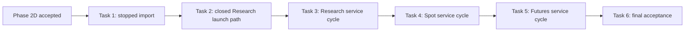

# Phase 2E Managed Migration, Compatibility, and Controlled Cutover Plan

> **For agentic workers:** Execute one service cycle and one bounded user journey at a
> time. Every Runtime Access operation lands with its producer, actual consumer, focused
> tests, and independent security review.

**Current status (2026-07-30):** Provisional and paused. The Product Phase 1 Baseline
Capability Gate is an inherited prerequisite, but its pass does not activate this plan.
Do not start until a later explicit Phase 2E decision revalidates the plan and every
rebaselined Phase 2D prerequisite it still needs.

**Governing amendment:**
`../specs/2026-07-30-runtime-access-rebaseline-design.md`

**Goal:** Import the fixed Spot/Futures/Research services as managed identities, then move
Research, Spot, and Futures through independent producer/consumer/state cutover cycles.
Remove 8081, 8082, or 8083 only after that service's own parity, one-writer, final-sync,
rollback, and acceptance evidence passes.

**Architecture:** Existing Compose services are migration input and rollback evidence,
not Runtime Access targets. A disposable managed candidate proves reads against a private
copied allocation while the fixed service remains the sole authoritative writer. Before
any write/computation migration, both candidate and old writer stop, the old authoritative
source is snapshotted once more, and a different empty final allocation is restored. The
new managed attempt becomes authoritative only after identity and health verification.

## Inputs from Phase 2D

If Phase 2E is explicitly resumed later, it may assume only:

- canonical Bot-independent market data and server-published refresh policy;
- one same-origin 8090 platform chart;
- a production-ready, single-writer Supervisor and attested endpoint producer/query;
- distinct Ed25519 Runtime Access authentication;
- one accepted paper-probe semantic operation: `bot.strategy_overlay.read.v1`.

Phase 2E must not assume that a Research or migration-Bot launch path, Bot status/log/
configuration/trade routes, or Research routes exist. The old 49-route inventory is not an
implementation input.

## Global constraints

- No destructive recovery, move, delete, overwrite, or simultaneous writers to one state
  allocation.
- Import performs no Docker, network, service, state, or secret mutation.
- Fixed services are never inserted as fake `RuntimeEndpoint` targets or proxied through
  8090.
- Runtime lifecycle remains Operator CLI/Supervisor-only; browser APIs are application
  operations, never lifecycle operations.
- Every Runtime Access route ID maps to one method, fixed path, producer capability, and
  closed schema. There are no authority-bearing route groups or caller paths.
- No automatic Runtime Access retry. Ambiguous writes are reconciled, never repeated.
- Research cannot call trading operations. Paper cannot call Live-only operations.
- No caller-selected URL, host, port, path, method, service, network, container, attempt,
  or connection identity. A typed API may select an authorized Registry instance only.
- Online acceptance is paper/dry-run only and needs separate explicit authorization. This
  plan grants no real order, exchange write, listener removal, push, or PR mutation.
- A compatibility listener stays active until its complete active-consumer inventory is
  empty and its service-specific rollback plan passes.

## Dependency order

Research comes first because it proves the Workspace Worker boundary without trading
authority. Spot and Futures remain independent gates; the team may reverse Tasks 4 and 5
only through an explicit plan amendment with evidence that no shared consumer/state
dependency changes. They must never run their authority transitions concurrently.

## The mandatory per-service state machine

Tasks 3-5 each execute the same delivery sequence. This is a planning invariant, not a
request to build a generic migration framework.

```mermaid
stateDiagram-v2
    [*] --> ImportedStopped
    ImportedStopped --> DisposableCandidate: initial verified snapshot to new empty allocation
    DisposableCandidate --> ReadsAccepted: managed candidate; old service is sole authority
    ReadsAccepted --> AuthorityFrozen: stop old and candidate; prove absence
    AuthorityFrozen --> FinalRestored: final source snapshot to different empty allocation
    FinalRestored --> ManagedAuthoritative: launch and verify exact final attempt
    ManagedAuthoritative --> WritesAccepted: migrate writes/computations one slice at a time
    WritesAccepted --> ListenerRemoved: parity and rollback pass
    ListenerRemoved --> [*]
```

Rules for every transition:

1. **Imported stopped.** The imported identity has no endpoint, process, network, state
   allocation, secret material, or pending lifecycle job.
2. **Disposable candidate.** Copy a verified initial snapshot into a new empty allocation.
   The old fixed service remains the only authoritative writer. The candidate is
   consumer-read-only: no write/computation route is exposed and none of its private-copy
   mutations can become authoritative or be copied back.
3. **Reads accepted.** Add and migrate one read operation at a time. Stopping the candidate
   yields a stable unavailable response; no fallback to the fixed listener or another
   runtime is allowed.
4. **Authority frozen.** Enter a bounded maintenance window. Stop the old service and
   candidate, prove both processes/listeners absent, and take the final identity-bound
   snapshot from the unchanged authoritative source.
5. **Final restored.** Never overwrite/reuse the candidate allocation. Restore the final
   snapshot into a different verified-empty allocation, compile a new exact spec/attempt,
   and retain both source and candidate as inactive evidence.
6. **Managed authoritative.** Launch through the real Supervisor. Only after health,
   state/spec/attempt/network/endpoint equality passes may the selected Registry instance
   become the application's authority.
7. **Writes accepted.** Migrate each write or computation consumer with durable request,
   route, target, result, ambiguity, and idempotency evidence. Never retry an ambiguous
   result.
8. **Listener removed.** Remove only this service's fixed listener/definition after all of
   its consumers pass and rollback remains executable.

Before the freeze, rollback stops the disposable candidate and leaves the old service
authoritative. Between freeze and the first accepted managed write, rollback restarts the
unchanged old source. After a managed write is accepted, rollback must transfer the managed
authoritative state into a new empty compatibility-recovery allocation; it may not discard
new results or overwrite the retained old source. The exact post-write rollback procedure
must be tested before the first write migration.

---

## Task 1: Import existing services as stopped managed identities

### Scope

Read the committed exact-three manifest, verified Compose render, component identities,
configuration/state identities, and image provenance. Create idempotent migration records
and stopped target identities:

| Current service | Managed owner kind | Initial desired state |
|---|---|---|
| Spot Bot | `migration_bot` | `stopped` |
| Futures Bot | `migration_bot` | `stopped` |
| Research | `workspace_worker` | `stopped` |

Old ports are evidence only. New endpoint policy is `internal_only` and contains no host
port.

### Required behavior and exit gate

- exact replay is idempotent;
- changed source identity conflicts before mutation;
- import creates no container, network, allocation, secret, endpoint, or lifecycle job;
- source state/configuration/strategy/image identities are immutable migration evidence;
- managed allocations are new and never point at an old writable state root;
- focused backend/Root tests prove classification, zero external mutation, no secret values,
  stopped instances, and no routable endpoint.

---

## Task 2: Close one exact managed Research launch path

### Why this is a prerequisite

The committed `research-worker-migration-v1` template exists, but current executable
launch-policy loading and production registration accept only `freqtrade-paper-probe-v1`.
Task 2 deliberately and narrowly extends that boundary before any Research launch. A
template file by itself is not an executable producer.

### Scope

- add one exact Workspace Worker migration registration path bound to the Task 1 imported
  identity and committed template/component digests; accept no caller template or command;
- extend launch-policy loading from the paper-probe singleton to the closed pair
  `freqtrade-paper-probe-v1` and `research-worker-migration-v1`, with explicit owner,
  `paper` environment, command, health, state, material, image, and network checks;
- extend production assembly/repository selection only enough to reconcile that reviewed
  Workspace Worker kind through the existing single writer;
- prove Research receives no Bot exchange/trading secret class and cannot select a trading
  command, Live environment, or migration-Bot template;
- update Root Safety and the Supervisor runbook for this exact extension while preserving
  all paper-probe tests.

Do not create a generic template registry executor, arbitrary owner/template switch, second
Supervisor, or Research application route in this task.

### Required gate

Focused tests must first fail because the Research template is rejected, then pass only for
the exact imported Workspace Worker. Paper-probe acceptance remains green; unknown,
changed-digest, wrong-owner, wrong-environment, trading-secret, and cross-template inputs
fail before state, secret, network, or Driver work. Offline assembly is required. Starting
the worker remains a separately authorized Task 3 action.

---

## Task 3: Complete the Research service cycle and remove 8083

### Candidate and four read journeys

Execute the mandatory state machine through `ReadsAccepted` for Research. The disposable
candidate is non-authoritative and no backtest/write route is exposed. After its separately
authorized health/endpoint proof, add exactly:

| Route ID | Typed platform consumer |
|---|---|
| `research.bots.read.v1` | Research Bot catalog |
| `research.instruments.read.v1` | Instrument selector |
| `research.datasets.read.v1` | Dataset selector |
| `research.chart_candles.read.v1` | Research chart |

Each route first receives a versioned record with one verified backend method/path, strict
schema, owner/environment capability, byte/time/concurrency bounds, and one actual FreqUI
consumer. Research FreqUI uses the platform session and selected Workspace Worker; it no
longer borrows `activeBot.api`. The authoritative standard Freqtrade `/backtest` and
analysis journeys remain on the old 8083 path during this candidate stage because they
initiate work. The simplified `/research` SMA calculation is frozen compatibility
behavior and gains no new strategy, dataset, Experiment, Runtime, or Runtime Access scope.

Required read tests cover exact instance/attempt/route isolation, no caller target, no
redirect/retry/body/token logging, bounded response, zero active Bot client, fixed-listener
non-fallback, and unchanged legacy backtest behavior.

### Final Research authority transition

After the four reads pass, execute `AuthorityFrozen` through `ManagedAuthoritative` using a
different empty final allocation. Rebind the four reads to the final attempt and repeat
their acceptance before migrating a write.

Generate the remaining Research consumer inventory from actual code. Preserve the
authoritative standard Freqtrade backtest, history, result visualization, Lookahead, and
Recursive journeys before removing 8083. Migrate each retained computation/write one
semantic slice at a time. Treat every POST/PUT/PATCH/DELETE/action as a write unless
proven otherwise. Require durable result and ambiguity evidence and the tested post-write
rollback path. Retiring the simplified `/research` calculation is a separate
compatibility decision; do not promote it into the authoritative backtest or expand it.

### Exit gate

- four reads and every retained Research write/computation work through typed 8090 APIs;
- old and new writers never overlap, and no candidate result is promoted;
- final state/spec/attempt/network/endpoint identity and rollback pass;
- stopping the final worker yields stable Research-unavailable behavior without fallback;
- 8083 and its active definition are removed only after the Research consumer inventory is
  empty; retained source/candidate/fixed definition remain inactive evidence.

Research completion grants no Spot or Futures authority.

---

## Task 4: Complete the Spot Bot service cycle and remove 8081

### Exact producer prerequisite

Before launching a Spot candidate, extend registration, launch-policy loading, and
production assembly for exactly the imported Spot `migration_bot` template and paper
environment. Preserve the negative Research/paper-probe boundaries. Prove the exact
strategy/configuration/state/secret/image/command/health identities and no Live or Futures
cross-selection. This extension lands and passes offline review before an authorized start.

### Consumer and state cycle

Execute the mandatory per-service state machine for Spot. Extend
`bot.strategy_overlay.read.v1` from `paper_probe` to this exact `migration_bot` capability
only when the Spot platform-chart consumer is migrated and accepted. Inventory all other
actual Spot UI/operator calls and classify each as platform capability, runtime read,
runtime write/computation, or obsolete compatibility behavior.

For every retained journey, define one exact operation, test it, migrate that consumer,
and review before adding another. Do not mechanically import legacy Bot endpoints. Status,
logs, configuration, trades, balance, and actions remain absent until a current consumer
demonstrates need; lifecycle remains outside HTTP.

The active-consumer inventory must preserve the accepted meanings of 8081 `/graph`
(minute-candle watch and strategy review) and 8081 `/trade` (compatibility dry-run
runtime observation/operations). These are parity obligations, not permission to add
features or proxy endpoints mechanically. Standard Freqtrade backtest/analysis remains an
8083 service-cycle obligation, not an 8081 Spot endpoint.

Freeze old Spot and the disposable candidate, perform the final sync into a different
empty allocation, verify the final managed attempt, then migrate any retained writes. Run
the tested post-write rollback before removing 8081.

### Exit gate

Every active Spot consumer passes through typed 8090 APIs or is explicitly removed from
scope; state/identity/one-writer/rollback evidence passes; 8081 is absent; 8082 and the
Futures source remain unchanged.

---

## Task 5: Complete the Futures Bot service cycle and remove 8082

Repeat Task 4 for only the imported Futures `migration_bot`, its exact closed template,
configuration/strategy/state/secret/image identities, consumers, and allocation. Do not
reuse Spot authority merely because owner kind is the same. Runtime policy must distinguish
the authorized instance/spec/attempt and deny Spot/Futures cross-selection.

Run the full candidate-read/freeze/final-sync/write/listener state machine. A successful
Spot cutover is regression evidence, not permission to skip Futures RED tests, independent
online authorization, one-writer proof, or rollback rehearsal.

### Exit gate

Every active Futures consumer passes through typed 8090 APIs or is explicitly removed from
scope; state/identity/one-writer/rollback evidence passes; 8082 is absent; Research and
Spot acceptance remain green.

---

## Task 6: Offline, paper-online, and fresh-checkout acceptance

### Offline gate

From a clean recursive checkout at exact component SHAs, prove:

- PostgreSQL remains internal and least-privileged;
- one Supervisor writer, restricted host bridge, failure latch, exact persisted launch
  authority, emergency stop, and attested endpoint lifecycle remain intact;
- exact closed launch-policy support exists only for the accepted paper probe, Research,
  Spot, and Futures identities;
- base chart works with all managed/fixed Bots stopped;
- every accepted operation enforces target/owner/environment/route/schema isolation, audit
  shape, bounds, and no automatic retry;
- fixed-listener absence matches three completed service-cycle gates;
- all backup/final-sync/rollback paths are identity-bound, non-destructive, and never
  overlap writers;
- platform-control has no Docker, host-bridge, secret-root, Bot-state-root, or arbitrary
  proxy authority;
- backend tests/Ruff, frontend tests/typecheck/lint/build, Root suite/Root Safety, document
  links, and submodule identities pass.

### Separately authorized paper-online gate

Only with explicit authorization for exact instances:

- run the approved paper/dry-run Research, Spot, and Futures managed runtimes one service
  cycle at a time;
- prove public market reads and all accepted application journeys;
- prove no real order, exchange write, Live environment, cross-instance credential, or
  cross-service state use;
- exercise bounded stop/restart/rollback and retain non-secret receipts.

### Final definition of done

- Current product journeys are reachable through typed 8090 APIs.
- Policy contains only operations with accepted producers and consumers.
- Research cannot reach trading operations; Paper cannot reach Live-only operations.
- Ambiguous writes are never retried or silently discarded.
- No active listener remains on 8081, 8082, or 8083.
- Old source state, disposable candidates, and service definitions remain inactive,
  identified rollback evidence.
- Exact-SHA fresh checkout and all offline gates pass.

Do not push, open or mutate a PR, remove a listener, start an online runtime, or enable live
trading without the corresponding explicit authorization. Completion of any earlier Gate
does not activate this plan without a new recorded Phase 2E decision.
