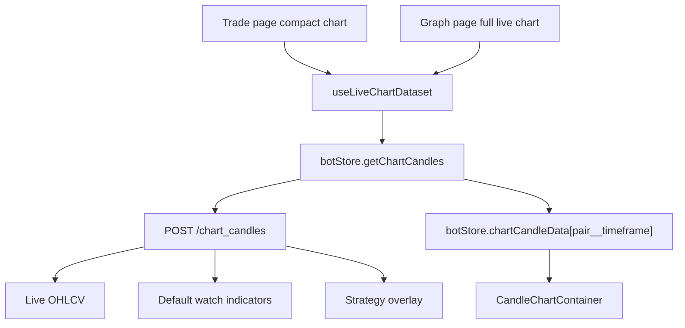

# Live Chart Dataset Unification Design

Date: 2026-07-03

## 1. Background

The current FreqUI chart behavior is inconsistent between the Trade page and the Graph page.

The Trade page chart is the newest implementation. It uses the `/chart_candles` API to load live OHLCV data, calculate default watch indicators, overlay strategy indicators, and refresh independently of the bot strategy timeframe.

The Graph page still uses the older chart data paths:

- `/pair_candles` for trading mode chart data.
- `/pair_history` for webserver and historical analysis.

As a result, the two pages can show different candles, different last candle timestamps, different indicators, and different signal counts for the same bot, pair, and timeframe. This violates the intended product model: the Trade page chart should be a compact version of the Graph page chart, not a separate chart system.

## 2. Goals

1. Make the Trade page chart and the Graph page live chart use the same real-time chart data model.
2. Treat the current Trade page chart behavior as the source implementation for live charting.
3. Keep the first implementation small and controlled.
4. Avoid rewriting the existing ECharts chart components.
5. Preserve the Graph page historical and webserver analysis behavior.
6. Keep strategy execution isolated from watch chart indicators.

## 3. Non-Goals

1. Do not remove `/pair_candles` or `/pair_history`.
2. Do not rewrite `CandleChart.vue`.
3. Do not redesign the full Graph page UI.
4. Do not create a full multi-bot chart workspace.
5. Do not rename `tradeChartStore` to `liveChartStore` in the first implementation.
6. Do not change how Freqtrade strategies execute or how orders are produced.
7. Do not make watch indicators affect strategy dataframe analysis.

## 4. Current State

### 4.1 Trade Page

The Trade page uses `getChartCandles()` with this payload shape:

```ts
{
  pair,
  timeframe,
  include_strategy_overlay: true,
  candle_mode: 'live',
}
```

The backend endpoint `/chart_candles` currently provides:

- Live OHLCV.
- Current incomplete candle when `candle_mode` is `live`.
- Default watch indicators such as MA, RSI, and MACD.
- Strategy indicator overlay from the bot strategy timeframe.
- Plot config for the chart.
- Signal columns and signal counts.
- Overlay metadata and warnings.

### 4.2 Graph Page

The Graph page currently branches through the older APIs:

- In trading mode it uses `/pair_candles`.
- In webserver or historical mode it uses `/pair_history`.
- It depends on `plotStore.plotConfig` for custom plotted columns.
- It does not use the live chart indicator layer in trading mode.

### 4.3 Shared Chart Components

The pages already share the major display components:

- `CandleChartContainer.vue`
- `SingleCandleChartContainer.vue`
- `CandleChart.vue`

The main gap is not rendering. The gap is the data source and page-level refresh state.

## 5. Proposed Design

### 5.1 Core Approach

Introduce a small shared frontend composable, tentatively named `useLiveChartDataset()`.

This composable extracts the live chart logic currently embedded in `TradingView.vue` and makes it reusable by both:

- Trade page compact chart.
- Graph page full chart in trading mode.

The backend source of truth for live chart data remains `/chart_candles`.

### 5.2 Data Flow



Pages should own layout. The composable should own live chart data orchestration.

### 5.3 Runtime Mode Split

The Graph page must keep two clearly separated modes.

| Mode | Data Source | Refresh | Purpose |
| --- | --- | --- | --- |
| Trading live chart | `/chart_candles` | Automatic | Real-time watch chart |
| Webserver or historical chart | `/pair_history` or existing path | Existing behavior | Historical strategy analysis |

The first implementation only migrates the Graph page trading live chart path.

## 6. Component Boundaries

### 6.1 Backend

No backend schema change is required for the first implementation.

`/chart_candles` remains responsible for:

- Loading chart OHLCV.
- Applying watch indicators.
- Merging strategy overlay columns.
- Returning plot config.
- Returning warnings and signal counts.

### 6.2 Bot Store

The existing bot store remains responsible for:

- `getChartCandles()`
- `chartCandleData`
- `chartCandleDataStatus`
- Request de-duplication through the existing chart refresh helper.

### 6.3 Shared Live Chart Composable

`useLiveChartDataset()` is responsible for:

- Resolving the selected live chart timeframe.
- Exposing available timeframe options.
- Reading the currently selected pair or pair list.
- Calling `getChartCandles()`.
- Deriving the current dataset.
- Deriving `plotConfig`, `warningText`, and `statusText`.
- Scheduling automatic refresh.
- Stopping refresh when the page is hidden.
- Refreshing immediately when the page becomes visible again.

It should not render UI.

### 6.4 Chart Components

`CandleChartContainer`, `SingleCandleChartContainer`, and `CandleChart` remain display components.

They should receive:

- `chartDataSource`
- `chartDataStatus`
- `plotConfigOverride`
- `chartStatusText`
- `chartWarningText`

They should not decide which backend endpoint is correct for a page.

## 7. State Design

The first implementation should keep state changes minimal.

Use the existing state:

- `botStore.activeBot.chartCandleData`
- `botStore.activeBot.chartCandleDataStatus`
- `tradeChartStore.selectedTimeframe`
- `tradeChartStore.useStrategyOverlay`
- `botStore.activeBot.plotMultiPairs`

Although `tradeChartStore` is named after the Trade page, it already models live chart state. The first implementation should wrap this store inside `useLiveChartDataset()` and avoid a broad rename.

The composable should expose a neutral interface so later renaming `tradeChartStore` to `liveChartStore` is possible without changing page components.

## 8. Page Changes

### 8.1 Trade Page

Move the existing live chart logic out of `TradingView.vue` into `useLiveChartDataset()`.

The Trade page keeps:

- Grid layout.
- Draggable container.
- Tabs and trading panels.
- The compact chart placement.
- The timeframe selector slot.

The Trade page should consume the composable output and pass it to `CandleChartContainer`.

### 8.2 Graph Page

Add a live chart branch:

```ts
const useLiveChart = computed(() =>
  !botStore.activeBot.isWebserverMode &&
  botStore.activeBot.botFeatures.chartCandles
);
```

When `useLiveChart` is true:

- Use `useLiveChartDataset()`.
- Pass `chartDataSource`, `chartDataStatus`, `plotConfig`, `warningText`, and `statusText` to `CandleChartContainer`.
- Use the same live timeframe options as the Trade page.
- Refresh via `/chart_candles`.

When `useLiveChart` is false:

- Keep the existing Graph page logic.
- Continue using `/pair_history` or `/pair_candles`.
- Keep strategy selector, timerange, and custom exchange behavior.

## 9. Small Required Cleanup

`CandleChartContainer.vue` currently receives a `historicView` prop but passes `botStore.activeBot.isWebserverMode` to `SingleCandleChartContainer`.

This should be changed to pass `props.historicView`.

This keeps the component boundary correct and prevents child components from ignoring the mode selected by the parent page.

## 10. Error Handling

1. A `/chart_candles` failure must not affect other Trade page panels.
2. A failed refresh should set the chart status to error.
3. Existing chart data should not be cleared on transient refresh failure.
4. Backend warnings should be shown through `chartWarningText`.
5. If the bot does not support `chartCandles`, Graph should use the old path.
6. Webserver and historical analysis mode should continue using the old path.

## 11. Performance Constraints

The first implementation should reuse current performance controls:

- `/chart_candles` OHLCV cache.
- Existing request de-duplication.
- Current interval mapping by timeframe.
- Stop refresh when `document.visibilityState === 'hidden'`.
- Refresh only selected `plotMultiPairs`.
- Reuse `chartCandleData[pair__timeframe]` across Graph and Trade in the same bot context.

No cross-tab global timer coordination is required in the first implementation.

## 12. Testing Plan

### 12.1 Unit Tests

Add or adjust tests for `useLiveChartDataset()`:

- Default timeframe comes from bot timeframe when no live chart timeframe is selected.
- Updating timeframe writes to the store.
- Refresh sends `pair`, `timeframe`, `include_strategy_overlay`, and `candle_mode: 'live'`.
- Unsupported `chartCandles` does not call `/chart_candles`.
- Hidden document state prevents scheduled refresh.
- Refresh interval comes from the existing interval helper.

### 12.2 Component and View Tests

Add or adjust tests for:

- `ChartsView` uses `chartDataSource` and `plotConfigOverride` in trading live mode.
- `ChartsView` keeps `/pair_history` behavior in webserver mode.
- `TradingView` still passes the live chart props to `CandleChartContainer`.
- `CandleChartContainer` passes `props.historicView` to `SingleCandleChartContainer`.

### 12.3 Manual Browser Verification

Verify with the in-app browser:

1. Open `http://127.0.0.1:8081/trade`.
2. Select a pair and timeframe.
3. Record signal counts, legend, and latest candle timestamp.
4. Open `http://127.0.0.1:8081/graph`.
5. Verify the Graph chart matches the Trade chart for the same bot, pair, and timeframe.
6. Repeat for `1m`, `15m`, and `1h`.
7. Zoom the chart and wait for automatic refresh.
8. Confirm zoom is preserved.
9. Repeat the core check on the futures bot at `http://127.0.0.1:8082`.

## 13. Acceptance Criteria

The implementation is complete when:

1. Trade and Graph live charts use `/chart_candles` in trading mode.
2. Same bot, pair, and timeframe produce the same latest candle timestamp in both pages.
3. Same bot, pair, and timeframe produce the same default watch indicators in both pages.
4. Strategy overlay indicators match between both pages.
5. Entry and exit signal counts match between both pages.
6. Trade page chart behavior does not regress.
7. Graph historical and webserver chart behavior does not regress.
8. Unit tests pass.
9. Typecheck passes.
10. Frontend build passes.
11. Docker services are rebuilt and restarted with the latest code.
12. Browser verification confirms the two pages match.

## 14. Implementation Order

1. Add tests for the shared live chart behavior.
2. Extract live chart logic from `TradingView.vue` into `useLiveChartDataset()`.
3. Update `TradingView.vue` to consume the composable.
4. Update `ChartsView.vue` to use the composable in trading live mode.
5. Fix `CandleChartContainer.vue` to pass `props.historicView`.
6. Run unit tests, typecheck, and build.
7. Rebuild and restart Docker services.
8. Verify in the browser.

