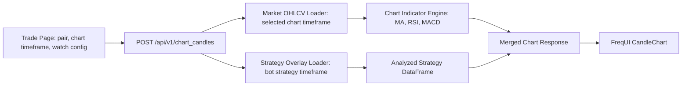

# Trade Chart Indicator Layer Design

## Status

Design sections approved by the user on 2026-07-03. This written spec is ready for user review before implementation planning.

## Goal

Add a minimal, architecture-correct chart indicator layer for the FreqUI Trade page so users can inspect market data with independent watch indicators while the running Freqtrade bot continues to trade using its own strategy settings.

The first implementation targets the Trade page only. It lets the user switch chart timeframes, view default watch indicators, and overlay the active bot strategy indicators without changing the bot strategy, bot timeframe, trading mode, orders, or execution logic.

## Core Decision

Strategy indicators are always displayed using the bot's actual strategy timeframe.

For the current futures bot:

- Strategy: `VolatilitySystem`
- Strategy timeframe: `1h`
- Strategy indicators: `atr`, `close_change`, `abs_close_change`

When the user switches the Trade chart to `1m`, `15m`, `30m`, `1h`, `2h`, `4h`, or `1d`, only the watch chart timeframe changes. `VolatilitySystem` remains a `1h` strategy and its strategy overlay remains a `1h` overlay.

## Assumptions

- The implementation target is `G:\AI_Trading\freqtrade-cn`.
- The frontend target is the `frequi` source tree.
- The backend target is the local `freqtrade` source tree.
- The first product surface is `Trade / 交易`, not `Graph`, `Dashboard`, or backtesting.
- The active bot can be spot or futures. The chart layer must use the active bot exchange context and pair format.
- The first default watch indicator set is:
  - `MA20`
  - `MA60`
  - `RSI 14`
  - `MACD 12/26/9`
  - `Volume`
- Strategy overlay is enabled by default.
- UI watch settings must never mutate `strategy.timeframe`, strategy code, bot configuration, or bot run state.
- The first version can request one pair per API call.
- The first version can use live exchange OHLCV for chart data and does not need a custom cache.

## Non-Goals

- Do not build a TradingView replacement.
- Do not add a user-defined indicator formula language.
- Do not support every TA-Lib indicator in the first version.
- Do not add RSI/MACD parameter editing in the first version.
- Do not support multiple strategy overlays in the first version.
- Do not recompute strategy logic on the user-selected chart timeframe.
- Do not aggregate low-timeframe strategy indicators into higher chart timeframes in the first version.
- Do not modify `/pair_candles` or `/pair_history` semantics.
- Do not make UI watch chart settings affect live or dry-run trading behavior.

## Current Architecture Findings

Current Trade chart data is strategy-coupled.

`frequi/src/views/TradingView.vue` calls the active bot store with:

```ts
timeframe: botStore.activeBot.timeframe
```

The frontend then calls `/pair_candles`, which returns the running bot's analyzed dataframe. The analyzed dataframe only contains columns produced by the active strategy.

For `VolatilitySystem`, the strategy dataframe contains `atr`, `close_change`, and `abs_close_change`, but does not contain `rsi`, `macd`, `ma20`, `tema`, or `sar`. Therefore FreqUI can configure plots for those names, but cannot draw them because the columns are absent.

The existing plot configurator is a column display configurator, not an indicator calculation engine. It can show any dataframe column, but it does not calculate missing columns.

## Recommended Architecture

Add a backend-owned Chart Indicator Layer and keep FreqUI as a display and interaction layer.



The boundaries are:

- Market OHLCV is the factual source for the selected chart timeframe.
- Watch indicators are calculated from the selected chart timeframe and are for user observation only.
- Strategy overlay indicators are read from the active bot strategy dataframe and retain the bot strategy timeframe.
- Trade execution remains owned by Freqtrade's normal bot loop.

## Backend API

Add:

```text
POST /api/v1/chart_candles
```

This endpoint is for Trade page charting. It does not replace `/pair_candles` or `/pair_history`.

### Request

```json
{
  "pair": "BTC/USDT:USDT",
  "timeframe": "15m",
  "limit": 500,
  "watch_indicators": {
    "ma": [20, 60],
    "rsi": [14],
    "macd": [
      {
        "fast": 12,
        "slow": 26,
        "signal": 9
      }
    ]
  },
  "include_strategy_overlay": true
}
```

`watch_indicators` is optional. When omitted, the endpoint uses the default watch indicator set: MA20, MA60, RSI14, MACD12/26/9, and volume.

`limit` defaults to `500` and is capped at `2000`. Requests above the cap return a validation error.

### Response

The response extends the existing `PairHistory` shape so the frontend can reuse existing chart rendering code.

```json
{
  "pair": "BTC/USDT:USDT",
  "timeframe": "15m",
  "chart_timeframe": "15m",
  "strategy": "VolatilitySystem",
  "strategy_timeframe": "1h",
  "timeframe_ms": 900000,
  "columns": [
    "date",
    "open",
    "high",
    "low",
    "close",
    "volume",
    "watch_ma20",
    "watch_ma60",
    "watch_rsi14",
    "watch_macd",
    "watch_macdsignal",
    "watch_macdhist",
    "strategy_1h_atr",
    "strategy_1h_close_change",
    "strategy_1h_abs_close_change",
    "enter_long",
    "enter_short",
    "exit_long",
    "exit_short",
    "__date_ts"
  ],
  "all_columns": [],
  "data": [],
  "length": 500,
  "overlay": {
    "strategy_timeframe": "1h",
    "alignment": "forward_fill",
    "columns": [
      "strategy_1h_atr",
      "strategy_1h_close_change",
      "strategy_1h_abs_close_change"
    ]
  },
  "plot_config": {
    "main_plot": {
      "watch_ma20": { "color": "#3b82f6" },
      "watch_ma60": { "color": "#f59e0b" }
    },
    "subplots": {
      "RSI 14": {
        "watch_rsi14": { "color": "#a855f7" }
      },
      "MACD": {
        "watch_macd": { "color": "#2563eb" },
        "watch_macdsignal": { "color": "#f97316" },
        "watch_macdhist": { "type": "bar", "color": "#22c55e" }
      },
      "Strategy overlay 1h": {
        "strategy_1h_atr": { "color": "#ffffff" },
        "strategy_1h_abs_close_change": { "color": "#ef4444" }
      }
    }
  },
  "warnings": []
}
```

## Column Naming

Watch indicator columns use the `watch_` prefix:

- `watch_ma20`
- `watch_ma60`
- `watch_rsi14`
- `watch_macd`
- `watch_macdsignal`
- `watch_macdhist`

Strategy overlay continuous indicators use the `strategy_<timeframe>_` prefix:

- `strategy_1h_atr`
- `strategy_1h_close_change`
- `strategy_1h_abs_close_change`

This avoids conflicts between user watch indicators and strategy-internal indicators with similar names.

Signal columns can keep the standard Freqtrade names when they are safe to render through existing chart code:

- `enter_long`
- `enter_short`
- `exit_long`
- `exit_short`

## Strategy Overlay Alignment

The strategy overlay uses the active bot strategy timeframe, not the chart timeframe.

For chart timeframe less than or equal to strategy timeframe:

- Merge strategy columns into the chart dataframe with backward `merge_asof`.
- This behaves like forward-filling the latest known strategy candle state onto smaller chart candles.

Example with a `1h` strategy and `15m` chart:

```text
10:00 strategy_1h_atr = 120
11:00 strategy_1h_atr = 135

10:00 chart candle -> 120
10:15 chart candle -> 120
10:30 chart candle -> 120
10:45 chart candle -> 120
11:00 chart candle -> 135
```

For chart timeframe equal to strategy timeframe:

- Direct timestamp alignment is used.

For chart timeframe greater than strategy timeframe:

- Continuous strategy overlay indicators are hidden.
- The response includes a warning explaining that the strategy overlay is hidden because the chart timeframe is higher than the strategy timeframe.
- Trade records remain visible.
- Strategy signal aggregation is not implemented in the first version because one higher-timeframe candle can contain multiple lower-timeframe signals.

With `VolatilitySystem` at `1h`:

- `1m`, `15m`, `30m`, `1h`: show `1h` strategy overlay.
- `2h`, `4h`, `1d`: hide continuous strategy overlay and show a warning.

## Backend Components

Add three focused backend modules.

### `freqtrade/rpc/api_server/api_chart.py`

Responsibilities:

- Define `POST /api/v1/chart_candles`.
- Validate request payloads.
- Call the chart data service.
- Convert expected failures into HTTP errors.

It does not calculate indicators or manipulate strategy dataframes directly.

### `freqtrade/rpc/chart_indicators.py`

Responsibilities:

- Calculate watch indicators on an OHLCV dataframe.
- Return the updated dataframe and default watch plot config.

First-version indicators:

- `watch_ma20`
- `watch_ma60`
- `watch_rsi14`
- `watch_macd`
- `watch_macdsignal`
- `watch_macdhist`

Implementation uses TA-Lib through the same Python stack already used by Freqtrade strategies.

### `freqtrade/rpc/chart_data.py`

Responsibilities:

- Load live OHLCV for the selected chart timeframe.
- Apply chart indicators.
- Load the active bot strategy dataframe when overlay is requested.
- Rename strategy overlay columns.
- Align strategy overlay to chart candles.
- Convert the final dataframe to the chart response shape.

The service uses the active bot exchange context, including spot/futures pair format and configured candle type.

## Data Loading

Watch chart OHLCV is loaded from the active bot exchange with the user-selected chart timeframe.

The request limit is translated into a `since_ms` using:

```text
since_ms = now - timeframe_ms * (limit + warmup_candles)
```

The first version uses:

```text
warmup_candles = 120
```

This supports MA60 and MACD warmup while keeping the request bounded. The response is trimmed back to the requested `limit`.

## Error Handling

Expected behavior:

- Invalid pair or timeframe payload: return `400` or `422`.
- Unsupported timeframe: return `400` with a clear message.
- Invalid indicator parameters: return `422`.
- OHLCV loading failure: return `502`.
- Watch indicator calculation failure: return `500`.
- Strategy overlay failure: return watch chart data with a warning.

Strategy overlay is an enhancement. Its failure must not prevent the user from viewing the chart candles and watch indicators.

Example warning:

```json
{
  "warnings": [
    "Strategy overlay unavailable for BTC/USDT:USDT 1h"
  ]
}
```

## Frontend Trade Page Design

Only the Trade page is changed in the first version.

Add a compact chart timeframe selector to the Trade chart header, near the pair selector and refresh button:

```text
[Pair Select] [Timeframe Select] [Plot Config] [Refresh]
```

The selector supports:

```text
1m, 15m, 30m, 1h, 2h, 4h, 1d
```

The default selected timeframe is the active bot timeframe. When switching bots, the selected chart timeframe resets to the new active bot timeframe.

Add compact status labels:

```text
Chart: 15m
Strategy overlay: VolatilitySystem 1h
```

When continuous strategy overlay is hidden:

```text
Strategy overlay hidden: chart timeframe > strategy timeframe
```

The warning should be visible but non-blocking.

## Frontend State

Add a small Trade chart store:

```text
frequi/src/stores/tradeChart.ts
```

Initial state:

```ts
selectedTimeframe: string
useStrategyOverlay: boolean
```

Defaults:

```ts
selectedTimeframe = activeBot.timeframe
useStrategyOverlay = true
```

The first version does not persist `selectedTimeframe`. This avoids incorrectly reusing a timeframe across spot/futures bots or exchanges with different supported timeframes.

## Frontend Data Flow

Current Trade page chart requests use:

```text
getPairCandles(pair, botStore.activeBot.timeframe, columns)
```

The new Trade chart path uses:

```text
getChartCandles(pair, tradeChartStore.selectedTimeframe, include_strategy_overlay=true)
```

`CandleChart` should remain the rendering component. The implementation should adapt container/store data flow instead of rewriting chart rendering.

The effective plot config for Trade charts is:

```text
watch-default plot_config
+
strategy overlay plot_config from /chart_candles
```

The first version does not add a full indicator parameter editor. Users can still use the existing plot configurator to hide/show returned columns.

## Testing Strategy

### Backend Unit Tests

Cover:

- MA20 and MA60 columns are created.
- RSI14 column is created.
- MACD columns are created.
- Watch indicator columns use the `watch_` prefix.
- Original OHLCV columns are preserved.
- Limit trimming returns the requested number of candles.
- `15m` chart with `1h` strategy overlay forward-fills strategy columns.
- `1h` chart with `1h` strategy overlay aligns directly.
- `4h` chart with `1h` strategy overlay hides continuous strategy columns and returns a warning.
- Overlay dataframe load failure returns watch data with a warning.
- OHLCV load failure returns an error.

### API Tests

Cover:

- Valid `POST /api/v1/chart_candles` returns `200`.
- Missing pair returns validation error.
- Invalid timeframe returns validation error.
- `limit > 2000` returns validation error.
- Missing `watch_indicators` uses the default watch indicator set.
- `include_strategy_overlay=false` excludes `strategy_*` continuous indicator columns.

Required response fields:

- `pair`
- `chart_timeframe`
- `strategy_timeframe`
- `columns`
- `all_columns`
- `data`
- `plot_config`
- `warnings`

### Frontend Unit and Component Tests

Cover:

- Trade page default chart timeframe equals active bot timeframe.
- Changing chart timeframe calls `getChartCandles`.
- Changing chart timeframe does not call `getPairCandles` for the new chart path.
- Switching bot resets chart timeframe.
- Effective plot config includes watch-default and strategy overlay config.
- Chart timeframe label is displayed.
- Strategy overlay timeframe label is displayed.
- Overlay warning is displayed as a non-blocking warning.

### E2E Verification

Use the current local setup:

- `8081` spot bot
- `8082` futures bot

Verify:

- Open `http://127.0.0.1:8081/trade`.
- Select `freqtrade-cn-volatility-futures`.
- Chart defaults to `1h`.
- Default watch indicators are visible.
- Strategy overlay is labeled as `VolatilitySystem 1h`.
- Switching to `15m` changes chart candles and watch indicators to `15m`.
- Strategy overlay remains labeled as `1h`.
- Switching to `4h` hides continuous strategy overlay and shows a warning.
- Backend `show_config` still reports `strategy=VolatilitySystem` and `timeframe=1h`.

## Acceptance Criteria

The first implementation is complete when:

1. Trade page has an independent chart timeframe selector.
2. The user can select `1m`, `15m`, `30m`, `1h`, `2h`, `4h`, and `1d`.
3. Default watch indicators show MA20, MA60, RSI14, MACD12/26/9, and volume.
4. `VolatilitySystem` strategy indicators display as a `1h` strategy overlay when chart timeframe is less than or equal to `1h`.
5. Continuous strategy overlay is hidden with a warning when chart timeframe is greater than `1h`.
6. Trade records continue to overlay on the chart.
7. UI chart timeframe changes do not change the active bot strategy timeframe.
8. Existing `/pair_candles`, `/pair_history`, Dashboard, Graph, and Backtesting behaviors are not regressed.
9. Spot and futures bots both still show the Trade page.

## Implementation Notes

The implementation should be incremental:

1. Add backend schemas, indicator calculation, chart data service, and API route.
2. Add tests for backend indicator calculation and overlay alignment.
3. Add FreqUI API client/store support for `chart_candles`.
4. Add Trade page timeframe selector and chart labels.
5. Merge watch-default and strategy overlay plot config.
6. Add frontend tests and E2E coverage.

Implementation planning starts only after the user reviews and approves this written spec.
