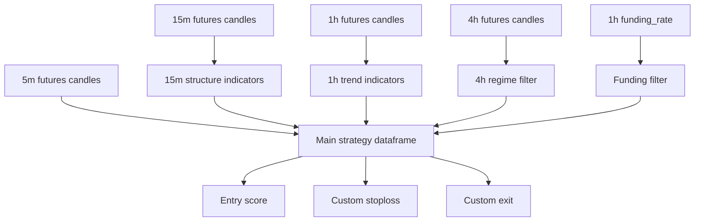

# LSRI Core Strategy Design

## Status

Design sections approved by the user on 2026-07-04. This written spec is ready for user review before implementation planning.

## Goal

Create a new backtestable Freqtrade futures strategy based on the user's LSRI framework: Liquidity Sweep + Regime Impulse, a low-frequency A+ signal strategy for a small 20 USDT isolated-margin account.

The first version must prioritize reproducible backtesting over completeness. It should implement the core price, volume, funding-rate, leverage, and R-based risk rules that can be tested with available or downloadable OKX historical data.

## Core Decision

Use a new independent strategy and config:

- Strategy file: `ft_userdata/user_data/strategies/LSRICoreStrategy.py`
- Config file: `ft_userdata/user_data/config.lsri.futures.20u.json`

Do not modify:

- `ft_userdata/user_data/strategies/VolatilitySystem.py`
- `ft_userdata/user_data/config.volatility.futures.json`

The strategy's main timeframe is `5m`. Higher timeframes are loaded as Freqtrade informative pairs:

- `15m` for structure, VWAP, ATR, ADX, RSI, Donchian, and volume confirmation
- `1h` for trend confirmation
- `4h` for broad regime filtering
- `1h funding_rate` for funding-rate crowding filter

## Assumptions

- The implementation target is `G:\AI_Trading\freqtrade-cn`.
- The exchange target is OKX futures.
- Trading mode is futures.
- Margin mode is isolated.
- Tradable pairs are only `BTC/USDT:USDT` and `ETH/USDT:USDT`.
- Initial dry-run wallet for this strategy is 20 USDT.
- Stake amount is 18 USDT, leaving about 2 USDT as a fee, slippage, funding, and execution buffer.
- The first implementation runs in dry-run and backtesting only. It must not place real orders.
- The first version uses only reproducible historical data available through Freqtrade's data layer.
- Missing funding-rate data blocks entries instead of silently allowing trades.
- OI, macro event calendars, DXY, 10Y yields, exchange incident filters, and narrative filters are deferred to later versions or manual trade locks.

## Non-Goals

- Do not implement a live trading rollout in the first version.
- Do not modify or replace `VolatilitySystem`.
- Do not add OI support in the first version.
- Do not add macro-calendar, CPI, FOMC, non-farm payroll, DXY, or 10Y yield integrations.
- Do not implement automatic daily trade limits, consecutive-loss locks, or 48-hour cool-down locks in the first version.
- Do not add position adjustment or scaling into positions.
- Do not trade altcoin contracts beyond BTC and ETH.
- Do not optimize parameters with hyperopt before baseline behavior is verified.

## Current Context

The existing futures strategy is `VolatilitySystem`.

Its current behavior:

- Main timeframe: `1h`
- Internal signal basis: 3h resampled ATR and close-change impulse
- Shorting enabled
- Minimal ROI effectively disabled with `{"0": 100}`
- Stoploss effectively disabled with `-1`
- Position adjustment enabled
- Leverage fixed at `2x`
- Current config allows up to 2 open trades

This conflicts with LSRI's target rules:

- LSRI needs `5m` execution triggers.
- LSRI requires no position adjustment.
- LSRI requires max one open trade.
- LSRI requires high but pair-specific leverage.
- LSRI requires hard technical stop boundaries.
- LSRI should use R-based take-profit and time-stop logic.

Current downloaded data under `ft_userdata/user_data/data/okx/futures` includes:

- BTC and ETH `5m` futures candles
- BTC and ETH `1h` futures candles
- BTC and ETH `1h` mark candles
- BTC and ETH `1h` funding-rate data

The implementation needs additional data before full backtesting:

- BTC and ETH `15m` futures candles
- BTC and ETH `4h` futures candles

Optional later enhancement:

- BTC and ETH `1m` futures candles as detail timeframe for more precise stop and take-profit simulation.

## Recommended Architecture

Use Freqtrade's native informative-pair pipeline instead of internal resampling.



Boundaries:

- Market data loading is owned by Freqtrade's dataprovider.
- Multi-timeframe alignment is handled with `merge_informative_pair`.
- Strategy signal generation is owned by `LSRICoreStrategy`.
- Risk state for an open trade is owned by Freqtrade `Trade` custom data where needed.
- FreqUI remains a backtest and inspection surface, not a strategy runtime owner.

## Data Flow

The `5m` main dataframe is the execution dataframe. It receives merged informative columns from `15m`, `1h`, `4h`, and `1h funding_rate`.

The `15m` dataframe calculates:

- `ema20`
- session-style intraday `vwap`
- `atr14`
- `adx14`
- `rsi14`
- `volume_z20`
- `donchian_high20`
- `donchian_low20`

Donchian bands must exclude the current candle:

```text
donchian_high20 = rolling(high, 20).max().shift(1)
donchian_low20 = rolling(low, 20).min().shift(1)
```

The `1h` dataframe calculates:

- `ema50`
- `ema200`
- trend direction booleans for long and short

The `4h` dataframe calculates:

- `ema200`
- broad regime booleans for long and short

The funding-rate dataframe provides:

- latest available historical funding rate
- long funding filter
- short funding filter

## Entry Model

The strategy generates entries only when a recent `15m` structure event is followed by a `5m` pullback reclaim or rejection.

### Long Direction

Trend requirements:

```text
1h close > 1h EMA200
1h EMA50 > 1h EMA200
4h close >= 4h EMA200
```

Structure requirements:

```text
15m close > 15m Donchian high20
15m ADX14 > 18
15m ADX14 rising for the latest 3 15m candles
15m Volume_Z20 > 1.0
50 < 15m RSI14 < 72
funding_rate <= 0.0003
```

Execution trigger:

```text
There was a 15m long structure breakout within the latest 12 5m candles.
Current 5m low pulls back near the key long level.
Current 5m close reclaims the key long level.
Current 5m close > current 5m open.
```

The long key level is the strongest nearby reclaimed level:

```text
max(15m donchian_high20, 15m ema20, 15m vwap)
```

Pullback tolerance:

```text
0.0015
```

Long pullback condition:

```text
low <= key_long_level * (1 + 0.0015)
close > key_long_level
```

### Short Direction

Trend requirements:

```text
1h close < 1h EMA200
1h EMA50 < 1h EMA200
4h close <= 4h EMA200
```

Structure requirements:

```text
15m close < 15m Donchian low20
15m ADX14 > 18
15m ADX14 rising for the latest 3 15m candles
15m Volume_Z20 > 1.0
28 < 15m RSI14 < 50
funding_rate >= -0.0003
```

Execution trigger:

```text
There was a 15m short structure breakdown within the latest 12 5m candles.
Current 5m high retests the key short level.
Current 5m close rejects below the key short level.
Current 5m close < current 5m open.
```

The short key level is the weakest nearby rejected level:

```text
min(15m donchian_low20, 15m ema20, 15m vwap)
```

Short retest condition:

```text
high >= key_short_level * (1 - 0.0015)
close < key_short_level
```

## Entry Scoring

Hard filters:

- Candle volume must be greater than 0.
- Funding-rate data must be present.
- Stop distance must be valid and within pair-specific limits.
- A matching `15m` structure event must have occurred within the latest 12 `5m` candles.

Long score:

| Condition | Points |
| --- | ---: |
| `1h close > EMA200` and `1h EMA50 > EMA200` | 20 |
| `4h close >= EMA200` | 10 |
| `15m ADX > 18` and rising | 10 |
| `15m Donchian` upside breakout | 15 |
| `5m` pullback and reclaim | 15 |
| `Volume_Z20 > 1.0` | 10 |
| `50 < RSI14 < 72` | 10 |
| `funding_rate <= 0.0003` | 10 |
| Stop distance is valid | 10 |

Short score mirrors the long score with bearish conditions.

Entry threshold:

```text
score >= 80
```

Entry tags:

```text
lsri_long_pullback_s80
lsri_short_pullback_s80
```

Later versions may add stronger tags such as:

```text
lsri_long_pullback_vz15_s90
lsri_short_pullback_vz15_s90
```

## Risk And Exit Model

### Leverage

Pair-specific leverage:

```text
BTC/USDT:USDT -> 20x
ETH/USDT:USDT -> 15x
```

Any other pair should return `1x`, though the config should not allow other pairs.

### Position Sizing

The LSRI config should use:

```text
dry_run_wallet = 20
stake_amount = 18
max_open_trades = 1
tradable_balance_ratio = 0.9
```

The strategy must disable position adjustment:

```text
position_adjustment_enable = False
```

### Initial Technical Stop

Long stop:

```text
pullback_low = rolling_low_5m_12
technical_sl = pullback_low - 0.2 * atr_15m
```

Short stop:

```text
pullback_high = rolling_high_5m_12
technical_sl = pullback_high + 0.2 * atr_15m
```

Stop-distance caps:

```text
BTC max price stop distance = 0.0068
ETH max price stop distance = 0.0096
```

Long risk distance:

```text
risk_pct = (entry_price - technical_sl) / entry_price
0 < risk_pct <= max_stop_distance
```

Short risk distance:

```text
risk_pct = (technical_sl - entry_price) / entry_price
0 < risk_pct <= max_stop_distance
```

If the technical stop requires more distance than allowed, the signal is skipped. The stop must not be compressed to fit the cap.

### Take Profit

Take profit is fixed at `2.2R`.

Long:

```text
R = entry_price - initial_stop_price
take_profit = entry_price + 2.2 * R
```

Short:

```text
R = initial_stop_price - entry_price
take_profit = entry_price - 2.2 * R
```

`custom_exit()` should return:

```text
long_tp_2_2r
short_tp_2_2r
```

### Stop Management

Use `custom_stoploss()` for initial hard stop and R-based stop movement.

Long:

```text
profit >= +1.0R -> stop to entry_price + fee_buffer
profit >= +1.6R -> stop to entry_price + 0.8R
```

Short:

```text
profit >= +1.0R -> stop to entry_price - fee_buffer
profit >= +1.6R -> stop to entry_price - 0.8R
```

Fee buffer:

```text
fee_buffer = 0.0015 * entry_price
```

The strategy should not enable Freqtrade's built-in trailing stop. This avoids conflicting trailing logic.

### Time Stop

If a trade has been open for 90 minutes and the current price has not reached at least `+0.5R`, exit:

```text
time_stop_no_impulse
```

This first implementation uses the conservative current-price check instead of tracking whether the trade reached `+0.5R` intratrade. That keeps state handling simple and reproducible.

## Strategy Attributes

The strategy should set:

```text
INTERFACE_VERSION = 3
can_short = True
timeframe = "5m"
process_only_new_candles = True
minimal_roi = {"0": 100}
stoploss = -0.99
use_custom_stoploss = True
trailing_stop = False
position_adjustment_enable = False
startup_candle_count = 240
```

The high `startup_candle_count` is required because `4h EMA200` needs enough warmup history.

## Config Design

Create `ft_userdata/user_data/config.lsri.futures.20u.json` based on the existing OKX futures config, with LSRI-specific changes:

```json
{
  "bot_name": "freqtrade-cn-okx-lsri-core-futures-20u",
  "max_open_trades": 1,
  "stake_currency": "USDT",
  "stake_amount": 18,
  "tradable_balance_ratio": 0.9,
  "dry_run": true,
  "dry_run_wallet": 20,
  "trading_mode": "futures",
  "margin_mode": "isolated"
}
```

Order types:

```json
{
  "entry": "limit",
  "exit": "limit",
  "emergency_exit": "market",
  "force_entry": "market",
  "force_exit": "market",
  "stoploss": "market",
  "stoploss_on_exchange": true,
  "stoploss_on_exchange_interval": 60
}
```

Whitelist:

```json
[
  "BTC/USDT:USDT",
  "ETH/USDT:USDT"
]
```

## Backtesting Plan

Required data before full backtest:

```text
BTC/USDT:USDT 15m futures
BTC/USDT:USDT 4h futures
ETH/USDT:USDT 15m futures
ETH/USDT:USDT 4h futures
```

Baseline timerange:

```text
20240101-20260701
```

Backtest UI settings:

```text
Strategy: LSRICoreStrategy
Timeframe: 5m
Detail timeframe: empty for first run, 1m for later precision checks
Pairs: BTC/USDT:USDT, ETH/USDT:USDT
Timerange: 20240101-20260701
```

First validation pass should focus on behavior, not profit:

- No position adjustment.
- Actual maximum simultaneous open trades is 1.
- Trades only occur on BTC and ETH.
- BTC leverage is 20x.
- ETH leverage is 15x.
- Each entry has a valid initial stop price.
- Stop distance does not exceed the pair-specific cap.
- Exit reasons include 2.2R take-profit or time-stop exits.
- `force_exit` appears only at backtest boundaries, not as the dominant exit path.

Second validation pass should evaluate performance:

- Total profit
- Max drawdown
- Winrate
- Average win
- Average loss
- Average win / average loss
- Profit factor
- Expectancy
- Trades per day
- Pair-level stats
- Long versus short stats
- Exit-reason stats

## Comparison Baseline

Use the existing `VolatilitySystem` backtest as a behavioral baseline, not as a direct profit target.

Existing baseline from the earlier run:

- Timerange: `20240101-20260701`
- Pairs: BTC and ETH futures
- Timeframe: `1h`
- Detail timeframe: `5m`
- Total profit: about `+2.49%`
- Winrate: about `34.64%`
- Losing trades: `100 / 153`
- Max drawdown: about `1.35%`

LSRI Core should be judged first on:

- Lower frequency
- Hard stop boundaries
- No adding to positions
- One open trade at a time
- Clear R-based exits
- Better explanatory exit reasons

Profit comparison is secondary until behavior is verified.

## Verification Commands

Implementation should be verified with:

```text
freqtrade list-strategies --userdir ft_userdata/user_data
freqtrade list-data --userdir ft_userdata/user_data --exchange okx --trading-mode futures
freqtrade backtesting --config ft_userdata/user_data/config.lsri.futures.20u.json --strategy LSRICoreStrategy --timerange 20240101-20240301
freqtrade backtesting --config ft_userdata/user_data/config.lsri.futures.20u.json --strategy LSRICoreStrategy --timerange 20240101-20260701
```

The exact command form may need Docker Compose prefixes in this local workspace.

## UI Validation

After CLI validation, use the FreqUI webserver on port `8003` or a new LSRI webserver instance to:

1. Open Backtest.
2. Select `LSRICoreStrategy`.
3. Select `5m` timeframe.
4. Select `20240101-20260701`.
5. Start backtest.
6. Confirm progress reaches 100%.
7. Load result.
8. Inspect summary, pair stats, trade list, and exit reasons.

Button expectations:

- Before starting: start button enabled if required fields and data are present.
- During run: start/load buttons disabled and stop button enabled.
- After completion: result appears in loadable result list.
- After load: charts and trade tables render without empty-result errors.

## Risks

- `15m` and `4h` data may be missing until explicitly downloaded.
- Funding-rate data alignment may reduce signal count if missing or sparse.
- `4h EMA200` requires long warmup history; early timerange trades may be unavailable.
- `stoploss_on_exchange` is not fully validated by backtesting because backtesting simulates stop behavior without proving the exchange order was placed.
- High leverage magnifies fee and slippage sensitivity. Backtest profitability should be treated as provisional until dry-run behavior is inspected.

## Later Extensions

After LSRI Core behavior is verified, later specs can add:

- OI filters
- macro event calendar locks
- DXY and 10Y yield filters
- automatic daily trade limits
- consecutive-loss pair locks
- 1m detail timeframe precision backtests
- parameter sweeps for score threshold, ADX threshold, volume Z-score threshold, pullback window, and pullback tolerance
