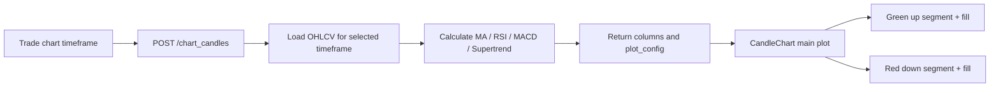

# Supertrend Watch Indicator Design

## Status

Design approved by the user on 2026-07-04. This written spec is ready for user review before implementation planning.

## Goal

Add Supertrend as a default Trade page watch indicator, alongside the existing default MA, RSI, and MACD indicators.

The indicator must render on the main candle chart in a standard Supertrend style: green trend segments during bullish phases, red trend segments during bearish phases, and a subtle filled band between the Supertrend line and price. The implementation must calculate Supertrend independently for each selected chart timeframe, so `1m`, `15m`, and `1h` charts can legitimately show different Supertrend directions.

## Assumptions

- The implementation target is `G:\AI_Trading\freqtrade-cn`.
- The backend target is the local `freqtrade` source tree.
- The frontend target is the local `frequi` source tree under `freqtrade-cn`.
- The active browser target is the Trade page at `http://127.0.0.1:8081/trade`.
- "Supertrend" means the standard ATR-based Supertrend indicator, not a multi-timeframe or strategy-specific trend signal.
- The default parameters are:
  - ATR period: `10`
  - Multiplier: `3`
- Supertrend is calculated from the currently selected chart timeframe OHLCV data.
- Supertrend does not inherit direction from higher timeframes.
- Supertrend is a watch/chart indicator only. It must not affect strategy execution, entries, exits, risk management, bot configuration, or the active strategy dataframe.

## Non-Goals

- Do not add a Supertrend parameter editor in the first implementation.
- Do not add multi-timeframe Supertrend.
- Do not add trading signals based on Supertrend.
- Do not alter the active strategy or bot timeframe.
- Do not replace MA, RSI, MACD, or existing strategy overlays.
- Do not rewrite the chart renderer.
- Do not add a general custom indicator scripting system.

## Current Architecture Findings

The Trade page live chart already uses the `/chart_candles` API through the chart indicator layer.

The existing backend watch indicator path is:

```text
POST /api/v1/chart_candles
  -> freqtrade.rpc.chart_data.build_chart_candles_response
  -> freqtrade.rpc.chart_indicators.add_watch_indicators
  -> freqtrade.rpc.chart_indicators.build_watch_plot_config
```

The existing default watch indicators are generated on the backend:

- `watch_ma20`
- `watch_ma60`
- `watch_rsi14`
- `watch_macd`
- `watch_macdsignal`
- `watch_macdhist`

The frontend receives a `plot_config` in the `/chart_candles` response and passes it into the existing `CandleChart` rendering flow. `CandleChart.vue` already supports line and bar series. It also supports `fill_to`, which can draw a transparent area between two plotted columns. That makes Supertrend's trend band possible without a new chart component.

## Recommended Approach

Extend the existing backend watch indicator layer and keep the frontend as a renderer.



This keeps one source of truth for indicator calculation and preserves the current FreqUI rendering boundary.

## Backend API Design

Extend `ChartIndicatorRequest` with Supertrend configuration:

```python
class SupertrendIndicatorRequest(BaseModel):
    period: int = Field(default=10, ge=1, le=500)
    multiplier: float = Field(default=3.0, gt=0, le=100)


class ChartIndicatorRequest(BaseModel):
    ma: list[int] = Field(default_factory=lambda: [20, 60])
    rsi: list[int] = Field(default_factory=lambda: [14])
    macd: list[MacdIndicatorRequest] = Field(default_factory=lambda: [MacdIndicatorRequest()])
    supertrend: list[SupertrendIndicatorRequest] = Field(
        default_factory=lambda: [SupertrendIndicatorRequest()]
    )
```

When `watch_indicators` is omitted, `/chart_candles` includes the default Supertrend configuration.

When `watch_indicators` is provided explicitly, the request controls whether Supertrend is present. For example, `supertrend=[]` disables it, matching the existing pattern for MA, RSI, and MACD.

## Supertrend Algorithm

Use the standard ATR-based Supertrend algorithm:

```text
hl2 = (high + low) / 2
basic_upper = hl2 + multiplier * atr
basic_lower = hl2 - multiplier * atr
```

Then carry final upper and lower bands forward:

```text
final_upper[i] =
  basic_upper[i] if basic_upper[i] < final_upper[i - 1]
                 or close[i - 1] > final_upper[i - 1]
  else final_upper[i - 1]

final_lower[i] =
  basic_lower[i] if basic_lower[i] > final_lower[i - 1]
                 or close[i - 1] < final_lower[i - 1]
  else final_lower[i - 1]
```

Trend direction flips when close crosses the active final band.

ATR uses TA-Lib `ATR` on the current chart OHLCV dataframe. This matches the existing dependency style used for RSI and MACD in the watch indicator layer.

## Column Design

For the default Supertrend `period=10`, `multiplier=3`, generate:

```text
watch_supertrend_up
watch_supertrend_down
watch_supertrend_price
```

Column semantics:

- `watch_supertrend_up`: Supertrend value only during bullish segments, otherwise null.
- `watch_supertrend_down`: Supertrend value only during bearish segments, otherwise null.
- `watch_supertrend_price`: close price helper column used only for area fill.

For non-default Supertrend parameters, use a suffix:

```text
watch_supertrend_up_<period>_<multiplier>
watch_supertrend_down_<period>_<multiplier>
watch_supertrend_price_<period>_<multiplier>
```

The multiplier suffix should be stable and filename-like. For example, `3.5` becomes `3_5`.

## Plot Config Design

Default plot config adds Supertrend to `main_plot`:

```json
{
  "main_plot": {
    "watch_supertrend_up": {
      "color": "#22c55e",
      "type": "line",
      "fill_to": "watch_supertrend_price"
    },
    "watch_supertrend_down": {
      "color": "#ef4444",
      "type": "line",
      "fill_to": "watch_supertrend_price"
    },
    "watch_supertrend_price": {
      "type": "line",
      "hidden": true
    }
  }
}
```

This renders as:

- green line under/near candles during bullish trend;
- red line above/near candles during bearish trend;
- subtle filled band between each Supertrend segment and close price;
- no standalone visible line or legend item for the helper price column.

## Frontend Type Design

Extend FreqUI types:

```ts
export interface ChartSupertrendIndicatorPayload {
  period: number;
  multiplier: number;
}

export interface ChartIndicatorPayload {
  ma?: number[];
  rsi?: number[];
  macd?: ChartMacdIndicatorPayload[];
  supertrend?: ChartSupertrendIndicatorPayload[];
}
```

Extend `IndicatorConfig` with a narrow optional flag:

```ts
hidden?: boolean;
```

`hidden` means the series is available as a data column but should not appear as a normal visible indicator series. The first use case is `watch_supertrend_price`, which exists only so `fill_to` can draw a band.

## Frontend Rendering Design

Keep `CandleChart.vue` as the renderer.

Minimal chart rendering changes:

1. Skip normal line/bar series creation when `IndicatorConfig.hidden === true`.
2. Keep hidden columns available for `fill_to` area calculations.
3. Do not add hidden helper columns to legend.
4. Do not show helper column values in tooltip.

The existing area fill mechanism can continue to calculate synthetic diff columns from:

```text
watch_supertrend_up -> watch_supertrend_price
watch_supertrend_down -> watch_supertrend_price
```

No new ECharts chart type is required.

## Data Flow

When the Trade page requests `1m`:

```text
1m OHLCV -> Supertrend(10, 3) -> watch_supertrend_* columns -> 1m plot_config
```

When the Trade page requests `15m`:

```text
15m OHLCV -> Supertrend(10, 3) -> watch_supertrend_* columns -> 15m plot_config
```

When the Trade page requests `1h`:

```text
1h OHLCV -> Supertrend(10, 3) -> watch_supertrend_* columns -> 1h plot_config
```

These outputs are independent. A `1h` bullish Supertrend and a `1m` bearish Supertrend can coexist because they are computed from different candle series.

## Error Handling

- Invalid Supertrend period returns schema validation error.
- Invalid Supertrend multiplier returns schema validation error.
- Empty `supertrend` list disables Supertrend without error.
- Calculation failures should fail the watch indicator calculation path, matching MA/RSI/MACD behavior.
- Null warmup values are allowed at the beginning of the response.
- Supertrend helper columns should not be required for strategy overlay behavior.

## Testing Strategy

### Backend Unit Tests

Add tests for `freqtrade.rpc.chart_indicators`:

- Default watch indicators include Supertrend columns.
- The original dataframe is not mutated.
- Default plot config includes `watch_supertrend_up`, `watch_supertrend_down`, and hidden `watch_supertrend_price`.
- The up and down Supertrend columns are segmented, with at most one side populated per candle after warmup.
- A custom Supertrend request creates suffixed column names.
- `supertrend=[]` omits Supertrend columns.
- Invalid period and multiplier fail schema validation.

### Backend Chart Response Tests

Add or adjust tests for `freqtrade.rpc.chart_data`:

- `/chart_candles` response includes default Supertrend columns.
- `/chart_candles` response includes Supertrend plot config in `main_plot`.
- Warmup trimming preserves non-null Supertrend values when enough candles are available.
- Strategy overlay behavior remains unchanged.

### Frontend Unit Tests

Add or adjust tests for FreqUI:

- `ChartIndicatorPayload` accepts `supertrend`.
- `IndicatorConfig.hidden` is accepted.
- Hidden helper columns do not create normal visible series.
- `fill_to` still works when the target column is hidden.
- Existing MA/RSI/MACD plot config tests continue to pass.

### Browser Verification

Use the current app browser:

1. Open `http://127.0.0.1:8081/trade`.
2. Confirm Supertrend appears by default on the main chart.
3. Confirm green and red segments render on the candle chart.
4. Confirm the filled band appears between the Supertrend line and price.
5. Confirm the helper close/price column is not visible as a separate legend item.
6. Switch chart timeframe between `1m`, `15m`, and `1h`.
7. Confirm Supertrend updates per selected timeframe.
8. Confirm bot strategy timeframe and strategy overlay labels do not change because of Supertrend.

## Acceptance Criteria

The implementation is complete when:

1. Supertrend is included in the default Trade page watch indicators.
2. Default Supertrend uses ATR period `10` and multiplier `3`.
3. Supertrend is calculated independently for the selected chart timeframe.
4. The main chart renders green bullish segments and red bearish segments.
5. The main chart renders a subtle fill between price and the active Supertrend segment.
6. Supertrend helper columns do not appear as normal visible indicators.
7. MA, RSI, MACD, volume, strategy overlay, and trade markers continue to render.
8. Supertrend does not affect strategy execution or bot configuration.
9. Backend unit tests pass.
10. Frontend unit tests and typecheck pass.
11. Browser verification on `http://127.0.0.1:8081/trade` confirms the visual result.

## Implementation Order

1. Add backend tests for Supertrend schemas, columns, and plot config.
2. Implement `SupertrendIndicatorRequest`.
3. Implement Supertrend column name helpers.
4. Implement Supertrend calculation in `chart_indicators.py`.
5. Add Supertrend to default watch plot config.
6. Add frontend type support for Supertrend and hidden indicator config.
7. Add chart rendering support for hidden helper series.
8. Run backend and frontend verification.
9. Verify the Trade page in the browser.

Implementation planning starts only after the user reviews and approves this written spec.
