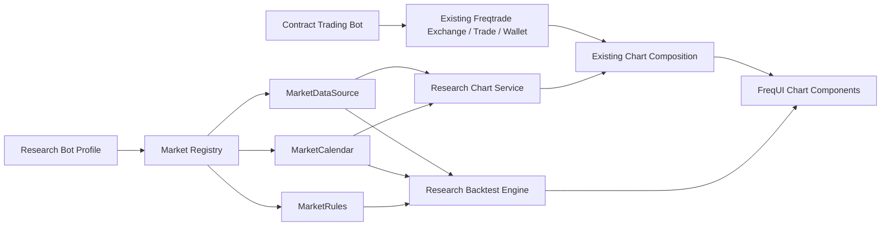

# A-Share Market Framework V1 Design

## Status

Draft created on 2026-07-05 for the first research-only market expansion.

This design intentionally separates trading bots from research bots. Contract bots keep the
existing Freqtrade trading stack. A-share, Hong Kong, and US equity markets enter through a
research stack that supports market data, charts, indicators, and backtesting, but not live
trading or dry-run trading.

## Goal

Build the first version of a market framework where one bot profile is bound to one market, with
A-share support for market data analysis, chart display, and simple strategy backtesting.

The framework must leave a clear path for later Hong Kong and US stock support.

## Non-Goals

- Do not add A-share live trading.
- Do not add A-share dry-run trading or account simulation as a bot runtime.
- Do not route A-share bots through force entry, force exit, order, wallet, or trade status APIs.
- Do not force stock symbols into the existing crypto `Exchange`/ccxt model.
- Do not implement a production-grade broker connector.
- Do not solve every exchange calendar holiday in V1; V1 may use a simple calendar with explicit
  closed-date overrides.
- Do not make the existing contract bot behavior depend on research-only modules.

## Assumptions

- The first A-share data source is a local normalized data source, because no external data vendor
  has been selected yet.
- Local A-share files use one instrument per file and include at least:

```text
date, open, high, low, close, volume
```

- The first backtest engine is research-only and long-only.
- A-share backtesting should model the basic constraints needed for credible first results:
  lot size, fees, stamp tax on sell, and T+1 sell restriction.
- Existing contract bots keep their current `pair` strings and Freqtrade trading behavior.
- Research endpoints can expose an instrument key such as `600519.SH` as `pair` in legacy chart
  responses so the existing chart renderer remains reusable.

## Current Findings

The existing chart path already has a useful market-data read model:

```text
POST /api/v1/chart_candles
  -> freqtrade.rpc.chart_data.build_chart_candles_response
  -> freqtrade.rpc.chart_data.build_chart_composition
  -> FreqUI CandleChart
```

The existing chart contract already treats market candles as the shared coordinate system:

```text
pair + candle_type + timeframe + candle_open_time
```

That is close to what stock research needs, but the current data source and execution model are
crypto-specific:

- `Exchange` depends on ccxt and ccxt.pro.
- Trading modes are `spot`, `margin`, and `futures`.
- Candle types are crypto/futures-oriented.
- Existing `/trade` UI assumes account, order, and position capabilities.
- Example strategy code is contract/funding/leverage specific.

## First Principles

### 1. Market data is not trade execution

For research-only stock markets, the source of truth is normalized historical market data. It does
not need an order book, wallet, broker account, or exchange order state.

### 2. One bot profile owns one market

A bot profile should declare:

```text
bot_id
label
market
capabilities
data_source
calendar
```

Contract bots and research bots can both be displayed as bots, but their capabilities differ.

### 3. Stock instruments are not crypto pairs

Internally, use an instrument identity:

```text
market
venue
symbol
currency
asset_type
display_name
```

Legacy chart responses may still expose `pair = instrument.key` for compatibility.

### 4. Trading calendar owns missing-time semantics

Non-trading time is not missing data. A-share lunch breaks, weekends, holidays, and suspended
symbols must not be treated like missing crypto candles.

### 5. Backtest rules are market-owned

The backtest engine must ask a market rule object for fees, lot size, and execution constraints.
This keeps A-share, Hong Kong, and US stock differences out of strategy code and out of chart code.

## Target Architecture



## Module Boundaries

### Trading Bot Path

Owner:

- existing Freqtrade runtime.

Responsibilities:

- contract market trading;
- exchange connectivity;
- wallet, trade, order, and leverage state;
- existing `/trade` behavior.

Must not depend on:

- research market data modules;
- stock calendars;
- research backtest engine.

### Research Bot Path

Owner:

- new research modules.

Responsibilities:

- research bot profile loading;
- market instrument listing;
- local normalized OHLCV loading;
- chart response generation;
- simple research backtesting.

Must not expose:

- force entry;
- force exit;
- live order placement;
- account balance;
- open order state.

### Shared Chart Path

Owner:

- existing chart composition and FreqUI chart components.

Responsibilities:

- render OHLCV;
- render watch indicators;
- render strategy/backtest outputs when available;
- keep market candles as the x-axis coordinate system.

## Backend Data Model

### MarketType

Allowed V1 values:

```text
contract
a_share
hk_stock
us_stock
```

`hk_stock` and `us_stock` may be defined in the enum in V1 even if their adapters are added later.

### Instrument

Suggested fields:

```text
key: 600519.SH
market: a_share
venue: SSE
symbol: 600519
currency: CNY
asset_type: equity
display_name: Guizhou Moutai
```

### ResearchBotProfile

Suggested fields:

```text
id: a-share-local
label: A Share Local Research
market: a_share
capabilities:
  chart: true
  backtest: true
  live_trade: false
  account: false
data_source:
  type: local_csv
  root: user_data/research_data/a_share
```

### Research OHLCV

Normalized DataFrame columns:

```text
date, open, high, low, close, volume
```

Optional V1 columns:

```text
amount, turnover, suspended, limit_up, limit_down
```

The chart response must preserve legacy `columns/data` compatibility.

## Backend API

### GET `/api/v1/research/bots`

Returns research bot profiles and capabilities.

### GET `/api/v1/research/instruments`

Parameters:

```text
bot_id
query
```

Returns instruments available in the bot data source.

### POST `/api/v1/research/chart_candles`

Request:

```json
{
  "bot_id": "a-share-local",
  "instrument": "600519.SH",
  "timeframe": "1d",
  "limit": 500,
  "timerange": "20240101-20240701",
  "adjustment": "raw",
  "watch_indicators": {}
}
```

Response:

- compatible with `ChartCandlesResponse`;
- `pair` is the instrument key;
- `strategy` may be `Research`;
- `meta.layers` includes market and watch layers;
- `meta.market` can later expose instrument and adjustment details.

### POST `/api/v1/research/backtest`

Request:

```json
{
  "bot_id": "a-share-local",
  "instrument": "600519.SH",
  "timeframe": "1d",
  "timerange": "20240101-20240701",
  "strategy": {
    "type": "sma_cross",
    "fast": 20,
    "slow": 60
  },
  "initial_cash": 100000
}
```

Response:

```text
trades
equity_curve
metrics
signals
warnings
```

## Frontend UX

### Navigation

V1 should not put research bots into trading controls.

Recommended first screen:

```text
/research
```

The screen should include:

- research bot selector;
- instrument search/select;
- timeframe select;
- chart;
- simple backtest panel;
- backtest result summary;
- trades table;
- equity curve.

### Capability Gating

Trading actions must be hidden or disabled when:

```text
capabilities.live_trade == false
```

Research bots should not call:

- `/balance`;
- `/status`;
- `/forcebuy`;
- `/forceenter`;
- `/forceexit`;
- `/trades`;
- `/locks`.

## Backtest Semantics

V1 simple A-share backtest uses:

- long-only positions;
- whole-lot execution, default lot size 100 shares;
- buy at next candle open after an entry signal;
- sell at next candle open after an exit signal;
- T+1 sell restriction;
- commission rate configurable;
- stamp tax on sells;
- no margin;
- no shorting;
- no intraday partial fill simulation.

The strategy runtime can start with a built-in SMA crossover strategy to prove the framework.

## Extension Path

Hong Kong and US stock support should require adding:

- a data source adapter;
- a calendar implementation or calendar config;
- market rules;
- optional display formatting.

They should not require rewriting:

- chart rendering;
- research bot profile API;
- research chart endpoint;
- research backtest engine core.

## Branching

All changes for this feature are made on:

```text
feature/a-share-market-framework-v1
```

Expected repositories:

- `freqtrade-cn`
- `freqtrade-cn/freqtrade`
- `freqtrade-cn/frequi`

`freqtrade-strategies` remains untouched unless a separate example strategy is explicitly added.

## Acceptance Criteria

1. Contract bots continue to work on existing trading screens.
2. A research bot profile can be loaded for A-share data.
3. A-share local OHLCV data can be listed and loaded.
4. A-share chart candles render through the existing chart component.
5. Watch indicators can be calculated for A-share data.
6. Simple SMA crossover backtest returns trades, equity curve, and summary metrics.
7. Research bots do not expose or call live trading actions.
8. The architecture allows Hong Kong and US stock adapters to be added without changing the chart
   or backtest core.

## Risks

- Data vendor choice can change file schema or instrument metadata.
- Calendar correctness is easy to underestimate.
- Reusing too much of the Freqtrade trading engine would couple research markets to execution
  semantics they do not need.
- Reimplementing too much chart UI would duplicate code that already works.

## Recommended Implementation Order

1. Add domain types, bot profiles, and capabilities.
2. Add local A-share data source and simple calendar.
3. Add research chart endpoint using existing chart composition.
4. Add simple research backtest engine.
5. Add frontend research route using existing chart components.
6. Add focused verification and keep contract trading behavior unchanged.
