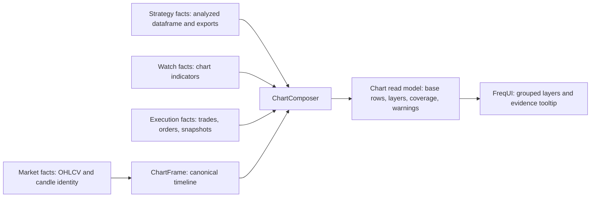

# Chart Data Source Boundaries Design

## Status

Draft created on 2026-07-05 from the source-of-truth architecture discussion.

This document is a design baseline for fixing the deeper conflict between:

- chart UI observation data;
- strategy analyzed data;
- bot decision evidence; and
- shared market candles.

Implementation must be planned and executed in phases. The first phase should preserve the current `/api/v1/chart_candles` response shape while adding explicit metadata and warnings.

## Goal

Make chart data robust, auditable, and extensible by separating shared facts from private facts, then composing them into a single chart read model with explicit provenance.

The user-facing result should be:

- one chart timeline where candle and indicator values align by candle identity;
- no silent substitution between watch indicators and strategy indicators;
- clear labels for watch, strategy, and decision data;
- visible coverage and warmup semantics;
- a path toward explaining bot decisions using actual decision-time evidence.

## Non-Goals

- Do not force UI, strategies, and bot execution to share one dataframe.
- Do not rewrite the complete chart renderer in the first phase.
- Do not build a generic custom indicator scripting platform.
- Do not change existing strategy trading logic.
- Do not expose arbitrary strategy dataframe columns unless the strategy explicitly exports them.
- Do not claim recomputed current data is the same as historical bot decision data.
- Do not solve missing strategy values by filling them from watch indicators.

## Current Findings

The current live chart path is:

```text
POST /api/v1/chart_candles
  -> freqtrade.rpc.chart_data.build_chart_candles_response
  -> freqtrade.rpc.chart_data.load_chart_ohlcv
  -> freqtrade.rpc.chart_indicators.add_watch_indicators
  -> freqtrade.rpc.chart_data.merge_strategy_overlay
  -> freqtrade.rpc.chart_data._trim_to_limit
  -> RPC._convert_dataframe_to_dict
  -> FreqUI CandleChart
```

Relevant current files:

- `freqtrade/freqtrade/rpc/chart_data.py`
- `freqtrade/freqtrade/rpc/chart_indicators.py`
- `freqtrade/freqtrade/rpc/api_server/api_schemas.py`
- `frequi/src/types/candleTypes.ts`
- `frequi/src/composables/useLiveChartDataset.ts`
- `frequi/src/components/charts/CandleChart.vue`
- `frequi/src/composables/useCandleChartTooltip.ts`
- `frequi/src/utils/charts/candleChartSeries.ts`
- `frequi/src/stores/settings.ts`

Current coupling points:

- `ChartCandlesRequest.limit` controls returned backend rows, but `chartDefaultCandleCount` controls only initial frontend zoom.
- `CHART_WARMUP_CANDLES = 120` is a fixed chart-service warmup, not derived from requested indicator layers.
- Watch indicators are calculated from chart OHLCV.
- Strategy overlay is read from `dataprovider.get_analyzed_dataframe(pair, strategy_timeframe)`.
- Strategy overlay columns are inferred from `strategy.plot_config`.
- Strategy overlay columns are renamed with `strategy_<timeframe>_<column>`.
- Watch indicator semantics are inferred from `watch_*` column names.
- Response data is flattened into one dataframe-like payload.
- The frontend must infer source and display meaning from column names and plot config.

This works for simple display, but it does not model source of truth, coverage, warmup, or decision evidence explicitly.

## First Principles

### 1. Market candles are shared facts

OHLCV candles are the shared coordinate system.

The canonical identity of a chart candle is:

```text
exchange/source + pair + candle_type + timeframe + candle_open_time
```

Array index, ECharts `dataIndex`, and row number are display implementation details. They must not be treated as durable identity.

### 2. Derived values are not just numbers

An indicator value is not complete without:

- source domain;
- owner;
- timeframe;
- input window;
- calculation parameters;
- warmup requirement;
- valid coverage;
- whether the candle was closed or live;
- whether the value was decision-time evidence or recomputed display data.

### 3. Strategy truth and watch truth are different

Two RSI values can use the same algorithm and still mean different things:

```text
RSI(14) from SampleStrategy analyzed dataframe
RSI(14) from watch indicators for manual chart observation
RSI(14) stored in a bot decision snapshot
```

They are not interchangeable.

### 4. Missing values are domain information

Missing strategy values can mean:

- strategy dataframe does not cover that chart window;
- strategy warmup has not completed;
- strategy overlay is hidden due to timeframe rules;
- strategy overlay is unavailable;
- the column was not exported by the strategy.

The system must preserve this information instead of hiding it with visual interpolation or watch fallbacks.

### 5. A chart is a composed read model

The chart endpoint should compose facts into a read model. It should not become the owner of strategy truth or execution truth.

## Source Domains

### Market Domain

Owner:

- exchange/cache/data provider market data path.

Contains:

- OHLCV;
- pair;
- timeframe;
- candle type;
- candle open and close time;
- candle status: closed, live, gap, unavailable.

Used by:

- chart frame;
- watch indicators;
- strategies;
- backtests;
- decision snapshots.

Invariant:

- all chart layers align to market candle identity, not row index.

### Strategy Domain

Owner:

- strategy engine and dataprovider analyzed dataframe.

Contains:

- strategy-produced indicators;
- entry and exit signal columns;
- informative timeframe outputs after strategy merge;
- strategy name;
- strategy timeframe;
- strategy version if available;
- strategy plot/export contract.

Used by:

- strategy overlay chart layer;
- strategy signal display;
- strategy-output tooltip section.

Invariant:

- strategy overlay must not be recomputed by FreqUI;
- strategy overlay must not be filled from watch indicators;
- strategy overlay may only expose columns explicitly exported by strategy configuration.

### Watch Domain

Owner:

- chart indicator service.

Contains:

- manual observation indicators such as MA, RSI, MACD, Supertrend, QQE MOD;
- chart-only calculation parameters;
- display-oriented plot metadata.

Used by:

- manual chart observation;
- auxiliary overlays and subplots.

Invariant:

- watch data can be useful to humans, but it is not bot decision evidence.

### Execution Domain

Owner:

- trade/order persistence and bot decision flow.

Contains:

- trades;
- orders;
- realized execution state;
- future decision snapshots.

Used by:

- trade markers;
- decision explanation panel;
- audit and backtest comparison.

Invariant:

- a real bot decision explanation must prefer decision-time snapshot data over current recomputation.

## Recommended Architecture



## Proposed Backend Model

The first implementation should introduce an internal chart composition model without breaking the existing response.

### ChartFrame

Represents the canonical x-axis.

Suggested fields:

```text
pair
timeframe
candle_type
rows
requested_count
returned_count
warmup_count
data_start
data_stop
last_candle_complete
```

Each row should retain:

```text
date
open
high
low
close
volume
candle_status
```

### ChartLayer

Represents one source-owned group of series.

Suggested fields:

```text
id
source
owner
timeframe
status
alignment
coverage
series
warnings
render
```

Allowed `source` values:

```text
market
watch
strategy
execution
decision_snapshot
recomputed
```

Allowed `status` values:

```text
ok
partial
hidden
unavailable
stale
provisional
```

### ChartSeries

Represents one drawable or tooltip-visible series.

Suggested fields:

```text
id
column
label
source
kind
panel
timeframe
visible
render
coverage
warmup
tooltip
```

Allowed `kind` values:

```text
ohlcv
line
bar
area_helper
event
trade_marker
signal
state
```

### LayerCoverage

Represents where a layer has meaningful values.

Suggested fields:

```text
first_valid
last_valid
valid_points
total_points
warmup_until
reason
```

Coverage must be calculated after final trimming, because the user sees the trimmed window.

## API Evolution

### Phase-compatible `/api/v1/chart_candles`

Keep the current payload and current flattened `columns/data` response, but add a `meta` object.

Suggested additive response fields:

```json
{
  "meta": {
    "schema_version": 1,
    "window": {
      "requested_count": 500,
      "returned_count": 500,
      "warmup_count": 120,
      "display_default_count": 250,
      "data_start": "2026-07-05 01:21:00+00:00",
      "data_stop": "2026-07-05 09:40:00+00:00"
    },
    "layers": [
      {
        "id": "watch.default",
        "source": "watch",
        "status": "ok",
        "series": [
          {
            "column": "watch_rsi14",
            "label": "RSI(14) - Watch",
            "source": "watch",
            "coverage": {
              "first_valid": "2026-07-05 01:35:00+00:00",
              "valid_points": 486
            }
          }
        ]
      },
      {
        "id": "strategy.overlay",
        "source": "strategy",
        "status": "partial",
        "timeframe": "1m",
        "alignment": "direct",
        "series": [
          {
            "column": "strategy_1m_rsi",
            "label": "RSI - Strategy Output - SampleStrategy",
            "source": "strategy",
            "coverage": {
              "first_valid": "2026-07-05 03:31:00+00:00",
              "valid_points": 383,
              "reason": "strategy dataframe coverage"
            }
          }
        ]
      }
    ],
    "warnings": []
  }
}
```

This allows FreqUI to improve labels and tooltips while still rendering the old dataframe payload.

### Future `/api/v2/chart_candles`

After the frontend is migrated to metadata-driven rendering, a new version can make layers first-class.

Suggested request:

```json
{
  "pair": "BTC/USDT",
  "timeframe": "1m",
  "data_window": {
    "count": 1000
  },
  "viewport_hint": {
    "visible_count": 250
  },
  "layers": [
    {"type": "market"},
    {"type": "watch_indicators", "profile": "default"},
    {"type": "strategy_overlay", "export": "plot_config"},
    {"type": "execution", "include_decision_snapshots": true}
  ],
  "candle_mode": "live"
}
```

Suggested response:

```json
{
  "schema_version": 2,
  "frame": {
    "pair": "BTC/USDT",
    "timeframe": "1m",
    "rows": []
  },
  "layers": [],
  "plot_config": {},
  "warnings": []
}
```

## Window Semantics

The system must separate four windows.

### Display Window

The number of candles visible by default in FreqUI.

Current setting:

```text
frequi/src/stores/settings.ts -> chartDefaultCandleCount
```

This should remain a UI viewport setting.

### Data Window

The number of candles returned by `/chart_candles`.

Current backend default:

```text
ChartCandlesRequest.limit = 500
```

FreqUI should eventually send this explicitly. It should not assume `chartDefaultCandleCount` also controls backend data count.

### Compute Warmup Window

Extra hidden candles requested only for indicator calculation.

Current implementation:

```text
CHART_WARMUP_CANDLES = 120
```

This should evolve into a value derived from requested layer specifications.

### Strategy Coverage Window

The date range actually available from `dataprovider.get_analyzed_dataframe`.

This is independent from chart data window and watch warmup. The UI must show when strategy overlay covers only part of the chart.

## Alignment Rules

### Same timeframe

Join by candle open time.

### Chart timeframe lower than strategy timeframe

Continuous strategy columns may be forward-filled only if this is explicitly exposed as `alignment = forward_fill`.

Signal/event columns must remain event-like. They must not be visually stretched as if every lower-timeframe candle had the signal.

### Chart timeframe higher than strategy timeframe

Current behavior hides strategy overlay. This is conservative and should remain the default.

Future aggregation can be added only as an explicit policy.

### Live candle

Watch indicators on the last live candle should be marked provisional.

Strategy overlay should be marked based on the analyzed dataframe state. It should not be presented as final decision evidence unless a decision snapshot exists.

## UI Design Rules

### Grouping

Legend and tooltip should group series by source:

```text
Bot Decisions
Strategy Output
Watch Indicators
Market Data
```

### Labels

Avoid labels that only expose internal column names.

Examples:

```text
RSI(14) - Watch
RSI - Strategy Output - SampleStrategy
QQE MOD Histogram - Watch
Supertrend Up - Watch
```

### Tooltip

The tooltip should become an evidence panel.

Required sections:

```text
Candle
Bot Decision
Strategy Output
Watch Indicators
Warnings
```

The tooltip must clearly say when:

- a strategy value is unavailable;
- a watch value is not decision evidence;
- a candle is live/provisional;
- a value is recomputed rather than stored decision evidence.

### Missing Values

Missing values should be rendered as gaps.

Do not draw lines through unavailable strategy periods unless the layer explicitly declares that interpolation or forward-fill is the intended alignment mode.

## Decision Snapshots

Decision snapshots are a later phase, but the design must leave room for them.

A decision snapshot should capture:

```text
strategy name
strategy version
config hash
pair
timeframe
candle open time
decision time
entry/exit signal state
selected exported indicator values
protections/risk state summary
linked trade/order ids
snapshot source: live, dry-run, backtest
```

Until decision snapshots exist, the UI must not call strategy overlay values "what the bot used". It should call them "strategy output" or "recomputed strategy output", depending on source.

## P0-P3 Migration Strategy

### P0: Make current behavior explicit

Keep the current chart response shape.

Add:

- source labels;
- layer metadata;
- coverage metadata;
- warmup metadata;
- provisional live-candle metadata;
- warnings for partial strategy coverage and source mismatch.

P0 fixes user trust without large structural risk.

### P1: Introduce backend ChartComposition

Add internal backend models:

- ChartFrame;
- ChartLayer;
- ChartSeries;
- LayerCoverage;
- ChartComposition.

`build_chart_candles_response` should become an adapter from ChartComposition to the legacy response.

P1 reduces backend coupling while preserving frontend compatibility.

### P2: Move frontend to metadata-driven layers

FreqUI should stop guessing source semantics from column prefixes.

The frontend should render:

- legend labels;
- tooltip sections;
- styles;
- warnings;
- coverage markers;

from backend layer metadata.

P2 makes new indicators and future multi-source overlays easier to add.

### P3: Add decision evidence

Add decision snapshots and display them as the highest-trust source for explaining real bot trades.

P3 turns the chart from a visual tool into an audit/explainability tool.

## Acceptance Criteria

The architecture is healthy when:

1. Market candles are the shared x-axis source of truth.
2. Watch indicators, strategy output, and decision evidence have separate source labels.
3. Strategy values are never silently substituted with watch values.
4. Tooltip and legend disclose source and coverage.
5. Missing strategy coverage is visible to the user.
6. Display window, data window, warmup window, and strategy coverage are separate concepts.
7. New indicators can be added as watch or strategy layers without hardcoding source semantics in FreqUI.
8. Bot decisions can eventually be explained from stored snapshots instead of current recomputation.

## Anti-Patterns to Avoid

- Treating column prefixes as the only domain model.
- Letting FreqUI recompute strategy indicators.
- Filling strategy gaps with watch indicators.
- Joining layers by row index.
- Hiding strategy coverage gaps with visual interpolation.
- Treating `chartDefaultCandleCount` as both display count and backend data count.
- Treating fixed `CHART_WARMUP_CANDLES` as a complete warmup architecture.
- Saying a recomputed value is decision-time truth.
- Expanding `plot_config` into permissions, source ownership, data lineage, and rendering semantics all at once.
