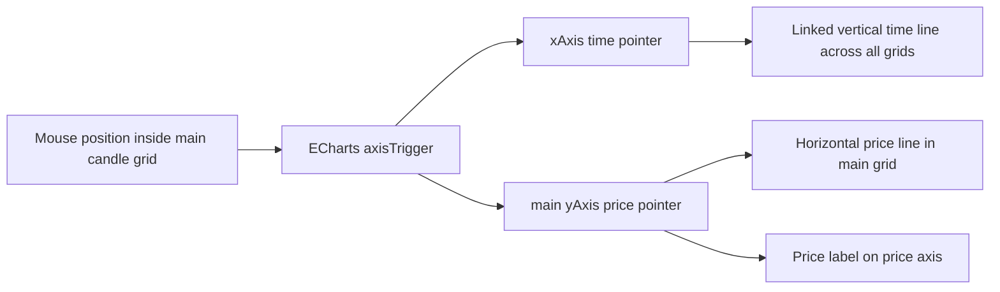

# Main Price Crosshair Design

## Status

Design approved by the user on 2026-07-05. This written spec is ready for user review before implementation planning.

## Goal

Add a horizontal price crosshair to the main candle chart.

When the mouse is over the main candle price grid, the chart should show:

- the existing vertical dashed time pointer;
- a new horizontal dashed price pointer;
- a price label on the chart price axis showing the horizontal pointer value.

The horizontal pointer is only for the main candle price chart. Volume, RSI, MACD, and other indicator subplots continue to use the shared vertical time pointer, but they must not show their own horizontal pointer or indicator-axis value label.

## Assumptions

- The implementation target is `G:\AI_Trading\freqtrade-cn`.
- The frontend target is `G:\AI_Trading\freqtrade-cn\frequi`.
- The active browser targets are `http://127.0.0.1:8081/graph` and `http://127.0.0.1:8081/trade`.
- The existing vertical pointer alignment fix is preserved.
- `__date_ts` remains the canonical x-axis value for candles, volume, trades, and indicators.
- ECharts native axisPointer remains the only chart pointer rendering mechanism.
- No DOM overlay, manual mouse-position line, or second coordinate system should be introduced.
- The price label follows the existing chart axis side. If labels are on the right, the crosshair price label appears on the right price axis.

## Non-Goals

- Do not add horizontal pointers to RSI, MACD, volume, or other subplots.
- Do not add a custom floating tooltip panel for the horizontal price.
- Do not add user settings for pointer color, width, or label style in this iteration.
- Do not change the current candle, indicator, trade, or strategy overlay data model.
- Do not rewrite the chart renderer.
- Do not replace ECharts axisPointer with a custom event layer.

## Current Architecture Findings

`CandleChart.vue` already uses ECharts native axisPointer for the vertical time pointer.

The current x-axis architecture is:

```text
dataset.__date_ts
  -> every xAxis uses type=time
  -> every xAxis uses the same min/max time domain
  -> global axisPointer.link links all xAxis indexes
  -> tooltip.axisPointer drives the visible vertical dashed pointer
```

This is the correct foundation and must remain unchanged.

The previous vertical-line bug came from introducing another visual positioning system outside ECharts. The same failure mode would occur if the horizontal price pointer were drawn with DOM or manual canvas overlays. The feature should therefore be implemented as an ECharts y-axis axisPointer on the main price axis.

## Recommended Approach

Use the main candle price `yAxis[0]` axisPointer for the horizontal price pointer, and keep the global x-axis pointer behavior unchanged.



This keeps one coordinate system responsible for both the horizontal line and the price label. The rendered horizontal line and label are derived from the same y-axis scale that renders the candle prices.

## Design Details

Add a small chart-axis helper in `frequi/src/utils/charts/candleChartAxis.ts`:

```ts
createMainPriceAxisPointer(labelFormatter)
```

The helper should return a plain ECharts axisPointer option with these semantics:

- `show: true`
- `type: 'line'`
- `snap: false`
- `triggerTooltip: false`
- dashed line style matching the existing vertical pointer style
- `label.show: true`
- label background and text style suitable for both dark and light chart themes
- label formatter supplied by `CandleChart.vue`, using the same number-formatting convention as the main price axis

`snap: false` is intentional. The horizontal pointer represents the exact mouse price, not the nearest candle close/high/low.

`triggerTooltip: false` is intentional. The y-axis price pointer should not drive candle tooltip lookup. The existing x-axis pointer remains responsible for selecting the candle and indicator values by time.

## Axis Responsibilities

Main candle price axis:

```text
yAxis[0]
  -> scale candle prices
  -> render price tick labels
  -> render horizontal price pointer
  -> render pointer price label
```

Volume axis:

```text
yAxis[1]
  -> scale volume
  -> no horizontal pointer
```

Indicator subplot axes:

```text
yAxis[2..n]
  -> scale subplot values
  -> no horizontal pointer
```

Each non-main y-axis should explicitly set `axisPointer: { show: false }` inline. This is not a visual patch; it records the responsibility boundary so future subplots do not accidentally opt into horizontal pointers. A separate disabled-pointer helper is not needed unless the same object starts carrying more behavior later.

## Tooltip And Pointer Interaction

Keep the existing tooltip configuration focused on x-axis selection:

```text
tooltip.trigger = "axis"
tooltip.axisPointer.axis = "x"
tooltip.axisPointer.type = "line"
axisPointer.link = [{ xAxisIndex: "all" }]
```

Do not change the global tooltip pointer to `type: "cross"`.

Reason: ECharts treats `tooltip.axisPointer.type = "cross"` as a shortcut that involves both axes in each coordinate system. In a multi-grid chart, that broadens the behavior and makes every future subplot responsible for opting out. The safer design is to keep the global x-axis behavior narrow and enable only the main price y-axis pointer.

## Price Formatting

The crosshair price label should follow the same display convention as the main price axis:

- use the y-axis value supplied by ECharts;
- format it with the existing decimal formatting approach used by candle chart price labels;
- avoid introducing a separate price precision policy in this feature.

The feature should not change the underlying y-axis min/max calculation.

## Error Handling

No network or data-processing error path is introduced.

If ECharts does not have a valid y-axis value, the native axisPointer remains hidden. The implementation should not add fallback DOM drawing or custom recovery logic.

If a chart has no data, the existing `hasData` guard remains responsible for avoiding chart rendering.

## Testing Strategy

### Unit Tests

Add or update frontend unit tests for `frequi/src/utils/charts/candleChartAxis.ts`:

- `createMainPriceAxisPointer` returns a visible dashed line pointer.
- The main price pointer label is enabled.
- The main price pointer uses the supplied price label formatter.
- The main price pointer does not trigger tooltip lookup.

Add or update chart option tests where practical:

- the main candle y-axis uses the main price axis pointer;
- volume and indicator y-axes disable their y-axis pointer;
- x-axis pointer and x-axis link behavior remain unchanged.

### Type And Lint Checks

Run:

```text
pnpm typecheck
pnpm exec eslint src/components/charts/CandleChart.vue src/utils/charts/candleChartAxis.ts tests/unit/candleChartAxis.spec.ts --quiet
```

### Browser Verification

Use the current app browser:

1. Open `http://127.0.0.1:8081/graph`.
2. Move the mouse over the main candle chart.
3. Confirm the vertical dashed time pointer is still aligned across candle, volume, and indicator grids.
4. Confirm a horizontal dashed line appears only in the main candle price grid.
5. Confirm the price axis shows a label at the horizontal line value.
6. Move the mouse over RSI/MACD/volume subplots.
7. Confirm no subplot-specific horizontal pointer appears.
8. Confirm the vertical time pointer still selects the same timestamp and indicator values.
9. Repeat on `http://127.0.0.1:8081/trade` if the page uses the same candle chart component.

## Acceptance Criteria

The implementation is complete when:

1. The main candle chart shows a horizontal dashed price pointer on mouse hover.
2. The chart price axis shows the horizontal pointer's price value.
3. The existing vertical dashed time pointer remains aligned across all visible grids.
4. Candle and indicator tooltip values remain selected by the same x-axis timestamp.
5. Volume, RSI, MACD, and other subplots do not show their own horizontal pointer.
6. No DOM overlay or custom mouse-position drawing is introduced.
7. Typecheck and targeted unit tests pass.
8. Browser verification confirms the feature on the active local app.

## Implementation Order

Implementation planning starts only after the user reviews and approves this written spec.

The likely implementation order is:

1. Add failing unit tests for the price axis pointer helper and disabled y-axis pointer behavior.
2. Implement the small axis helper changes in `candleChartAxis.ts`.
3. Apply the main y-axis pointer and non-main y-axis opt-out in `CandleChart.vue`.
4. Run typecheck, targeted unit tests, and eslint.
5. Verify the behavior in the browser.
