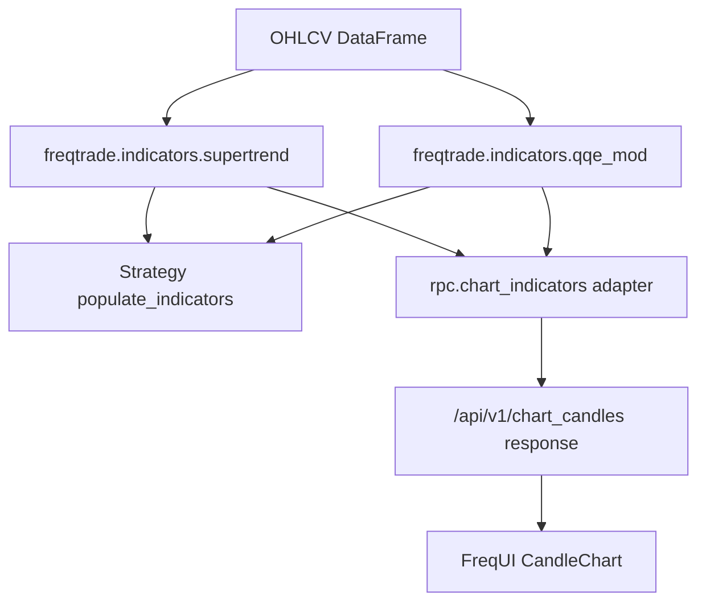

# QQE MOD Shared Indicators Design

## Status

Design approved by the user on 2026-07-05. This written spec is ready for user review before implementation planning.

## Goal

Add the classic Mihkel00 TradingView QQE MOD dual-QQE indicator as a project-internal shared indicator that can be used by both:

- robot strategies, when a strategy explicitly imports and calls it; and
- the chart indicator layer, where QQE MOD is shown by default in FreqUI charts.

At the same time, move the existing Supertrend calculation into the same shared indicator structure. Supertrend and QQE MOD are the same architectural category: technical indicator algorithms. The RPC chart layer should adapt indicator results for chart display, but should not own indicator algorithms.

## Core Decision

Introduce a project-internal shared indicators layer:

```text
freqtrade/freqtrade/indicators/
  __init__.py
  supertrend.py
  qqe_mod.py
```

The rule is:

```text
Technical indicator algorithms live in shared indicators.
Chart-specific column names, colors, plot types, and subplot placement live in rpc.chart_indicators.
Strategy trading rules live in strategy files and change only when a strategy explicitly calls shared indicators.
```

This replaces the unhealthy pattern where Supertrend calculation currently lives in `freqtrade/rpc/chart_indicators.py`.

## Assumptions

- The implementation target is `G:\AI_Trading\freqtrade-cn`.
- The backend target is the local `freqtrade` source tree.
- The frontend target is the local `frequi` source tree.
- The chart target is the existing `/api/v1/chart_candles` data flow.
- "QQE MOD" means the classic Mihkel00 / Glaz TradingView dual-QQE version, not standard single-layer QQE.
- QQE MOD is calculated from the current dataframe's selected source column, defaulting to `close`.
- QQE MOD is calculated independently for each timeframe. A `1m` QQE MOD state and a `1h` QQE MOD state may differ.
- "Robot usable" means strategies can explicitly import and call the shared indicator helper inside `populate_indicators`.
- Existing strategies must not trade differently merely because the shared indicator module exists.
- The first implementation may keep indicator helpers as batch dataframe functions. A streaming state-machine API can be added later only if a real runtime consumer needs it.

## Non-Goals

- Do not automatically modify `LSRICoreStrategy`, `VolatilitySystem`, or any other existing strategy's entry or exit logic.
- Do not create a general custom indicator scripting system.
- Do not add a QQE MOD parameter editor in the first implementation.
- Do not add multi-timeframe QQE MOD in the first implementation.
- Do not make chart watch indicators mutate bot configuration, strategy timeframe, orders, risk management, or live trading behavior.
- Do not reimplement the chart renderer.
- Do not hide QQE MOD inside frontend-only code.
- Do not use OKX API as an indicator source. OKX provides candles; QQE MOD is calculated locally.

## Current Architecture Findings

The existing chart indicator path is:

```text
POST /api/v1/chart_candles
  -> freqtrade.rpc.chart_data.build_chart_candles_response
  -> freqtrade.rpc.chart_indicators.add_watch_indicators
  -> freqtrade.rpc.chart_indicators.build_watch_plot_config
  -> FreqUI CandleChart
```

Current default watch indicators are calculated in `freqtrade/rpc/chart_indicators.py`:

- MA
- RSI
- MACD
- Supertrend

MA, RSI, and MACD are simple TA-Lib calls. Supertrend is a custom stateful technical indicator and therefore should not be owned by the RPC chart module.

The existing FreqUI renderer already consumes dataframe columns and `plot_config`. For a new indicator, the clean boundary is to return new dataframe columns and plot config, not to create a frontend-only calculation path.

## Recommended Architecture



The shared indicator layer is the numerical source of truth. The chart layer remains a display adapter. Strategies remain the only owner of trading decisions.

## Shared Indicator Package

### `freqtrade.indicators.supertrend`

Responsibilities:

- Calculate standard ATR-based Supertrend.
- Return values without chart-specific `watch_` names.
- Preserve the existing chart Supertrend behavior after migration.
- Avoid mutating the input dataframe.

Proposed public helper:

```python
def add_supertrend(
    dataframe: DataFrame,
    period: int = 10,
    multiplier: float = 3.0,
    prefix: str = "supertrend",
) -> DataFrame:
    ...
```

Default output columns:

```text
supertrend_up
supertrend_down
supertrend_price
```

With a custom prefix:

```text
<prefix>_up
<prefix>_down
<prefix>_price
```

Column semantics:

- `<prefix>_up`: Supertrend value only during bullish segments, otherwise null.
- `<prefix>_down`: Supertrend value only during bearish segments, otherwise null.
- `<prefix>_price`: close price helper for chart fills.

The first implementation can keep the current Supertrend algorithm unchanged and move it from RPC into shared indicators. Any algorithm refinements are out of scope unless needed to preserve existing tests.

### `freqtrade.indicators.qqe_mod`

Responsibilities:

- Calculate the classic Mihkel00 QQE MOD dual-QQE indicator.
- Expose a reusable dataframe helper for strategies and chart adapters.
- Keep warmup values as null/NaN instead of filling with `0`.
- Avoid mutating the input dataframe.
- Keep chart-specific column names out of the shared module.

Proposed public helper:

```python
def add_qqe_mod(
    dataframe: DataFrame,
    rsi_length: int = 6,
    rsi_smoothing: int = 5,
    qqe_factor: float = 3.0,
    bollinger_length: int = 50,
    bollinger_multiplier: float = 0.35,
    secondary_rsi_length: int = 6,
    secondary_rsi_smoothing: int = 5,
    secondary_qqe_factor: float = 1.61,
    threshold: float = 3.0,
    source: str = "close",
    prefix: str = "qqe_mod",
) -> DataFrame:
    ...
```

Default output columns:

```text
qqe_mod_trend
qqe_mod_hist
qqe_mod_up
qqe_mod_down
qqe_mod_up_state
qqe_mod_down_state
qqe_mod_up_event
qqe_mod_down_event
```

Column semantics:

- `<prefix>_trend`: secondary QQE trend line, `secondary_trail - 50`.
- `<prefix>_hist`: secondary RSI histogram, `secondary_rsi_ma - 50`.
- `<prefix>_up`: histogram value when the QQE MOD up condition is active, otherwise null.
- `<prefix>_down`: histogram value when the QQE MOD down condition is active, otherwise null.
- `<prefix>_up_state`: boolean state for the active up condition.
- `<prefix>_down_state`: boolean state for the active down condition.
- `<prefix>_up_event`: true only on the first candle where up state turns active.
- `<prefix>_down_event`: true only on the first candle where down state turns active.

The visual indicator uses `trend`, `hist`, `up`, and `down`. Strategies may use either continuous states or one-candle events.

## QQE MOD Algorithm

The implementation should match the classic Mihkel00 TradingView logic, using two QQE passes.

Single QQE pass:

```text
wilders = rsi_length * 2 - 1
rsi = Wilder RSI(source, rsi_length)
rsi_ma = EMA(rsi, rsi_smoothing)
atr_rsi = abs(rsi_ma - rsi_ma[1])
ma_atr_rsi = EMA(atr_rsi, wilders)
dar = EMA(ma_atr_rsi, wilders) * qqe_factor

new_longband = rsi_ma - dar
new_shortband = rsi_ma + dar

longband =
  max(longband[1], new_longband)
  when rsi_ma[1] > longband[1] and rsi_ma > longband[1]
  otherwise new_longband

shortband =
  min(shortband[1], new_shortband)
  when rsi_ma[1] < shortband[1] and rsi_ma < shortband[1]
  otherwise new_shortband

trend flips when rsi_ma crosses the previous active band.
trail = longband when trend is up, otherwise shortband.
```

Outer QQE MOD:

```text
primary = qqe_pass(close, 6, 5, 3.0)
bb_basis = SMA(primary.trail - 50, 50)
bb_dev = STDEV(primary.trail - 50, 50) * 0.35
upper = bb_basis + bb_dev
lower = bb_basis - bb_dev

secondary = qqe_pass(close, 6, 5, 1.61)
trend = secondary.trail - 50
hist = secondary.rsi_ma - 50

up_state = hist > 3 and primary.rsi_ma - 50 > upper
down_state = hist < -3 and primary.rsi_ma - 50 < lower

up = hist when up_state else NaN
down = hist when down_state else NaN

up_event = up_state and not up_state[1]
down_event = down_state and not down_state[1]
```

Implementation details:

- Use TradingView-compatible Wilder RSI semantics as closely as the local stack allows.
- Do not use `np.roll` in a way that wraps the first row to the final row.
- Do not fill warmup with `0`.
- Keep calculation O(n) for batch dataframes.
- Validate required columns and numeric parameters before calculation.

## Chart Adapter Design

`freqtrade.rpc.chart_indicators` remains responsible for chart watch indicator adaptation.

For Supertrend, it calls shared `add_supertrend(..., prefix="watch_supertrend")` or maps shared output to existing watch columns:

```text
watch_supertrend_up
watch_supertrend_down
watch_supertrend_price
```

For QQE MOD, it calls shared `add_qqe_mod(..., prefix="watch_qqe_mod")`.

Default chart output columns:

```text
watch_qqe_mod_trend
watch_qqe_mod_hist
watch_qqe_mod_up
watch_qqe_mod_down
watch_qqe_mod_up_state
watch_qqe_mod_down_state
watch_qqe_mod_up_event
watch_qqe_mod_down_event
```

Only visual columns are included in plot config by default:

```json
{
  "subplots": {
    "QQE MOD": {
      "watch_qqe_mod_hist": { "type": "bar", "color": "#64748b" },
      "watch_qqe_mod_up": { "type": "bar", "color": "#22c55e" },
      "watch_qqe_mod_down": { "type": "bar", "color": "#ef4444" },
      "watch_qqe_mod_trend": { "type": "line", "color": "#eab308" }
    }
  }
}
```

State and event columns are returned for inspection and strategy parity, but hidden from the default chart plot config unless a later UI asks to expose them.

## Backend API Schema

Extend `ChartIndicatorRequest` with QQE MOD configuration:

```python
class QqeModIndicatorRequest(BaseModel):
    rsi_length: int = Field(default=6, ge=1, le=500)
    rsi_smoothing: int = Field(default=5, ge=1, le=500)
    qqe_factor: float = Field(default=3.0, gt=0, le=100)
    bollinger_length: int = Field(default=50, ge=1, le=1000)
    bollinger_multiplier: float = Field(default=0.35, gt=0, le=100)
    secondary_rsi_length: int = Field(default=6, ge=1, le=500)
    secondary_rsi_smoothing: int = Field(default=5, ge=1, le=500)
    secondary_qqe_factor: float = Field(default=1.61, gt=0, le=100)
    threshold: float = Field(default=3.0, gt=0, le=100)
    source: str = "close"
```

Then:

```python
class ChartIndicatorRequest(BaseModel):
    ma: list[int] = ...
    rsi: list[int] = ...
    macd: list[MacdIndicatorRequest] = ...
    supertrend: list[SupertrendIndicatorRequest] = ...
    qqe_mod: list[QqeModIndicatorRequest] = Field(
        default_factory=lambda: [QqeModIndicatorRequest()]
    )
```

When `watch_indicators` is omitted, QQE MOD is part of the default watch set.

When `watch_indicators` is provided explicitly:

- `qqe_mod=[]` disables QQE MOD;
- one default config creates unsuffixed watch columns;
- non-default configs use stable suffixes to avoid column collisions.

## Column Naming

Default chart watch columns remain short:

```text
watch_qqe_mod_trend
watch_qqe_mod_hist
watch_qqe_mod_up
watch_qqe_mod_down
```

Custom QQE MOD configs should suffix every output column with a stable parameter suffix:

```text
watch_qqe_mod_hist_6_5_3_50_0_35_6_5_1_61_3_close
```

The suffix format can be implemented in a helper and covered by tests. It should replace decimal dots with underscores, matching the existing Supertrend suffix style.

## Frontend Design

FreqUI does not calculate QQE MOD.

Frontend changes are limited to type support if needed:

```ts
export interface ChartQqeModIndicatorPayload {
  rsi_length: number;
  rsi_smoothing: number;
  qqe_factor: number;
  bollinger_length: number;
  bollinger_multiplier: number;
  secondary_rsi_length: number;
  secondary_rsi_smoothing: number;
  secondary_qqe_factor: number;
  threshold: number;
  source: string;
}

export interface ChartIndicatorPayload {
  ma?: number[];
  rsi?: number[];
  macd?: ChartMacdIndicatorPayload[];
  supertrend?: ChartSupertrendIndicatorPayload[];
  qqe_mod?: ChartQqeModIndicatorPayload[];
}
```

The existing `CandleChart.vue` should render QQE MOD through returned `plot_config` like any other subplot. No dedicated QQE MOD component is required.

If overlapping bar series make the QQE MOD subplot hard to inspect, the implementation may use existing chart series options only as far as the current `IndicatorConfig` supports. Do not expand the frontend chart config model unless the default view is unreadable.

## Strategy Usage

Strategies can explicitly use QQE MOD:

```python
from freqtrade.indicators.qqe_mod import add_qqe_mod


def populate_indicators(self, dataframe: DataFrame, metadata: dict) -> DataFrame:
    dataframe = add_qqe_mod(dataframe, prefix="qqe_mod")
    return dataframe
```

Strategies can explicitly use Supertrend:

```python
from freqtrade.indicators.supertrend import add_supertrend


def populate_indicators(self, dataframe: DataFrame, metadata: dict) -> DataFrame:
    dataframe = add_supertrend(dataframe, prefix="supertrend")
    return dataframe
```

This makes the indicators robot-usable without changing existing robot behavior.

## Warmup

The chart data loader currently keeps `CHART_WARMUP_CANDLES = 120`.

QQE MOD default warmup depends on:

- RSI length;
- RSI smoothing;
- two EMA passes over RSI movement;
- Bollinger length over the primary QQE trail.

The first implementation should verify that 120 warmup candles are sufficient for non-null default QQE MOD values in the trimmed chart response. If tests show insufficient non-null output, increase `CHART_WARMUP_CANDLES` with a focused explanation.

Do not solve warmup by filling missing values with `0`.

## Error Handling

- Missing required OHLCV/source columns raises a clear `ValueError`.
- Invalid indicator parameters fail schema validation for chart requests.
- Empty `qqe_mod` list disables QQE MOD without error.
- Calculation failures in watch indicators fail the chart indicator path, matching current MA/RSI/MACD behavior.
- Strategy overlay failures remain non-fatal and still return watch indicator data, as today.

## Testing Strategy

### Shared Indicator Tests

Add tests for `freqtrade.indicators.supertrend`:

- output columns are created with the default prefix;
- custom prefix creates custom columns;
- input dataframe is not mutated;
- only one of up/down is populated per candle after warmup;
- migrated results match current Supertrend tests.

Add tests for `freqtrade.indicators.qqe_mod`:

- default output columns are created;
- custom prefix creates custom columns;
- input dataframe is not mutated;
- warmup values remain null/NaN instead of zero-filled;
- up/down visual columns are null unless their state is active;
- `up_event` and `down_event` only fire on state transitions;
- required source column validation fails clearly;
- deterministic sample data produces stable expected values.

### Chart Indicator Tests

Extend `freqtrade/tests/rpc/test_chart_indicators.py`:

- default watch indicators include QQE MOD columns;
- default plot config includes a `QQE MOD` subplot;
- `qqe_mod=[]` omits QQE MOD columns;
- custom QQE MOD request creates suffixed watch columns;
- Supertrend behavior remains unchanged after migration to shared indicators;
- `build_watch_plot_config(ChartIndicatorRequest())` still equals `build_watch_plot_config()`.

### Chart Response Tests

Extend `freqtrade/tests/rpc/test_chart_data.py`:

- `/chart_candles` response includes default QQE MOD columns;
- `/chart_candles` response includes `QQE MOD` subplot config;
- warmup trimming preserves non-null default QQE MOD values when enough candles are available;
- strategy overlay behavior remains unchanged.

### API Schema Tests

Extend API/schema validation tests:

- invalid QQE periods fail validation;
- invalid QQE factors fail validation;
- invalid threshold fails validation;
- explicit `watch_indicators.qqe_mod=[]` is accepted.

### Frontend Tests

Add or update FreqUI tests only if frontend types or rendering behavior changes:

- `ChartIndicatorPayload` accepts `qqe_mod`;
- CandleChart can render returned `QQE MOD` subplot from normal `plot_config`;
- existing MA, RSI, MACD, Supertrend, and strategy overlay rendering remain unchanged.

### Browser Verification

Use the current local app:

1. Open `http://127.0.0.1:8081/trade`.
2. Confirm QQE MOD appears by default as a subplot.
3. Confirm `watch_qqe_mod_hist`, `watch_qqe_mod_up`, `watch_qqe_mod_down`, and `watch_qqe_mod_trend` render.
4. Switch chart timeframe between `1m`, `15m`, and `1h`.
5. Confirm QQE MOD recalculates independently per selected chart timeframe.
6. Confirm Supertrend still renders on the main chart.
7. Confirm bot strategy timeframe and existing entry/exit behavior do not change.

## Acceptance Criteria

The implementation is complete when:

1. `freqtrade.indicators` exists as the shared indicator layer.
2. Supertrend calculation is moved from `freqtrade.rpc.chart_indicators` into `freqtrade.indicators.supertrend`.
3. QQE MOD calculation exists in `freqtrade.indicators.qqe_mod`.
4. Strategies can import and call `add_supertrend` and `add_qqe_mod`.
5. `/chart_candles` uses shared Supertrend and QQE MOD helpers.
6. QQE MOD is included in default chart watch indicators.
7. QQE MOD renders in a `QQE MOD` subplot by default.
8. Existing Supertrend chart behavior is preserved.
9. Existing strategies are not automatically changed and do not trade differently merely because the indicator exists.
10. Backend tests pass.
11. Frontend typecheck/tests pass if frontend files changed.
12. Browser verification confirms QQE MOD and Supertrend render together.

## Implementation Notes

Recommended implementation order:

1. Add shared Supertrend tests that encode current behavior.
2. Move Supertrend calculation into `freqtrade.indicators.supertrend`.
3. Update `rpc.chart_indicators` to call shared Supertrend.
4. Add QQE MOD shared indicator tests.
5. Implement `freqtrade.indicators.qqe_mod`.
6. Add QQE MOD schema and chart adapter tests.
7. Add QQE MOD to default watch indicators and plot config.
8. Update FreqUI types only if required.
9. Run backend and frontend verification.
10. Rebuild `freqtrade-cn:local` and restart `freqtrade-cn` only after implementation is complete and requested or needed for browser verification.

Implementation planning starts only after the user reviews and approves this written spec.
