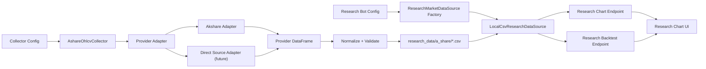

# A-Share Phase 1 OHLCV Data Ingestion Design

## Status

Proposed for Phase 1 implementation. Created on 2026-07-06.

This spec narrows the broader A-share market framework into the first executable data
integration phase: collect A-share OHLCV from external data providers, normalize it into
`freqtrade-cn` research data files, load it through a `ResearchMarketDataSource` factory, and
verify that existing research chart and backtest endpoints consume the data without touching the
crypto/contract trading stack.

## Goal

Add a repeatable A-share OHLCV ingestion path for Phase 1:

```text
provider adapter -> OHLCV collector -> normalized local files
                 -> ResearchMarketDataSource factory
                 -> /research/chart_candles and /research/backtest
```

The successful result is that a configured A-share research bot can refresh one or more stock
OHLCV files, list those instruments, render chart candles, calculate watch indicators, and run
the current research SMA backtest from the normalized data.

## Non-Goals

- Do not add A-share live trading.
- Do not add A-share dry-run trading, broker connectivity, wallet state, order state, or force
  entry/force exit support.
- Do not route A-share data through `freqtrade.exchange.Exchange`, ccxt, or the existing
  Freqtrade trading `DataProvider`.
- Do not modify the existing crypto/futures data download, chart, or backtest behavior.
- Do not ingest funds flow, news, announcements, research reports, financial statements, limit-up
  pools, or AI document data in Phase 1.
- Do not implement a production data lake, job scheduler, distributed task queue, or database
  migration system in Phase 1.
- Do not implement portfolio-level A-share backtesting, historical index constituents, delisting
  survivorship handling, or full corporate-action adjustment in Phase 1.

## Assumptions

- The first implementation remains research-only and follows the existing separation described in
  `docs/superpowers/specs/2026-07-05-a-share-market-framework-v1-design.md`.
- `akshare` is suitable as an optional Python dependency for a first OHLCV collector.
- `a-stock-data` is used as an engineering reference for source priority, `mootdx` pitfalls,
  Tencent quote semantics, and Eastmoney throttling rules, not imported as a runtime package.
- Backtests must not call live external data providers. They read local normalized files only.
- Phase 1 supports `raw` prices only. `qfq` and `hfq` must be rejected until an adjusted-price
  dataset contract is defined for both charting and backtesting.
- A-share instrument display keys use the existing form `600519.SH` and `000001.SZ`.
- The canonical research OHLCV columns remain:

```text
date, open, high, low, close, volume
```

Optional extra columns may be written for future phases, but Phase 1 readers must not depend on
them.

## Current Context

The current repository already has a research path:

- `freqtrade/freqtrade/markets/instrument.py` defines `MarketType` with `a_share`, `hk_stock`,
  and `us_stock`, and parses A-share keys such as `600519.SH`.
- `freqtrade/freqtrade/markets/rules.py` defines minimal A-share lot, fee, stamp-tax, and T+1
  behavior.
- `freqtrade/freqtrade/markets/calendar.py` defines a minimal A-share trading session calendar.
- `freqtrade/freqtrade/research/data_source.py` defines `LocalCsvResearchDataSource`, which loads
  files named like `600519.SH-1d.csv`.
- `freqtrade/freqtrade/rpc/api_server/api_research.py` exposes `/research/bots`,
  `/research/instruments`, `/research/chart_candles`, and `/research/backtest`.
- `ft_userdata/user_data/config.research.example.json` already declares an A-share research bot.

The existing crypto/contract trading path remains ccxt-based:

```text
ExchangeResolver -> Exchange -> ccxt/ccxt.pro
                 -> freqtrade.data.history
                 -> freqtrade.optimize.backtesting
                 -> trading UI and trading APIs
```

Phase 1 must not alter that path.

## First Principles

### 1. Provider data is not research data

Provider responses are raw observations from a specific source. Research data is a normalized,
versioned local dataset with stable field names and market semantics. The collector owns that
translation boundary.

### 2. Backtests consume local snapshots

Backtests must be reproducible. They cannot depend on akshare, Eastmoney, Tencent, mootdx, network
availability, or provider-side field changes at run time.

### 3. The research data source owns read semantics

Research chart and backtest endpoints should ask a data source for normalized OHLCV. They should
not know whether data originated from akshare, a-stock-data direct HTTP logic, exported CSV, or a
future vendor.

### 4. Market candles remain the chart coordinate system

Every chart value aligns to the candle open time. Phase 1 should preserve the existing
`ChartCandlesResponse` compatibility and `meta.layers` source information.

### 5. Small, testable ingestion beats broad data coverage

Phase 1 should prove one clean path end to end before adding funds flow, documents, AI retrieval,
or portfolio backtesting.

## Target Architecture



## Module Boundaries

### Provider Adapter

Suggested location:

```text
freqtrade/freqtrade/research/data_sources/akshare_ashare.py
```

Responsibilities:

- Convert `600519.SH` into provider-specific symbols such as `600519`.
- Call the selected provider function for a given timeframe, date range, and adjustment.
- Return a provider-shaped `DataFrame` or a small provider DTO.
- Hide provider-specific parameter names such as `period`, `adjust`, `fqt`, `frequency`, or
  Eastmoney `secid`.

Must not:

- Write final research CSV files directly.
- Be imported by strategies, chart builders, or backtest code.
- Implement Freqtrade `Exchange`.

### OHLCV Collector

Suggested location:

```text
freqtrade/freqtrade/research/collectors/a_share_ohlcv.py
```

Responsibilities:

- Read a list of A-share instruments and requested timeframes.
- Call a provider adapter.
- Normalize returned data into the research OHLCV schema.
- Merge with existing files when incremental refresh is requested.
- Write files atomically into the configured research data root.
- Produce a refresh summary with counts, date range, source, and warnings.

Must not:

- Run during chart or backtest requests.
- Hide provider failures by writing partial corrupt files.
- Fill non-trading time with synthetic candles.

### ResearchMarketDataSource Factory

Suggested location:

```text
freqtrade/freqtrade/research/data_source_factory.py
```

Responsibilities:

- Build the configured research data source from `ResearchDataSourceConfig`.
- Keep `api_research.py` independent from concrete source classes.
- Preserve the current `local_csv` behavior.

Initial source types:

```text
local_csv
```

Phase 1 may also define a collector provider type such as `akshare_ashare`, but chart/backtest
reads should still use `local_csv` after data is collected.

### LocalCsvResearchDataSource

Existing location:

```text
freqtrade/freqtrade/research/data_source.py
```

Responsibilities in Phase 1:

- Continue to list instruments from normalized CSV file names.
- Continue to load only the canonical OHLCV columns.
- Accept an `adjustment` argument only when the file naming or metadata makes the adjustment
  unambiguous.

Recommended small extension:

- Add a `ResearchMarketDataSource` protocol and make `LocalCsvResearchDataSource` satisfy it.

### Research API

Existing location:

```text
freqtrade/freqtrade/rpc/api_server/api_research.py
```

Responsibilities in Phase 1:

- Replace direct construction of `LocalCsvResearchDataSource` with the source factory.
- Keep route contracts stable for `/research/instruments`, `/research/chart_candles`, and
  `/research/backtest`.
- Continue to reject unsupported adjustment modes clearly.

### CLI or Tool Entry Point

Phase 1 needs an explicit collector entry point. Two acceptable implementations are:

1. A new utility command under the existing CLI, such as:

```text
freqtrade download-research-data --config user_data/config.research.json --bot-id a-share-local \
  --instruments 600519.SH 000001.SZ --timeframes 1d --timerange 20240101-20240701
```

2. A repository-local script under `tools/`, such as:

```text
tools/download_a_share_research_data.py
```

The command is preferable if the implementation is small. A `tools/` script is acceptable for the
first proof if CLI integration would create unnecessary argument-parser churn.

## Data Model

### Instrument Key

Phase 1 accepts:

```text
600519.SH
000001.SZ
```

The collector normalizes case and rejects invalid keys through the existing A-share parser.

### Timeframe Mapping

Phase 1 target timeframe:

| Research timeframe | Provider mapping for akshare daily history |
| --- | --- |
| `1d` | `period="daily"` |

Weekly, monthly, and minute timeframes may be included only after later phases define their
research semantics, provider history depth, and session handling:

| Research timeframe | Provider mapping |
| --- | --- |
| `1w` | later-phase weekly endpoint or daily resampling contract |
| `1M` | later-phase monthly endpoint or daily resampling contract |
| `1m` | provider-specific minute endpoint |
| `5m` | provider-specific minute endpoint |
| `15m` | provider-specific minute endpoint |
| `30m` | provider-specific minute endpoint |
| `1h` | provider-specific minute endpoint |

Phase 1 collector and local research readers must reject these unsupported timeframes with a clear
error even if a matching local CSV file exists.

### Adjustment

Allowed request values:

```text
raw
qfq
hfq
```

Phase 1 behavior:

- `raw` is required.
- `qfq` and `hfq` return a typed unsupported-feature error.
- Unsupported adjustment must not silently fall back to `raw`.

Phase 1 file naming:

```text
600519.SH-1d.csv          # raw default, backward compatible
```

Later adjusted-price phases may add a new file naming contract, but Phase 1 readers must not infer
adjusted datasets from suffixes such as `1d-qfq` or `1d-hfq`.

### Normalized OHLCV

Required CSV columns:

```text
date,open,high,low,close,volume
```

Rules:

- `date` is ISO-like and parseable by `pandas.to_datetime(..., utc=True)`.
- Daily bars use the trading date at a consistent timestamp. The recommended first version writes
  date-only values such as `2026-07-06`; the existing loader converts them to UTC midnight.
- Numeric columns are finite and positive for `open/high/low/close`; `volume` is finite and
  non-negative.
- Rows are sorted by `date` ascending.
- Duplicate `date` rows are rejected or deterministically de-duplicated with a warning.
- OHLC consistency is validated:

```text
low <= min(open, close)
high >= max(open, close)
low <= high
```

Optional extra columns may be written but are not loaded by the current data source:

```text
amount, turnover, source, adjustment, provider_symbol
```

### Refresh Manifest

Each collector run should write a small manifest next to the data root:

```text
research_data/a_share/.manifests/{run_id}.json
```

Minimum fields:

```json
{
  "run_id": "20260706T153000Z-akshare-a-share-ohlcv",
  "market": "a_share",
  "provider": "akshare",
  "provider_version": "unknown",
  "created_at": "2026-07-06T15:30:00Z",
  "instruments": ["600519.SH"],
  "timeframes": ["1d"],
  "adjustment": "raw",
  "timerange": "20240101-20240701",
  "files": [
    {
      "path": "600519.SH-1d.csv",
      "rows": 120,
      "start": "2024-01-02",
      "stop": "2024-07-01",
      "status": "ok"
    }
  ],
  "warnings": []
}
```

This is not a full data-versioning system. It is the minimal audit record needed to make a
research chart or backtest result explain which local files were refreshed.

## Data Flow

### Collection Flow

1. User runs the collector command with config, bot id, instruments, timeframes, timerange, and
   adjustment.
2. The command loads the research bot profile and resolves the A-share data root.
3. The command validates instruments with `parse_instrument_key(..., market=MarketType.A_SHARE)`.
4. The command validates timeframe and adjustment support.
5. `AshareOhlcvCollector` calls the configured provider adapter.
6. The collector normalizes provider columns into canonical OHLCV.
7. The collector validates dates, numeric values, duplicates, OHLC consistency, and empty results.
8. The collector writes a temporary file in the same directory.
9. The collector atomically replaces the target CSV.
10. The collector writes a manifest and returns a summary.

### Chart Flow

1. FreqUI calls `/api/v1/research/chart_candles`.
2. `api_research.py` resolves the bot profile and builds a data source through the factory.
3. The data source loads normalized local OHLCV.
4. The chart service applies timerange, limit, and watch indicators.
5. The chart response remains compatible with `ChartCandlesResponse`.
6. `meta.layers` identifies market and watch layers.

### Backtest Flow

1. FreqUI calls `/api/v1/research/backtest`.
2. `api_research.py` resolves the bot profile and builds a data source through the factory.
3. The data source loads normalized local OHLCV.
4. The backtest applies timerange and row-count guardrails.
5. The current SMA research strategy generates signals.
6. The research backtest executes from local data only.
7. The response returns trades, equity curve, metrics, signals, warnings.

## Error Handling

Collector errors should be explicit:

| Condition | Behavior |
| --- | --- |
| Invalid instrument key | Reject before provider call |
| Unsupported timeframe | Reject before provider call |
| Unsupported adjustment | Reject before provider call |
| Provider returns empty data | Do not overwrite existing file unless `--erase-empty` exists and is explicit |
| Provider columns missing | Fail the instrument/timeframe and record manifest error |
| Invalid numeric values | Fail the file validation |
| Duplicate dates | Deterministically de-duplicate only if rows are identical; otherwise fail |
| Partial multi-instrument run | Continue other instruments, return non-zero status or clear failed count |
| File write failure | Leave existing file untouched |

Research API errors should remain route-level:

| Condition | HTTP response |
| --- | --- |
| Unknown research bot | `404` |
| Invalid research config | `400` |
| Missing OHLCV file | `404` |
| Unsupported adjustment | `501` |
| Invalid instrument or timeframe | `400` |
| Data source read failure | `502` with logged internal detail |

## Provider Choice

### Phase 1 Recommended Provider

Use `akshare.stock_zh_a_hist` for the first raw daily OHLCV implementation because it is a normal
Python package, has MIT licensing, and maps cleanly to the existing research CSV schema. Although
the provider exposes additional adjusted-price and weekly/monthly options, Phase 1 intentionally
does not enable them.

### Provider Adapter Constraints

- `akshare` should be an optional dependency or research extra.
- Import errors should produce a setup-oriented error that explains the missing dependency.
- Provider code should be isolated to the adapter module.
- Provider output field names must be translated once at the boundary.
- Tests should mock the provider adapter rather than making network calls.

### a-stock-data Role

Use `a-stock-data` as a reference for:

- `mootdx` frequency mapping and the known `frequency` vs `category` pitfall.
- The warning that `mootdx` bars are unadjusted raw prices.
- Tencent quote fields for future snapshot and limit-up/limit-down support.
- Eastmoney rate limiting and retry behavior for later non-OHLCV sources.

Do not import `a-stock-data/SKILL.md` or copy all code blocks into the application.

## Configuration

Phase 1 should keep the existing research bot config shape working:

```json
{
  "research_bots": [
    {
      "id": "a-share-local",
      "label": "A Share Local Research",
      "market": "a_share",
      "data_source": {
        "type": "local_csv",
        "root": "research_data/a_share"
      }
    }
  ]
}
```

Collector-specific options can live in the command invocation first. If they are promoted to
config later, use a separate section to avoid changing chart/backtest read semantics:

```json
{
  "research_collectors": {
    "a_share_ohlcv": {
      "provider": "akshare",
      "default_adjustment": "raw",
      "request_interval_seconds": 1.0
    }
  }
}
```

`data_source.type` should continue to describe how research APIs read data, not how collector jobs
refresh data.

## Testing Strategy

### Unit Tests

Add tests for:

- instrument key normalization and provider symbol conversion;
- timeframe mapping;
- adjustment support and rejection;
- provider column normalization;
- empty provider output;
- invalid OHLC values;
- duplicate dates;
- atomic write behavior;
- manifest creation;
- factory returns `LocalCsvResearchDataSource` for existing configs.

Suggested test files:

```text
freqtrade/tests/research/test_data_source_factory.py
freqtrade/tests/research/test_a_share_ohlcv_collector.py
freqtrade/tests/research/test_akshare_ashare_data_source.py
```

### API Tests

Extend existing research API tests to prove:

- `/research/instruments` still works through the factory;
- `/research/chart_candles` still returns chart-compatible data;
- `/research/backtest` still runs from local files;
- missing files and unsupported adjustments keep existing error semantics.

Suggested file:

```text
freqtrade/tests/rpc/test_api_research.py
```

### Integration Smoke Test

Use a local fake provider fixture, not live network calls:

1. Fake provider returns two instruments of daily OHLCV.
2. Collector writes `600519.SH-1d.csv` and `000001.SZ-1d.csv`.
3. Research data source lists both instruments.
4. Research chart endpoint returns candles for one instrument.
5. Research backtest endpoint returns metrics and an equity curve.

### Manual Verification

After implementation, manually run:

```powershell
cd G:\AI_Trading\freqtrade-cn\freqtrade
.\.venv\Scripts\python -m pytest tests/research tests/rpc/test_api_research.py -q
```

If frontend behavior is touched:

```powershell
cd G:\AI_Trading\freqtrade-cn\frequi
pnpm typecheck
```

Then start the research webserver config and verify the Research page can list instruments, render
the chart, and run the sample backtest.

## Acceptance Criteria

1. Existing crypto/futures trading tests and behavior are not intentionally changed.
2. Existing `local_csv` research bot config still works.
3. A collector can generate normalized A-share OHLCV files for at least `600519.SH` and one
   Shenzhen instrument.
4. Generated files use canonical research columns and pass validation.
5. A collector run writes a manifest with source, files, row counts, and warnings.
6. `/research/instruments` lists generated instruments.
7. `/research/chart_candles` renders generated A-share candles with existing watch indicators.
8. `/research/backtest` runs from generated A-share candles without network access.
9. Unsupported adjustment and timeframe combinations fail explicitly.
10. No implementation depends on importing `a-stock-data/SKILL.md`.

## Risks

- Provider APIs may change fields or throttle requests. The adapter boundary and tests reduce the
  blast radius but do not remove the risk.
- `akshare` adds dependencies. Keeping it optional avoids affecting normal trading installs.
- Daily raw prices are not enough for long-horizon production research. Corporate-action
  adjustment is a follow-up phase.
- Minute data depth differs by provider. Phase 1 should not promise minute backtests until the
  provider behavior is verified and cached.
- Generated local CSV files can become stale. The manifest makes this visible, but does not solve
  scheduling.
- Writing adjusted files without clear naming would make chart and backtest prices inconsistent.
  Phase 1 must either name adjusted files explicitly or reject non-raw adjustments.

## Recommended Implementation Order

1. Add `ResearchMarketDataSource` protocol and data source factory.
2. Update research API code to use the factory while preserving `local_csv` behavior.
3. Add the OHLCV normalizer and validator with tests.
4. Add the A-share OHLCV collector with a fake provider in tests.
5. Add the akshare provider adapter behind an optional import.
6. Add a CLI or `tools/` command to run the collector.
7. Add manifest writing and collector summary output.
8. Verify generated files through existing research chart and backtest endpoints.
9. Document the command in the research config example or a short docs page.

## Future Phases

Phase 2 should add stronger A-share correctness:

- official or cached trading calendar;
- suspended status;
- limit-up and limit-down non-fill checks;
- adjustment factors and corporate actions;
- minute-session semantics that do not fill lunch breaks;
- historical universes and delisting metadata.

Phase 3 should add feature/event/document data:

- funds flow;
- industry and concept membership;
- limit-up pools and market breadth;
- financial statements and reports;
- announcements, news, research reports, and AI retrieval.

Those phases should build on the same provider adapter and canonical store boundary introduced in
Phase 1.
