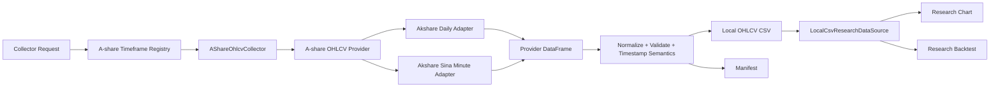

# A-Share Phase 1B Multi-Timeframe OHLCV Design

## Status

Draft created on 2026-07-08.

This spec extends Phase 1 from raw daily A-share OHLCV into raw multi-timeframe
OHLCV for the research-only A-share stack. It is intentionally an incremental
design: keep the current collector, standardized local artifacts,
`ResearchMarketDataSource`, research chart, and research backtest boundaries, but
add minute-capable data collection and read semantics.

Phase 1B exists because Phase 1 proved the first daily path, while current code
still hard-rejects every A-share timeframe except `1d`. The next useful step is
not a broad data lake or a trading exchange adapter. The next useful step is a
credible local OHLCV contract for:

```text
1m, 5m, 15m, 30m, 60m, 1d
```

## Background

Phase 1 introduced the research-only A-share OHLCV flow:

```text
provider adapter -> AShareOhlcvCollector -> normalized local CSV files
                 -> ResearchMarketDataSource
                 -> /research/chart_candles and /research/backtest
```

The current implementation is deliberately narrow:

- `LocalCsvResearchDataSource` lists and loads files named like `600519.SH-1d.csv`.
- `SUPPORTED_A_SHARE_RESEARCH_TIMEFRAMES` is `{"1d"}`.
- `AShareOhlcvCollector` maps only `1d -> daily`.
- `AkshareAshareOhlcvProvider` calls only `akshare.stock_zh_a_hist`.
- `normalize_provider_ohlcv()` formats all dates as `YYYY-MM-DD`, which would
  collapse same-day minute bars into duplicate dates.
- Chart and backtest API routes read local files and do not call providers.

This boundary is correct. The limitation is the daily-only data contract, not
the research chart surface.

Local provider research found:

- `akshare.stock_zh_a_minute(symbol="sh688017", period="1|5|15|30|60",
  adjust="")` successfully returned recent raw minute bars for `688017.SH` in
  the local environment.
- `akshare.stock_zh_a_minute` has fixed recent-history depth, around `1970`
  bars per period, and no start/end request parameters.
- `akshare.stock_zh_a_hist_min_em` has a more collector-shaped API and richer
  fields, but Eastmoney minute requests were unstable in the local environment.
- `a-stock-data` is useful as engineering reference for provider priority,
  `mootdx` frequency pitfalls, Tencent quote fields, and Eastmoney throttling,
  but it should not become a runtime dependency.

## Goal

Add raw multi-timeframe A-share OHLCV support for research:

1. Support a shared A-share research timeframe registry:

```text
1m, 5m, 15m, 30m, 60m, 1d
```

2. Collect raw minute OHLCV through a provider adapter, with
   `akshare.stock_zh_a_minute` as the Phase 1B default minute provider.
3. Keep daily collection through the existing raw daily provider path.
4. Normalize minute rows without losing intraday timestamps.
5. Store local files using the existing artifact naming pattern:

```text
688017.SH-1m.csv
688017.SH-5m.csv
688017.SH-15m.csv
688017.SH-30m.csv
688017.SH-60m.csv
688017.SH-1d.csv
```

6. Make `LocalCsvResearchDataSource` list and load those files.
7. Render research chart candles for those timeframes.
8. Run bounded research backtests from those local files.
9. Keep all provider calls out of chart and backtest API requests.
10. Validate the path with real `688017.SH` data in the Research UI.

## Non-Goals

Phase 1B does not:

- add A-share live trading, dry-run trading, broker connectivity, wallet state,
  order state, or execution APIs;
- route A-share data through `freqtrade.exchange.Exchange`, ccxt, or the normal
  trading `DataProvider`;
- replace the research backtest engine with Freqtrade's crypto/futures
  `Backtesting`, AKQuant, Backtrader, or PyBroker;
- implement `qfq` or `hfq` adjusted minute datasets;
- promise full historical minute coverage;
- implement a production scheduler, queue, database, or data lake;
- ingest order book, tick transactions, quote snapshots, news, announcements,
  research reports, or AI document data;
- allow Phase 3 feature-aware backtests on minute candles before a separate
  as-of alignment design exists;
- resample daily bars into minute bars or synthesize candles for missing time;
- infer missing lunch-break bars or fill non-trading sessions.

## First Principles

### 1. Provider Responses Are Not The Research Contract

Provider frames are source-specific observations. The research contract is the
normalized local artifact plus manifest. Provider quirks are handled at the
adapter/collector boundary.

### 2. Chart And Backtest Read Local Artifacts Only

Backtests must be reproducible. `/research/chart_candles` and
`/research/backtest` must not call `akshare`, Eastmoney, Sina, Tencent,
`mootdx`, or any future live provider.

### 3. Timeframe Support Is A Data Contract

Adding `1m` is not just adding a UI option. The collector, normalizer,
manifest, local reader, chart, backtest, and tests must all agree that a
timeframe is supported.

### 4. Minute Timestamp Semantics Must Be Explicit

Daily bars can safely use a date-only value in the current system. Minute bars
cannot. Minute `date` values must preserve intraday time and must identify the
canonical candle coordinate used by chart and backtest.

### 5. A-Share Market Rules Stay Separate From Provider Access

The provider can supply OHLCV. It does not define T+1, lunch breaks, limit-up
non-fill behavior, suspension, whole lots, or fee rules. Those remain market
rule and backtest concerns.

## Recommended Approach

Use the existing Phase 1 architecture and add one shared timeframe registry plus
minute-capable provider/normalizer behavior:



This is preferred over introducing a full exchange-like adapter now because it
unblocks A-share chart/backtest parity while keeping A-share trading semantics
outside the ccxt stack.

## Scope Decisions

### Canonical Timeframes

Phase 1B canonical A-share research timeframes are:

| Research timeframe | Meaning | Phase 1B status |
| --- | --- | --- |
| `1m` | 1 minute | supported |
| `5m` | 5 minutes | supported |
| `15m` | 15 minutes | supported |
| `30m` | 30 minutes | supported |
| `60m` | 60 minutes | supported |
| `1d` | 1 trading day | supported |

`60m` is used instead of `1h` in Phase 1B because the validated A-share
provider period is `60`, and this avoids an alias layer in the first minute
implementation. A later UI/parity phase may add `1h` as an input alias that
normalizes to the same artifact.

Unsupported examples remain rejected:

```text
3m, 2h, 4h, 1w, 1M
```

### Adjustment

Phase 1B remains raw-only.

Allowed request values remain:

```text
raw, qfq, hfq
```

Behavior:

- `raw` is accepted.
- `qfq` and `hfq` return a typed unsupported-feature error.
- Provider-side silent fallback from adjusted to raw is not allowed.

Rationale:

- Sina minute adjusted data is synthesized by AkShare using daily adjustment
  factors and may silently fall back to raw on upstream failures.
- Eastmoney `1m` minute history does not support adjustment.
- Backtest market rules such as limit-up and limit-down must be in the same
  price coordinate system as OHLCV. Mixing adjusted candles with raw limit
  prices would produce invalid fills.

### Feature-Aware Backtest Scope

Phase 3B feature-aware backtest remains `1d` only in Phase 1B.

If a request uses a feature-aware strategy on a minute timeframe, the API should
return a controlled unsupported-feature error rather than attempting to align
daily side-data to minute candles.

## Data Contract

### File Naming

Continue using:

```text
{instrument_key}-{timeframe}.csv
```

Examples:

```text
688017.SH-1m.csv
688017.SH-5m.csv
688017.SH-15m.csv
688017.SH-30m.csv
688017.SH-60m.csv
688017.SH-1d.csv
```

Do not add provider or adjustment suffixes in Phase 1B.

### Required Columns

The canonical OHLCV columns stay unchanged:

```text
date,open,high,low,close,volume
```

Reader behavior:

- `LocalCsvResearchDataSource` loads only these six columns.
- Extra columns are not part of the Phase 1B read contract.
- Files with missing or reordered required columns are rejected.

### Daily Timestamp Format

Daily files keep the existing date-only behavior:

```text
2026-07-07
```

The existing loader converts date-only values with `pd.to_datetime(..., utc=True)`.
Phase 1B must not break existing daily files.

### Minute Timestamp Format

Minute files must store full, timezone-stable timestamps.

Required canonical format:

```text
2026-07-07T01:30:00Z
```

This represents `2026-07-07 09:30:00` in `Asia/Shanghai`.

Rules:

- Provider timestamps are interpreted in `Asia/Shanghai` unless explicitly
  timezone-aware.
- Stored minute timestamps are converted to UTC ISO strings with `Z`.
- The canonical `date` value represents the candle coordinate used by chart and
  backtest.
- Manifest records both source and canonical timestamp semantics.

### Candle Coordinate Semantics

The preferred canonical coordinate is candle open time.

Provider adapters must declare source timestamp semantics:

```text
candle_open
candle_close
unknown
```

Normalization behavior:

| Source timestamp semantics | Phase 1B behavior |
| --- | --- |
| `candle_open` | Convert local timestamp to UTC and write it directly |
| `candle_close` | Convert to candle open by subtracting the timeframe duration |
| `unknown` | Fail the provider adapter until semantics are verified |

The first implementation must verify the `akshare.stock_zh_a_minute` timestamp
semantics before enabling it as supported. The manifest must record the verified
choice.

### Provider History Depth

`akshare.stock_zh_a_minute` returns recent bars only. Phase 1B must make that
visible in manifests and operator docs.

Recommended manifest field:

```json
{
  "history_depth_policy": "provider_latest_bars",
  "provider_row_limit": 1970
}
```

If a requested timerange is older than provider coverage and produces an empty
normalized file, the collector must fail that file and leave any existing file
untouched.

## Timeframe Registry

Add a single source of truth for supported A-share research timeframes.

Suggested module:

```text
freqtrade/freqtrade/research/a_share_timeframes.py
```

Suggested contract:

```python
SUPPORTED_A_SHARE_OHLCV_TIMEFRAMES = ("1m", "5m", "15m", "30m", "60m", "1d")
MINUTE_A_SHARE_OHLCV_TIMEFRAMES = ("1m", "5m", "15m", "30m", "60m")

def validate_a_share_ohlcv_timeframe(timeframe: str) -> str:
    ...

def is_a_share_minute_timeframe(timeframe: str) -> bool:
    ...

def timeframe_to_minutes(timeframe: str) -> int:
    ...
```

Consumers:

- `LocalCsvResearchDataSource`
- `AShareOhlcvCollector`
- provider mapping
- chart/backtest guards
- tests

Do not keep separate hard-coded supported sets in the collector and reader.

## Provider Strategy

### Phase 1B Default Provider Split

The existing `AkshareAshareOhlcvProvider` may remain the public collector
provider, but internally it needs daily and minute branches:

| Timeframe | Default function | Provider symbol |
| --- | --- | --- |
| `1d` | `akshare.stock_zh_a_hist` | `688017` |
| `1m` | `akshare.stock_zh_a_minute` | `sh688017` / `sz000001` |
| `5m` | `akshare.stock_zh_a_minute` | `sh688017` / `sz000001` |
| `15m` | `akshare.stock_zh_a_minute` | `sh688017` / `sz000001` |
| `30m` | `akshare.stock_zh_a_minute` | `sh688017` / `sz000001` |
| `60m` | `akshare.stock_zh_a_minute` | `sh688017` / `sz000001` |

Daily call:

```python
akshare.stock_zh_a_hist(
    symbol="688017",
    period="daily",
    start_date="20240101",
    end_date="20260707",
    adjust="",
)
```

Minute call:

```python
akshare.stock_zh_a_minute(
    symbol="sh688017",
    period="1",
    adjust="",
)
```

For minute calls, `start_date` and `end_date` are applied as local post-filters
after provider fetch because the Sina minute interface does not accept a
timerange.

### Eastmoney Minute Adapter

Do not make Eastmoney minute the Phase 1B default.

It may be added as a later optional adapter because it has richer fields and
some adjusted periods, but local verification showed unstable `RemoteDisconnected`
failures. If implemented later, it should be behind explicit provider selection
and retry/backoff policy.

### Mootdx Adapter

Do not add `mootdx` in Phase 1B.

`mootdx` is the right future candidate for stronger watch/live-ish A-share data,
order book, and tick transactions. It also has important pitfalls:

- `frequency=8` means `1m`;
- `frequency=0` means `5m`;
- `frequency=1/2/3` means `15m/30m/60m`;
- `frequency=4` means daily;
- bars are raw and do not provide adjustment.

Those rules should become tests when a `MootdxAshareOhlcvProvider` is added, but
they are outside Phase 1B.

## Collector Changes

### Request Validation

`AShareOhlcvRequest` keeps the same shape:

```python
AShareOhlcvRequest(
    instruments=["688017.SH"],
    timeframes=["1m", "5m", "15m", "30m", "60m", "1d"],
    start_date="20260701",
    end_date="20260707",
    adjustment="raw",
)
```

Validation rules:

- instruments must parse as A-share instruments;
- timeframes must be in the shared registry;
- adjustment must be `raw`;
- invalid requests fail before provider calls;
- mixed success/failure across instruments and timeframes still writes manifest
  entries per artifact.

### Normalizer Signature

The current normalizer lacks timeframe context. Phase 1B should change it to
accept normalization options:

```python
def normalize_provider_ohlcv(
    provider_dataframe: pd.DataFrame,
    *,
    timeframe: str,
    source_timestamp_semantics: str,
    source_timezone: str = "Asia/Shanghai",
) -> tuple[pd.DataFrame, list[str]]:
    ...
```

Responsibilities:

- map provider columns to `date/open/high/low/close/volume`;
- preserve full timestamps for minute rows;
- convert minute timestamps to UTC ISO strings;
- preserve daily date-only output for `1d`;
- validate numeric values and OHLC relationships;
- sort by timestamp ascending;
- handle duplicate timestamps, not duplicate dates;
- return warnings for identical duplicate rows.

### Provider Column Aliases

Add aliases for Sina minute fields:

| Canonical | Existing aliases | Additional Phase 1B aliases |
| --- | --- | --- |
| `date` | `date`, `日期` | `day`, `时间` |
| `open` | `open`, `开盘` | no change |
| `high` | `high`, `最高` | no change |
| `low` | `low`, `最低` | no change |
| `close` | `close`, `收盘` | no change |
| `volume` | `volume`, `成交量` | no change |

Ignore `amount`, `均价`, `涨跌幅`, `涨跌额`, `振幅`, and `换手率` in Phase 1B.

## LocalCsvResearchDataSource Changes

`LocalCsvResearchDataSource` must:

- discover supported minute files;
- reject unsupported timeframes even if files exist;
- parse daily date-only values as today;
- parse minute UTC ISO values without timezone drift;
- return sorted dataframes with `date` as timezone-aware UTC timestamps;
- preserve `get_ohlcv_provenance()` behavior.

`available_timeframes("688017.SH")` should return only supported files that
exist locally, sorted by the registry order:

```text
1m, 5m, 15m, 30m, 60m, 1d
```

Avoid lexicographic ordering that would place `15m` before `1m` or `60m` before
`5m`.

## Chart Behavior

`/research/chart_candles` should support all Phase 1B timeframes.

Expected behavior:

- load local OHLCV only;
- apply existing timerange and limit behavior;
- compute watch indicators from the selected timeframe;
- return the existing `ChartCandlesResponse` shape;
- include OHLCV provenance from the local manifest;
- return `404` for missing files;
- return `501` for unsupported timeframes outside the registry;
- return `501` for non-raw adjustment.

No frontend redesign is required. ResearchView can use the returned
`available_timeframes` for the selector.

## Backtest Behavior

Phase 1B permits bounded raw OHLCV research backtests on supported minute
timeframes, with the existing simplified single-instrument research backtest.

Required behavior:

- load local OHLCV only;
- keep the existing row limit unless separately changed;
- keep the current SMA strategy behavior;
- apply T+1 sell checks by trading date;
- apply daily status, suspension, limit-up, and limit-down checks by trading date
  when status data exists;
- preserve whole-lot and fee behavior.

Minute-specific market correctness:

- minute rows must be within A-share trading sessions;
- invalid minute rows outside `09:30-11:30` or `13:00-15:00` Asia/Shanghai
  must fail validation for collector-generated files;
- API backtests reading manually supplied local minute files should reject
  out-of-session rows with a controlled request error rather than silently
  filtering them;
- silent filtering is not allowed in Phase 1B because it changes strategy
  candle sequences;
- `row.volume == 0` should be documented as not enough liquidity for a fill only
  if implementation explicitly adds that rule. Otherwise do not invent it
  silently.

The existing `MAX_RESEARCH_BACKTEST_ROWS = 5000` remains acceptable for Phase
1B. It means `1m` backtests cover only short windows. Raising that limit is a
separate performance and UX decision.

## Side-Data And Feature Guards

Phase 3A/3B side-data is daily-aligned today.

Phase 1B must not make daily side-data appear minute-aware by accident. Guard
rules:

- ordinary `sma_cross` can run on minute OHLCV;
- `sma_cross_feature_filter` remains supported only on `1d`;
- `chart_candles.side_layers` for feature/event/document data should either
  stay `1d`-only or return controlled unsupported behavior for minute requests;
- OHLCV CSV files must not receive feature columns.

This prevents false confidence from incorrectly aligned fund-flow, announcement,
or event data.

## Manifest Changes

Extend the existing manifest shape without breaking old manifests.

Recommended additional fields:

```json
{
  "timeframe_registry_version": "a_share_ohlcv_v1b",
  "timestamp_semantics": {
    "source_timezone": "Asia/Shanghai",
    "source_timestamp_semantics": "candle_close",
    "canonical_timezone": "UTC",
    "canonical_timestamp_semantics": "candle_open"
  },
  "provider_endpoint": "stock_zh_a_minute",
  "history_depth_policy": "provider_latest_bars",
  "provider_row_limit": 1970,
  "session_filter": "a_share_regular_session"
}
```

Per-file entries should continue to include:

```json
{
  "path": "688017.SH-1m.csv",
  "rows": 1970,
  "start": "2026-06-25T05:53:00Z",
  "stop": "2026-07-07T07:00:00Z",
  "status": "ok",
  "warnings": []
}
```

Old manifests that do not contain these fields must still be readable by
`find_local_csv_provenance()`.

## Tooling

Keep the existing collector script path:

```text
tools/download_a_share_research_data.py
```

Recommended examples:

```powershell
cd G:\AI_Trading\freqtrade-cn
.\freqtrade\.venv\Scripts\python tools\download_a_share_research_data.py `
  --config ft_userdata\user_data\config.research.example.json `
  --bot-id a-share-local `
  --instruments 688017.SH `
  --timeframes 1m 5m 15m 30m 60m 1d `
  --adjustment raw
```

For `stock_zh_a_minute`, timerange is a post-filter:

```powershell
.\freqtrade\.venv\Scripts\python tools\download_a_share_research_data.py `
  --config ft_userdata\user_data\config.research.example.json `
  --bot-id a-share-local `
  --instruments 688017.SH `
  --timeframes 1m `
  --timerange 20260701-20260707
```

The command must state clearly when a provider cannot satisfy the requested
timerange because the provider only returns recent bars.

## Error Handling

Collector errors:

| Condition | Behavior |
| --- | --- |
| Invalid instrument | Reject before provider call |
| Unsupported timeframe | Reject before provider call |
| Non-raw adjustment | Reject before provider call |
| Provider unavailable | Record file error, do not overwrite existing file |
| Provider returns empty data | Record file error, do not overwrite existing file |
| Unknown timestamp semantics | Fail before writing |
| Missing provider columns | Fail file validation |
| Invalid OHLC values | Fail file validation |
| Duplicate conflicting timestamps | Fail file validation |
| Identical duplicate rows | Drop deterministically with warning |
| Out-of-session minute rows | Fail file validation |

API errors:

| Condition | HTTP response |
| --- | --- |
| Unknown research bot | `404` |
| Missing OHLCV file | `404` |
| Unsupported timeframe | `501` |
| Unsupported adjustment | `501` |
| Invalid request | `400` |
| Local read failure | `502` |
| Feature-aware strategy on minute timeframe | `501` |

## Testing Strategy

### Unit Tests

Add or modify tests for:

- shared timeframe registry accepts `1m/5m/15m/30m/60m/1d`;
- registry rejects unsupported values;
- provider mapping routes `1d` to `stock_zh_a_hist`;
- provider mapping routes minute timeframes to `stock_zh_a_minute`;
- A-share symbol conversion maps `688017.SH -> sh688017` and
  `000001.SZ -> sz000001`;
- normalizer preserves minute timestamps;
- normalizer writes UTC ISO minute timestamps;
- normalizer keeps daily date-only output;
- duplicate detection uses timestamp for minute data;
- source timestamp semantics are required for minute data;
- identical duplicate minute rows warn and de-duplicate;
- conflicting duplicate minute rows fail;
- local CSV data source lists minute files;
- local CSV data source loads minute files into UTC timestamps;
- timeframes sort by registry order.

Suggested files:

```text
freqtrade/tests/research/test_a_share_timeframes.py
freqtrade/tests/research/test_a_share_ohlcv_collector.py
freqtrade/tests/research/test_akshare_ashare_data_source.py
freqtrade/tests/research/test_data_source.py
```

### Backtest Tests

Add or modify tests for:

- ordinary `sma_cross` can run on a small `1m` fixture;
- T+1 sell blocking still uses trading dates for minute rows;
- non-trading-day minute rows are blocked or rejected according to the chosen
  policy;
- out-of-session minute rows are rejected by validation or produce controlled
  warnings;
- feature-aware strategy on minute timeframe returns unsupported behavior.

Suggested files:

```text
freqtrade/tests/research/test_backtesting.py
freqtrade/tests/rpc/test_api_research.py
```

### API Tests

Extend API tests to cover:

- `/research/instruments` returns `688017.SH` with minute timeframes when local
  files exist;
- `/research/chart_candles` returns `1m` candles from local files;
- `/research/backtest` runs from a local `1m` file;
- missing minute files return `404`;
- unsupported `3m` returns `501`;
- API routes do not import provider modules.

### Provider Tests

Provider tests must mock `akshare`.

Do not make network calls in CI.

Mocked minute provider should return a frame like:

```text
day,open,high,low,close,volume,amount
2026-07-07 09:31:00,460,461,459,460.5,1000,460500
2026-07-07 09:32:00,460.5,462,460,461.5,1200,553800
```

The expected canonical timestamps depend on the verified source timestamp
semantics.

### Optional Live Smoke

Manual live provider smoke is useful but must not be required for CI:

```powershell
cd G:\AI_Trading\freqtrade-cn
.\freqtrade\.venv\Scripts\python tools\download_a_share_research_data.py `
  --config ft_userdata\user_data\config.research.example.json `
  --bot-id a-share-local `
  --instruments 688017.SH `
  --timeframes 1m 5m 15m 30m 60m `
  --adjustment raw
```

Expected manual result:

- files are written under `ft_userdata/user_data/research_data/a_share`;
- manifest identifies the minute provider and timestamp semantics;
- Research UI can select `688017.SH`;
- Research UI can switch between `1m/5m/15m/30m/60m/1d`;
- chart renders real candles;
- bounded `sma_cross` backtest returns metrics without provider calls.

## Verification Commands

Backend:

```powershell
cd G:\AI_Trading\freqtrade-cn\freqtrade
.\.venv\Scripts\python -m pytest `
  tests/research/test_a_share_ohlcv_collector.py `
  tests/research/test_akshare_ashare_data_source.py `
  tests/research/test_data_source.py `
  tests/research/test_backtesting.py `
  tests/rpc/test_api_research.py `
  -q
.\.venv\Scripts\python -m ruff check `
  freqtrade/research `
  freqtrade/rpc/api_server `
  tests/research `
  tests/rpc/test_api_research.py
```

Frontend only if selector behavior changes:

```powershell
cd G:\AI_Trading\freqtrade-cn\frequi
pnpm typecheck
```

Browser verification:

```text
http://127.0.0.1:8082/research
```

or the active research webserver port used by the local environment.

## Acceptance Criteria

Phase 1B is complete when:

1. A single registry defines A-share research OHLCV timeframes.
2. Collector and local CSV reader support `1m/5m/15m/30m/60m/1d`.
3. Existing `1d` raw files remain readable.
4. Minute normalization preserves intraday timestamps.
5. Minute timestamps are timezone-stable and documented in manifests.
6. Provider calls happen only in collector/tooling paths.
7. `akshare.stock_zh_a_minute` can collect real `688017.SH` raw minute data in
   manual smoke verification.
8. `/research/instruments` exposes minute timeframes for collected files.
9. `/research/chart_candles` renders collected minute candles.
10. `/research/backtest` runs a bounded raw minute OHLCV backtest.
11. Feature-aware backtest remains guarded to `1d` until minute side-data
    alignment is designed.
12. Unsupported timeframes and adjustments fail explicitly.
13. No runtime dependency is added on `a-stock-data`.
14. CI tests do not require live provider access.

## Risks

- `akshare.stock_zh_a_minute` provides limited recent history. Phase 1B is enough
  for recent chart validation and short-window backtests, not long-horizon
  minute research.
- Provider timestamp labels may be candle-close rather than candle-open. The
  adapter must verify and record this instead of assuming.
- Eastmoney minute APIs may be unstable or rate-limited. They should not be the
  default provider without fallback.
- `MAX_RESEARCH_BACKTEST_ROWS = 5000` limits `1m` backtest coverage to a short
  period. Raising this limit requires a separate performance decision.
- Daily market status projected onto minute rows cannot represent all intraday
  halts or microstructure constraints.
- Raw-only minute data is not enough for long-horizon corporate-action-correct
  backtests.
- Enabling side-data on minute charts without a new alignment design would
  create false research signals.

## Future Phases

### Phase 1C: Timeframe Alias And Storage Format

- Add `1h` as an alias for `60m` if needed for stronger Freqtrade UI parity.
- Evaluate Parquet or Feather for larger minute datasets.
- Add an artifact index to avoid repeated directory scans.

### Phase 2.6: Minute Market Correctness

- Strengthen session validation.
- Model lunch-break boundaries, opening auction, closing auction, and zero-volume
  minute behavior.
- Decide whether invalid session rows fail fast or are filtered at collection.

### Phase 4: Portfolio And Universe Backtest

- Multi-symbol pools.
- Index constituents.
- Delisting and listing-age filters.
- Benchmark and rebalancing.

### Future Provider Adapters

- `MootdxAshareOhlcvProvider` for stronger watch/live-ish data.
- `TencentQuoteSnapshotProvider` for valuation and limit price snapshots.
- `EastmoneySideDataProvider` for fund flow, limit pools, and other event data.

These future adapters should all feed the same collector/store/DataPortal
boundary introduced by Phase 1 and extended by Phase 1B.
