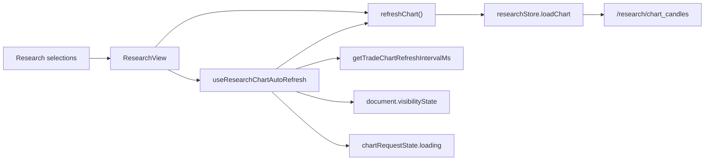

# Research Chart Auto Refresh Design

## Status

Draft created on 2026-07-08.

This Phase 1D design adds automatic refresh behavior to the research chart
surface. It is intentionally frontend-only. It reuses the existing trade chart
refresh cadence and keeps manual refresh as an immediate sync and retry action.

The default behavior is auto-refresh enabled.

## Background

The A-share research route can now load multi-timeframe local OHLCV data and
render trading-session-compressed charts. The remaining UX problem is that the
research chart behaves like a static report: users must click
`Refresh chart / 刷新图表` to see newly collected or newly available candles.

The existing contract and spot chart path already has a better model:

- `getTradeChartRefreshIntervalMs()` centralizes timeframe refresh cadence.
- `useLiveChartDataset()` schedules refresh with recursive `setTimeout`.
- Page visibility is respected: hidden pages stop refreshing and visible pages
  refresh immediately.
- Chart candle requests are deduplicated so overlapping requests are avoided.
- Websocket `new_candle` messages provide an additional fast path for live bots.

A-share research does not currently have a websocket candle stream. Polling is
therefore the correct Phase 1D mechanism, but it should reuse the existing
cadence and lifecycle rules rather than adding a one-off interval in
`ResearchView`.

## Goal

Add default-on automatic refresh for the `/research` chart:

1. Refresh the research chart automatically while the page is visible.
2. Reuse the existing trade chart timeframe cadence.
3. Preserve manual refresh as an immediate refresh and retry action.
4. Avoid overlapping chart requests.
5. Pause while the document is hidden.
6. Refresh immediately when the document becomes visible again.
7. Recalculate the next refresh when bot, instrument, timeframe, adjustment,
   selected side-data, or indicator parameters change.
8. Keep research backtests manual only.
9. Keep the implementation small and isolated from backend data-source and
   collector concerns.

## Non-Goals

Phase 1D does not:

- implement A-share websocket or push-based candle updates;
- implement a collector scheduler;
- add backend market-session status APIs;
- implement full trading-day, holiday, lunch-break, or suspension gating;
- change `/research/chart_candles` request or response contracts;
- change A-share OHLCV storage;
- auto-run research backtests;
- add user-configurable refresh intervals;
- add a persistent user setting for auto-refresh;
- change contract or spot trading chart behavior;
- modify the global bot auto-refresh switch.

## First Principles

### 1. Research Chart Is A Watch Surface, Not A Backtest Trigger

The chart should stay current. Backtests should remain explicit. Automatic chart
refresh must never trigger `runBacktest()`.

### 2. Refresh Cadence Is Shared Chart Infrastructure

Timeframe refresh intervals are already defined for live charts. Research charts
should reuse that shared mapping so `1m`, `5m`, `15m`, and other intervals feel
consistent across markets.

### 3. Visibility And In-Flight State Bound Network Load

Polling must stop when the page is hidden and must not enqueue parallel requests
when a previous chart request is still running.

### 4. Manual Refresh Still Matters

Automatic refresh is the normal watch mode. Manual refresh remains useful after
collector runs, transient API failures, parameter changes, or user-initiated
sync.

### 5. Market-Session Gating Requires A Market Source Of Truth

The UI may later consume an explicit market status from A-share market rules.
Phase 1D should not hard-code a full calendar in the frontend.

## Recommended Approach

Add a small composable that owns research chart auto-refresh lifecycle:

```text
useResearchChartAutoRefresh
  -> computes interval from timeframe
  -> schedules recursive setTimeout
  -> skips hidden pages
  -> skips while chart request is loading
  -> refreshes immediately on visibility resume
  -> cleans up on unmount
```

`ResearchView` remains responsible for user selections and `refreshChart()`.
The composable only decides when to call `refreshChart()`.



## Refresh Cadence

Phase 1D reuses:

```text
getTradeChartRefreshIntervalMs(timeframe)
```

Current cadence:

| Timeframe | Interval |
| --- | --- |
| `1m` | 10 seconds |
| `3m` | 30 seconds |
| `5m` | 60 seconds |
| `15m` | 60 seconds |
| `30m` | 60 seconds |
| `1h` | 180 seconds |
| `2h` | 300 seconds |
| `4h` | 300 seconds |
| `6h` | 600 seconds |
| `8h` | 600 seconds |
| `12h` | 600 seconds |
| `1d` and above | 900 seconds |
| unknown | 60 seconds |

A-share research currently exposes `60m` rather than `1h`. Phase 1D should add
a tiny normalization helper so `60m` uses the `1h` cadence:

```text
60m -> 1h
```

All other supported A-share timeframes can pass through directly.

## Component Design

### `useResearchChartAutoRefresh`

Suggested path:

```text
frequi/src/composables/useResearchChartAutoRefresh.ts
```

Suggested input:

```ts
interface UseResearchChartAutoRefreshOptions {
  active: Ref<boolean> | ComputedRef<boolean>;
  timeframe: Ref<string> | ComputedRef<string>;
  canRefresh: Ref<boolean> | ComputedRef<boolean>;
  isLoading: Ref<boolean> | ComputedRef<boolean>;
  refreshChart: () => Promise<void> | void;
}
```

Suggested output:

```ts
interface UseResearchChartAutoRefreshResult {
  autoRefreshEnabled: ComputedRef<boolean>;
  refreshIntervalMs: ComputedRef<number>;
  refreshStatus: ComputedRef<"active" | "paused" | "refreshing">;
  refreshLabel: ComputedRef<string>;
}
```

Responsibilities:

- default enabled when `active && canRefresh`;
- schedule a recursive timer with the normalized timeframe interval;
- call `refreshChart()` only when visible and not loading;
- skip a tick if `isLoading` is true;
- clear timer before scheduling a new one;
- clear timer on unmount;
- refresh immediately when visibility changes from hidden to visible and the
  chart can refresh;
- not own selection state;
- not own API request payload construction;
- not call `runBacktest()`.

### ResearchView Integration

`ResearchView` should:

- pass `active = true` while mounted;
- pass `timeframe`;
- pass the existing `hasSelection`;
- pass `researchStore.chartRequestState.loading`;
- pass `refreshChart`;
- display auto-refresh state near the manual refresh button.

Suggested minimal status text:

```text
Auto 10s
Auto 60s
Paused
Refreshing
```

Do not add a toggle in Phase 1D because the approved default is enabled and the
phase goal is parity with the watch chart behavior.

## Data Flow

### Initial Load

On mount:

1. ResearchView loads bots, instruments, datasets, and the initial chart.
2. Auto-refresh schedules the next tick based on the selected timeframe.
3. No immediate duplicate refresh should fire if the initial chart request is
   still loading.

### Parameter Changes

When the user changes a chart-affecting parameter:

1. ResearchView clears stale chart results.
2. ResearchView's handler may trigger an immediate refresh where current code
   already does so.
3. The auto-refresh composable observes the changed dependency and resets the
   next scheduled tick.

Chart-affecting parameters:

```text
bot_id
instrument
timeframe
adjustment
selected feature/event/document side layers
smaFast
smaSlow
```

### Visibility Changes

When the document becomes hidden:

```text
clear scheduled timer
```

When the document becomes visible:

```text
if canRefresh and not loading:
  refresh immediately
schedule next tick
```

### Loading State

If a tick fires while `chartRequestState.loading` is true:

```text
skip this tick
schedule next tick
```

Do not enqueue another refresh. Do not cancel the in-flight request.

## Error Handling

Research chart request errors continue to be owned by:

```text
researchStore.chartRequestState.error
```

Phase 1D behavior:

- automatic refresh errors should not throw out of the composable;
- no repeated toast spam;
- the existing inline chart error remains visible;
- the next tick follows the normal interval;
- no exponential backoff in Phase 1D.

If repeated failures become noisy or expensive, a later phase can add backoff.

## UI Behavior

The manual refresh button stays visible and enabled when no request is loading.

Recommended button area:

```text
[Refresh chart / 刷新图表]  Auto 10s
```

When loading:

```text
[Refresh chart / 刷新图表 loading]  Refreshing
```

When hidden, the user does not see the page. On return, the chart refreshes
immediately and status returns to active.

If selection is invalid:

```text
Paused
```

## Testing Strategy

### Unit Tests

Add tests for the refresh cadence helper or normalization:

- `1m -> 10_000`
- `5m -> 60_000`
- `60m -> 180_000`
- unknown timeframe -> `60_000`

Add composable tests using fake timers:

- schedules a refresh when active and visible;
- calls `refreshChart()` after the expected interval;
- does not call while `isLoading` is true;
- does not call while `canRefresh` is false;
- clears timer on unmount;
- stops when `document.visibilityState` is hidden;
- refreshes immediately when visibility returns to visible;
- recalculates interval when timeframe changes.

### Component Tests

Extend ResearchView component tests:

- auto-refresh is wired by default;
- manual refresh button still calls `loadChart`;
- automatic refresh calls `loadChart`;
- automatic refresh does not call `runBacktest`;
- loading state disables manual refresh and prevents auto-refresh overlap;
- status label shows the expected interval for `1m` and `60m`.

### Browser Verification

Manual browser verification should use the active research UI:

```text
http://127.0.0.1:8083/research
```

Verification scenario:

1. Select `A Share Local`.
2. Select `688017`.
3. Select `1m`.
4. Confirm chart renders.
5. Confirm status shows `Auto 10s`.
6. Wait one interval and confirm a chart request occurs without clicking refresh.
7. Switch to `60m` and confirm status changes to the `1h` cadence.
8. Hide or navigate away from the page and confirm scheduled refresh stops.

## Acceptance Criteria

Phase 1D is complete when:

1. Research chart auto-refresh is enabled by default.
2. Research chart uses the shared trade chart refresh cadence.
3. `60m` uses the `1h` cadence instead of the unknown-timeframe default.
4. Hidden pages do not keep polling.
5. Returning to the page triggers one immediate refresh.
6. Loading requests are not overlapped by auto-refresh.
7. Manual refresh remains available and still works.
8. Auto-refresh never triggers research backtests.
9. Inline chart request errors still render through existing store state.
10. Focused component/composable tests pass.
11. Browser verification confirms `688017 / 1m` refreshes automatically.

## Risks

- Polling only reflects newly available local research data. If the collector
  has not refreshed local files, automatic chart refresh will return the same
  candles.
- Phase 1D does not know exact A-share market status. It may poll during closed
  sessions until a later market-status API is added.
- The research chart request can be heavier than a live trade chart request
  because it may include watch indicators and side-layer metadata. The loading
  guard is required.
- If the UI later supports multiple research charts at once, this single-view
  composable will need extension to avoid synchronized request bursts.

## Future Work

Later phases can add:

- backend market-session status for A-share, Hong Kong, and US markets;
- closed-session pause or low-frequency mode;
- collector scheduling status;
- websocket or SSE push for newly collected research artifacts;
- user-configurable auto-refresh settings;
- a global research watch dashboard with staggered refresh windows.
