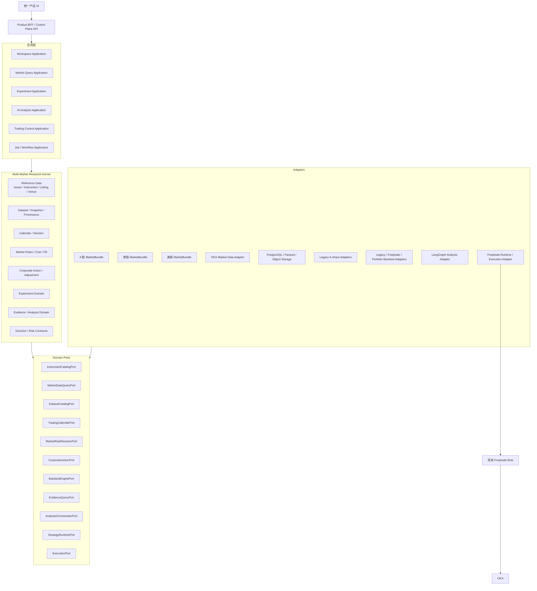
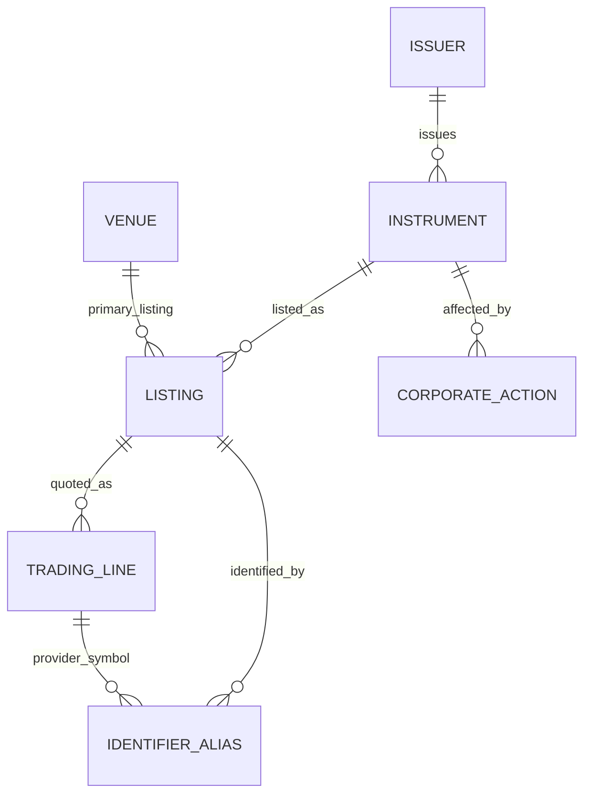

# 多市场研究平台总体架构设计

## 状态

- 设计日期：2026-07-11
- 状态：已确认
- 适用仓库：`freqtrade-cn`
- 架构路线：新建多市场研究内核，采用 Strangler 渐进迁移；Freqtrade 作为 OKX 策略运行与执行适配器
- 当前范围：A 股、港股、美股、OKX 的数据、研究、回测和 AI 分析；OKX 保留现有交易；港股和美股预留正式交易接口但暂不接券商

本设计是总架构设计，不对应一次性实施。实现必须拆为独立子项目，每个子项目分别编写设计、实施计划、测试和迁移方案。

---

## 1. 背景

当前系统最初围绕 Freqtrade 的币圈现货和合约交易构建，随后增加了 A 股 research-only 路径。现有设计已经确立了几个正确原则：

- 市场数据不等于交易执行；
- A 股研究不能被强制映射到 CCXT/Wallet/Order；
- 股票应使用 Instrument，而不是复用 crypto pair 语义；
- 市场日历和市场规则应由市场域拥有；
- 图表渲染可复用，但数据和执行能力必须分开。

现有依据：

- `docs/superpowers/specs/2026-07-05-a-share-market-framework-v1-design.md`
- `freqtrade/freqtrade/markets/instrument.py`
- `freqtrade/freqtrade/research/`
- `freqtrade/freqtrade/rpc/api_server/api_research.py`
- `frequi/src/views/ResearchView.vue`

但是当前实现仍然是“A 股 V1 代码 + 港股/美股枚举占位”，不是可插拔多市场内核：

- `MarketType` 把 `contract` 这种工具类型与 `a_share/hk_stock/us_stock` 这种市场维度混在一起；
- instrument parser 只接受 A 股代码；
- Research Profile 只允许 `local_csv`，并拒绝非 A 股市场；
- Calendar、Status、Rules、Backtest Context 绑定具体 A 股类型；
- Event/Document DTO 把 market 固定为 A 股；
- 当前回测函数直接构造 `AShareMarketRules`；
- Research 领域反向依赖 Freqtrade RPC/API schema；
- 数据仍以可变 CSV/JSONL 路径为主，Snapshot、PIT 和并发发布语义不完整；
- FreqUI 仍通过全局 activeBot 隐式决定数据源、能力和交易目标。

如果继续复制 A 股代码并增加 `if market == "hk_stock"`、`if market == "us_stock"`，市场时区、交易时段、复权、企业行为、费用、数据许可和 AI 时间语义会快速扩散到 API、UI、回测和 Agent 中，最终使 Freqtrade 分叉难以维护。

---

## 2. 架构决策

采用以下路线：

> 在顶层仓库新建独立的 Multi-Market Research Platform。它拥有证券主数据、数据快照、市场语义、统一实验和 AI 证据等领域能力。现有 A 股实现通过 Legacy Adapter 渐进迁移；港股和美股从第一天只实现新 MarketBundle。Freqtrade 保留为 OKX 策略运行、回测和执行适配器，不再成为新平台的领域核心。

不采用以下路线：

1. **继续直接扩展 Freqtrade/FreqUI**：短期最快，但会使股票、数据、AI 和交易状态继续耦合。
2. **一次性重写全部平台**：边界最干净，但会丢弃 Freqtrade 的成熟交易能力，迁移和资金风险过高。
3. **所有事实统一成无类型 JSON**：Provider 接入快，但单位、时间、复权、revision 和类型约束不可控。

采用“稳定核心实体 + 类型化契约 + Adapter + Strangler”的折中方案。

---

## 3. 目标

平台长期承载：

- A 股、港股、美股、OKX 的统一证券和市场身份；
- 日线、分钟线及以后更多行情数据；
- 财报、宏观、新闻、公告、行业、资金流和舆情；
- 单标的、组合、横截面和多市场回测；
- 宏观 → 行业/主题 → 个股的 AI 分析；
- 可复现的 AI 策略实验；
- 现有 OKX 现货和合约交易；
- 未来港股、美股券商适配；
- 中央账户、组合风险、人工审批、执行幂等和审计。

架构成功标准：

1. 新增港股或美股时不修改 Freqtrade 核心。
2. 新增市场时不修改 Experiment、Analysis、Snapshot 应用核心。
3. 新增 Provider 时不修改 UI 和领域模型。
4. 更换 LangGraph 或模型供应商时不修改 AnalysisRun/EvidenceBundle 契约。
5. 更换回测引擎时不修改数据平台和实验 UI。
6. 当前 A 股可以通过 Legacy Adapter 保持兼容。
7. 一个 Research Workspace 可以同时引用 A 股、港股、美股和 OKX。
8. 一个 ExecutionBot 必须绑定明确账户或 subaccount。
9. AI Worker 不持有交易账户 secret。
10. 正式 Experiment 和历史 AI 分析可复现、可追溯且默认 fail closed。

---

## 4. 非目标

第一阶段不做：

- 港股或美股真实券商连接；
- 全市场微秒级 tick 基础设施；
- 高频交易撮合或 colocated execution；
- 一次性完整覆盖期权、债券和 OTC 产品；
- 大型多租户 SaaS；
- 每个市场、Provider 或 Agent 一个微服务；
- 完全通用的市场规则 DSL；
- 允许 AI 直接管理真实资金；
- 通过大量空接口或空 Adapter 假装能力已经实现。

港股和美股交易属于长期正式目标，但本设计只稳定 `Account`、`ExecutionIntent`、`ExecutionPort`、`RiskGateway` 和 `Reconciliation` 等边界，不实现券商 SDK。

---

## 5. 基本假设

- 近期仍是本地优先、单团队使用；
- 初期支持分钟级和日级批量更新，不以全市场低延迟 tick 为目标；
- 初期采用模块化单体 + 持久 Worker；
- PostgreSQL 保存元数据、任务和业务状态；
- Parquet/Arrow 和本地或 S3-compatible object storage 保存大批量 artifact；
- 当前 Freqtrade Bot 和 SQLite 暂时保留；
- A 股、港股、美股第一阶段均为完整研究市场；
- OKX 是当前唯一正式执行市场；
- AI Analysis 和未来 AI Trading 分域；
- 所有历史研究必须显式声明知识时间和数据质量等级。

---

## 6. 总体架构



核心边界：

- UI 只面对统一 Product BFF，不再以 activeBot 作为整个产品上下文；
- Multi-Market Kernel 拥有研究领域事实；
- MarketBundle 封装市场差异；
- Freqtrade 通过 Adapter 接入；
- AI Analysis 与 Execution 分域；
- 港美股未来只需增加 Broker Adapter，不重写研究、数据和 AI。

---

## 7. 模块所有权

| 模块 | 唯一负责 | 明确不负责 |
|---|---|---|
| Product BFF | UI 聚合、认证、RBAC、Capability、DTO 转换 | 不拥有行情、账户、实验或 AI 事实 |
| Workspace | 用户研究上下文、市场范围、数据集选择 | 不代表交易账户或 Bot |
| Reference Data | Issuer、Instrument、Listing、TradingLine、Venue、Alias | 不保存价格和订单 |
| Dataset/Snapshot | Dataset、不可变 Snapshot、质量、血缘、许可 | 不定义市场交易规则 |
| Calendar/Session | 交易日、时区、开闭市、午休、竞价、盘前盘后 | 不计算费用和成交 |
| Market Rules | 数量、tick、价格控制、卖空资格、结算规则版本 | 不保存券商账户 |
| Cost Model | 佣金、税费、征费和实验成本假设 | 不决定是否成交 |
| Fill Model | 滑点、部分成交、容量和撮合假设 | 不决定账户权限 |
| Corporate Action | 分红、拆并股、供股、代码变化、退市 | 不覆盖原始价格 |
| Experiment | Spec、Run、Result 和可复现性 | 不实现具体回测循环 |
| Analysis | EvidenceBundle、AnalysisRun 和 AnalysisResult | 不拥有交易权限 |
| Job/Workflow | 持久任务、lease、heartbeat、重试和取消 | 不保存领域最终事实 |
| Risk/Decision | Proposal、Approval、ExecutionIntent | 不使用 LLM 决定硬风控 |
| Execution Adapter | 将平台 Intent 映射到 Freqtrade/券商 | 不决定策略是否值得交易 |
| Freqtrade | OKX 策略、订单、仓位、交易所连接 | 不拥有多市场数据、AI 和跨市场研究 |

---

## 8. 依赖规则

```text
API DTO
  → Application Use Case
    → Domain Model / Domain Ports
      ← Infrastructure Adapters
```

Domain Kernel 禁止依赖：

- FastAPI router；
- Freqtrade RPC/API schema；
- FreqtradeBot；
- CCXT；
- Akshare 或具体 Provider SDK；
- 具体券商 SDK；
- LangChain/LangGraph 类型；
- Pandas DataFrame；
- 具体 CSV 路径；
- FreqUI Chart response。

允许：

- Adapter 内部使用 Pandas、Arrow、SDK 或 Freqtrade 类型；
- API 层使用 Pydantic；
- AI Adapter 内部使用 LangGraph；
- Legacy Adapter 映射当前 A 股模型；
- Legacy Response Adapter 映射当前 FreqUI schema。

依赖规则必须通过架构测试进入 CI。禁止创建无所有权的 `shared/common/utils` 垃圾目录；共享类型必须归属于明确领域。

---

## 9. 产品上下文模型

```text
DataSourceProfile
= Provider + CredentialRef + 配置 + 数据能力

MarketRuntime
= 市场日历、规则、默认成本和展示语义

ResearchWorkspace
= 可同时包含 A 股、港股、美股和 OKX 的研究上下文

Experiment
= 显式声明数据、市场、策略、规则和时间范围的回测

AnalysisRun
= 显式声明 as_of、证据、市场范围和模型版本的 AI 分析

ExecutionBot
= 绑定明确账户/subaccount 和 venue 的策略执行实例

Account
= 真实或模拟资金主体
```

不变量：

- 一个 ResearchWorkspace 可以跨市场；
- 一个 ExecutionBot 必须绑定明确账户；
- Workspace 不自动获得交易权限；
- AnalysisRun 不自动产生交易；
- DataSourceProfile 不代表账户；
- 页面能力由 Capability Manifest 决定，不从 activeBot 猜测。

---

## 10. 证券身份模型



### 10.1 Issuer

```text
Issuer
- issuer_id
- canonical_name
- legal_entity_identifiers[]
- domicile
- sector_classification_refs[]
- valid_from
- valid_to?
- revision
```

Issuer 表示发行主体，不是可交易证券。用于关联 A/H 股、ADR、不同 share class、财报和公司事件。

### 10.2 Instrument

```text
Instrument
- instrument_id
- issuer_id?
- asset_class
- instrument_type
- canonical_name
- denomination_currency?
- status
- valid_from
- valid_to?
- schema_version
```

正交分类：

```text
asset_class: equity | fund | index | crypto | fx | commodity | bond | derivative
instrument_type: common_stock | preferred_stock | etf | adr | index | spot | perpetual | future
```

- A 股和 H 股通常是不同 Instrument，共享 Issuer；
- ADR 与原股是不同 Instrument，通过 relation 关联；
- OKX Spot 和 Perpetual 是不同 Instrument；
- 港股双柜台可以共享同一 Instrument。

### 10.3 Listing

```text
Listing
- listing_id
- instrument_id
- market_id
- primary_venue_id
- listing_currency
- calendar_id
- listed_from
- listed_to?
- status
- schema_version
```

Listing 表示上市关系，支持上市、退市、转板、历史股票池和主上市地。

### 10.4 TradingLine

```text
TradingLine
- trading_line_id
- listing_id
- display_symbol
- trading_currency
- settlement_currency
- default_venue_id
- calendar_id
- quantity_rule_ref
- price_increment_rule_ref
- active_from
- active_to?
- status
```

TradingLine 表示实际可报价、成交和结算的交易线。港股 HKD/RMB 双柜台通过同一经济证券下的不同 TradingLine 表达。

### 10.5 Venue

```text
Venue
- venue_id
- code
- mic?
- name
- venue_type
- country
- region
- timezone
- default_calendar_id
- capabilities[]
- active_from
- active_to?
```

主上市 venue、execution venue 和 market-data feed scope 必须分开。美股不能抽象成单一 `US_EXCHANGE`。

### 10.6 IdentifierAlias

```text
IdentifierAlias
- alias_id
- subject_type
- subject_id
- identifier_type
- identifier_value
- provider_id?
- valid_from
- valid_to?
- revision
```

- ticker/provider symbol 不是主键；
- 解析必须带 as_of；
- 多匹配返回 `AMBIGUOUS_SYMBOL`；
- ticker 更名不创建全新公司。

---

## 11. Market 与 Capability

```text
MarketDefinition
- market_id
- region
- country
- asset_classes[]
- default_timezone
- default_calendar_id
- supported_capabilities[]
- active
```

有效能力由以下条件共同解析：

```text
Market Capability
+ Listing Capability
+ DataSource Capability
+ BacktestEngine Capability
+ ExecutionAdapter Capability
+ Account Capability
+ User Permission
= EffectiveCapability
```

```text
CapabilityManifest
- can_search
- can_chart
- can_query_realtime
- can_query_historical
- can_run_backtest
- can_run_portfolio_backtest
- can_run_ai_analysis
- can_paper_trade
- can_live_trade
- can_short
- can_trade_fractional
- supported_sessions[]
- supported_intervals[]
- limitations[]
```

未实现能力返回 false，并在 UI 提交前禁用；不能等请求执行后再返回 501。

---

## 12. 时间、日历与 Session

所有 instant 存 UTC，同时保留市场 TradingDate 和 IANA timezone。

```text
TradingDate
- local_date
- calendar_id
- timezone
```

```text
TradingSession
- session_id
- trading_date
- timezone
- session_phase
- opens_at
- closes_at
- random_close_window?
- accepts_orders
- matches_orders
- supported_order_types[]
- trade_date_rule
- calendar_version
```

```text
session_phase:
pre_open | opening_auction | regular | lunch_break | closing_auction |
post_market | overnight | maintenance | closed
```

日线不能用 UTC 00:00 代替 TradingDate。美国 DST 必须使用 `America/New_York`，不能使用固定 UTC offset。交易日历查询返回完整 SessionSchedule，而不是单一 `is_open`。

```text
TradingCalendar
- calendar_id
- calendar_version
- timezone
- valid_from
- valid_to?
- source
- source_version
- tzdb_version
```

Experiment 必须锁定 Calendar Snapshot/Version/TZDB Version。

---

## 13. 市场规则快照

应用层只面对：

```text
MarketRuleResolverPort.resolve(
    listing_id,
    trading_line_id,
    venue_id,
    effective_at,
    known_at
) -> MarketRuleSnapshot
```

```text
MarketRuleSnapshot
- rule_snapshot_id
- listing_id
- trading_line_id
- venue_id
- valid_from
- valid_to?
- announced_at?
- known_at
- status
- session_rule
- quantity_rule
- price_increment_rule
- price_control_rule
- short_sale_rule
- settlement_rule
- source_documents[]
- content_hash
```

```text
status: proposed | approved | scheduled | effective | suspended | superseded
```

`valid_from` 与 `known_at` 分开，以支持真实历史重放和未来已公告规则模拟。

MarketBundle 内部组合：

- SessionPolicy；
- QuantityRule；
- PriceIncrementRule；
- PriceControlRule；
- ShortSalePolicy；
- SettlementPolicy；
- FeeTaxPolicy。

其中 FeeTaxPolicy 只表达市场和监管强制费用规则；CostModel 再组合这些规则、券商/账户费率和实验指定的成本假设，避免两个模块同时拥有同一费用事实。

数量、tick、价格控制、卖空资格、结算周期和费用均按 Listing/Venue/Session/Date 解析，不能硬编码为市场常量。

---

## 14. Observation 与 Point-in-Time

统一 envelope，payload 保持类型化。

```text
ObservationSeries
- series_id
- subject_ref
- observation_type
- schema_id
- frequency?
- unit?
- value_currency?
- adjustment_basis?
- methodology_version?
- provider_id
```

```text
ObservationRecord
- observation_id
- series_id
- effective_start
- effective_end?
- trading_date?
- published_at?
- available_at
- ingested_at
- availability_basis
- vintage_id
- revision_number
- supersedes_observation_id?
- source_record_id
- payload_schema_id
- quality_flags[]
```

时间含义：

- effective：事实描述的经济期间或市场时间；
- published：来源声明的发布时间；
- available：市场参与者最早可使用时间；
- ingested：本系统真实收到时间；
- vintage/revision：同一事实的历史版本。

```text
availability_basis: live_observed | vendor_reconstructed | estimated | unknown
```

公开 DTO 采用类型化结构：

- BarBatchDTO；
- QuoteBatchDTO；
- FundamentalBatchDTO；
- MacroObservationDTO；
- FlowObservationDTO；
- SentimentObservationDTO；
- FeatureBatchDTO；
- EventDTO；
- DocumentDTO。

金额和价格使用 Decimal，JSON 以字符串传输。API 不返回 Pandas DataFrame。

```text
KnowledgePolicy
- PLATFORM_REPLAY
- HISTORICAL_POINT_IN_TIME
```

- PLATFORM_REPLAY：`ingested_at <= as_of`；
- HISTORICAL_POINT_IN_TIME：`available_at <= as_of`，且必须有合格 vintage。

```text
pit_grade: live_observed | vendor_vintage | best_effort | latest_only
```

看盘可使用 best-effort 并显示 warning；正式 Experiment 和历史 AI 默认拒绝 latest-only。

---

## 15. DatasetSnapshot

```text
DatasetSnapshot
- snapshot_id
- dataset_id
- schema_id
- schema_version
- state
- created_at
- published_at?
- content_digest
- parent_snapshot_id?
- dependency_snapshots[]
- coverage
- quality_report_id
- pit_grade
- license_id?
- redistribution_policy?
- producer_version
```

```text
state: building | published | quarantined | revoked
```

```text
ArtifactManifest
- artifact_uri
- content_hash
- byte_size
- row_count
- subject_range
- effective_time_range
- available_time_range
- trading_date_range
- schema_id
```

不变量：

1. Published Snapshot 永不修改；
2. 修订生成新 Snapshot；
3. 失败构建不能发布；
4. 读取时校验 content hash；
5. Experiment 只能引用 Published Snapshot；
6. Revoked Snapshot 可重放旧实验，默认不用于新实验；
7. Snapshot 依赖固定 reference、calendar、rule、corporate action 和 FX。

---

## 16. Corporate Action 与复权

```text
CorporateAction
- action_id
- instrument_id
- affected_listing_ids[]
- action_type
- status
- announcement_at
- available_at
- ex_date?
- record_date?
- effective_date?
- payable_date?
- ratio?
- cash_amount?
- currency?
- old_identifiers[]
- new_identifiers[]
- revision_id
- supersedes_action_id?
- source_document_id
```

支持分红、拆股、合股、供股、合并、分拆、代码变化、退市、ADR 比例变化、board lot 变化、停牌和复牌。

```text
PriceAdjustmentSpec
- mode
- corporate_action_snapshot_id
- adjustment_as_of
- formula_version
```

```text
mode: raw | split_adjusted | split_dividend_adjusted | total_return | provider_native
```

A 股 qfq/hfq 只作为 Adapter/UI 兼容术语。Raw price 永远保留，避免复权价格与现金分红重复计入。

---

## 17. 多币种与 FX

```text
Money
- amount: Decimal
- currency
```

分离：

- price currency；
- trading currency；
- settlement currency；
- corporate-action currency；
- reporting currency。

Experiment 必须包含 FX Snapshot 和转换策略。结果保留原币值、报告币种值和 FX provenance。缺少 FX 时返回 `CURRENCY_CONVERSION_MISSING`，禁止直接相加 CNY/HKD/USD/USDT。

---

## 18. MarketBundle

```text
MarketBundle
- market_definition
- identifier_codec
- reference_data_adapter
- market_data_capabilities
- calendar_adapter
- session_policy
- market_rule_resolver
- corporate_action_adapter
- default_cost_model_ref
- default_fill_model_ref
- display_policy
- capability_manifest
```

第一阶段使用静态 MarketRegistry，不设计复杂插件发现。

### A 股 Bundle

- A 股标识；
- Asia/Shanghai；
- 午休和交易日历；
- 涨跌停；
- T+1 可卖；
- 手数和印花税；
- 企业行为；
- Akshare/本地数据 Adapter。

### 港股 Bundle

- Listing/TradingLine 和 HKD/RMB counter；
- Asia/Hong_Kong；
- POS/continuous/lunch/CAS；
- board lot/odd lot；
- tick table；
- VCM/竞价限制；
- 企业行为、费用、结算和许可。

### 美股 Bundle

- Issuer/CIK/Security/Listing/Venue；
- America/New_York/DST；
- Pre/Core/Post/未来 Overnight；
- Early Close；
- round lot/tick；
- LULD/MWCB；
- T+1；
- Reg SHO；
- SEC filing、企业行为、FX 和行情 entitlement。

### OKX Bundle

- Spot/Perpetual；
- 24×7 calendar + maintenance；
- funding/basis；
- quantity/tick；
- OKX market-data adapter。

OKX Bundle 不拥有账户和订单，执行由 Freqtrade Adapter 负责。

---

## 19. 核心 Ports

### InstrumentCatalogPort

```text
search(query) -> Page[ListingSummary]
get_instrument(instrument_id) -> Instrument
get_listing(listing_id, as_of) -> Listing
get_trading_line(trading_line_id, as_of) -> TradingLine
resolve_alias(identifier, venue_id?, as_of) -> ResolutionResult
get_universe(universe_ref, as_of) -> UniverseSnapshot
```

### DatasetCatalogPort

```text
search_datasets(query) -> Page[DatasetDescriptor]
get_snapshot(snapshot_id) -> DatasetSnapshot
resolve_snapshot(selector) -> DatasetSnapshot
get_quality(snapshot_id) -> DataQualityReport
verify(snapshot_id) -> VerificationResult
```

### MarketDataQueryPort

```text
query_bars(query) -> BarBatch
query_observations(query) -> ObservationBatch
```

### TradingCalendarPort

```text
sessions(query) -> SessionSchedule
session_at(market_id, instant) -> TradingSession?
next_session(market_id, instant, phase?) -> TradingSession
align_decision_time(query) -> EligibleDecisionTime
```

### MarketRuleResolverPort

```text
resolve(query) -> MarketRuleSnapshot
evaluate_order(order, market_state, rule_snapshot) -> OrderEligibility
```

### CorporateActionPort

```text
query_actions(query) -> CorporateActionBatch
build_adjustment_series(query) -> AdjustmentSeries
```

### FxRatePort

```text
resolve_rate(from_currency, to_currency, effective_at, snapshot_id) -> FxRate
```

### EvidenceQueryPort

```text
search(query) -> Page[EvidenceItem]
build_bundle(request) -> EvidenceBundle
```

### BacktestEnginePort

```text
capabilities() -> EngineCapabilities
validate(spec) -> ValidationResult
submit(spec, idempotency_key) -> ExperimentRunId
status(run_id) -> ExperimentRunState
cancel(run_id)
result(run_id) -> ExperimentResult
```

### AnalysisOrchestratorPort

```text
capabilities() -> OrchestratorCapabilities
plan(run_spec)
execute(run_spec, evidence_bundle, read_only_tools)
resume(run_id)
cancel(run_id)
```

### StrategyRuntimePort

```text
capabilities(runtime_id)
start(runtime_id)
stop(runtime_id)
pause(runtime_id)
resume(runtime_id)
status(runtime_id)
deployed_strategy(runtime_id)
positions(runtime_id)
trades(runtime_id)
health(runtime_id)
```

### ExecutionPort

```text
capabilities(account_id, trading_line_id)
submit(intent, idempotency_key)
cancel(order_id, idempotency_key)
get_order(order_id)
list_open_orders(account_id)
get_positions(account_id)
reconcile(account_id)
```

现阶段 Freqtrade 正式实现 StrategyRuntimePort；Hardened ExecutionPort 在平台级幂等和对账完成后实现。

---

## 20. API v2

```text
GET  /api/v2/markets
POST /api/v2/listings:search
POST /api/v2/listings:resolve
GET  /api/v2/listings/{listing_id}

GET  /api/v2/datasets
GET  /api/v2/datasets/{dataset_id}/snapshots
GET  /api/v2/snapshots/{snapshot_id}
GET  /api/v2/snapshots/{snapshot_id}/quality

POST /api/v2/bars:query
POST /api/v2/observations:query
GET  /api/v2/calendars/{calendar_id}/sessions

POST /api/v2/experiments/runs
GET  /api/v2/experiments/runs/{run_id}
POST /api/v2/experiments/runs/{run_id}:cancel
GET  /api/v2/experiments/runs/{run_id}/result

POST /api/v2/analyses/runs
GET  /api/v2/analyses/runs/{run_id}
POST /api/v2/analyses/runs/{run_id}:cancel
GET  /api/v2/analyses/runs/{run_id}/result
```

Execution 路由在 Risk/Intent 完成前不开放港美股实现。

Bar Query 明确声明 TradingLine、interval、range、snapshot selector、as_of、knowledge policy、session scope、adjustment、pagination 和 allow_partial。看盘可以解析 latest；Experiment/Analysis 创建时必须冻结具体 Snapshot。

---

## 21. 错误与版本语义

```text
ApiError
- code
- message
- retryable
- correlation_id
- details
```

核心错误码：

- `INVALID_ARGUMENT`
- `UNKNOWN_INSTRUMENT`
- `UNKNOWN_LISTING`
- `AMBIGUOUS_SYMBOL`
- `UNSUPPORTED_CAPABILITY`
- `SNAPSHOT_NOT_FOUND`
- `SNAPSHOT_NOT_PUBLISHED`
- `SNAPSHOT_HASH_MISMATCH`
- `AS_OF_VIOLATION`
- `VINTAGE_UNAVAILABLE`
- `DATA_INCOMPLETE`
- `RULE_COVERAGE_GAP`
- `CURRENCY_CONVERSION_MISSING`
- `IDEMPOTENCY_CONFLICT`
- `PROVIDER_RATE_LIMITED`
- `DEPENDENCY_TIMEOUT`
- `ENGINE_UNAVAILABLE`
- `MODEL_OUTPUT_INVALID`
- `EVIDENCE_INSUFFICIENT`

看盘允许 degraded-with-warning；正式 Experiment 和历史 AI 默认 fail closed。只有 timeout、rate limit 和临时 unavailable 自动重试。

版本必须区分 REST API、DTO schema、Dataset schema、Domain revision、Market Rule、Engine、Model、Prompt 和 Toolset。Snapshot 永不原地迁移；破坏性 schema 使用新 major 或显式 converter。前端类型最终由 OpenAPI 生成。

---

## 22. 数据采集与发布

```text
DataSourceProfile
- profile_id
- provider_id
- supported_markets[]
- supported_dataset_types[]
- supported_intervals[]
- latency_class
- entitlement_ref
- licence_policy_ref
- credential_ref
- rate_limit_policy
- retry_policy
- timeout_policy
- default_schedule?
- retention_policy
- config_version
```

Credential 只存 reference，不存明文。

```text
CollectionJobSpec
- job_id
- profile_id
- dataset_id
- market_scope[]
- subject_scope[]
- requested_effective_range
- requested_available_range?
- intervals[]
- parent_snapshot_id?
- collection_mode
- priority
- idempotency_key
- deadline
```

```text
collection_mode: full_snapshot | incremental_partition | revision_backfill | repair | validation_only
```

任务状态：queued、leased、running、retry_wait、succeeded、failed、cancelled、dead_letter。系统采用 at-least-once + 幂等，不宣称 exactly-once。

处理链：

```text
Raw Artifact
  → Decode
  → Schema Mapping
  → Identifier Resolution
  → Time/Unit/Currency Normalization
  → Revision/Vintage Resolution
  → Session Validation
  → Quality Gate
  → Immutable Partition
  → Atomic Snapshot Publish
```

Quality Gate 覆盖 schema、identifier、timestamp、session、duplicate、coverage、OHLC、revision、corporate action、PIT、license 和 cross-partition consistency。

发布通过 staging + artifact hash + catalog transaction + current pointer 原子切换。失败时旧健康 Snapshot 继续服务。

增量更新生成新 Snapshot 并复用未变化 partition，不覆盖完整历史。

---

## 23. 存储

| 数据 | 存储 |
|---|---|
| Reference Data | PostgreSQL |
| Job/Lease | PostgreSQL |
| Dataset/Snapshot/Manifest/Quality | PostgreSQL |
| Experiment/Analysis/Intent 元数据 | PostgreSQL |
| Raw Artifact | Object Storage |
| OHLCV/Feature | Parquet/Arrow |
| 文档正文 | Object Storage |
| 文档元数据/实体关系 | PostgreSQL |
| 全文检索 | PostgreSQL FTS 或按规模独立扩展 |
| Vector Index | 有明确语义检索需求后增加 |
| Freqtrade 交易状态 | 暂时保持每 Bot SQLite |

初期不引入 Kafka、Kubernetes、ClickHouse 或大型向量数据库，除非测量结果证明需要。

---

## 24. 统一 Experiment

```text
ExperimentSpec
- experiment_id
- engine_id
- engine_version_constraint
- market_scopes[]
- universe_spec
- resolved_universe_snapshot_id
- resolved_trading_line_ids[]
- dataset_snapshot_ids[]
- feature_snapshot_ids[]
- strategy_artifact_id
- strategy_version
- strategy_parameters
- effective_time_range
- decision_clock
- knowledge_as_of
- knowledge_policy
- session_scope
- calendar_snapshot_ids[]
- market_rule_snapshot_policy
- corporate_action_snapshot_id
- adjustment_policy
- cost_model_ref
- fill_model_ref
- settlement_model_ref
- borrow_model_ref?
- fx_snapshot_id?
- reporting_currency
- benchmark_spec?
- random_seed?
- code_commit
- spec_hash
```

```text
StrategyArtifact
- strategy_artifact_id
- strategy_type
- source_ref
- content_hash
- code_commit
- parameter_schema
- input_feature_schema
- output_signal_schema
- runtime_requirements
- generated_by?
- status
```

策略版本不可被 AI 原地覆盖。

Adapters：

- Legacy A-share Backtest：单标的、long-only、当前功能；
- Freqtrade Backtest：Crypto/Freqtrade Strategy；
- Multi-Market Portfolio Backtest：A/H/美股、多标的、多币种和组合语义。

热循环只消费已冻结 Artifact、Calendar、Rules、Corporate Actions、FX 和 Strategy；禁止网络调用、Provider、LLM 和漂移的 latest。

模拟订单顺序：Session → Quantity → Tick → Price Control → Halt → Short/Borrow → Cash/Position → Fill → Cost → Settlement → Portfolio → Corporate Action。

结果包含 orders、fills、trades、equity、positions、metrics、benchmark、currency breakdown、rejected-order reasons、warnings、quality、provenance 和 reproducibility hash。

---

## 25. AI Evidence 与 Analysis

AI 只能读取冻结 EvidenceBundle。

```text
EvidenceBundle
- evidence_bundle_id
- as_of
- subjects[]
- snapshot_ids[]
- evidence_items[]
- coverage
- freshness
- conflicts[]
- content_digest
```

```text
EvidenceItem
- evidence_id
- snapshot_id
- source_record_id
- source_uri?
- source_name
- source_quality
- content_hash
- locator
- subject_refs[]
- market_refs[]
- published_at?
- available_at
- ingested_at
- language
- licence_policy_ref
```

不变量：Bundle 不可变；Evidence 来自 Published Snapshot；available_at 不晚于 Analysis as_of；文档是 untrusted data；license 不允许时不能进入 Bundle。

```text
AnalysisRunSpec
- analysis_type
- workspace_id
- subjects[]
- market_scopes[]
- as_of
- analysis_timezone
- horizon
- evidence_bundle_id
- feature_snapshot_ids[]
- experiment_run_ids[]
- model_ref
- prompt_ref
- toolset_version
- orchestrator_ref
- output_schema_id
- budget
- deadline
- spec_hash
```

```text
AnalysisResult
- result_id
- analysis_run_id
- as_of
- horizon
- summary
- market_regime?
- conclusions[]
- claims[]
- counter_claims[]
- risks[]
- invalidation_conditions[]
- confidence
- calibration_version?
- data_coverage
- data_freshness
- caveats[]
- evidence_bundle_id
- model_version
- prompt_version
- tool_versions[]
```

每个事实 Claim 必须引用 Evidence。输出 schema 非法、Evidence 晚于 as-of、关键结论无证据或 coverage 不足时运行失败。

第一版使用有界状态图：Validate → Regime → Macro → Sector → Instrument → Risk/Counter-Thesis → Evidence Verify → Structured Synthesis。只提供只读工具。LangGraph 仅实现 OrchestratorPort 和 checkpoint，不拥有领域事实。

外部新闻、网页和文档必须按 Prompt Injection/Excessive Agency 风险处理：文档最低权限、工具 allowlist、参数 schema、read/write 分离、AI Worker 无交易 secret、保存 tool trace、限制预算和递归深度。

---

## 26. 贪恐指数与 AI 策略实验

贪恐指数是确定性、版本化指标：

```text
FearGreedSpec
- market_id
- session_scope
- horizon
- component_definitions[]
- component_weights
- normalization_policy
- missing_data_policy
- formula_version
```

各市场独立计算，再构建可选全球风险偏好指标。AI 解释分项、背离和限制，不临时改变权重。

策略生命周期：

```text
draft
→ static_validated
→ leakage_checked
→ backtested
→ walk_forward_passed
→ paper
→ shadow
→ canary
→ approved / rejected / retired
```

优先支持模板参数、因子组合和受限 DSL，最后才考虑任意 Python。生成代码必须在无交易 secret、受资源限制和受网络限制的沙箱中运行。AI 不得自行晋级或覆盖 live 策略。

---

## 27. Risk 与执行

分离：

```text
DecisionProposal
→ RiskApproval
→ ExecutionIntent
→ ExecutionAdapter
→ Broker/Exchange
→ Reconciliation
```

DecisionProposal 只是建议。RiskApproval 由确定性 RiskGateway 产生，检查数据 freshness、市场状态、账户绑定、余额、仓位、open orders、单笔/日累计风险、杠杆、集中度、drawdown、kill switch、策略和账户风险预算。

ExecutionIntent 包含 account、adapter、trading line、side、position effect、order type、quantity、price、TIF、session、expiry、idempotency key 和 state。

状态机支持 Created、Validating、PendingApproval、Approved、Submitting、Accepted、PartiallyFilled、Filled、CancelPending、Cancelled、Unknown、Reconciling 和 Failed。

网络超时进入 Unknown，不盲目重试；通过 client order id、open orders、fills 和 positions 对账。每次状态变化写 append-only audit。

中央 Portfolio Ledger 管理多币种现金、settled cash、positions、open orders、risk reservations、PnL 和 drawdown。中央 Ledger 完成前，多个 Freqtrade Bot 必须使用独立 subaccount。

Freqtrade 第一阶段只实现 StrategyRuntimePort。Hardened ExecutionAdapter 必须在 idempotency、intent persistence、account binding 和 reconciliation 完成后实现，不能直接把现有 force-entry/force-exit 当作长期执行协议。

---

## 28. 代码与部署边界

推荐目录：

```text
freqtrade-cn/
├── services/
│   └── research-platform/
│       ├── pyproject.toml
│       ├── src/research_platform/
│       │   ├── domain/
│       │   ├── application/
│       │   ├── ports/
│       │   ├── adapters/
│       │   ├── api/
│       │   ├── workers/
│       │   └── bootstrap/
│       └── tests/
├── freqtrade/
├── frequi/
├── freqtrade-strategies/
├── ft_userdata/
└── docker-compose.yml
```

初期放在顶层 monorepo，不创建新 submodule。等团队和发布节奏证明需要时再拆仓库。

Compose 最终增加 `research-api`、`research-worker`、`research-postgres` 和 `research-object-store`。API 只读 artifact，Worker 写 staging/artifact，AI Worker 无交易 secret，Freqtrade Bot 各自独立 writable state。

---

## 29. v1/v2 Strangler 迁移

现有 `/api/v1/research/*` 保留但不再扩展新领域能力。v1 作为 Compatibility Facade，逐步映射到 v2 Application。

迁移状态：

1. **Legacy-Owned**：旧系统是事实源，新平台只读适配；
2. **Mirror-Verify**：新平台构建 Snapshot，与旧输出对照但不服务正式请求；
3. **New-Owned**：新 Snapshot 成为事实源，v1 Facade 映射新结果；
4. **Legacy-Retired**：兼容窗口结束后移除旧 collector/storage path。

禁止双向双写和互相覆盖。

前端渐进引入 WorkspaceContext、MarketContext、DataSnapshotContext、ExecutionContext、AccountContext 和 EnvironmentContext。v1 页面在功能等价和 golden E2E 通过后才下线。

---

## 30. 项目分解与顺序

```text
P0  Current-System Safety Gate
P1  Multi-Market Kernel Foundation
P2  Legacy A-share Strangler Migration
P3  Immutable Snapshot Data Platform
P4  Market Query API v2 and Workspace Context
P5  Unified Experiment Platform
P6  Hong Kong MarketBundle
P7  US MarketBundle
P8  Fundamentals / News / Macro / Evidence
P9  Read-only AI Analysis
P10 AI Strategy Experiment / Paper / Shadow
P11 Central Portfolio / Risk / ExecutionIntent
P12 Future HK / US Broker Execution
```

依赖：P0 → P1 → P2 → P3；P3 之后并行推进 P4/P5；P4/P5 稳定后接 P6/P7；P3/P5/P8 完成后接 P9；P9/P5 后接 P10；P0/P10 后接 P11；P11 稳定后接 P12。

每个 P* 都必须有独立 spec、implementation plan、tests、migration 和 acceptance gate。

### P0 Safety Gate

修复订单五天判断、多 Bot 错目标、静态 secret、共享 writable volume、sudo chown、freshness gate、根 CI 和 SQLite backup/restore。P0 与新平台重构分开提交。

### P1 Kernel Foundation

建立独立 package、核心值对象、Snapshot 基础、Ports、MarketRegistry、PostgreSQL migration、health/readiness 和架构 import tests，不创建大量空 Adapter。

### P2 Legacy A-share Migration

建立 v1 golden fixtures 和 Legacy Instrument/Data/Calendar/Rules/Backtest/Chart Adapters，保证现有结果兼容。

### P3 Snapshot Platform

先迁移 A 股 OHLCV，验证 Job、Raw、Quality、Parquet、Catalog、Atomic Publish、PIT 和 Backup。

### P4 Market Query v2

实现市场、证券、Dataset、Bars、Calendar、Capability、pagination、OpenAPI 前端类型和 WorkspaceContext。

### P5 Unified Experiment

实现统一 Spec/Run/Result、异步、幂等、取消、结果注册、Legacy A-share 和 Freqtrade adapters。

### P6/P7 HK/US MarketBundle

只有 Snapshot、Query、Experiment 稳定且数据许可明确后进入。新增市场不能修改通用核心。

### P8/P9 Evidence 与 AI

先建立文档/事件/PIT/Evidence，再接 read-only AI。AI 无交易工具。

### P10-P12 策略与执行

按 Paper → Shadow → Canary → Risk/Intent → Broker Adapter 顺序演进，任何阶段不得绕过 Gate。

---

## 31. 测试策略

- Domain unit tests：ID、Money、Time、Revision、Snapshot、Experiment hash、Evidence、Intent state；
- Port contract tests：Catalog、MarketData、Calendar、Rules、Backtest、Orchestrator、Execution；
- MarketBundle contract tests：所有市场共享基础套件，加市场专项 fixture；
- Golden compatibility：v1 instrument/chart/backtest/FreqUI response；
- PIT tests：财报/宏观修订、新闻时间、公司行为、股票池、ticker、DST、early close；
- Failure injection：timeout、429、schema drift、worker kill、publish interruption、DB/object store failure、engine crash、AI invalid output、execution unknown；
- Security：secret、RBAC、path/SQL/command injection、prompt injection、tool escalation、token leakage、container privilege、cross-account；
- E2E：collection → snapshot → chart；snapshot → experiment；evidence → analysis；candidate → paper/shadow；proposal → risk → intent → reconcile。

每个 MarketBundle 必须证明：alias/as_of、currency/timezone、session、rule effective date、PIT corporate action、Snapshot provenance、multi-currency、evidence availability 和不修改通用核心。

---

## 32. CI 与上线 Gate

根 CI：固定 submodule、secret scan、config validation、lint/typecheck、architecture tests、domain/contract/golden tests、frontend tests、Compose、Docker build、安全 smoke、DB migration、Snapshot integrity、SBOM 和依赖/镜像扫描。

市场上线 Gate：Provider 稳定、license 允许、Snapshot 可验证、freshness 可监控、Calendar contract 通过、延迟明确展示。

回测 Gate：Rule/Calendar/Corporate Action/PIT/Cost/Fill 覆盖，reproducibility 通过，缺失数据 fail closed。

AI Gate：Evidence citation、as-of、prompt injection、schema、离线评估、模型/证据/限制可见。

Live Gate：Central Risk、Idempotent Intent、Reconciliation、Kill Switch、Audit、Human Takeover、Canary、Freshness 和账户隔离。任何一项缺失，不进入 live。

---

## 33. 非功能不变量

- 相同 Spec、Snapshot、Calendar、Rule、Strategy、Engine 和 Seed 必须得到相同 reproducibility hash；
- Provider 故障不影响 Freqtrade 交易循环；
- AI 故障不影响行情和回测；
- Research API 故障不影响 OKX Bot；
- 一个 MarketBundle 故障不污染其他市场；
- Snapshot 构建失败不覆盖旧版本；
- API 查询必须分页，K 线使用 partition pruning，回测读取批量 artifact；
- AI Worker 无交易 secret，Research Worker 无 Bot 配置写权限；
- 高风险操作必须包含 actor、account、intent 和 audit；
- 数据陈旧或 Risk Gateway 不可用时禁止新开仓。

---

## 34. 有意延后的决策

以下内容不是未完成占位，而是必须在对应子项目、基于实际供应商和规模单独决策：

- 港股、美股具体数据 Provider；
- 港股、美股具体券商；
- 实时行情 entitlement 和预算；
- Object Storage 采用本地实现还是 S3-compatible 服务；
- 全文搜索是否需要独立搜索引擎；
- Vector Index 供应商；
- Multi-Market Portfolio Engine 具体实现；
- AI 模型供应商和 Orchestrator 运行方式；
- 硬件相关性能预算；
- 港美股 live 交易的监管和账户合规要求。

这些选择不得改变本文定义的核心领域契约和安全边界。

---

## 35. 官方规则与风险参考

- HKEX Dual Counter Model: https://www.hkex.com.hk/Services/Trading/Securities/Overview/Trading-Mechanism/HKD-RMB-Dual-Counter-Model?sc_lang=en
- HKEX Securities Market Operations: https://www.hkex.com.hk/Global/Exchange/FAQ/Securities-Market/Trading/Securities-Market-Operations?sc_lang=en
- HKEX Reduction of Minimum Spreads: https://www.hkex.com.hk/Services/Trading/Securities/Overview/Trading-Mechanism/Reduction-of-Minimum-Spreads?sc_lang=en
- HKEX 2026 Board Lot Framework: https://www.hkex.com.hk/News/Market-Communications/2026/260630news?sc_lang=en
- NYSE Trading Information: https://www.nyse.com/trade/trading-information
- NYSE Extended Hours FAQ: https://www.nyse.com/publicdocs/nyse/NYSE_Extended_Hours_Trading_FAQ.pdf
- SEC T+1: https://www.sec.gov/newsroom/press-releases/2024-62
- SEC EDGAR APIs: https://www.sec.gov/search-filings/edgar-application-programming-interfaces
- CTA Non-Display Policy: https://www.ctaplan.com/publicdocs/ctaplan/Policy_CTA_Non_Display_with_FAQ.pdf
- LangGraph Persistence: https://docs.langchain.com/oss/python/langgraph/persistence
- LangChain Human-in-the-loop: https://docs.langchain.com/oss/python/langchain/human-in-the-loop
- NIST AI RMF: https://www.nist.gov/itl/ai-risk-management-framework
- OWASP Top 10 for LLM Applications: https://owasp.org/www-project-top-10-for-large-language-model-applications/
- OWASP Excessive Agency: https://owasp.org/www-project-top-10-for-large-language-model-applications/2_0_vulns/LLM06_ExcessiveAgency.html

---

## 36. 最终决策摘要

1. 新建独立 `research-platform`；
2. 初期位于顶层 monorepo，不进入 Freqtrade 子模块；
3. 使用模块化单体 + 持久 Worker；
4. Freqtrade 当前正式实现 StrategyRuntime Adapter，满足平台级幂等、风控和对账 Gate 后再实现 Hardened Execution Adapter；
5. A 股通过 Legacy Adapter 渐进迁移；
6. 港股和美股只走新 MarketBundle；
7. 新增 API v2，v1 只做兼容；
8. Snapshot 是数据事实边界；
9. Experiment 是回测事实边界；
10. EvidenceBundle 是 AI 知识边界；
11. RiskApproval 是资金安全边界；
12. ExecutionIntent 是执行幂等边界；
13. 港美股交易契约现在设计，券商实现延后；
14. 大型能力拆为独立子项目，不做 Big Bang；
15. P0 当前安全问题先于平台大规模实现。
