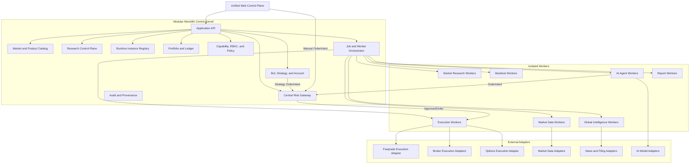
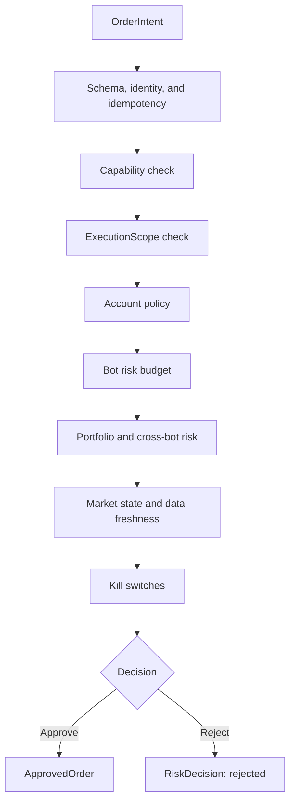
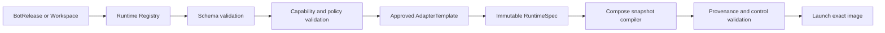

# Multi-Market Research and Trading Platform Architecture

**Date:** 2026-07-12

**Status:** Approved target design; Phase 2 detailed planning in progress

**Migration strategy:** Backward-compatible, staged migration

**Deployment strategy:** Modular monolith control kernel with isolated workers

**Execution strategy:** Layered execution; Freqtrade is one execution adapter

## 1. Background

The repository began as a Freqtrade-oriented cryptocurrency trading product. Its current P0 safety branch introduces strong runtime protections, including exact image provenance, committed configuration validation, immutable launch snapshots, isolated state roots, read-only inputs, secret isolation, SQLite backup and restore controls, emergency operations, bounded health readiness, and integrated Root Safety.

Those protections are valuable and must remain. The current formal runtime model, however, recognizes only three hard-coded services:

- `freqtrade`;
- `freqtrade-futures`;
- `freqtrade-research`.

The same three-instance assumption is repeated in Compose, runtime manifests, startup validation, state management, backup and restore, CI, tests, ports, and UI integration. This makes three P0 acceptance instances behave like the permanent product model.

The long-term product is broader:

- multiple markets and product types;
- multiple trading venues;
- multiple accounts, strategies, and bots;
- common global intelligence and market-specific research;
- historical research snapshots and replayable decisions;
- backtesting, simulation, paper trading, and live trading;
- AI analysis and AI-driven bots;
- centralized portfolio risk and order approval;
- Freqtrade-based cryptocurrency execution;
- later broker adapters for A-share, Hong Kong, and US markets;
- options research and backtesting before separate options execution.

The architecture must remove the three-service ceiling without discarding the P0 safety boundary.

## 2. Product goals

### 2.1 Primary goals

1. Make market, product, venue, account, strategy, bot, workspace, and runtime instance first-class domain objects instead of encoded service names.
2. Preserve the existing Spot, Futures, Research, and human market-watch behavior
   during migration, then remove the fixed 8081/8082/8083 service topology after
   equivalent `platform-control:8090` paths pass acceptance.
3. Let a user select a market at the top of the UI, then select a product, after which research and bot lists reflect that context.
4. Define Research as a workspace, not as a bot or a single fixed service.
5. Share non-market-specific global intelligence across research workspaces.
6. Load market- and product-specific collection and analysis capabilities through validated plugins.
7. Define a bot release from a strategy release, account binding, and environment.
8. Derive and freeze a bot's execution scope from strategy, account, adapter, and policy capabilities.
9. Permit broad, read-only research subscriptions without widening execution authority.
10. Require every live order to pass through the central risk gateway.
11. Keep exchange write credentials out of AI, research, backtest, and general control-plane workers.
12. Add new paper-trading runtime instances without editing a Python service allowlist or hand-writing arbitrary Compose services.
13. Retain exact provenance, immutable launch specifications, read-only inputs, isolated state, health gating, emergency controls, and auditable recovery.

### 2.2 Product success criteria

The architecture is successful when:

- a fourth cryptocurrency paper bot can be registered and launched without changing `FORMAL_SERVICES` or adding a bespoke Compose service;
- a new market can be added through catalog entries and adapters without modifying the bot core or risk decision flow;
- the UI and backend apply the same market/product scope rules;
- one research workspace can serve multiple bots;
- one bot can consume multiple authorized research workspaces;
- every bot decision records the research snapshot versions it consumed;
- every live order can be traced to strategy, account, bot release, research, risk decision, execution adapter, and final execution report;
- no AI agent can directly submit an exchange or broker write request;
- the original state roots remain untouched rollback evidence while 8081/8082/
  8083 cease to be permanent services or public endpoints;
- every supported K-line timeframe retains the current lower-cadence refresh
  policy and does not depend on a Bot runtime being active;
- human charts and governed AI/strategy consumers read the same canonical,
  freshness-labelled market snapshot for the same market-data key.

## 3. Non-goals

This design does not:

- convert the whole system to microservices immediately;
- introduce Kubernetes as a prerequisite;
- expose arbitrary Docker, Compose, image, volume, command, or host-path configuration to users;
- claim that A-share, Hong Kong, US, or options live execution already exists;
- add options to Freqtrade by merely adding an enum;
- implement multi-leg options execution in the early phases;
- migrate or delete existing SQLite files destructively;
- replace every existing FreqUI route in one release;
- permit live operation by changing a mutable `dry_run` boolean in place;
- allow a risk-gateway bypass for trusted bots;
- make AI-generated text a source of market fact.

## 4. Confirmed product decisions

1. The migration is backward-compatible.
2. The control plane is a modular monolith.
3. Long-running, high-load, failure-prone, or credential-bearing jobs run as isolated workers.
4. Digital-asset spot, margin, and supported futures/perpetual products may support paper and live execution through Freqtrade adapters.
5. A-share, Hong Kong, and US products first support data, research, backtest, and AI analysis.
6. Options first support market data, chain analysis, Greeks, research, and backtesting.
7. Broker and options live execution require later dedicated adapters and separate acceptance.
8. Multiple accounts, strategies, and bots are supported.
9. Every live order requires central risk approval.
10. Existing Spot and Futures become migrated Bot RuntimeInstances; existing
    Research becomes a migrated Workspace Worker RuntimeInstance. None is a
    permanent platform service category.
11. `platform-control` is the fixed loopback application API on
    `127.0.0.1:8090`; Bot and Worker instances have no public host ports.

## 5. Product hierarchy

The primary UI and domain hierarchy is:

```text
Market
  -> Product
     -> Research workspaces
     -> Bots
     -> Watch, backtest, reports, risk, and accounts
```

### 5.1 Markets

The initial market catalog contains:

- `digital_asset`;
- `a_share`;
- `hk_stock`;
- `us_stock`.

Hong Kong and US markets may be grouped visually under a global-equities heading, but remain separate domain markets because calendars, currencies, fees, regulations, filings, corporate actions, and venue capabilities differ.

### 5.2 Product types

Initial target products include:

| Market | Products |
|---|---|
| Digital asset | spot, margin, perpetual, delivery future, option |
| A-share | equity, ETF, index, convertible bond, option |
| Hong Kong | equity, ETF, index, warrant, CBBC, option |
| US | equity, ETF, index, option |

Product types are domain contracts, not navigation labels. A product type determines required identifiers, market data, trading rules, risk fields, and adapter capabilities.

## 6. Target architecture



### 6.1 Control-kernel responsibilities

The modular monolith owns strongly governed platform concepts:

- market and product catalog;
- account metadata and revisions;
- strategy and bot releases;
- runtime registry and immutable runtime specifications;
- research workspaces and subscriptions;
- capability and permission decisions;
- portfolio ledger and central risk;
- lifecycle orchestration;
- API, audit, and provenance.

Modules depend on domain interfaces and public DTOs. They must not query another module's private tables or import concrete external adapters.

### 6.2 Isolated-worker responsibilities

Workers contain long-running or isolated activity:

- market data collection;
- global news, macro, filing, and event collection;
- market-specific enrichment;
- research computation;
- report generation;
- backtests;
- AI agent loops;
- Freqtrade, broker, and options execution.

Workers may initially run under Docker Compose. The orchestrator compiles immutable runtime specifications into approved launch snapshots. A future scheduler can replace Compose without changing domain contracts.

## 7. Core domain model

### 7.1 MarketDefinition

```yaml
market_id: digital_asset
display_name: Digital Assets
status: active
default_currency: USD
timezone_policy: venue_defined
supported_products:
  - spot
  - margin
  - perpetual
  - delivery_future
  - option
```

### 7.2 ProductDefinition

```yaml
market_id: digital_asset
product_id: perpetual
display_name: Perpetual
domain_capabilities:
  leverage: true
  short: true
  expiry: false
  funding_rate: true
  option_greeks: false
```

### 7.3 VenueDefinition

```yaml
venue_id: okx
market_id: digital_asset
adapter_family: ccxt
status: active
supported_products:
  - spot
  - margin
  - perpetual
  - delivery_future
  - option
```

### 7.4 InstrumentDefinition

```yaml
instrument_id: digital_asset.okx.perpetual.BTC-USDT-SWAP
market_id: digital_asset
product_id: perpetual
venue_id: okx
symbol: BTC/USDT:USDT
base_currency: BTC
quote_currency: USDT
settlement_currency: USDT
contract_multiplier: 0.01
status: active
```

Options extend the instrument contract with underlying, expiry, strike, right, exercise style, settlement, and multiplier. Equities extend it with lot size, currency, listing venue, and corporate-action identity.

### 7.5 MarketScope

A market scope contains:

- market;
- one or more products;
- optional venues;
- an instrument selector.

The platform distinguishes:

- `ExecutionScope`: strict write authority;
- `ResearchScope`: read-only information authority.

Research may cross markets and products. Execution may not exceed the immutable derived execution scope.

## 8. Strategy, account, and bot model

### 8.1 StrategyDefinition and StrategyRelease

A strategy definition is the logical product identity. A strategy release is immutable and contains:

- source commit;
- artifact digest;
- parameter digest;
- model and prompt versions where applicable;
- supported execution scopes;
- required research scopes and features;
- compatible execution-adapter family.

### 8.2 Account and AccountRevision

An account is the logical venue or broker account. An account revision contains:

- venue;
- supported products;
- read and write permissions;
- environment restrictions;
- secret reference;
- adapter compatibility.

The database stores secret references, not secret values. Trade credentials must not have withdrawal or unrelated administrative permission.

### 8.3 BotDefinition and BotRelease

A bot definition is its product identity and display metadata. A bot release binds:

- one immutable strategy release;
- one or more named account revisions;
- one environment: backtest, simulation, paper, or live;
- one risk profile;
- one immutable derived execution scope;
- zero or more research workspace subscriptions;
- one capability snapshot.

The initial UI supports one `primary` account binding. The target schema permits named bindings for future multi-account hedging and arbitrage without requiring the first implementation to execute them.

Changing strategy, account, parameters, model, risk profile, or paper/live environment creates a new bot release. A running release is never mutated in place.

### 8.4 Scope derivation

The execution scope is:

```text
Strategy capability
intersection Account capability
intersection Adapter capability
intersection Product policy
intersection Platform policy
```

The result and all input revision IDs are frozen in the bot release for audit and historical stability.

## 9. Research architecture

### 9.1 Common research kernel

The common kernel provides market-independent intelligence:

- geopolitical and political events;
- central-bank policy;
- interest rates, inflation, and macro releases;
- global liquidity;
- major world events;
- energy, supply-chain, disaster, and technology events;
- source registry and licensing metadata;
- raw ingestion;
- normalization;
- deduplication and canonical event resolution;
- entity and sector mapping;
- confidence and source provenance;
- AI enrichment;
- report generation.

AI enrichment is stored separately from raw and canonical facts. It cannot overwrite factual source records.

### 9.2 Market-specific research plugins

Plugins declare:

- supported markets and products;
- required data sources;
- features they emit;
- freshness contracts;
- failure modes;
- licensing requirements.

Examples include A-share calendars and capital flows, crypto funding and liquidation, Hong Kong southbound flow, US SEC filings, earnings, and options flow.

### 9.3 ResearchWorkspace

A workspace has:

- one primary market/product scope;
- optional read-only reference scopes;
- enabled research capabilities;
- data-source bindings;
- report policy;
- retention and freshness policy.

### 9.4 ResearchSnapshot

Research output is immutable and versioned. A snapshot records:

- workspace;
- `as_of` time;
- source watermarks;
- data freshness and degradation;
- feature and report artifact locations;
- calculation, model, prompt, and methodology versions;
- provenance digest.

Bot decisions record the exact research snapshots they consumed. Historical backtests use historical availability timestamps and may not read future observations.

### 9.5 Workspace-to-bot relationship

The relationship is many-to-many:

- one workspace serves multiple bots;
- one bot subscribes to multiple workspaces;
- research subscriptions do not widen execution scope.

## 10. Capability and permission model

Capabilities include:

- market data;
- research;
- backtest;
- simulation;
- paper trading;
- live trading;
- short;
- leverage;
- options chain;
- options backtest;
- options execution;
- manual order;
- AI order intent.

The effective capability is the intersection of:

- market policy;
- product policy;
- venue capability;
- adapter capability;
- account capability;
- strategy capability;
- user permission;
- environment.

Every unavailable capability carries a stable reason code. The UI displays that reason instead of silently hiding an entire product.

UI filtering is not authorization. API endpoints independently enforce market, product, account, bot, and action permissions.

## 11. Central risk gateway

### 11.1 Order flow



### 11.2 Required controls

The gateway evaluates:

- bot and release state;
- account binding;
- instrument scope;
- environment;
- user and service permission;
- adapter capability;
- maximum order and position risk;
- leverage;
- daily and consecutive loss;
- account- and portfolio-level exposure;
- aggregate exposure across bots;
- market open state;
- data and research freshness;
- kill switches.

### 11.3 Failure policy

- Live risk unavailability fails closed.
- Paper defaults to rejection when risk is unavailable.
- Backtest uses versioned historical risk policies.
- No trusted bot bypass exists.

### 11.4 Freqtrade integration

During migration, the platform introduces a reviewed pre-order risk hook immediately before the exchange order-creation boundary:

```text
Freqtrade strategy
  -> pending order
  -> platform risk hook
  -> OrderIntent
  -> central risk gateway
  -> ApprovedOrder
  -> exchange create_order
```

UI-only or startup-only risk checks are insufficient because an autonomous strategy may originate orders internally.

## 12. Execution adapters

### 12.1 FreqtradeExecutionAdapter

Freqtrade remains responsible for supported digital-asset spot, margin, futures/perpetual execution, strategy loops, order lifecycle, venue connection, position synchronization, and per-instance local state.

Freqtrade does not own the platform catalog, research model, cross-bot portfolio, centralized risk policy, or non-crypto markets.

### 12.2 BrokerExecutionAdapter

Broker adapters later implement A-share, Hong Kong, and US execution. Their interfaces are designed early, but live capability remains unavailable until a concrete adapter passes separate safety and acceptance gates.

### 12.3 OptionsExecutionAdapter

Options execution is a separate adapter family. It requires option contracts, chains, Greeks, multi-leg orders, exercise, assignment, settlement, and margin scenarios. Options research and backtesting do not imply options live execution.

## 13. Runtime registry and orchestration

### 13.1 RuntimeInstance

A runtime instance is an execution of a bot release or workspace worker release. It contains:

- stable instance ID;
- instance kind;
- immutable owner revision;
- approved adapter template;
- environment;
- state-root allocation;
- secret references;
- health profile;
- resource profile;
- immutable runtime-spec revision.

Initial instance kinds are:

- market-data worker;
- event collector;
- research worker;
- backtest worker;
- AI agent worker;
- execution worker;
- report worker;
- web worker.

### 13.2 AdapterTemplate

Trusted templates define:

- approved image policy;
- allowed instance kinds;
- allowed commands;
- allowed mount classes;
- privilege and network policy;
- health contract;
- resource limits.

Users cannot provide arbitrary images, commands, entrypoints, host paths, volumes, privileges, Compose files, or project names.

### 13.3 Runtime compilation



The current P0 protections remain binding:

- committed configuration;
- exact provenance labels and image ID;
- validated immutable launch snapshot;
- TOCTOU checks;
- read-only config, strategies, research inputs, and secrets;
- isolated writable state;
- bounded readiness;
- fail-closed launch;
- emergency stop and inspection independent of normal launch validation.

### 13.4 Network and ports

Runtime instances use isolated internal addresses and do not each require a
public host port. The fixed loopback application ingress is
`platform-control` on `127.0.0.1:8090`.

Ports 8081, 8082, and 8083 may exist only during the bounded compatibility and
rollback window. Final Phase 2 cutover removes all three listeners after 8090
control, chart, and research compatibility acceptance.

## 14. Data architecture

### 14.1 PostgreSQL control plane

PostgreSQL is the source of truth for:

- catalogs;
- workspaces and subscriptions;
- strategy, account, and bot revisions;
- runtime registry;
- capability and permission policies;
- jobs;
- order intents and risk decisions;
- platform ledger;
- audit and transactional outbox.

### 14.2 Per-instance SQLite

Freqtrade execution workers retain an isolated SQLite database:

```text
runtime/instances/<instance_id>/trades.sqlite
```

Multiple bots do not share a Freqtrade SQLite database. Existing P0 backup and restore protections are generalized by instance identity.

### 14.3 Research and market data

The initial research store uses Parquet plus DuckDB-compatible layouts for OHLCV, normalized events, features, reports, and backtest inputs. Object storage or an approved local artifact root owns immutable artifacts.

ClickHouse, TimescaleDB, Redis, and distributed queues are deferred until measured scale requires them.

Human market-watch reads use a canonical candle contract exposed by
`platform-control`. The Phase 2 compatibility implementation may use a bounded
in-process TTL cache and request coalescing over approved public-data adapters;
it does not store high-frequency candles in control-plane PostgreSQL. Later
market-data workers and hot storage can replace that implementation without
changing the UI contract.

The current multi-timeframe cadence is preserved as a versioned backend policy:

| Timeframe | Refresh interval |
|---|---:|
| `1m` | 10 seconds |
| `3m` | 30 seconds |
| `5m`, `15m`, `30m` | 60 seconds |
| `1h` / alias `60m` | 180 seconds |
| `2h`, `4h` | 300 seconds |
| `6h`, `8h`, `12h` | 600 seconds |
| `1d`, `3d`, `1w`, `2w`, `1M`, `1y` | 900 seconds |

The chart, Research, strategy, and AI layers consume one canonical market-data
read contract. Market observation may run at the refresh cadence, while costly
AI inference follows a separately governed schedule or material-change trigger.
This prevents the requirement for fresh data from turning into an uncontrolled
LLM invocation loop.

### 14.4 Time semantics

Records distinguish:

- event time;
- source observation time;
- ingestion time;
- availability time.

Backtests use availability time to prevent future-data leakage.

## 15. UI architecture

### 15.1 Global context

The top-level context selects a market, then a product. All market-scoped pages consume the same context:

- dashboard;
- watch;
- research;
- backtest;
- bots;
- reports;
- AI analysis;
- accounts;
- risk.

Recommended routes include:

```text
/markets/digital-asset/perpetual/overview
/markets/digital-asset/perpetual/research
/markets/digital-asset/perpetual/bots
/markets/a-share/equity/research
/markets/us-stock/option/backtests
```

### 15.2 Bot visibility

A market-scoped bot page only lists matching execution scopes. It supports venue, account, strategy, environment, state, and risk filters.

The UI continuously displays the active market and product so bots do not appear to have been deleted after a context switch.

### 15.3 Global operations center

Authorized operators have a separate all-market view for:

- all bots and workers;
- live accounts and positions;
- incidents;
- global risk;
- global kill switches;
- resource and health state.

Normal market isolation must not create an operational blind spot.

### 15.4 Compatibility

Existing v1 APIs and routes continue during migration. API v2 introduces catalogs, contexts, workspaces, bot releases, registry, and capabilities.

The 8090 compatibility surface must preserve current human-watch behavior before
the old endpoints are stopped. Base K-lines are platform market data and remain
available when a Bot is stopped; strategy overlays are Bot-specific and may
degrade independently.

Live views distinguish forming from closed candles and provisional from confirmed
signals. Historical decision replay uses recorded Bot/strategy/data/Research/risk
snapshot identities; a present-day recomputation over revised data is labelled
analysis rather than replay.

Chart refresh is read-only observation. It never evaluates a trading strategy,
creates an OrderIntent, wakes a Bot decision loop, changes a position, or submits
an order. Strategy evaluation cadence and forming-candle policy belong to the
immutable StrategyRelease/Bot policy.

## 16. Security, reliability, and failure handling

### 16.1 Credential separation

- Research, backtest, report, and AI workers have no exchange write credentials.
- The risk gateway approves but does not hold exchange secrets.
- An execution worker receives only its account's minimum required credential reference.
- Withdrawal, transfer, and account-administration permission is forbidden unless a separate future design explicitly authorizes it.

### 16.2 Live promotion

Paper-to-live is a new bot release, not an in-place boolean change. It requires strategy, account, risk, capability, provenance, approval, and live-acceptance evidence.

### 16.3 Idempotency and reconciliation

All write commands carry a command ID, idempotency key, and expected revision. An ambiguous execution result triggers reconciliation before retry. Blind exchange-order retry is forbidden.

### 16.4 Degraded research

Source failures degrade only dependent capabilities. Workspaces publish freshness and degradation. Strategies and risk policies decide whether missing or stale research blocks new order intents.

### 16.5 AI failure

AI failure never creates fabricated facts. Deterministic features and the latest permitted snapshot may be used only when policy explicitly allows them. Model, prompt, input, and output versions remain auditable.

### 16.6 Registry failure

Existing workers may continue their immutable revision. New lifecycle changes fail closed. Emergency stop, status, and bounded inspection remain available.

## 17. Compatibility migration

The three existing processes map to:

```text
freqtrade
  -> migrated digital-asset spot bot runtime instance

freqtrade-futures
  -> migrated OKX digital-asset perpetual bot runtime instance

freqtrade-research
  -> migrated A-share equity workspace worker runtime instance
```

Migration states are:

- `discovered`;
- `imported_stopped`;
- `state_copied`;
- `managed`;
- `accepted`;
- `rollback_retained`.

The transition is:

```text
Existing Compose process
  -> stopped registry import
  -> verified backup and copied state
  -> managed lifecycle
  -> 8090 behavior comparison
  -> remove 8081/8082/8083 listeners
  -> retain inactive source as rollback evidence
```

Existing SQLite files and research state are never shared writable or moved in
place. The source remains untouched, the managed instance uses a new allocation,
and rollback first proves the managed writer is absent. No destructive migration
or silent state-root relocation is permitted.

## 18. Phased delivery plan

### Phase 0: Freeze and document the safety baseline

Deliver:

- this architecture specification;
- domain glossary;
- current behavior and compatibility matrix;
- explicit classification of Spot/Futures as Bot-like migration instances and
  Research as a Workspace Worker migration instance.

No runtime behavior changes.

### Phase 1: Market, product, venue, instrument, and capability catalog

Deliver:

- catalog schemas and PostgreSQL foundation;
- catalog API v2;
- market and product scopes;
- capability contracts;
- mappings for current digital-asset and A-share behavior.

Gate:

- the three services behave unchanged;
- planned markets cannot claim unavailable capability;
- current compatibility tests remain green.

Estimated effort: 4-7 person-weeks.

### Phase 2: Runtime Registry v2

Deliver:

- runtime-instance and adapter-template schemas;
- fixed `platform-control:8090` read API;
- existing-runtime migration records;
- immutable runtime-spec compiler;
- dynamic state and secret references;
- internal addressing;
- canonical Bot-independent candle reads preserving the complete current multi-
  timeframe refresh policy, shared by UI and governed machine consumers;
- forming/closed candle and provisional/confirmed signal semantics;
- generalized health, emergency, backup, restore, and controlled cutover contracts.

Gate:

- a fourth paper bot launches without a Python service allowlist change or a hand-written arbitrary Compose service;
- all current P0 provenance and launch controls remain;
- Spot/Futures run as managed Bot-like instances and Research as a managed
  Workspace Worker instance;
- no active listener remains on 8081, 8082, or 8083 after acceptance;
- base K-lines remain available when a Bot is stopped and every supported
  timeframe preserves its current cadence;
- AI and strategy readers receive the same canonical freshness metadata without
  obtaining trading credentials;
- invalid runtime input fails before Docker.

Estimated effort: 8-14 person-weeks.

### Phase 3: Strategy, account, and bot releases

Deliver:

- strategy definitions and releases;
- account revisions;
- bot definitions and releases;
- scope derivation and immutable capability snapshots;
- research-subscription schema;
- migration config importer.

Gate:

- existing spot and futures migration owners rebind to ordinary BotReleases;
- invalid strategy/account combinations cannot be created;
- environment changes create a new release.

Estimated effort: 6-10 person-weeks.

### Phase 4: UI MarketContext and global operations center

Deliver:

- top-level market and product switching;
- API v2 market-scoped pages;
- backend scope enforcement;
- capability reasons;
- global operations center;
- 8090 route compatibility.

Gate:

- research and bot pages switch together;
- URL manipulation cannot bypass scope or authorization;
- operators retain all-market incident visibility.

Estimated effort: 6-10 person-weeks.

### Phase 5: Research workspace and common intelligence kernel

Deliver:

- source registry;
- raw and canonical event models;
- common ingestion, normalization, deduplication, and enrichment;
- research workspaces, plugins, snapshots, reports, and subscriptions;
- migration of existing A-share research.

Gate:

- one global event is normalized once and reused;
- multiple bots consume the same snapshot;
- bot decisions cite snapshot IDs;
- historical replay has no availability-time leakage.

Estimated effort: 10-18 person-weeks.

### Phase 6: Multi-venue digital-asset paper bots

Deliver:

- account capability registration for approved venues;
- multiple isolated Freqtrade runtime instances;
- spot and perpetual paper capability;
- per-bot state, logs, health, research subscriptions, and paper ledger.

Gate:

- multiple venues, strategies, and paper bots run concurrently;
- no new bespoke service definitions are required;
- no paper bot can write to a live venue account.

Estimated effort: 8-14 person-weeks.

### Phase 7: Central risk gateway and digital-asset live lane

Deliver:

- order-intent, risk-decision, approved-order, ledger, budgets, kill switches, reconciliation, Freqtrade risk hook, and live-promotion workflow.

Rollout:

```text
one small OKX live account
  -> multiple OKX bots
  -> approved additional digital-asset venues
```

Gate:

- bypassing the risk gateway cannot submit an order;
- risk unavailability fails closed;
- duplicate intents do not duplicate orders;
- ambiguous outcomes reconcile before retry;
- every live order has a complete audit chain.

Estimated effort: 12-20 person-weeks.

### Phase 8: Hong Kong and US research

Deliver per market:

- instrument parsing;
- calendars and rules;
- market and filing adapters;
- corporate and sector events;
- workspaces;
- backtesting;
- AI analysis;
- UI capability.

Live execution remains unavailable.

Estimated effort: 8-14 person-weeks per market.

### Phase 9: Options research and backtesting

Deliver:

- option contract and chain;
- Greeks and implied-volatility structures;
- options adapters;
- research, reports, backtesting, and UI;
- explicit unavailable execution capability.

Estimated effort: 12-20 person-weeks.

### Phase 10: Broker and options live execution

This is separately designed and authorized. It requires broker-specific execution, portfolio margin, multi-leg orders, exercise, assignment, settlement, reconciliation, risk, and live acceptance.

## 19. Common delivery gates

Every phase must:

1. preserve accepted product behavior through an explicit compatibility and
   rollback gate;
2. add schema and contract tests;
3. provide adapter compliance tests where applicable;
4. enforce capabilities on the backend and UI;
5. keep live paths disabled by default;
6. provide a rollback or shadow fallback;
7. avoid destructive recovery and silent state migration;
8. support clean remote recursive checkout;
9. pass Root Safety for the exact SHA;
10. pass independent architecture and code review;
11. retain exact runtime provenance;
12. preserve emergency stop and inspection;
13. audit all live write paths;
14. record data source, freshness, and model provenance.

## 20. Current PR policy

The current P0 branch remains a valuable safety baseline, but its three formal services are not the final product model.

The root PR remains Draft while the team decides how Phase 1 and Phase 2 are incorporated. It must not be presented as a complete multi-market architecture.

Recommended path:

1. retain the current P0 commits;
2. implement Phase 1 and Phase 2 compatibly on this line or a reviewed child line;
3. prove the three existing processes are migrated into correctly typed managed
   RuntimeInstances and the old public listeners are absent;
4. prove a fourth paper instance does not require a hard-coded service change;
5. prove the complete multi-timeframe chart cadence through 8090 with related Bots
   stopped, including 1m/10-second behavior;
6. rerun exact-SHA CI, remote checkout, online paper acceptance, and whole-branch review;
7. then reassess readiness for main.

No merge or PR-state change is implied by approval of this design.

## 21. Architecture invariants

1. Markets and products are domain objects, not service names.
2. Research is a workspace, not a bot.
3. A bot release binds strategy release, account binding, and environment.
4. Execution scope is derived, immutable, and strictly enforced.
5. Research scope may be broader and read-only.
6. Common events are collected and normalized once.
7. Market-specific capabilities are registered plugins.
8. Workspaces and bots have a many-to-many subscription relationship.
9. Freqtrade is a digital-asset execution adapter.
10. AI agents do not hold exchange write credentials.
11. Every live order requires central risk approval.
12. Runtime instances come from validated registry objects and trusted templates.
13. Existing services migrate through stopped import, copied state, managed
    acceptance, and rollback retention; no permanent Legacy Facade remains.
14. UI filtering and backend authorization remain consistent.
15. PostgreSQL owns platform control data; Freqtrade SQLite remains per instance.
16. Options research and options live execution are separate programs.
17. The modular monolith is split only when measured operational needs justify service extraction.
18. Market-data observation cadence, strategy evaluation cadence, and AI model-
    inference cadence are separate governed policies.
19. Historical replay uses recorded decision evidence; current-data recomputation
    is never presented as the original decision.
20. Chart and market-data refresh are read-only observations and never trigger
    strategy evaluation or execution.
