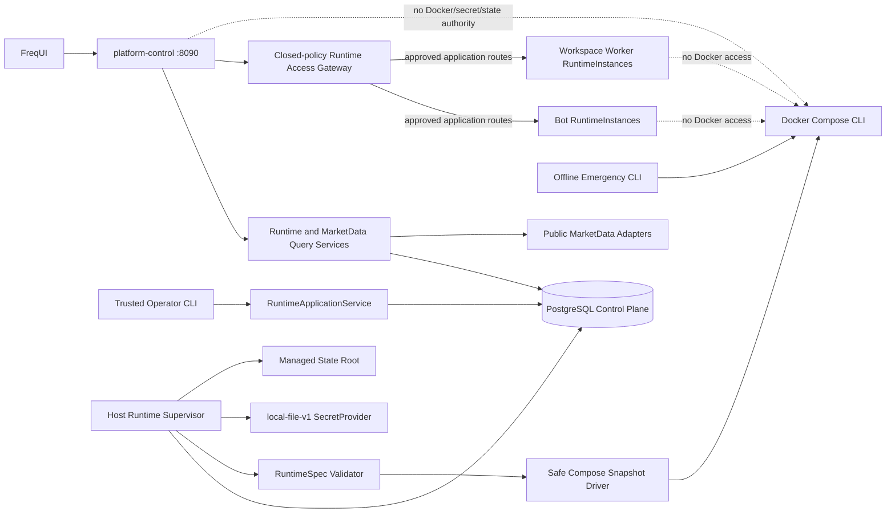

# Runtime Registry v2 and Platform Control Cutover Design

**Status:** Approved design; pending written-spec review and implementation plans

**Date:** 2026-07-12

**Parent architecture:** `docs/superpowers/specs/2026-07-12-multi-market-research-trading-platform-design.md`

**Foundation:** Phase 1 Market Catalog at root `ccd41474fc9f8bf4ca26809b92b3086fe505fcee` and backend `1eafd17500fe1e59a7bd7e10521583d43bb35fea`

## 1. Decision summary

Phase 2 replaces the fixed-three-service runtime ceiling with a governed Runtime
Registry and safe dynamic-instance compiler while preserving every existing P0
launch and recovery control.

The approved decisions are:

1. A runtime has a typed `RuntimeOwnerRef`. Phase 2 owner kinds are
   `migration_bot`, `paper_probe`, and `workspace_worker`; Phase 3 adds
   `bot_release` without changing the Registry core.
2. The current verified Docker Compose launch chain is extracted and reused. No
   parallel Docker SDK control path is introduced.
3. Lifecycle writes are available only through a trusted local Operator CLI.
   API v2 is authenticated and read-only until role-based authorization exists.
4. A stable `RuntimeInstance` owns state. Every launch or restart creates an
   append-only `RuntimeAttempt`.
5. PostgreSQL is the only production control-plane database. SQLite remains a
   unit-test database and a per-Freqtrade-instance trade database.
6. A host-local Runtime Supervisor is the only dynamic Docker lifecycle actor.
   Web, Research, AI, and Bot processes do not receive Docker access.
7. Adapter templates are published only from committed Git blobs into immutable
   database revisions. Database rows cannot author arbitrary container powers.
8. A RuntimeSpec references stable secret identities. Each RuntimeAttempt records
   the exact resolved secret version; secret values never enter PostgreSQL, API,
   audit, logs, or ordinary environment variables.
9. State paths are allocated by the platform under a fixed root. Users cannot
   submit paths, volumes, or allocation reuse requests.
10. Every managed instance receives an isolated Compose project and network and
    has no host port after cutover.
11. The fourth dynamic acceptance instance is a Bitget Spot paper probe using the
    committed Spot configuration, `SampleStrategy`, and enforced `dry_run=true`.
12. Dynamic containers use `restart: "no"`. Failures latch and require explicit
    operator retry after reconciliation.
13. `platform-control` is the fixed loopback API service on
    `127.0.0.1:8090`. It has PostgreSQL query access but no Docker, secret-root,
    or Bot-state authority.
14. Existing Spot 8081 and Futures 8082 are migrated into Supervisor-managed
    Bot-like RuntimeInstances. Existing Research 8083 is migrated into a
    Supervisor-managed Workspace Worker RuntimeInstance. They are not permanent
    platform services or permanent Legacy Facades.
15. The UI reads control data and base market data through `platform-control`.
    Every supported chart timeframe retains the current lower-cadence refresh
    policy, including 1m/10 seconds, and remains usable when a Bot
    RuntimeInstance is stopped. The same canonical read layer supports governed
    high-frequency AI and strategy observation.
16. Phase 2 is delivered as five gated sub-phases: 2A Registry and Platform
    Control, 2B Compiler, 2C Supervisor, 2D Market-Data Compatibility, and 2E
    Controlled Cutover and Operations.
17. `platform-control` contains a closed-policy Runtime Access Gateway. It routes
    only approved application API calls to exact healthy Registry endpoints so
    Bot and Research functionality survives removal of 8081/8082/8083. It is not
    an arbitrary reverse proxy and receives no Docker, secret-root, or state
    authority.

## 2. Product-domain invariant carried into later phases

Phase 2 does not implement the final Bot product model, but it must not create a
runtime model that contradicts it.

An ordinary Phase 3 `BotRelease` is constrained to:

```text
one Market
+ one Product
+ one primary AccountRevision
+ one Environment
```

Venue is derived from the AccountRevision. The execution scope is derived from:

```text
Strategy capability
intersection Account capability
intersection Adapter capability
intersection Product policy
intersection Platform policy
```

An ordinary BotRelease cannot simultaneously execute Spot and Perpetual, Equity
and Option, or two markets. Cross-market and cross-product execution belongs to a
later `CompositeBot` with independently governed execution legs.

Research remains broader:

- a Research Workspace binds a `ResearchScope`;
- a BotRelease may subscribe to multiple compatible Workspace revisions;
- one Workspace may serve multiple Bot releases;
- ResearchScope may include global or cross-product evidence;
- Research subscription is versioned configuration, not Bot ownership;
- no Research relationship expands the Bot's write-capable ExecutionScope.

The Phase 2 `paper_probe` owner is an operator-only acceptance identity. It is not
returned as a product Bot, cannot become a permanent Bot-creation bypass, and is
retired or imported into the Phase 3 BotRelease model.

## 3. Scope

### 3.1 In scope

- PostgreSQL control-plane service and Alembic migrations;
- runtime-owner, instance, attempt, job, template, spec, allocation, secret-
  reference, alias, observation, endpoint, and audit contracts;
- fixed `platform-control` service on `127.0.0.1:8090`;
- authenticated read-only Runtime Registry and Market Data API v2;
- a Registry-bound Runtime Access Gateway for approved Bot and Research
  application routes, including explicitly governed compatibility writes;
- trusted local Operator CLI;
- committed AdapterTemplate publication;
- deterministic immutable RuntimeSpec compilation;
- managed state allocation;
- `local-file-v1` SecretProvider;
- host Runtime Supervisor and job reconciliation;
- safe Compose snapshot driver derived from the existing P0 launch kernel;
- one isolated dynamic Bitget Spot paper probe;
- migration definitions for existing Spot, Futures, and Research runtimes;
- a Bot-independent base-candle query path preserving the complete current
  multi-timeframe refresh matrix;
- versioned refresh-policy, forming/closed candle, strategy-overlay alignment,
  replay-provenance, and internal AI read contracts;
- controlled state copy, runtime cutover, rollback proof, and removal of active
  8081/8082/8083 listeners;
- generalized health, emergency inspection/stop, backup, verify, and restore
  contracts;
- Root Safety, migration, PostgreSQL, compiler, driver, and compatibility gates.

### 3.2 Out of scope

- StrategyDefinition, StrategyRelease, AccountRevision, BotDefinition, and
  BotRelease production models;
- CompositeBot and cross-product execution;
- Research Workspace and common intelligence implementation;
- AI model/agent execution and inference scheduling implementation;
- immutable Bot decision snapshot production before the BotRelease phase;
- final UI MarketContext navigation and dynamic runtime write UI;
- RBAC and externally callable lifecycle mutation API;
- central risk gateway and new live lane;
- broker, equities, and options execution;
- arbitrary user-defined images, commands, mounts, networks, ports, paths,
  Compose fragments, or Docker project names;
- unattended or destructive runtime cutover;
- automatic state deletion, reuse, overwrite restore, or destructive recovery;
- arbitrary URL, IP, port, Docker-name, or unrestricted dynamic-runtime proxying;
- automatic trading-runtime restart or retry loops;
- Vault, cloud secret manager, HSM, or encrypted secret storage in PostgreSQL.

## 4. System context and trust boundaries



Trust rules:

- only the host Runtime Supervisor and trusted offline emergency tools invoke
  Docker lifecycle commands;
- `platform-control` has database SELECT access appropriate to its query/gateway
  services and INSERT/UPDATE access only to gateway-owned request/audit records.
  It has no Registry lifecycle-table mutation, Docker socket, Docker CLI
  authority, secret-root read authority, or Bot-state mount;
- the Runtime Access Gateway resolves targets only from Registry endpoints,
  connects only through the exact per-instance access network, and never accepts
  a caller-supplied upstream URL, IP, port, container, project, or service name;
- Bot, Research, AI, and data workers have neither Docker nor PostgreSQL control-
  plane credentials;
- PostgreSQL is internal-only and has no public host port;
- the Operator CLI runs locally under an approved operator account;
- a database compromise cannot manufacture new AdapterTemplate powers because
  template publication is rooted in committed Git blobs and closed policy IDs;
- an AdapterTemplate revision alone cannot launch: compilation, capability,
  allocation, secret, provenance, and current policy checks must all pass.

## 5. Runtime ownership

### 5.1 RuntimeOwnerRef

```text
RuntimeOwnerRef
- owner_kind
- owner_id
- owner_revision
```

Phase 2 kinds:

| Kind | Purpose | User-facing Bot | Lifecycle mode |
|---|---|---:|---|
| `migration_bot` | Existing Spot/Futures compatibility owner | Transitional | `supervisor` |
| `paper_probe` | Phase 2 dynamic acceptance | No | `supervisor` |
| `workspace_worker` | Runtime foundation for later Research workers | No | `supervisor` when enabled |

Phase 3 adds `bot_release` and imports or retires the paper probe. An owner kind is
a closed enum. Unknown kinds fail before RuntimeSpec compilation.

### 5.2 Ownership invariants

- an owner revision may own multiple historical instances but only the instances
  explicitly created for it;
- a RuntimeInstance has exactly one owner reference;
- owner reference fields are immutable after instance creation;
- owner deletion does not cascade-delete runtime history or state;
- owner retirement prevents new instances but does not erase attempts;
- paper probes cannot select live environment, live capability, or a live account;
- migration owners are closed to the reviewed existing Spot/Futures definitions,
  cannot select new live capabilities, and must be rebound to or retired by the
  Phase 3 BotRelease migration.

## 6. PostgreSQL control plane

### 6.1 Production database policy

PostgreSQL is the sole production source of truth for the Runtime Registry. It is
an internal service with:

- no public host-port mapping;
- credentials supplied by fixed platform configuration and Docker Secret;
- a dedicated database role with no superuser privilege;
- bounded connection settings;
- health checks used by control-plane readiness;
- backup and restore runbooks separate from per-instance SQLite bundles.

SQLite may be used for fast repository unit tests. PostgreSQL integration tests
are mandatory for migrations, JSON behavior, indexes, uniqueness, row locking,
lease claim, and transaction semantics.

### 6.2 Migration policy

- Alembic is the only production schema creation and upgrade mechanism;
- production startup never calls `metadata.create_all()`;
- Phase 1 `PlatformBase` models join one Alembic metadata boundary;
- every migration has a deterministic upgrade path and a reviewed downgrade or
  an explicit irreversible boundary with backup/restore procedure;
- migration commands fail closed on unexpected schema revision;
- migration output does not print database credentials;
- Root Safety upgrades an empty PostgreSQL database to head and validates schema;
- at least one non-empty upgrade fixture is maintained once a production
  revision has shipped.

### 6.3 Core tables

The initial schema contains:

```text
platform_catalog_revisions
adapter_template_revisions
runtime_spec_revisions
runtime_instances
runtime_attempts
runtime_lifecycle_jobs
state_allocations
secret_references
secret_version_metadata
runtime_endpoints
runtime_migration_records
runtime_access_requests
runtime_audit_events
```

Foreign keys use explicit restrict semantics for immutable audit history. No
runtime, attempt, allocation, template revision, or audit record is cascade-
deleted by a product-owner deletion.

`runtime_access_requests` is owned by the Gateway and records request identity,
instance/attempt, closed route-policy revision, method, idempotency key, timing,
and stable result code without bodies, credentials, tokens, or secret headers.
The platform-control database role may insert a request and update only its
terminal result fields and may insert audit events. It cannot change desired
state, jobs, attempts, specs, templates, allocations, endpoints, or migrations.

## 7. RuntimeInstance and RuntimeAttempt

### 7.1 RuntimeInstance

```text
RuntimeInstance
- instance_id
- instance_kind
- owner_kind
- owner_id
- owner_revision
- management_mode
- runtime_spec_revision_id
- environment
- state_allocation_id
- desired_state
- lifecycle_status
- failure_latched
- optimistic_version
- created_at
- retired_at
```

`management_mode` is `supervisor` in the final Phase 2 state. A pre-cutover
Compose process is migration input, not a Registry lifecycle mode.

`desired_state` is one of:

- `stopped`;
- `running`;
- `retired`.

`lifecycle_status` is an observed state and does not replace desired state:

- `registered`;
- `provisioning`;
- `stopped`;
- `starting`;
- `healthy`;
- `stopping`;
- `failed`;
- `retired`.

Invariants:

- RuntimeSpec, owner, environment, template revision, and state allocation are
  immutable for an instance;
- a material change creates a new RuntimeInstance;
- an instance has at most one active lifecycle job and one active attempt;
- retired instances cannot start, retry, or receive a new active allocation;
- instances are retired, not hard-deleted;
- optimistic version prevents stale operator commands from overwriting newer
  desired state.

### 7.2 RuntimeAttempt

Every actual launch creates an append-only attempt:

```text
RuntimeAttempt
- attempt_id
- instance_id
- attempt_number
- runtime_spec_revision_id
- adapter_template_revision_id
- resolved_secret_versions
- image_id
- root_commit
- backend_commit
- frontend_commit
- strategies_commit
- project_identity
- container_identity
- status
- health_result
- started_at
- stopped_at
- exit_code
- failure_code
```

Attempt status is one of:

- `pending`;
- `validating`;
- `launching`;
- `healthy`;
- `stopping`;
- `stopped`;
- `failed`.

Attempt numbers are unique per instance and monotonically increasing. Attempt
records cannot be updated to another RuntimeSpec, image, or secret version.

The Phase 2A read model is deliberately smaller than the immutable attempt
record. `RuntimeAttemptView` contains exactly `attempt_id`, `instance_id`,
`attempt_number`, `runtime_spec_revision_id`, `adapter_template_revision_id`,
`status`, nullable `health_result`, nullable `started_at`, nullable
`stopped_at`, nullable `exit_code`, and nullable `failure_code`. Exact image,
component, secret-version, project, and container provenance remains persisted
on the attempt record and is exposed only through later purpose-specific,
non-secret contracts. The summary view never carries secret values, secret
paths, host paths, or an arbitrary JSON payload.

The Phase 2A `RuntimeInstanceView` contains exactly `instance_id`,
`instance_kind`, typed `owner_ref`, `management_mode`,
`runtime_spec_revision_id`, closed `environment` (`paper` or `live`),
`state_allocation_id`, `desired_state`, `lifecycle_status`, `failure_latched`,
non-negative `optimistic_version`, `created_at`, and nullable `retired_at`.

### 7.3 Restart semantics

- a controlled restart stops the active attempt and creates the next attempt;
- restart keeps instance identity and state allocation;
- Docker-level restart is disabled for dynamic instances;
- a failed dynamic attempt sets `failure_latched=true`;
- desired running plus a failure latch does not create another attempt;
- only explicit operator retry with expected optimistic version clears the latch;
- a missing or ambiguous container is reconciled before any retry.

## 8. Lifecycle jobs and Supervisor

### 8.1 RuntimeLifecycleJob

```text
RuntimeLifecycleJob
- job_id
- instance_id
- requested_action
- idempotency_key
- expected_instance_version
- status
- lease_owner
- lease_expires_at
- requested_at
- started_at
- completed_at
- failure_code
```

Job status is closed to:

- `pending`;
- `claimed`;
- `running`;
- `succeeded`;
- `failed`;
- `needs_reconciliation`.

`pending`, `claimed`, and `running` are active states. `succeeded` and `failed`
are definitive terminal states. `needs_reconciliation` is a blocked terminal
claim outcome: it does not authorize a retry or another attempt, and the
application service must reject a new lifecycle command until explicit
reconciliation has established the external state.

The Phase 2A `RuntimeJobView` contains exactly `job_id`, `instance_id`,
`requested_action`, `idempotency_key`, non-negative
`expected_instance_version`, `status`, nullable `lease_owner`, nullable
`lease_expires_at`, `requested_at`, nullable `started_at`, nullable
`completed_at`, and nullable `failure_code`.

Actions are closed to:

- `start`;
- `stop`;
- `retry`;
- `retire`.

There is no generic Docker action and no raw argument field.

Job invariants:

- `(instance_id, idempotency_key)` is unique;
- one active job per instance;
- claim uses PostgreSQL row locking and `SKIP LOCKED` semantics;
- a claim receives a bounded lease;
- stale leases may be reclaimed only after state and Docker reconciliation;
- a stale expected instance version rejects the request;
- stop is idempotent;
- retry is rejected unless the failure latch is set;
- retire requires no active attempt and retained state policy.

### 8.2 Supervisor topology

The Supervisor is a host-local Python process with two entry points:

```text
python -m tools.runtime_supervisor run
python -m tools.runtime_supervisor reconcile-once
```

Both use the same application and reconciliation implementation. The daemon:

1. claims a job;
2. reloads immutable instance/spec/template revisions;
3. revalidates catalog capabilities and template status;
4. resolves state and secret identities;
5. reconciles deterministic Docker identity;
6. creates or adopts an attempt;
7. invokes the safe driver;
8. observes health;
9. writes attempt, instance, audit, and job results;
10. releases or completes the lease.

Web requests never synchronously call Docker.

### 8.3 Ambiguous launch outcomes

If a launch command times out or loses its result, the Supervisor queries the
deterministic project and container identity:

- no container: mark not-created failure;
- stopped container: record stopped failure;
- starting container with exact labels: continue observing;
- healthy container with exact labels: adopt into the current attempt;
- mismatched labels, image, spec digest, or state identity: security mismatch,
  fail closed, and do not delete the unknown container.

The Supervisor cannot create another attempt until absence or safe adoption is
proven.

## 9. AdapterTemplate trust model

### 9.1 Template source

Templates live under:

```text
ops/adapter-templates/
```

Initial template identities are:

- `freqtrade-spot-migration-v1`;
- `freqtrade-futures-migration-v1`;
- `research-worker-migration-v1`;
- `freqtrade-paper-probe-v1`.

A template contains only closed fields:

```text
template_id
semantic_version
allowed_instance_kinds
allowed_owner_kinds
allowed_environments
image_policy_id
command_policy_id
mount_policy_ids
network_policy_id
health_profile_id
resource_profile_id
secret_classes
state_layout_id
```

It cannot contain an arbitrary image, entrypoint, command, host path, volume,
network, port, device, capability, privilege, Compose fragment, project name, or
environment-variable passthrough.

### 9.2 Publication

Template publication:

- requires a clean committed checkout;
- requires the file to be Git tracked;
- reads the committed blob rather than a replaceable worktree file;
- validates the closed schema and referenced policy IDs;
- canonicalizes JSON;
- computes SHA-256 digest;
- records source commit and component commits;
- creates an immutable `AdapterTemplateRevision`;
- rejects overwrite of the same template/version with another digest;
- never resolves `latest` inside a RuntimeSpec.

Template revision status is `active`, `deprecated`, or `revoked`.

- deprecated blocks new default selection but permits explicit reviewed use;
- revoked blocks new RuntimeSpec and new attempts;
- revocation does not silently kill a running container;
- affected running instances are surfaced for explicit operator action;
- emergency stop remains available.

## 10. RuntimeSpec compiler

### 10.1 Inputs

The compiler consumes typed references only:

- RuntimeOwnerRef;
- Market Catalog revision;
- AdapterTemplateRevision;
- environment;
- StateAllocation reservation;
- SecretReference IDs;
- approved config and strategy artifact references;
- component commit identity.

### 10.2 Validation

Before producing a spec, it validates:

- owner kind and owner revision;
- one-market/one-product constraint for the paper probe;
- catalog product existence;
- environment capability;
- template owner, instance-kind, environment, and policy compatibility;
- no live capability for paper probe;
- state allocation ownership and readiness requirements;
- required and allowed secret classes;
- committed config and strategy blob identities;
- exact image policy;
- no host port or external exposure;
- no Docker socket or privileged escape;
- all closed policy references exist and are active.

Invalid input fails before Docker, filesystem mutation, or secret resolution.

### 10.3 Output

`RuntimeSpecRevision` is immutable and includes:

```text
runtime_spec_revision_id
owner_ref
instance_kind
market_scope
environment
adapter_template_revision_id
template_digest
image_policy_id
command_policy_id
mount_policy_ids
network_policy_id
health_profile_id
resource_profile_id
state_layout_id
state_allocation_id
secret_reference_ids
config_blob_commit
config_blob_digest
strategy_commit
strategy_digest
safety_policy_commit
safety_policy_digest
root_commit
backend_commit
frontend_commit
strategies_commit
canonical_payload
payload_digest
```

Canonical JSON is deterministic. Identical inputs produce the same payload and
digest. Existing revision IDs cannot be overwritten with different content.

## 11. Secret references

### 11.1 Stable references and attempt versions

RuntimeSpec stores stable `SecretReference` IDs. At attempt creation, the
Supervisor resolves the provider's active version and records version metadata on
the attempt.

PostgreSQL may store:

- reference ID;
- provider ID;
- secret class;
- logical name;
- allowed owner scope;
- version ID;
- status and activation timestamps.

It may not store secret values, credential fields, secret file content, or a
secret-content hash.

### 11.2 local-file-v1 provider

Phase 2 implements only `local-file-v1` under a fixed platform secret root. The
provider derives all paths from reference and version identifiers and fixed
secret-class policy. Users do not provide a path or filename.

Before returning a material handle, it verifies:

- containment under the fixed root;
- no symlink, reparse-point, or path escape;
- regular file type;
- required owner and ACL/mode;
- no group/other readability;
- single-line, non-empty, NUL-free content and class-specific length rules;
- distinct required secret fields do not reuse one value;
- no secret content is included in an exception or log.

Secrets are injected as Compose Secret or fixed read-only files. Ordinary
environment-variable injection is forbidden.

### 11.3 Rotation

Rotation creates and validates a new version and atomically marks it active.
Running attempts continue with their mounted version. The next explicit restart
resolves the new active version and records it. Rotation never silently restarts
a runtime.

## 12. StateAllocation

### 12.1 Managed allocations

Dynamic instances receive a platform-assigned path under:

```text
ft_userdata/runtime/instances/<instance_id>/
```

`StateAllocation` includes allocation ID, instance ID, layout ID, provider ID,
relative path, kind, status, generation, timestamps, and optional restore-source
bundle identity.

Invariants:

- one active allocation per instance;
- one instance owner per allocation;
- no user-provided absolute or relative path;
- no sharing of writable roots;
- no automatic reuse;
- no automatic deletion;
- failed provisioning quarantines only paths proven to belong to that operation;
- retired allocations remain retained and inspectable.

The database reserves the allocation before filesystem creation. The Supervisor
then validates the fixed root, creates the layout, applies ownership/ACL, performs
durability barriers, and marks the allocation ready. A provisioning failure
blocks launch.

### 12.2 Existing-state migration

The existing writable roots are migration sources, not permanent allocations:

```text
ft_userdata/runtime/freqtrade
ft_userdata/runtime/freqtrade-futures
ft_userdata/runtime/freqtrade-research
```

Cutover never lets an old Compose service and a managed RuntimeInstance write the
same state. For each source, the migration workflow:

1. creates and verifies the existing P0 backup bundle;
2. stops the exact old service and proves container absence;
3. reserves a new empty managed allocation;
4. copies and durably verifies the approved state files into that allocation;
5. launches the managed instance against the new allocation;
6. runs offline and separately authorized online acceptance;
7. retains the original source read-only as rollback evidence.

The workflow never moves, deletes, overwrites, or mounts the old writable root
into the new instance. A failed cutover stops the managed instance before the old
definition may be restored.

### 12.3 Restore and handoff

Dynamic restore targets a new, empty managed allocation and validates bundle
instance/layout/schema identity. Existing destinations are never overwritten.
Failure is quarantined. A later StateHandoff design is required to move state to
a new BotRelease; two instances never mount the same writable state root.

## 13. Network and endpoints

Every managed RuntimeInstance receives a deterministic, compiler-generated
Compose project, service identity, and isolated bridge network. Users cannot
provide these names.

The Phase 2 paper probe and migrated Bot/Workspace instances:

- has outbound market-data access through a closed network policy;
- has no host-port mapping;
- does not join the PostgreSQL control-plane network;
- does not share Docker DNS with another managed runtime;
- does not receive Docker access.

`RuntimeEndpoint` records endpoint kind, internal port, protocol, and exposure
policy. Managed Bot and Workspace instances use `internal_only` or `none`; they
do not receive a public host port.

`platform-control` is the fixed loopback ingress at `127.0.0.1:8090`. It is not a
RuntimeInstance and is never created once per Bot. During the bounded cutover
window, 8081/8082/8083 may remain available only until equivalent 8090 read paths
and rollback proof pass. Final Phase 2 acceptance requires those listeners to be
absent.

Only committed, typed Runtime Access route policies are implemented. Arbitrary
proxying and caller-selected upstream destinations are forbidden.

### 13.1 Human and machine market-data refresh compatibility

The existing multi-timeframe UI contract is preserved explicitly. A visible
chart refreshes on a cadence materially lower than its selected candle timeframe
so the forming candle, watch indicators, strategy overlays, and entry/exit points
remain observable without waiting for the whole candle to close. Base candle
availability is a platform market-data capability, not a Bot capability.

The Phase 2 compatibility policy is the current production mapping:

| Canonical timeframe | Refresh interval |
|---|---:|
| `1m` | 10 seconds |
| `3m` | 30 seconds |
| `5m`, `15m`, `30m` | 60 seconds |
| `1h` | 180 seconds |
| `2h`, `4h` | 300 seconds |
| `6h`, `8h`, `12h` | 600 seconds |
| `1d`, `3d`, `1w`, `2w`, `1M`, `1y` | 900 seconds |

`60m` is an alias of `1h`. API v2 rejects unknown timeframes instead of silently
inventing a cadence. The mapping is published as an immutable, versioned
`MarketDataRefreshPolicy` from a committed platform artifact; it is not owned
only by a frontend constant or editable by an arbitrary API parameter. An adapter
may declare a stricter provider limit or degraded cadence. Under healthy accepted
conditions the compatibility cadence holds; otherwise the response exposes the
effective cadence and degradation reason instead of pretending the data is fresh.

Phase 2 adds a read-only `MarketDataQueryService` behind `platform-control`:

```text
GET /api/v2/market-data/candles
    ?market_id=digital_asset
    &product_id=perpetual
    &venue_id=okx
    &instrument_id=BTC-USDT-SWAP
    &timeframe=1m
    &limit=500
```

The response uses a canonical candle DTO keyed by market, product, venue,
instrument, timeframe, and open time. It distinguishes the forming candle from a
closed candle and includes source event time, ingestion time, freshness, and a
stable stale/error reason. It also returns the canonical timeframe, applied
refresh-policy revision, and recommended refresh interval so UI and machine
consumers can prove which policy they followed.

For Phase 2, the query service uses an approved public-data adapter, a bounded
in-process TTL cache, and in-flight request coalescing. It does not use trading
credentials, write to an exchange, or store high-frequency data in the control-
plane PostgreSQL database. The existing frontend polling lifecycle remains the
compatibility transport, now using the server-published policy. The cache age is
bounded by the applicable cadence, and concurrent requests for the same market,
product, venue, instrument, and timeframe coalesce into one upstream fetch.
WebSocket streaming and worker-fed hot storage can be added later behind the
same DTO without changing the UI contract.

Strategy overlays remain Bot-specific. If a Bot is stopped, base K-lines remain
available while an unavailable overlay is reported separately; the base chart
must not disappear with the Bot.

### 13.2 Strategy observation and replay semantics

The live chart composes two independently owned layers:

- canonical base candles and deterministic watch indicators from Market Data;
- strategy indicators, entry/exit signals, orders, positions, and risk state from
  a selected Bot/Strategy read model.

Both layers align by instrument, canonical timeframe, candle open time, and
data-as-of time. Every signal marker distinguishes forming-candle/provisional
state from closed-candle/confirmed state. Refreshing a chart may update the
forming candle and provisional calculation but cannot rewrite a previously
recorded Bot decision as though the new value had existed earlier.

Refresh is observation, not execution. A chart request never evaluates a trading
strategy, creates an OrderIntent, wakes a Bot decision loop, changes a position,
or submits an order. Strategy evaluation frequency and whether forming candles
are permitted come from the immutable StrategyRelease/Bot policy. The chart only
reads and composes the most recent recorded outputs.

True replay uses immutable decision evidence. The later Bot/Research phases add
strategy release, Bot release, RuntimeAttempt, signal event time, decision time,
source availability time, candle completeness, market-data snapshot, Research
snapshot, and risk-decision identities. Recomputing today's strategy over revised
historical data is analysis, not historical decision replay, and must be labelled
accordingly.

### 13.3 AI market-data consumption

AI workers consume the same canonical Market Data read contract through an
internal `MarketDataReadPort`; they do not scrape the UI, depend on browser
timers, call arbitrary exchange URLs, or obtain trading credentials. Multiple AI,
chart, Research, and strategy consumers share cache/coalescing by the same data
key, preventing one upstream request per consumer.

Market observation frequency and model-inference frequency are separate:

- the observation loop may ingest or refresh according to the timeframe policy;
- deterministic feature extraction may run at that cadence;
- expensive model or agent inference runs only under an explicit schedule,
  material-change trigger, or Bot policy.

Every AI input snapshot carries market/product/venue/instrument/timeframe,
forming-or-closed status, event/ingestion/availability times, freshness, source
provenance, and policy revision. Stale or unavailable data is explicit input
state; an AI consumer cannot silently treat it as current.

### 13.4 Closed-policy Runtime Access Gateway

Removing per-instance host ports must not remove existing Bot and Research
application behavior. `platform-control` therefore exposes a typed compatibility
gateway under:

```text
/api/runtime-access/v1/instances/{instance_id}/...
```

The client supplies only `instance_id` and a route defined by a committed closed
policy. The gateway loads the RuntimeInstance and exact active RuntimeAttempt,
requires healthy state, validates owner kind/environment/capability/method, and
resolves the internal endpoint recorded by the Supervisor. It never accepts an
upstream URL, IP address, port, hostname, container name, Compose project, or
network name from the request.

Each managed application runtime receives a private per-instance access network
shared only with `platform-control`, in addition to any private execution network.
The Supervisor verifies the fixed platform-control identity before attaching it
to that network and reconciles the attachment on start/stop. Two managed runtimes
never share an access network or Docker DNS.

`platform-control` joins the PostgreSQL control-plane network and the separately
identified per-instance access networks. Bot runtimes do not join PostgreSQL,
Docker, or another Bot's network. Endpoint alias, attempt identity, RuntimeSpec
digest, network identity, and route policy must match before forwarding.

The gateway separates two authorities:

- Runtime lifecycle commands remain unavailable from HTTP in Phase 2 and are
  accepted only by the trusted Operator CLI/Supervisor path;
- approved existing Bot/Research application calls may be forwarded so migration
  does not remove status, logs, chart overlays, Research, or previously available
  trading actions.

Application writes are explicit compatibility routes, not generic passthrough.
They require instance-scoped authentication and capability checks, are audited,
carry an idempotency key where the upstream contract supports one, use a bounded
timeout, and are never automatically retried after an ambiguous result. A Paper
runtime cannot reach a Live-only route. A Research worker cannot reach a trading
route. Credentials or tokens scoped to one instance cannot target another.

Base market data never traverses this gateway. The gateway is a migration bridge
for runtime-owned application behavior. Later Platform Command and Central Risk
Gateway APIs replace compatibility trading writes route by route; removal is
allowed only after equivalent behavior and authorization are accepted.

## 14. Safe Compose Snapshot Driver

The existing P0 launch kernel is refactored, not replaced. The driver consumes
only an immutable RuntimeSpec and resolved, validated material handles.

Compilation produces a one-time Compose input with:

- exact inspected image ID;
- fixed command policy expansion;
- fixed read-only config, strategy, policy, and secret mounts;
- one managed writable state mount;
- non-root UID and HOME inside state;
- dropped capabilities;
- no-new-privileges;
- no privileged/device/namespace escape;
- isolated network;
- no host port;
- fixed health profile;
- `restart: "no"`;
- immutable identity labels binding instance, attempt, spec digest, template
  digest, state allocation, and commit provenance.

The driver retains:

- committed build context;
- complete component revision labels;
- exact image inspection;
- worktree and control-file drift checks;
- rendered snapshot validation;
- validate-before-launch and revalidation-before-action;
- no-build/no-deps exact launch;
- bounded readiness;
- snapshot cleanup;
- secret-safe fixed errors.

There is no long-lived user-editable generated Compose file.

## 15. Health and failure policy

HealthProfile is a closed, committed policy. The paper probe uses the existing
bounded Freqtrade API ping semantics with fixed start period, interval, timeout,
and retries.

When retries are exhausted:

1. record unhealthy evidence;
2. stop the exact identity-matched container;
3. mark the attempt failed;
4. set the instance failure latch;
5. do not create another attempt.

Supervisor restart adopts an existing healthy dynamic container only when all
identity labels, image, state allocation, and spec digest match. A missing
container latches `container_missing`. A mismatch latches a security failure and
does not delete the unknown container.

## 16. Existing runtime migration and cutover

`runtime-registry import-existing` reads the committed runtime manifest and
verified Compose render and creates idempotent migration records, immutable
RuntimeSpecs, and stopped managed RuntimeInstances. Import itself performs no
Docker or filesystem mutation.

The import:

- classifies Spot and Futures as `migration_bot` owners;
- classifies Research as a `workspace_worker` owner;
- requires exact service, role, config, strategy, state-source, and image
  identity;
- records the previous port only as migration evidence, never as the new
  endpoint policy;
- records source manifest and component revisions;
- succeeds idempotently for an identical import;
- rejects conflicting owner, state, image, or role identity.

Cutover is an explicit operator workflow, not an automatic side effect of
import. It requires a verified backup, stopped-container proof, new state
allocation, copied-state verification, managed launch, acceptance, and tested
rollback. Only one writer is allowed at every step.

After cutover, all three instances report:

```text
management_mode: supervisor
public_host_port: none
```

No permanent Legacy Facade remains. The old definitions and state are retained
only as inactive rollback evidence until a later separately authorized retention
policy permits archival.

## 17. Operator CLI and platform-control API

### 17.1 Operator CLI

The local trusted CLI exposes typed operations such as:

```text
runtime-template validate
runtime-template publish
runtime-registry import-existing
runtime-registry register-paper-probe
runtime-registry compile
runtime-registry start
runtime-registry stop
runtime-registry retry
runtime-registry retire
runtime-registry status
runtime-supervisor reconcile-once
```

It calls `RuntimeApplicationService`; it does not implement a second business
path. It rejects unknown flags and raw Docker/Compose inputs.

### 17.2 platform-control API v2

The fixed `platform-control` service binds `127.0.0.1:8090`. Its authenticated
control-plane API is read-only and exposes registry views for instances, attempts,
jobs, template revisions, RuntimeSpec revisions, migration records, endpoints,
health, market-data candles, and stable failure codes. The separate Runtime
Access namespace may forward only the closed application-route policy described
in section 13.4.

It adds no POST, PUT, PATCH, or DELETE lifecycle route. Existing Basic/JWT
credentials therefore do not gain container-control authority. A later RBAC-
protected write API reuses `RuntimeApplicationService`.

No API response includes secret values, secret paths, host paths, PostgreSQL DSN,
Docker project internals unnecessary for the user, or research data roots.
Market-data routes accept only closed catalog identifiers and bounded timeframe/
limit parameters; they do not accept an arbitrary upstream URL or adapter name.

## 18. Emergency, backup, and restore

### 18.1 Offline emergency control

Emergency stop, inspect, ps, and logs remain independent of PostgreSQL health,
normal RuntimeSpec validation, and Supervisor availability.

For dynamic instances, the Supervisor durably publishes a root-owned, read-only
offline runtime identity snapshot outside Bot-writable state. It contains only
non-secret identity data required to locate and verify the exact project/container.

Emergency control:

- can stop or inspect a known identity;
- cannot start, rebuild, mutate a spec, change mounts, or select an arbitrary
  project/container;
- rejects mismatched identity labels;
- never deletes an unknown container or path.

### 18.2 Backup

Dynamic SQLite backup resolves the formal instance lane from the Registry or
validated offline identity snapshot. It reuses current safe SQLite online-backup,
bundle identity, durability, lock, receipt, and quarantine controls.

Bundle identity includes instance ID, allocation ID, layout ID, source filename,
schema, RuntimeSpec revision, and creation provenance. The backup interface does
not accept an arbitrary source or output root.

### 18.3 Restore

Normal dynamic restore requires PostgreSQL and Supervisor control, no active
attempt, a new empty allocation, a verified bundle, and exact identity match.
Emergency mode may verify and create backups but does not perform dynamic restore.
Restore never overwrites an existing destination and never performs destructive
recovery.

## 19. Paper probe acceptance

The Phase 2 dynamic acceptance owner is:

```text
owner_kind: paper_probe
owner_id: phase2-spot-paper-probe
owner_revision: phase2-spot-paper-probe-v1
```

Its fixed semantics are:

- Market: Digital Assets;
- Product: Spot;
- Venue: Bitget;
- Environment: paper;
- Strategy: `SampleStrategy`;
- config: committed Spot template;
- safety overlay loaded last;
- config and overlay both require exact boolean `dry_run=true`;
- no exchange write credentials;
- managed independent state and trades SQLite;
- isolated project/network;
- no host port;
- `restart: "no"`;
- `freqtrade-paper-probe-v1` template only.

Acceptance layers:

1. deterministic compiler tests;
2. offline formal-startup and security tests;
3. authorized online paper acceptance.

Online acceptance is separately authorized and must prohibit real orders and
exchange writes, prove independent state, record attempt provenance, and cleanly
stop the dynamic instance. Design approval does not authorize online execution.

## 20. Error contracts and audit

Public/application failures use stable codes without secret or path details.
Required classes include validation, capability, template status, state,
secret, job conflict, stale version, Docker ambiguity, health, identity mismatch,
and database unavailability.

Every lifecycle decision emits an append-only audit event containing actor type,
request ID, idempotency key, owner/instance/spec/template revisions, action,
previous and next state, stable result code, timestamps, and non-secret provenance.

Database unavailability fails lifecycle writes closed. Emergency stop/inspection
remains available through the offline identity path.

## 21. Delivery decomposition

### 21.1 Phase 2A: Runtime Registry and Platform Control

Deliver PostgreSQL, Alembic, domain models, repositories, constraints, job leases,
the fixed loopback `platform-control:8090` read API, CLI framework, and audits. No
Docker mutation.

Gate:

- empty and non-empty migrations pass on PostgreSQL;
- production path does not call `create_all()`;
- unique active job/attempt and optimistic-version constraints hold;
- idempotent job creation and stale lease reclaim are proven;
- API is authenticated and read-only and has no Docker, secret-root, or Bot-state
  authority;
- Runtime Access route policy is a committed closed contract; no forwarding is
  enabled before endpoint and network identity exist;
- Phase 1 catalog remains available through the 8090 compatibility surface.

### 21.2 Phase 2B: Trusted Template and RuntimeSpec Compiler

Deliver committed templates, publisher, closed policy registries, compiler,
managed allocation reservation, secret metadata/provider validation, deterministic
specs, and existing-runtime import dry-run. No Docker mutation.

Gate:

- dirty/untracked templates fail;
- arbitrary image, command, path, mount, network, port, privilege, or live input
  fails before filesystem, secret, or Docker action;
- identical inputs produce identical digest;
- paper probe compiles only to approved Spot paper semantics;
- secret values never enter payload, database, API, audit, or logs.

### 21.3 Phase 2C: Supervisor and Safe Runtime Driver

Deliver jobs, leases, reconciler, attempts, state provisioning, secret resolution,
Compose snapshot driver, isolated network, health, latching, retry, and offline
emergency identity. Deliver deterministic per-instance access networks and exact
platform-control attachment reconciliation for application runtimes.

Gate:

- one dynamic paper instance starts without a Python service allowlist or hand-
  written Compose service;
- at most one active attempt/container exists;
- ambiguous outcomes reconcile before retry;
- failure latch prevents automatic relaunch;
- state survives explicit restart;
- no host port, Docker socket, privilege, mutable image, or unapproved mount;
- each application runtime access network contains only that runtime and the
  verified platform-control identity;
- stale/mismatched endpoint, attempt, network, or platform-control identity fails
  closed before forwarding;
- all P0 provenance and TOCTOU controls remain.

### 21.4 Phase 2D: Market-Data and UI Compatibility

Deliver the read-only canonical candle route on 8090, approved public-data
adapter, immutable `MarketDataRefreshPolicy`, bounded TTL/in-flight coalescing,
base-chart/strategy-overlay separation, internal `MarketDataReadPort`, and
frontend cutover from Bot-specific candle reads to the platform candle route.
Deliver read-only Runtime Access policies for status, logs, chart overlays, and
Research reads. No lifecycle write UI is introduced.

Gate:

- every supported timeframe matches the approved compatibility cadence, including
  1m/10s, 3m/30s, 5m-30m/60s, 1h/180s, 2h-4h/300s,
  6h-12h/600s, and 1d-or-higher/900s;
- `60m` uses the `1h` cadence and unknown API v2 timeframes fail closed;
- stopping Spot or Futures Bot RuntimeInstances does not remove base K-lines;
- simultaneous identical UI requests coalesce into one upstream fetch;
- UI, Research, strategy, and AI consumers receive the same canonical candle and
  freshness metadata for the same data key;
- stale and upstream-error states are explicit and do not fabricate candles;
- market/product/venue/instrument/timeframe capability is backend-enforced;
- no trading credentials or exchange-write calls exist in the market-data path;
- strategy-overlay failure does not erase the base chart;
- forming and closed candles and provisional and confirmed signal markers are
  distinguishable;
- chart or AI refresh never triggers strategy evaluation, OrderIntent creation,
  risk approval, or exchange execution;
- a stopped or identity-mismatched runtime produces stable `runtime_unavailable`
  or `runtime_identity_mismatch` errors without a fallback target;
- replay evidence cannot be silently replaced by a current-data recomputation.

### 21.5 Phase 2E: Controlled Cutover and Operations

Deliver idempotent migration records, stopped-instance import, verified state
copy, controlled Spot/Futures/Research cutover, generalized health/emergency/
backup/verify/restore, rollback rehearsal, Root Safety gates, runbooks, fresh
recursive-checkout proof, governed compatibility application-write routes, and
authorized online paper acceptance.

Gate:

- Spot and Futures run as Supervisor-managed migration Bot instances;
- Research runs as a Supervisor-managed Workspace Worker instance;
- the original state roots are retained but not mounted writable by new instances;
- 8090 control, chart, research, and required compatibility reads pass before old
  listeners are stopped;
- existing approved Bot application actions remain reachable through instance-
  scoped route policies; lifecycle actions remain absent from HTTP;
- Research cannot reach trading routes, Paper cannot reach Live-only routes, and
  credentials for one instance cannot target another;
- ambiguous application-write results are never automatically retried;
- no active listener remains on 8081, 8082, or 8083 after acceptance;
- dynamic backup/restore is identity-bound and non-destructive;
- invalid runtime inputs fail before Docker;
- exact-SHA Root Safety and remote recursive checkout pass;
- online acceptance is paper-only and separately authorized.

## 22. Testing strategy

Required layers:

- pure domain and state-machine tests;
- Pydantic/DTO contract and serialization tests;
- SQLite repository unit tests where dialect-neutral;
- PostgreSQL migration, constraint, transaction, claim, and lease tests;
- template mutation and committed-blob provenance tests;
- compiler golden/canonical/digest tests;
- state and secret filesystem security tests on Windows and POSIX;
- Supervisor fake-driver state-transition tests;
- real Compose render and mutation tests;
- offline Docker formal-startup tests;
- emergency database-down tests;
- backup/restore identity and fault-injection tests;
- migration and cutover compatibility selectors;
- Runtime Access route-policy, target-confusion, cross-instance authorization,
  per-instance network, timeout, retry, and audit tests;
- market-data canonicalization, refresh-policy, cache, coalescing, every supported
  cadence, signal-layer alignment, AI-read, and UI tests;
- Root Safety structural mutation tests;
- separately authorized online paper acceptance.

Tests must include mutation cases proving that a selector or safety check cannot
pass when moved to a comment, unrelated step, UI-only guard, or non-executed path.

## 23. Security invariants

Phase 2 is rejected if any path permits:

- arbitrary Docker image, command, entrypoint, Compose fragment, host path,
  volume, network, project name, host port, privilege, capability, device, or
  namespace;
- Web/API Docker access;
- Worker control-plane database or secret-root access;
- lifecycle mutation through current Basic/JWT API;
- arbitrary Runtime Access upstream URL, IP, port, hostname, container, project,
  network, method, or unregistered route;
- one runtime reaching another runtime's private or access network;
- instance-scoped credentials targeting another RuntimeInstance;
- Research invoking a trading route or Paper invoking a Live-only route;
- automatic retry of an ambiguous application write;
- secret value in PostgreSQL, API, RuntimeSpec, audit, log, environment, or error;
- two writable users of one state allocation;
- two active attempts or jobs for one instance;
- dynamic Docker auto-restart outside Supervisor observation;
- automatic retry after an ambiguous launch;
- paper-to-live environment promotion by parameter change;
- market-data refresh triggering strategy execution, risk approval, or an order;
- existing-runtime lifecycle takeover without explicit cutover;
- public dynamic host ports;
- destructive or overwrite restore;
- deletion of unknown containers or paths;
- launch when Registry, template, spec, allocation, secret, provenance, or safety
  validation is unavailable.

## 24. Rollback and compatibility

Each sub-phase is additive until the explicit 2E cutover.

- 2A rollback stops `platform-control` after database backup; existing services
  continue temporarily through current tools.
- 2B rollback deprecates unpublished/unused template and spec revisions; no
  container exists.
- 2C rollback stops and retains the dynamic paper instance and state; existing
  services remain independent before cutover.
- 2D rollback returns the UI to the temporarily retained candle routes; no
  runtime or state mutation is involved.
- 2E rollback first stops and proves absence of the managed instance, then may
  restore the exact old definition against its untouched original state. It
  never permits old and new writers simultaneously.

The old services are migration scaffolding, not a permanent target architecture.
No phase silently migrates state or ports. No rollback deletes a managed
allocation, original state source, or PostgreSQL audit history.

## 25. Final Phase 2 acceptance

Phase 2 is complete only when:

1. all 2A-2E independent reviews are approved;
2. PostgreSQL migrations and integration gates pass;
3. API remains authenticated and read-only;
4. Template publication is committed-blob and digest bound;
5. invalid input fails before Docker;
6. the dynamic Bitget Spot paper probe launches through Registry, Supervisor,
   RuntimeSpec, and the safe driver;
7. the probe has independent state, network, attempt history, and no host port;
8. failures latch and require explicit retry;
9. `platform-control` is the only fixed loopback application API service and
   binds `127.0.0.1:8090`;
10. Spot and Futures are managed migration Bot RuntimeInstances and Research is a
    managed Workspace Worker RuntimeInstance;
11. no active listener remains on 8081, 8082, or 8083;
12. every supported visible chart timeframe follows the approved compatibility
    cadence even when the related Bot RuntimeInstance is stopped;
13. canonical market snapshots expose freshness and forming/closed state to UI,
    Research, strategy, and AI consumers without exchange-write credentials;
14. the Runtime Access Gateway preserves approved Bot/Research application
    behavior through exact instance-scoped routes without arbitrary proxying;
15. HTTP exposes no Runtime lifecycle mutation, while compatibility application
    writes are capability-checked, audited, bounded, and never blindly retried;
16. emergency stop/inspection remains available without PostgreSQL;
17. backup/restore remains identity-bound and non-destructive;
18. fresh remote recursive checkout and exact-SHA Root Safety pass;
19. authorized online acceptance proves paper-only behavior and no exchange write;
20. whole-branch architecture, code-quality/security, compatibility, and
    execution-safety reviews are approved.

Publishing, PR state changes, merge, online acceptance, exchange connectivity,
and any live/order write remain separately authorized operations.
