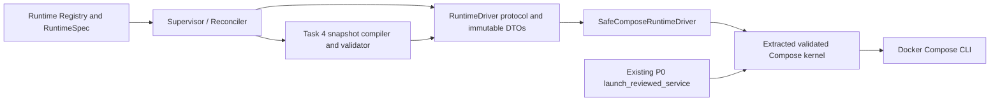

# Phase 2C RuntimeDriver Contract and P0 Kernel Extraction Design

**Status:** Proposed for implementation planning
**Date:** 2026-07-15
**Applies to:** Phase 2C Tasks 1, 3, 4, 5, and 6
**Supersedes:** The underspecified interface and sequencing portions of Phase 2C Task 1
**Does not supersede:** Phase 2C global safety constraints or the Phase 2A/2B reviewed domain models

## 1. Background

Phase 2B produced a reviewed Runtime Registry, committed adapter templates and policies,
managed state and secret references, and a pure RuntimeSpec compiler. Phase 2C must turn
that control-plane intent into supervised runtime processes without allowing Docker,
Compose, host paths, or container lifecycle state to leak into the platform domain.

The original Phase 2C Task 1 correctly required a `RuntimeDriver` boundary, immutable
identity/snapshot DTOs, and reuse of the P0 validated Compose launch path. It did not,
however, define the fields or semantics of `DriverIdentity`, `DriverInspection`,
`LaunchSnapshot`, `HealthProfile`, or `HealthObservation`. It also asked for a concrete
`SafeComposeRuntimeDriver` before Task 4 had produced the complete snapshot compiler and
validator.

Implementing the original text literally would force one of three incorrect results:

1. a P0-specific identity such as `service + repository root`, which is not driver-neutral;
2. a fake inspection synthesized from a subprocess return code, which cannot reconcile an
   ambiguous launch outcome safely; or
3. an oversized Task 1 that prematurely implements snapshot compilation, network
   ownership, health handling, and exact-stop behavior owned by later tasks.

This design closes that contract gap before production implementation.

## 2. Goals

1. Define a stable, driver-neutral contract that can support Docker Compose now and a
   different runtime driver later without changing Supervisor domain logic.
2. Separate expected identity from observed state so reconciliation never trusts a launch
   return code as proof of container identity or health.
3. Define a final `LaunchSnapshot` semantic surface before implementing a concrete dynamic
   Docker actor.
4. Preserve every current `tools.compose_runtime` public CLI and emergency behavior.
5. Reuse the P0 validated temporary-snapshot kernel without routing legacy services through
   an incomplete dynamic-runtime DTO.
6. Keep Task 1 small enough to review: pure contracts first, P0 extraction second, concrete
   dynamic driver only after Task 4 supplies the compiler and validator.
7. Keep root-side control modules importable and testable under `python -S`.

## 3. Non-goals

This design does not:

- start, stop, probe, or inspect a real runtime during Task 1;
- create RuntimeAttempts or lifecycle jobs;
- define repository transaction behavior;
- compile RuntimeSpec, templates, secrets, state, or policies into a launch snapshot;
- create, attach, detach, or remove runtime networks;
- implement automatic restart, retry, or failure recovery;
- change Spot, Futures, or Research trading behavior;
- remove the current 8081/8082/8083 compatibility services before Phase 2E;
- authorize online exchange connectivity, credentials, or order writes;
- add Pydantic or another third-party dependency to root-side host-control modules.

## 4. Architectural decision

Phase 2C Task 1 is split into two independently verifiable slices:

### 4.1 Task 1A: Pure RuntimeDriver contract

`tools/runtime_driver.py` contains only immutable value objects, strict validation,
closed enums, fixed/redacted error types, and the `RuntimeDriver` protocol. Importing it
performs no filesystem, environment, Git, Docker, database, network, or clock I/O.

Task 1A does not create a concrete Docker driver.

### 4.2 Task 1B: P0 launch-kernel extraction

`tools/compose_runtime.py` keeps its existing public surface. Its current validated launch
sequence is extracted into one internal kernel with explicit inputs and fixed action
arguments. The existing `launch_reviewed_service()` remains the only production caller in
this slice.

Task 1B does not pretend that the three compatibility services are Runtime Registry
instances. It only makes the already-reviewed safety sequence reusable by the later
concrete driver.

### 4.3 Task 4B: Concrete SafeComposeRuntimeDriver

After Task 4 implements `compile_launch_snapshot()` and the complete rendered-snapshot
validator, a Task 4B subtask creates `tools/safe_compose_driver.py`. That adapter renders a
typed `LaunchSnapshot`, invokes the extracted kernel, and performs real post-action
inspection.

This sequencing ensures that no dynamic Docker actor exists before the full snapshot is
both compilable and fail-closed validated.



The dependency direction is one-way: Supervisor depends on the protocol, while Compose
depends on the protocol DTOs. Domain modules never import `compose_runtime` or Docker.

## 5. Contract model

All contract types are `@dataclass(frozen=True, slots=True)` and use tuple-based immutable
collections. Where tests and callers require `model_validate(payload)`, the root module
provides one small strict classmethod; it is not a general Pydantic replacement.

Every model rejects:

- unknown fields;
- missing required fields;
- mutable list/dict payloads that are not normalized by its validator;
- empty identifiers;
- duplicate tuple entries where uniqueness is required;
- malformed digests, image IDs, container IDs, ports, or absolute container targets.

Validation errors use fixed field/error codes and must not echo secret values, host paths,
raw subprocess output, DSNs, credentials, or caller-provided documents.

### 5.1 DriverIdentity: expected immutable identity

`DriverIdentity` is the complete identity that the Supervisor expects a single runtime
attempt to have. It is not a Docker lookup result and does not contain repository roots,
Compose service names, or arbitrary labels.

| Field | Type | Meaning |
|---|---|---|
| `project_name` | `str` | Deterministic backend-owned runtime project name |
| `container_name` | `str` | Deterministic backend-owned container name |
| `instance_id` | `str` | Runtime Registry instance identity |
| `attempt_id` | `str` | Append-only RuntimeAttempt identity |
| `runtime_spec_digest` | `str` | Lowercase 64-character RuntimeSpec payload digest |
| `state_allocation_id` | `str` | Exact managed state allocation identity |
| `image_id` | `str` | Exact inspected `sha256:<64 lowercase hex>` image ID |
| `network_names` | `tuple[str, ...]` | Sorted unique expected private/access network names |

All fields are required. `network_names` contains runtime network names, not host endpoints
or user-provided aliases. The Supervisor and policy compiler derive these names; the API
caller cannot choose them.

The driver derives its immutable identity labels from this object. A launch caller cannot
provide a separate arbitrary label map that could disagree with it.

### 5.2 DriverInspection: untrusted observed state

`DriverInspection` reports what the runtime engine actually observed. It never reports
whether the observation is acceptable; that decision belongs to the pure reconciler.

| Field | Type | Meaning |
|---|---|---|
| `state` | `DriverState` | `absent`, `created`, `starting`, `running`, or `exited` |
| `container_id` | `str | None` | Full immutable engine object ID, or `None` when absent |
| `observed_project_name` | `str | None` | Observed identity label, possibly missing |
| `observed_container_name` | `str | None` | Observed engine name, possibly missing |
| `observed_instance_id` | `str | None` | Observed identity label, possibly missing |
| `observed_attempt_id` | `str | None` | Observed identity label, possibly missing |
| `observed_runtime_spec_digest` | `str | None` | Observed identity label, possibly missing |
| `observed_state_allocation_id` | `str | None` | Observed identity label, possibly missing |
| `observed_image_id` | `str | None` | Actual inspected image ID |
| `observed_network_names` | `tuple[str, ...]` | Sorted unique actual network membership |
| `health` | `DriverHealth` | `not_configured`, `starting`, `healthy`, `unhealthy`, or `unknown` |
| `exit_code` | `int | None` | Actual inspected exit code for an exited object |

Partial or malformed observations remain representable. Missing labels do not become a
validation exception and do not disappear; they result in `None` fields that the reconciler
will treat as an identity mismatch.

The inspection does not contain:

- the launch subprocess return code;
- a caller-computed `identity_matches` flag;
- raw Docker JSON;
- raw stdout/stderr;
- logs or health-command output.

### 5.3 HealthProfile and HealthObservation

`HealthProfile` is a fully resolved closed policy, not a caller-selectable command:

| Field | Type | Constraint |
|---|---|---|
| `profile_id` | `str` | Closed committed policy ID |
| `probe_argv` | `tuple[str, ...]` | Non-empty fixed argument vector; no shell string |
| `start_period_seconds` | `int` | Non-negative |
| `interval_seconds` | `int` | Positive |
| `timeout_seconds` | `int` | Positive and not greater than interval |
| `retries` | `int` | Positive; the closed committed policy supplies the upper bound |

`HealthObservation` contains only:

- `status: DriverHealth`;
- `attempts: int`;
- `failure_code: str | None`.

It contains no raw command output. A timeout, malformed output, missing object, or identity
mismatch uses a stable failure code.

### 5.4 LaunchSnapshot: fully resolved desired container configuration

`LaunchSnapshot` is the output of Task 4 compilation and the only launch input accepted by
the concrete driver. It is not a Compose document and cannot carry arbitrary Docker
options.

**User-approved Architecture Resolution A:** `LaunchSnapshot` is an internal,
post-compilation value. It is never accepted or deserialized from a public API,
PostgreSQL, RuntimeSpec JSON, or a generic external mapping. Task 2 validation proves only
that this internal value has the required structural and canonical form; the Task 2
dataclasses are not provenance authority and do not classify values as secret or
non-secret.

Top-level fields:

| Field | Type | Meaning |
|---|---|---|
| `identity` | `DriverIdentity` | Exact expected runtime identity |
| `argv` | `tuple[str, ...]` | Fixed expanded application argument vector |
| `working_directory` | `str` | Fixed absolute POSIX container directory |
| `non_secret_environment` | `tuple[EnvironmentEntry, ...]` | Sorted unique non-secret environment entries |
| `read_only_mounts` | `tuple[ReadOnlyMount, ...]` | Committed config/strategy/policy inputs |
| `state_mount` | `WritableStateMount` | Exactly one managed writable state allocation |
| `secret_mounts` | `tuple[SecretMount, ...]` | Fixed read-only secret file mounts |
| `runtime_user` | `RuntimeUser` | Non-root UID/GID/HOME contract |
| `internal_ports` | `tuple[int, ...]` | Internal-only ports; never host mappings |
| `health_profile` | `HealthProfile` | Resolved bounded health behavior |
| `resource_limits` | `ResourceLimits` | Resolved integer CPU, memory, and process limits |

Nested value objects are also frozen and strict:

- `EnvironmentEntry(name, value)` rejects secret-class names and control characters.
- `ReadOnlyMount(source, target)` requires a provider-resolved source and absolute POSIX
  target; it cannot be writable.
- `WritableStateMount(source, target, allocation_id)` must match
  `identity.state_allocation_id`; exactly one exists.
- `SecretMount(source, target, secret_reference_id, version)` is always read-only and cannot
  be converted to an environment entry.
- `RuntimeUser(uid, gid, home)` rejects UID/GID zero and requires an absolute POSIX HOME.
- `ResourceLimits(cpu_millis, memory_bytes, pids_limit)` uses positive integers only.
  `cpu_millis` avoids floating-point ambiguity; the committed resource policy supplies the
  permitted upper bounds.

The Task 2 DTO surface rejects unknown fields and structurally unrepresentable options such
as:

- `compose` or a rendered Compose document;
- `host_port`, `ports` with host mappings, or host networking;
- `privileged`, host PID/IPC, devices, or added capabilities;
- caller-provided `restart`, `labels`, `container_name`, or project overrides;
- more than one writable mount.

Task 4 compilation and final validation reject semantically equivalent forms that shape
validation alone cannot classify: Docker socket/device/named-pipe or host-directory source
exposure, raw secret values or credentials in argv/environment/read-only mounts, arbitrary
command strings, and shell interpolation.

The concrete driver always derives and enforces these non-overridable values:

- exact `identity.image_id`;
- `restart: "no"`;
- read-only root filesystem where supported by the runtime contract;
- `cap_drop: [ALL]`;
- `no-new-privileges:true`;
- no host port;
- deterministic project/container names and identity labels;
- only the networks listed in `identity.network_names`;
- one managed writable state and fixed read-only inputs/secrets.

Task 4 owns the trust transition into this value. Its compiler accepts only a committed,
closed `AdapterTemplate` and policy plus typed RuntimeSpec, state-allocation, and secret
references. Only that compiler emits `argv`, `EnvironmentEntry` values, and resolved mount
sources:

- read-only sources originate only from compiler-owned or explicitly allowlisted material
  roots and cannot expose host directories, Docker sockets, devices, named pipes, or
  untyped secret material;
- source paths are resolved before use, and symlink, junction, reparse-point, or material-
  root escape is rejected;
- `argv` is expanded from a committed executable/argument template, never from shell
  interpolation or caller-provided command strings, and never embeds credentials or other
  secrets;
- environment names come from a per-template closed allowlist, and values come only from
  typed non-secret RuntimeSpec fields or committed constants;
- secrets are resolved by the provider only into `SecretMount` values, never argv,
  ordinary environment entries, or read-only mounts.

The final Task 4 snapshot validator rechecks all of these gates. A future concrete driver
must invoke that validator immediately before any runtime mutation. No
`SafeComposeRuntimeDriver` exists until these trust-boundary gates and their mutation tests
pass. This is the approved resolution of the review finding, not a claim that Task 2's
dataclasses alone prove source provenance or secret classification.

## 6. RuntimeDriver protocol semantics

```python
class RuntimeDriver(Protocol):
    def inspect(self, identity: DriverIdentity) -> DriverInspection: ...
    def launch(self, snapshot: LaunchSnapshot) -> DriverInspection: ...
    def stop(self, identity: DriverIdentity) -> DriverInspection: ...
    def probe(
        self,
        identity: DriverIdentity,
        profile: HealthProfile,
    ) -> HealthObservation: ...
```

### 6.1 inspect

- Performs read-only engine inspection.
- Looks up only the deterministic project/container locator from `DriverIdentity`.
- Returns `state=absent` when no object exists.
- Returns all observed identity fields even when they do not match the expected identity.
- Does not adopt, stop, delete, rename, connect, or repair anything.
- Does not query PostgreSQL or read secrets.

### 6.2 launch

- Accepts only a fully validated `LaunchSnapshot`.
- Refuses to act when any object already occupies the deterministic locator; the reconciler
  must inspect and decide whether to adopt or fail first.
- Invokes the fixed validated-snapshot kernel with argument arrays only.
- Never performs an automatic retry.
- After an unambiguous successful action, performs a new engine inspection and returns that
  real observation.
- A timeout, transport interruption, or lost subprocess result raises
  `AmbiguousDriverOutcome`; it does not claim success or failure. The Supervisor then calls
  `inspect(identity)` and reconciles deterministic identity before any retry decision.
- A deterministic preflight or policy rejection raises `DriverPolicyError` before mutation.

### 6.3 stop

- Inspects first and compares the complete observed identity to the expected identity.
- Returns `absent` without mutation when no object exists.
- Refuses with `DriverIdentityMismatch` when any expected identity field is missing or
  different.
- Stops by the immutable full container ID obtained from that inspection, never by a mutable
  name.
- Re-inspects after the action and returns a real observation.
- Does not remove containers, networks, volumes, paths, images, state, or secrets.

### 6.4 probe

- Requires exact identity before executing or reading a health result.
- Uses only `HealthProfile.probe_argv`; no shell interpolation.
- Applies the profile's bounded timeout and attempt count.
- Returns a redacted `HealthObservation`; raw output remains inside the adapter and is not
  persisted or logged.
- Does not stop, restart, or repair the runtime.

## 7. Error model

Root-side driver errors use fixed exception types and stable codes:

| Error | Meaning | Retry behavior |
|---|---|---|
| `DriverValidationError` | DTO or closed-policy validation failed | Never retry unchanged input |
| `DriverPolicyError` | Rendered snapshot or safety invariant failed before mutation | Never retry unchanged input |
| `DriverIdentityMismatch` | An object exists but does not exactly match expected identity | Never mutate; operator/reconciler decision required |
| `DriverObjectOccupied` | Locator is occupied at launch time | Inspect/reconcile; no automatic retry |
| `AmbiguousDriverOutcome` | Action result is unknown after possible mutation | Inspect exact identity before any retry |
| `DriverTransportError` | Engine unavailable before mutation is known to start | Latch or bounded higher-level retry policy |

Public messages contain only fixed codes. Detailed exceptions may be chained internally but
must not expose raw Docker output, secret values, host paths, environment values, or full
input documents.

## 8. P0 compatibility and kernel extraction

The current P0 path remains:

1. resolve committed root/backend/frontend/strategy identity;
2. build from a committed temporary context;
3. inspect exact image ID and revision labels;
4. re-check committed identity and checkout cleanliness;
5. render the current fixed Compose service override;
6. write a temporary rendered snapshot;
7. validate the rendered snapshot and control-file cleanliness;
8. run fixed `up --detach --wait --force-recreate --no-build --no-deps <service>`;
9. remove the temporary snapshot in all outcomes.

Task 1B may extract only mechanics shared by the legacy path and the later driver:

- clean Docker/Compose environment construction;
- exclusive temporary snapshot lifetime;
- pre-action and immediate-before-action validation callbacks;
- fixed argument-list subprocess execution;
- snapshot cleanup in `finally`/context-manager ownership.

It must not weaken or relocate ownership of:

- committed-build identity verification;
- exact inspected image ID;
- live control drift checks;
- legacy manifest/service validation;
- emergency `stop/down/ps/logs` availability.

The compatibility CLI continues returning the original `CompletedProcess` and exit code.
The future concrete driver returns `DriverInspection`. These outer APIs are intentionally
different while sharing the same low-level safety kernel.

## 9. Corrected implementation sequence

### Task 1A — Driver-neutral contract

Files:

- create `tools/runtime_driver.py`;
- create `tests/test_runtime_driver.py`.

Verification:

- strict unknown-field rejection, including `compose` and `host_port`;
- frozen/immutable values;
- partial/malformed observation representation;
- no I/O at import;
- protocol signature checks;
- `python -S` compatibility.

### Task 1B — P0 kernel extraction

Files:

- modify `tools/compose_runtime.py`;
- modify `tests/test_compose_runtime.py`.

Verification:

- every existing Compose CLI and emergency test remains green;
- current `launch_reviewed_service()` calls the one extracted validated kernel;
- exact image, committed identity, temporary snapshot cleanup, and fixed flags remain
  covered;
- no concrete dynamic driver or new Docker authority exists yet.

### Task 2 — Repository attempt/job transitions

Unchanged from the Phase 2C plan and independent of Docker implementation.

### Task 3 — Pure reconciliation

Consumes `RuntimeDriver` through fakes. It compares expected `DriverIdentity` with every
observed field in `DriverInspection`. It never needs Compose imports.

### Task 4 — Snapshot compiler, validator, and concrete driver

Task 4 compiles reviewed RuntimeSpec/template/policy/state/secret material into the final
`LaunchSnapshot`. Its input is restricted to committed closed AdapterTemplate/policy and
typed RuntimeSpec/state/secret references; it alone emits argv, environment entries, and
resolved material sources. It resolves every source and rejects disallowed source roles,
parent/root escape, and symlink/junction/reparse traversal, then validates the final
snapshot again immediately before mutation. Task 4 adds `SafeComposeRuntimeDriver` in a
dedicated infrastructure module only after these gates and their mutation tests pass. Only
at this point can Phase 2C dynamically launch a Registry runtime.

### Tasks 5–7

Per-instance access networks, bounded health/failure handling, offline identity, daemon,
CLI, and offline paper-probe acceptance continue in their planned order.

## 10. Testing strategy

### 10.1 Task 1A pure contract tests

- valid complete identities and snapshots are accepted;
- all unknown top-level and nested fields fail closed;
- raw Compose, host port, host mode, Docker socket, privileged options, added capabilities,
  raw labels, and multiple writable mounts are unrepresentable or rejected;
- DTO mutation fails;
- invalid digests, image IDs, ports, UID/GID, paths, duplicates, and secret-like environment
  keys fail with fixed messages;
- importing under `python -S` performs no I/O.

### 10.2 Task 1B compatibility tests

- the existing P0 suite passes before and after extraction;
- a spy proves legacy launch calls the extracted kernel;
- all validation still occurs before the action;
- cleanup happens on render, validation, and final action failures;
- emergency actions do not require the dynamic driver, PostgreSQL, or Runtime Registry.

### 10.3 Later concrete-driver tests

- argument-array construction only;
- no shell interpolation;
- post-launch real inspection;
- timeout produces `AmbiguousDriverOutcome`, not a synthetic state;
- identity mismatch causes zero mutation;
- stop uses full immutable container ID;
- mutation tests reject parent-directory Docker socket exposure, a `ReadOnlyMount` used to
  bypass the secret role, source-root or symlink/junction/reparse escape, shell argv, raw
  credential argv, non-allowlisted or raw-secret environment entries, and external
  `LaunchSnapshot` deserialization;
- the final snapshot validator is called immediately before every mutation;
- unknown containers/networks/paths are never deleted or disconnected.

No Task 1 test may run a real Docker lifecycle action or contact an exchange. Online
connectivity remains separately authorized.

## 11. Migration and rollback

Task 1A and Task 1B are behavior-preserving for current products:

- no database migration;
- no runtime migration;
- no service, port, profile, Bot, account, strategy, or market permission change;
- no real/paper trading behavior change;
- no operator permission expansion;
- no removal of compatibility services.

Rollback of Task 1A/1B is a code revert. Because no dynamic driver is activated and no
persistent state changes, rollback does not require data or container recovery.

## 12. Acceptance criteria

The corrected Task 1 is complete only when:

1. the pure contract is strict, immutable, `python -S` compatible, and performs no import
   I/O;
2. expected identity and observed state are separate;
3. inspection and health are never synthesized from launch return codes;
4. Task 2 structurally excludes raw Compose, host-port and privilege fields, arbitrary
   labels, and multiple writable mounts, while Task 4 provenance gates exclude Docker
   socket/host exposure, arbitrary commands, and raw secrets;
5. the existing P0 CLI and emergency behavior remain unchanged;
6. the P0 path uses the extracted single validation/execution kernel;
7. no dynamic Docker actor is enabled before Task 4's complete compiler and validator;
8. all focused and existing P0 tests pass;
9. independent task and whole-branch reviews report no open Critical or Important finding;
10. Task 2 is treated only as structural/canonical validation; Task 4 exclusively establishes
    source provenance and secret classification before a concrete driver is enabled.
