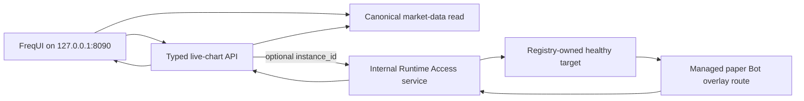

# Runtime Access Minimal Vertical-Slice Rebaseline

**Status:** Approved Runtime Access resume design; current execution paused by the
Product Phase 1 Baseline Capability Gate

**Date:** 2026-07-30

**Original implementation branch:** `phase2d-runtime-access-rebaseline`

> **Execution-order supersession:** This document remains the reviewed technical design
> if Runtime Access is selected later. It is not the current work queue. Use
> [the Baseline Capability Gate](../plans/2026-07-30-phase1-baseline-capability-gate.md)
> on `phase1-baseline-capability-gate`. The preconfigured 8081 service is compatibility
> evidence only; it is not a dynamic RuntimeInstance, `paper_probe`, or formal Product
> Phase 1 Paper acceptance.

**Amends:**

- `2026-07-12-runtime-registry-v2-design.md` sections 13.4, 21.4, and 21.5;
- Phase 2D Tasks 5-10 in
  `../plans/2026-07-12-runtime-registry-v2-phase2d-market-data-ui.md`;
- Phase 2E ordering where the old plan assumed all read routes already existed.

This amendment changes rollout order, route breadth, the first operation/audit contract,
and the internal-auth contract only.
It does not weaken the approved Registry, Supervisor-only Docker, private-network,
no-caller-selected connection target, secret isolation, fail-closed, paper-only, or
no-automatic-retry invariants.

## 1. Decision

Runtime Access will be built only for a real managed producer and a real user journey.
Phase 2D will deliver one Bot strategy-overlay read vertical slice. Research reads move to
Phase 2E, after a managed Workspace Worker exists. All other compatibility routes remain
unimplemented until a concrete cutover task proves that a current consumer needs them.

The browser does not receive a general Runtime Access proxy. It calls typed
`platform-control` APIs. The gateway is an internal application service that can perform
only committed semantic operations.

No route, token, gateway, Supervisor-enablement, Experiment, dynamic Runtime, Paper
Observation, or 8090 chart work in this design is currently authorized. A passing
compatibility baseline must be followed by an explicit decision selecting this exact
Runtime Access journey before implementation resumes.

This is the smallest design that proves the difficult boundary:



Base candles do not cross the gateway and remain available when the Bot, target lookup,
policy, key, or overlay fails.

## 2. Verified starting point

The rebaseline is based on the repository state inspected on 2026-07-30:

| Area | Verified state |
|---|---|
| Phase 2A-2C | Merged into local Root `main`; offline/fail-closed boundary accepted |
| Production Supervisor | Deliberately disabled by `PRODUCTION_ASSEMBLY_ENABLED = False` and `_assemble_supervisor()` returning `runtime_supervisor_not_enabled` |
| Phase 2D Tasks 1-4 | Complete only on the local Phase 2D branch; Root `2128646`, backend `b9345c4a6` |
| Canonical candles | Authenticated `GET /api/v2/market-data/candles` exists on `platform-control` |
| Browser path | FreqUI still uses Bot-specific sessions and endpoints; no accepted 8090 base-chart journey exists |
| Endpoint schema | `runtime_endpoints` exists, but no production launch path inserts and exposes the active application endpoint for gateway use |
| Runtime Access audit | `runtime_access_requests` has policy revision and method but no durable semantic `route_id` |
| Managed application target | No production-assembled, healthy managed application runtime has been accepted |
| Research target | No managed Workspace Worker exists; the current Research service is still a fixed compatibility service |

Therefore token and gateway code cannot be accepted before target lifecycle closure. Unit
tests backed only by invented endpoints would prove a mock, not the system.

## 3. First-principles invariants

1. **Baseline before expansion.** Existing 8081 watch/runtime and 8083 standard
   Freqtrade backtest/analysis journeys must pass the exact-SHA Baseline Capability Gate;
   a pass still requires an explicit Runtime Access resume decision.
2. **No producer, no gateway.** An endpoint is routable only after the Supervisor has
   verified a healthy exact attempt and persisted its internal-only endpoint.
3. **No consumer, no route.** A route enters policy only in the same slice that migrates
   and tests its concrete consumer.
4. **Semantic operation, not mechanical path.** Policy identifies a stable operation such
   as `bot.strategy_overlay.read.v1`; it is not a copy of every existing HTTP path.
5. **One route ID, one method, one fixed upstream template.** Method and path are policy
   facts. Broad route groups grant no authority.
6. **The runtime cannot mint platform authority.** It receives only a verification public
   key and immutable attempt identity.
7. **No fallback target and no read retry.** Missing, stopped, stale, duplicate, or
   identity-mismatched targets fail closed. The client can refresh later.
8. **Base market data is independent.** Runtime Access failure is an overlay warning, not
   a base-chart outage.
9. **Compatibility stays explicit.** Existing 8081/8082/8083 services remain available
   until the corresponding Phase 2E journey passes parity and rollback gates.

## 4. Route disposition

The old Task 5 inventory contained 49 method/path pairs. They are reclassified as follows:

| Disposition | Count | Decision |
|---|---:|---|
| Implement in Phase 2D | 1 | One Bot strategy-overlay operation |
| Implement in Phase 2E after a managed worker exists | 4 | Four Research read operations |
| Explicitly reject | 3 | Health and base-candle paths do not belong in Runtime Access |
| Defer without policy entries or code | 41 | Add only with a later concrete UI/cutover consumer |
| **Total** | **49** | Complete disposition of the old inventory |

### 4.1 Phase 2D operation

The first operation is a closed versioned contract, not a placeholder for later design:

| Policy field | Exact Phase 2D value |
|---|---|
| `schema_version` | `1` |
| `revision_id` | `runtime-access-policy-v1` |
| `route_id` | `bot.strategy_overlay.read.v1` |
| owner/environment | `paper_probe` / `paper` only |
| upstream method | `POST` |
| upstream path | `/api/v1/internal/runtime-access/strategy-overlay` |
| matched FastAPI route name | `runtime_strategy_overlay_v1` |
| request/response schema IDs | `strategy-overlay-request-v1` / `strategy-overlay-response-v1` |
| request/response caps | 16 KiB / 2 MiB, uncompressed UTF-8 JSON |
| timeout | connect 1000 ms; pool 250 ms; write 1000 ms; read 3000 ms |
| concurrency | at most 2 in flight for the selected instance; wait at most 250 ms |
| redirect/retry | disabled / zero |

The committed policy file contains exactly this one record. Extending the owner set to
`migration_bot` is a later Phase 2E policy change with its own producer and consumer
acceptance; it is not latent Phase 2D authority.

Its decoded JSON shape is exactly:

```json
{
  "schema_version": 1,
  "revision_id": "runtime-access-policy-v1",
  "entries": [
    {
      "route_id": "bot.strategy_overlay.read.v1",
      "owner_kinds": ["paper_probe"],
      "environments": ["paper"],
      "method": "POST",
      "path": "/api/v1/internal/runtime-access/strategy-overlay",
      "matched_route_name": "runtime_strategy_overlay_v1",
      "request_schema_id": "strategy-overlay-request-v1",
      "response_schema_id": "strategy-overlay-response-v1",
      "request_max_bytes": 16384,
      "response_max_bytes": 2097152,
      "timeouts_ms": {
        "connect": 1000,
        "pool": 250,
        "write": 1000,
        "read": 3000
      },
      "concurrency": {
        "max_in_flight_per_instance": 2,
        "acquire_timeout_ms": 250
      },
      "follow_redirects": false,
      "retry_count": 0
    }
  ]
}
```

The committed bytes are canonical UTF-8 JSON with sorted object keys, compact separators,
`ensure_ascii=false`, and one final LF. Duplicate keys, non-finite numbers, unknown fields,
non-canonical bytes, or a second entry fail loading. Issuer, verifier, tests, and Root
Safety load these same packaged bytes.

`StrategyOverlayRequestV1` is a frozen, extra-forbid object with exactly:

| Field | Contract |
|---|---|
| `schema_version` | literal `1` |
| `key` | the existing canonical `MarketDataKey` |
| `window_start_open_ms` | strict non-negative integer, inclusive |
| `window_end_open_ms` | strict non-negative integer, inclusive and not before start |
| `point_limit` | strict integer `1..500` |
| `base_data_as_of_ms` | strict non-negative UTC epoch millisecond |

The runtime verifies that market, product, venue, instrument, and canonical timeframe are
compatible with its immutable spec/configuration. It reads only already-recorded,
fully-analyzed closed-candle strategy output inside the requested window; official
Strategy Indicator and Strategy Signal output must omit the Forming Candle. It never
analyzes a new candle to satisfy the request. Strategy Signal points remain distinct from
execution Trade/Order/Fill points and cannot be used as proof of execution.

`StrategyOverlayResponseV1` is also frozen and extra-forbid. Every top-level field is
required; `layers` and `warnings` may be empty:

| Field | Contract |
|---|---|
| `schema_version` | literal `1` |
| `key` | exactly equal to the request `MarketDataKey` |
| `window_start_open_ms` | accepted inclusive start, exactly equal to the request |
| `window_end_open_ms` | accepted inclusive end, exactly equal to the request |
| `point_limit` | strict integer, exactly equal to the request |
| `runtime_data_as_of_ms` | strict non-negative UTC epoch millisecond |
| `layers` | tuple of the closed layer union below, maximum 32 |
| `warnings` | tuple of at most 16 values from the closed warning vocabulary below |

The warning vocabulary is exactly `overlay_window_partial`, `overlay_data_lagging`,
`overlay_forming_candle_omitted`, `overlay_layer_unavailable`, and
`overlay_no_recorded_data`. `layers` is a discriminated union of only:

- `StrategySeriesLayerV1`: required fields `layer_id`, `source="strategy"`, `kind` in
  `line|bar|scatter`, `label`, `panel`, `timeframe`,
  `alignment="exact_candle_open"`, and `points`. Every point has exactly required
  `candle_open_ms` and `value`, where `value` is finite;
- `RecordedEventLayerV1`: `source` in `strategy|execution|decision_snapshot`,
  `kind="event"`, the same required `layer_id`, `label`, `panel`, `timeframe`, alignment,
  and points fields. Every point has exactly required `candle_open_ms`, `event_id`,
  `event_type`, `label`, and `value`; `value` is required but may be null or finite.

Each layer has at most `point_limit` points; the response has at most `point_limit`
distinct candle-open timestamps and at most `min(8000, 32 * point_limit)` total points.
Point timestamps are strictly ordered, unique within a layer, inside the accepted window,
and no later than either data-as-of value. `layer_id`, `panel`, `event_id`, and `event_type`
use the existing `Identifier` encoding; labels are UTF-8 strings of 1..256 Unicode scalar
values with control characters rejected. `timeframe` is one canonical policy timeframe.
There is no arbitrary payload, style object, `plot_config`, column matrix, or open-ended
metadata map. The platform maps this finite vocabulary to its existing renderer.

The runtime response cannot contain `market`, `watch`, `recomputed`, `feature`, external
`event`, or `document` sources and cannot contain base OHLCV. If the legacy
`chart_candles` builder is reused internally, an adapter must validate and project into
this exact DTO before any response leaves the runtime. `platform-control` never forwards
the broad legacy response as its compatibility contract.

### 4.2 Phase 2E Research operations

These routes do not enter committed policy until Phase 2E has imported and launched one
healthy managed Workspace Worker:

| Semantic route ID | Legacy behavior being migrated |
|---|---|
| `research.bots.read.v1` | Research Bot catalog |
| `research.instruments.read.v1` | Research instrument catalog |
| `research.datasets.read.v1` | Research dataset catalog |
| `research.chart_candles.read.v1` | Research chart data |

### 4.3 Rejected paths

- `GET /ping`: lifecycle health is observed and reconciled by the Supervisor; it is not a
  browser compatibility operation.
- `GET /pair_candles` and `POST /pair_candles`: base candles come from the canonical
  platform market-data service.

### 4.4 Deferred legacy inventory

The following 41 old entries receive no policy entry, token support, gateway branch, test
fixture, or public API in Phase 2D:

```text
GET  /trades
GET  /status
GET  /locks
GET  /pair_history
POST /pair_history
GET  /plot_config
GET  /strategies
GET  /strategy/{strategy_name}
GET  /freqaimodels
GET  /hyperopt-loss
GET  /exchanges
GET  /available_pairs
GET  /markets
GET  /performance
GET  /entries
GET  /exits
GET  /mix_tags
GET  /profit_all
GET  /profit
GET  /whitelist
GET  /blacklist
GET  /daily
GET  /weekly
GET  /monthly
GET  /balance
GET  /historic_balance
GET  /show_config
GET  /logs
GET  /pairlists/available
GET  /pairlists/evaluate/{job_id}
GET  /background/{job_id}
GET  /background
GET  /recursive_analysis/{job_id}
GET  /lookahead_analysis/{job_id}
GET  /trades/{trade_id}/custom-data
GET  /sysinfo
GET  /backtest
GET  /backtest/history
GET  /backtest/history/result
GET  /backtest/history/{filename}/market_change
GET  /backtest/history/{filename}/{strategy_name}/wallet
```

These are inventory labels, not verified API truth. For example, the old
`/hyperopt-loss` label already differs from the backend's current route spelling. A future
slice must derive method/path from the matched backend route and the actual consumer; it
must not copy this list into policy.

"Deferred from Runtime Access" does not deprecate a current compatibility journey.
8081 `/graph` and `/trade` remain baseline watch/runtime paths; standard Freqtrade
`/backtest` and analysis remain on 8083. The simplified `/research` SMA calculation
remains frozen compatibility behavior and is not promoted into Runtime Access or
authoritative backtesting.

## 5. Dependency-correct delivery stages

The table preserves the resume order after an explicit decision. Stage -1 is the only
active stage; Stages 0-4 are paused.

| Stage | Phase | Deliverable | Exit condition |
|---|---|---|---|
| -1 | Product Phase 1 | Compatibility Baseline Capability Gate | 8081 watch/runtime plus 8083 standard Freqtrade backtest/analysis pass at exact SHAs; stop for one resume decision |
| 0 | 2D Tasks 1-5 | Canonical candles plus one authenticated, base-only 8090 FreqUI chart | With all Bot services stopped, the browser renders a controlled canonical snapshot and follows the server-published cadence; a real provider remains a separately authorized Task 8 smoke |
| 1 | 2D Task 6 | Production-readiness closure plus real managed paper-probe target lifecycle | Existing Supervisor production blockers 1-6 close offline; separately authorized probe smoke produces exactly one immutable internal endpoint and invalidates it on stop |
| 2 | 2D Tasks 7-8 | One Bot overlay operation end to end | 8090 chart keeps base candles on overlay failure and shows correctly aligned Bot-owned layers when the paper probe is healthy |
| 3 | 2E Tasks 1-3 | Stopped import, closed Research launch path, and one Research service cycle | A disposable read candidate proves four reads; a final authoritative sync precedes every write migration and 8083 removal |
| 4 | 2E Tasks 4-6 | Independent Spot/Futures service cycles and final acceptance | Each fixed listener is removed only after its own producer, consumers, one-writer transition, rollback, and acceptance proof pass |

Phase 2D no longer depends on importing the fixed Research service. Phase 2E no longer
depends on dormant Research policies created before the worker exists. This removes the
old Phase 2D/2E cycle.

## 6. Browser and public API boundary

The current route disposition precedes this later boundary:

- 8081 `/graph`: compatibility live watch and strategy review;
- 8081 `/trade`: compatibility dry-run Spot runtime observation/operations;
- 8083 `/backtest` and analysis routes: standard Freqtrade offline validation;
- 8083 `/research`: frozen simplified compatibility behavior, not backtest authority;
- 8090 `/platform-chart`: resume-only and not current baseline evidence.

The accepted default is same-origin:

- `platform-control` reuses the existing packaged FreqUI static router and serves it on
  `127.0.0.1:8090`;
- the platform client uses relative `/api/v2` URLs and the existing platform login/refresh
  endpoints;
- Task 5 delivers exactly one isolated base-chart entrypoint; Bot controls and Research
  remain on their current compatibility paths;
- `/platform-login` and `/platform-chart` use an explicit platform-auth router branch.
  Platform routes do not initialize the Bot store; all existing Bot routes keep their
  existing Bot-presence guard;
- no Runtime Access internal token, runtime hostname, port, network, upstream path, or
  policy structure is returned to the browser.

Exact loopback CORS may be used only as a documented, time-bounded development fallback
if same-origin packaging is temporarily unavailable. Wildcard origins, arbitrary browser
base URLs, redirects, and caller-selected runtime targets are not accepted.

The Task 5 offline gate uses a controlled credential-free provider adapter and is complete
without public network access. A real Bitget response is a separately authorized Task 8
paper-online requirement and cannot be inferred from fixture-backed acceptance.

The Phase 2D public surface is limited to the existing market-data route and one typed
live-chart composition route. The browser may select an authorized Registry
`runtime_instance_id` as product identity, but never an attempt or connection target; the
server resolves those. There is no browser-facing generic `/runtime-access/{route_id}`
dispatcher.

## 7. Managed target lifecycle prerequisite

Before Runtime Access authentication or forwarding is enabled, the system must provide:

- reviewed closure of production blockers 1-6 in
  `../../operations/runtime-supervisor.md`: exact dependency assembly, Supervisor-only
  PostgreSQL wiring, persisted launch authority, protected single-writer host mutation,
  production state/secret operations, and bounded observability/emergency stop;
- a production assembly limited to the already closed paper-probe registration/template
  path. It remains stopped by default, and no lifecycle job or online start is authorized
  by this document;
- one `RuntimeEndpointView` or equivalent immutable DTO containing the exact instance,
  attempt, endpoint kind, protocol, internal port, exposure, and trusted connection
  identity required by the gateway;
- an atomic healthy-transition write that creates exactly one `application_http`
  endpoint for the exact attempt only after health and launch identity are verified;
- a consistent-read query that requires healthy instance and attempt state, matching
  RuntimeSpec and endpoint attempt, `internal_only` exposure, and exactly one endpoint;
- stop/failure/retry behavior in which old endpoint rows remain evidence but are never
  selected for a new or inactive attempt;
- tests proving missing, duplicate, stale, foreign-attempt, wrong-exposure, and
  identity-mismatch states fail without network access.

Connection identity is persisted and attested, not re-derived by `platform-control`.
`runtime_endpoints` gains non-null `network_name`, `runtime_alias`, and
`connection_identity_revision` fields. The Supervisor obtains them only from the exact
compiled access-network binding, verifies the active two-member private network, and
persists them atomically with the healthy endpoint. The query compares the endpoint row
with the active launch authority; a mismatch is unroutable. No arbitrary host or URL is
stored, and none of these values comes from a browser or API request. Migration fails if
any legacy endpoint row exists because no trusted producer can attest it; it never invents
or backfills connection identity.

After blockers 1-6 close, production assembly may be enabled only in a reviewed change
that remains paper-probe-only. The online portion of production blocker 7 is split:

- **7a, Phase 2D:** a separately authorized paper-probe start/health/endpoint/stop smoke,
  with 8081/8082/8083 unchanged;
- **7b, Phase 2E:** per-service migration, rollback, and listener retirement.

Task 7 does not begin until 7a proves the producer. If authorization for 7a is unavailable,
development pauses after the Task 6 offline gate. If any prerequisite requires weakening
the Phase 2C writer guard, offline identity, or fail-closed assembly, Runtime Access work
stops and Phase 2C is repaired first.

## 8. Internal authentication

The one Phase 2D operation uses a distinct internal authentication path:

- Ed25519 signing key held only by `platform-control`;
- public verification key mounted read-only into the runtime;
- dedicated `X-Freqtrade-Runtime-Access` header, never Basic/Bearer fallback;
- protected dependency attached only to the new internal overlay route;
- JOSE header exactly `alg="EdDSA"`, `typ="freqtrade-runtime-access+jwt"`, and
  `kid="runtime-access-ed25519-v1"`, with no unrecognized header members;
- exact claims only: `iss="freqtrade-platform-control"`, `aud=instance_id`,
  `token_use="runtime_access"`, `attempt_id`, `route_id`, `policy_revision`, `jti`, `iat`,
  and `exp`; `jti` is the durable request ID rather than a second duplicate field;
- integer UTC NumericDate values with `exp = iat + 15`, no expiry grace, and at most two
  seconds of positive clock skew for `iat`; missing, extra, duplicate, non-integer, future,
  expired, or differently bounded claims fail closed;
- the runtime compares the verified `route_id` with the actual matched FastAPI route and
  method through the committed one-to-one policy mapping.

`aud` and `attempt_id` are the exact existing `Identifier` strings: ASCII matching
`^[a-z0-9][a-z0-9_-]{0,127}$`, copied without case folding or normalization. `jti` is a
new lowercase canonical UUIDv4 string and is stored unchanged as `request_id`. Semantic
route IDs use ASCII `^[a-z][a-z0-9]*(?:[._-][a-z0-9]+)*$` with a 128-character maximum;
the first route is the literal value above. `policy_revision`, `kid`, and fixed issuer use
their literal policy values. JWT string comparison is exact and case-sensitive; no Unicode
normalization, percent decoding, aliasing, or alternate textual encoding is accepted.

The token does not carry a broad route group or a caller-asserted method. There is one
manual replacement key, not a key ring, automatic rotation service, or general token
platform. Because the first operation is read-only, single-host, private-network, and
non-retried, Phase 2D records `jti` for correlation but does not add a distributed replay
cache. Revisit replay protection before any write route or multi-host deployment.

The existing user-facing HS256/Basic authentication remains separate and cannot validate
an internal token. The runtime's ordinary API credentials cannot mint Runtime Access
authority.

## 9. Forwarding and audit boundary

For the single overlay operation, forwarding is bounded by policy:

- exact `POST /api/v1/internal/runtime-access/strategy-overlay`, no redirect following,
  no retry;
- connect 1000 ms, pool 250 ms, write 1000 ms, and read 3000 ms timeouts; at most two
  in-flight requests for the selected instance and a 250 ms semaphore wait;
- 16 KiB request and 2 MiB response caps. Send `Accept-Encoding: identity` and reject any
  non-identity content encoding so the decoded cap cannot be bypassed;
- allowlisted content type and headers; strip `Host`, cookies, forwarding headers,
  ordinary `Authorization`, hop-by-hop headers, and internal tokens from responses/logs;
- no request or response body in durable audit;
- no caller-provided URL, scheme, host, port, path, method, container, network, or service.

`runtime_access_requests` is migrated before use so pre-resolution denials are
representable. It gains non-null `requested_instance_id` and `route_id`; resolved
`instance_id` and `attempt_id` become nullable foreign keys. Checks require an attempt to
have a resolved instance and any resolved instance to equal `requested_instance_id`.
Because no accepted Runtime Access producer exists yet, migration refuses a non-empty
legacy table instead of fabricating semantic route IDs or requested identities.
Failure rows require a bounded `status` (`denied` or `failed`), stable non-null
`result_code`, policy revision, exact policy method, request time, and completion time.
Unknown instance records both foreign keys null; no-active-attempt records the instance
only; resolved failures record both. No body, token, key, target address, or secret is
stored. Repository/migration tests cover all three shapes and fail if audit persistence
itself would silently erase the original denial.

Denials, identity mismatches, policy failures, and ambiguous security outcomes are
durable. Audit persistence failure returns a stable closed failure and performs no
upstream call.
High-frequency successful overlay reads use structured logs and metrics by default; full
success-row persistence requires a separate retention/index/capacity decision. Writes in
Phase 2E are durable and never automatically retried.

Stable failures include `runtime_unavailable`, `runtime_target_ambiguous`,
`runtime_identity_mismatch`, `runtime_route_denied`, `runtime_upstream_timeout`, and
`runtime_response_too_large`. None triggers another target or removes base candles.
Concurrency saturation adds `runtime_busy`; it is not retried automatically.

## 10. Deliberate non-goals

Phase 2D does not add:

- 49-route compatibility parity;
- formalization of 8081 as a dynamic RuntimeInstance, Product Bot, `paper_probe`, or
  Paper Observation;
- expansion of the simplified Research SMA backtest;
- Bot status, logs, configuration, balance, trade-history, backtest, or action proxying;
- Research Runtime Access or a fake Registry endpoint for fixed port 8083;
- generic route groups, generic proxy controllers, arbitrary path parameters, or a
  reusable gateway SDK;
- retries, token replay stores, automatic key rotation, key rings, mTLS, service mesh,
  multi-host discovery, or a new policy authoring framework;
- fixed-service proxying through 8090;
- lifecycle HTTP, live trading, exchange writes, or fixed-listener removal.

mTLS becomes necessary only when Runtime Access leaves the trusted single-host private
bridge, transport peer identity is required independently of the signed request, or a
compliance/multi-host boundary demands it.

## 11. Phase 2D acceptance and stop conditions

This section is inapplicable until the exact-SHA Baseline Capability Gate passes and a
recorded decision explicitly resumes Phase 2D. Baseline evidence from fixed 8081/8083
services must never be relabelled as managed-runtime or Paper acceptance.

Phase 2D is accepted only when all of the following are true:

- Tasks 1-4 remain green and their canonical market-data contract is unchanged;
- FreqUI is served and authenticated on 8090 and one chart renders base candles with all
  Bot services stopped;
- server cadence, freshness, forming/closed state, and source metadata drive that chart;
- Supervisor production blockers 1-6 are closed without weakening the accepted Phase 2C
  guards, and the operations runbook/Root Safety describe the enabled paper-only boundary;
- separately authorized gate 7a proves a real managed paper probe can produce and later
  invalidate its exact attested endpoint;
- the single overlay operation succeeds only for the exact healthy attempt;
- wrong instance, attempt, route, key, policy revision, network identity, endpoint, owner,
  or state fails before upstream access;
- overlay failure preserves the base chart and produces a stable warning;
- official Strategy Indicator/Signal output omits the Forming Candle, and Strategy Signals
  remain distinct from execution Trade/Order/Fill evidence;
- chart refresh never evaluates a strategy or creates an order;
- no Research route, generic Runtime Access public API, application write, or fixed-port
  removal appears in the Phase 2D diff;
- offline gates pass; any paper-online acceptance is separately and explicitly
  authorized.

Stop implementation immediately if:

- production Supervisor assembly is still a fake or bypasses its existing guards;
- no real endpoint producer can be tied atomically to the healthy attempt;
- the only proposed target is a fixed 8081/8082/8083 service;
- same-origin delivery would require weakening authentication or exposing secrets;
- the overlay cannot be separated from base/watch data without silently changing the
  chart source contract;
- a new requirement needs a second operation before the first vertical slice passes.
